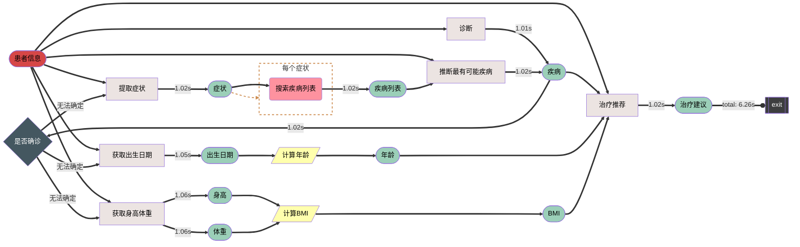

<div align="center">
  

  <a href='https://sigmaflows.github.io/'></a>
  <a href="https://sigmaflow.gitbook.io/sigmaflow-docs"></a>
  <a href="#"></a>
  <a href="https://pypi.org/project/sigmaflow/"></a>
  <a href="https://hub.docker.com/r/ai4drug/sigmaflow"></a>
  
  <a href='https://arxiv.org/abs/2512.10313'></a>
  <a href='https://doi.org/10.5281/zenodo.17874411'></a>
  [](https://github.com/maokangkun/SigmaFlow/tree/main/LICENSE)
  [](https://github.com/maokangkun/SigmaFlow/issues)

  <p align="center">
    👋 join us on <a href="https://linluhe.github.io/group_qrcode.html" target="_blank">WeChat</a>
  </p>
</div>

# 🚀 SigmaFlow
SigmaFlow is a Python package designed to optimize the performance of task-flow related to LLMs/MLLMs or Multi-agent.

```mermaid
gantt
title Task Timeline
dateFormat  x
axisFormat  %M:%S.%L
section pid_00
诊断: 0, 1023ms
获取身高体重: 2046, 1035ms
每个症状: 3083, 12ms
搜索疾病列表: 3095, 1024ms
搜索疾病列表: 4119, 1023ms
section pid_01
获取出生日期: 2045, 1029ms
计算BMI: 3076, 11ms
治疗推荐: 3088, 1027ms
搜索疾病列表: 4115, 1025ms
推断最有可能疾病: 5141, 1025ms
section pid_02
提取症状: 2045, 1043ms
搜索疾病列表: 3089, 1022ms
搜索疾病列表: 4112, 1021ms
section pid_03
是否确诊: 1020, 1035ms
计算年龄: 3071, 25ms
搜索疾病列表: 3096, 1022ms
搜索疾病列表: 4118, 1023ms
```

```mermaid
graph TD
    subgraph Legend
        direction TB
        LLMNode["LLM Node"]
        OutputNode(["Output Node"])
        InputNode(["Input Node"])
        LoopNode["Loop Node"]
        BranchNode{"Branch Node"}
        ValueNode@{shape: notch-rect, label: "Value Node"}
        CodeNode[/"Code Node"/]
        RAGNode@{shape: docs, label: "RAG Node"}
        APINode>"API Node"]
        MCPNode["MCP Node"]
        SubgraphNode["Subgraph Node"]
        FileNode@{shape: div-rect, label: "File Node"}
        DataBaseNode@{shape: cyl, label: "DataBase Node"}
        WebNode@{shape: procs, label: "Web Node"}
        ExitNode[["Exit Node"]]
    end

    %% ========================
    %% Style definition section
    %% ========================
    classDef CONFIGNODE color:black
    class CONFIG CONFIGNODE
    classDef OUTPUTDATA fill:#9BCFB8,color:black
    class OutputNode OUTPUTDATA
    classDef LLMNODE fill:#ECE4E2,color:black,stroke:#f96,stroke-width:1px,stroke-dasharray: 5 5
    class LLMNode LLMNODE
    classDef LOOPNODE fill:none,stroke:#CC8A4D,stroke-dasharray:5 5,stroke-width:2px
    class LoopNode LOOPNODE
    classDef RAGNODE fill:#FE929F,color:black
    class RAGNode RAGNODE
    classDef CODENODE fill:#FFFFAD,color:black
    class CodeNode CODENODE
    classDef BRANCHNODE fill:#445760,color:white
    class BranchNode BRANCHNODE
    classDef APINODE fill:#E6DAF8,color:black
    class APINode APINODE
    classDef MCPNODE fill:#E2EEFA,stroke:#4A90E2,stroke-dasharray:5 5,stroke-width:2px
    class MCPNode MCPNODE
    classDef VALUENODE fill:#EAFFD0,color:black
    class ValueNode VALUENODE
    classDef SUBGRAPHNODE fill:#F5F5F5,stroke:#4A90E2,stroke-dasharray:5 5,stroke-width:2px
    class SubgraphNode SUBGRAPHNODE
    classDef FILENODE fill:#EFC2A2,color:black
    class FileNode FILENODE
    classDef DATABASENODE fill:#f96,color:black
    class DataBaseNode DATABASENODE
    classDef EXITNODE fill:#3D3E3F,color:white
    class ExitNode EXITNODE
    classDef INPUTDATA fill:#D64747,color:black
    classDef WEBNODE fill:#FAB6BF,color:black
    class WebNode WEBNODE
    class InputNode INPUTDATA
```








## 🎉 News

- [X] [2025.04.15]🎯📢SigmaFlow support command line use & file node! Please refer to the [example](https://github.com/maokangkun/SigmaFlow/tree/main/example/) directory.
- [X] [2025.04.01]🎯📢SigmaFlow first release [pypi](https://pypi.org/project/sigmaflow/)!

## Introduction
SigmaFlow is a Python package designed to optimize the performance of task-flow related to Large Language Models (LLMs) or Multimodal Large Language Models (MLLMs) or Multi-agent system. It ensures efficient parallel execution of task-flow while maintaining dependency constraints, significantly enhancing the overall performance.

SigmaFlow 是一个 Python 包，旨在优化与大模型 (LLMs or MLLMs) 相关任务流的性能。在满足依赖关系的前提下，确保任务流的高效并行执行，从而显著提高整体性能。

## Features
- Dependency Management: Handles task dependencies efficiently, ensuring correct execution order.

  依赖管理：高效处理任务依赖关系，确保正确的执行顺序。
- Parallel Execution: Maximizes parallelism to improve performance.

  并行执行：最大化并行性以提高性能。
- Loop Handling: Supports tasks with loop structures.

  循环处理：支持带有循环结构的任务。
- Easy Integration: Simple and intuitive API for easy integration with existing projects.

  易于集成：简单直观的 API，便于与现有项目集成。

## Installation
You can install SigmaFlow via pip:

你可以通过 pip 安装 SigmaFlow：
```bash
pip install SigmaFlow

# or editable install from source
git clone https://github.com/maokangkun/SigmaFlow.git && cd SigmaFlow
pip install -e .
```

Or using docker image:
```bash
docker pull ai4drug/sigmaflow:latest
```

## Quick Start
Here is a basic example to get you started:

下面是一个基本示例，帮助你快速入门：

<details>
<summary>Example Code</summary>

```python
from SigmaFlow import SigmaFlow, Prompt

# set custom prompt
example_prompt = Prompt("""
...
{inp1}
xxx
""", keys=['{inp1}'])

# set api
def llm_api(inp):
    ...
    return out

def rag_api(inp):
    ...
    return out

# set input data
data = {
    'inp': 'test input text ...',
}

# set pipeline
demo_pipe = {
    'process_input': {
        'prompt': example_prompt,
        'format': {'out1': list, 'out2': str}, # check return json format
        'inp': ['inp'],
        'out': ['out1', 'out2'],
        'next': ['rag1', 'loop_A'], # specify the next pipeline
    },
    'rag1': {
        'rag_backend': rag_api2, # specific api can be set for the current pipe via 'rag_backend' or 'llm_backend'.
        'inp': ['out2'],
        'out': 'out8',
    },
    'loop_A': { # here is iterating over a list 'out1'
        'inp': 'out1',
        'pipe_in_loop': ['rag2', 'llm_process', 'rag3', 'rag4', 'llm_process2', 'llm_process3'],
        'next': ['exit'], # 'exit' is specific pipe mean to end
    },
    'rag2': {
        'inp': ['out1'],
        'out': 'out3',
    },
    'llm_process2': {
        'prompt': llm_process2_prompt,
        'format': {'xxx': str, "xxx": str},
        'inp': ['inp', 'out4', 'out8'],
        'out': 'final_out1',
    },
    ...
}

# running pipeline
pipeline = SigmaFlow(demo_pipe, llm_api, rag_api)
result, info = pipeline.run(data, core_num=4, save_pref=True)
```
</details>

Logs are stored in the `logs` folder. If `save_pref` is `true`, you can see the relevant performance report.

日志存储在`logs`文件夹下，如果`save_pref`为`true`，你可以看到相关的性能报告。

For a complete example, please refer to the [examples](https://github.com/maokangkun/SigmaFlow/tree/main/examples/) directory.

完整示例请参考examples目录。

## Start with CLI Mode

> We have updated a more easy-to-use command to run pipeline.
```bash
sigmaflow -p example/demo_pipeline.py -i example/demo_data.json
```

Command Options:
```
options:
  -h, --help            show this help message and exit
  -p PIPELINE, --pipeline PIPELINE
                        specify the pipeline to run
  -i INPUT, --input INPUT
                        specify input data
  -o OUTPUT, --output OUTPUT
                        specify output data
  -m {async,mp,seq}, --mode {async,mp,seq}
                        specify the run mode
  --split SPLIT         split the data into parts to run
  --png                 export graph as png
  --test                run test
```

## Documentation
For detailed documentation, please visit our official documentation page.

有关详细文档，请访问我们的官方文档页面。

## Contributing
We welcome contributions from the community. Please read our contributing guide to get started.

我们欢迎来自社区的贡献。请阅读我们的贡献指南开始。

## License
SigmaFlow is licensed under the Apache License Version 2.0. See the [LICENSE](./LICENSE) file for more details.

SigmaFlow 采用 Apache License Version 2.0 许可证。有关详细信息，请参阅[许可证](./LICENSE)文件。

## Acknowledgements
Special thanks to all contributors and the open-source community for their support.

特别感谢所有贡献者和开源社区的支持。

## Contact
For any questions or issues, please open an issue on our [GitHub repository](https://github.com/maokangkun/SigmaFlow).

如有任何问题或意见，请在我们的[GitHub 仓库](https://github.com/maokangkun/SigmaFlow)提交 issue。

## Star History

<div align="center">
<a href="https://star-history.com/#maokangkun/SigmaFlow&Date">
 <picture>
   <source media="(prefers-color-scheme: dark)" srcset="https://api.star-history.com/svg?repos=maokangkun/SigmaFlow&type=Date&theme=dark" />
   <source media="(prefers-color-scheme: light)" srcset="https://api.star-history.com/svg?repos=maokangkun/SigmaFlow&type=Date" />
   
 </picture>
</a>
</div>

## Contribution

Thank you to all our contributors!

<a href="https://github.com/maokangkun/SigmaFlow/graphs/contributors">
  
</a>

## 🌟Citation

```python
@misc{mao2025sigmaflow,
  author = {Mao, Kangkun},
  doi = {10.5281/zenodo.17874411},
  month = apr,
  title = {{SigmaFlow Software}},
  url = {https://github.com/maokangkun/SigmaFlow},
  version = {0.0.44},
  year = {2025}
}
```