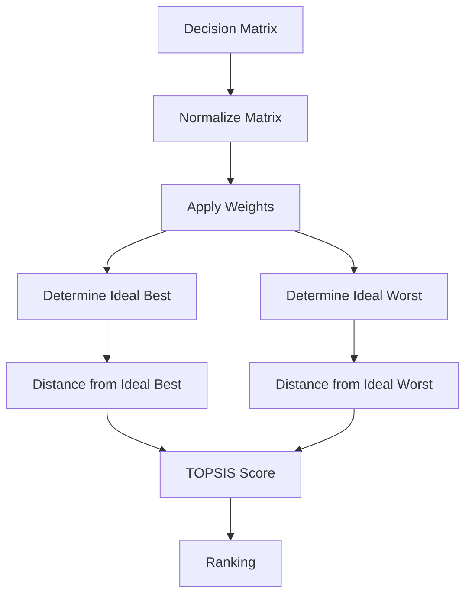
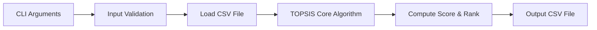
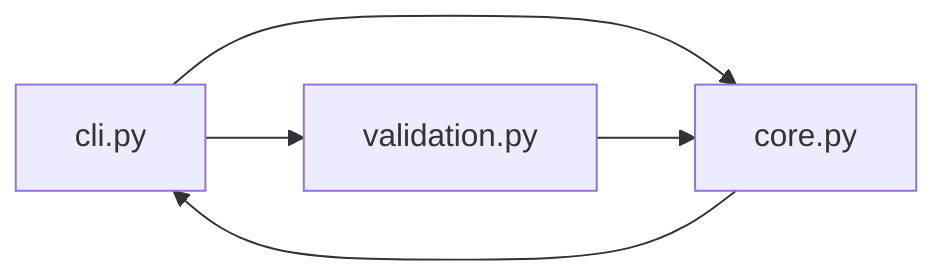

# Topsis-Siddharth-102303592

A **Python command-line implementation of TOPSIS** (Technique for Order Preference by Similarity to Ideal Solution) for **Multi-Criteria Decision Making (MCDM)**.

This project is built as:

| Feature | Description |
|--------|-------------|
| Academic correctness | Follows standard TOPSIS methodology |
| CLI Tool | Fully executable from command line |
| Validation | Strict input and argument validation |
| Distribution | PyPI-ready Python package |
| Documentation | Clear explanations with diagrams |

---

## 📌 What is TOPSIS?

**TOPSIS (Technique for Order Preference by Similarity to Ideal Solution)** is a popular **Multi-Criteria Decision Making (MCDM)** technique.

### 🔑 Core Principle

The best alternative is the one that:
- Is **closest to the ideal best solution**
- Is **farthest from the ideal worst solution**

### 📊 Common Applications

| Domain | Usage |
|--------|-------|
| Engineering | Component / design selection |
| Business | Supplier & product evaluation |
| Finance | Investment ranking |
| Analytics | Model comparison |

---

## 🧠 TOPSIS Algorithm Flow



---

## 🧩 Program Workflow (Software Perspective)



---

## 🏗️ Module Interaction Diagram



---

## 📦 Installation

Install the package from PyPI:

```bash
pip install Topsis-Siddharth-102303592
```

---

## ▶️ Usage (Command Line)

### General Syntax

```bash
topsis <input_file> <weights> <impacts> <output_file>
```

### Example

```bash
topsis sample.csv "0.4,0.4,0.2" "+,+,-" result.csv
```

---

## 📥 Input File Format

### Requirements

| Rule | Description |
|------|-------------|
| File type | CSV |
| Columns | Minimum 3 |
| Column 1 | Alternative / identifier |
| Columns 2+ | Numeric criteria only |

### Example Input

```csv
Name,C1,C2,C3
A,250,16,12
B,200,16,8
C,300,32,16
D,275,32,8
```

---

## 📤 Output File Format

### Output Characteristics

| Property | Description |
|----------|-------------|
| Original data | Preserved |
| New columns | Topsis Score, Rank |
| Ranking | 1 = Best |

### Example Output

```csv
Name,C1,C2,C3,Topsis Score,Rank
A,250,16,12,0.2754,4
B,200,16,8,0.3196,3
C,300,32,16,0.6803,2
D,275,32,8,0.8895,1
```

---

## ⚠️ Error Handling & Validation

The program validates the following:

| Validation Type | Description |
|-----------------|-------------|
| CLI arguments | Correct number of arguments |
| Input file | File existence |
| CSV format | Minimum columns |
| Data values | Numeric criteria only |
| Weights | Numeric & count match |
| Impacts | Only `+` or `-` |

All errors are reported with **clear, user-friendly messages**.

---

## 📁 Project Structure

```text
Topsis-Siddharth-102303592/
│── topsis_siddharth/
│   ├── cli.py          # Command-line interface
│   ├── core.py         # Core TOPSIS algorithm
│   ├── validation.py  # Input validation
│
│── tests/
│── README.md
│── pyproject.toml
│── LICENSE
```

---

## 👤 Author

| Name | Role |
|------|------|
| Siddharth Jaswal | Computer Science Student |

---

## 📄 License

This project is licensed under the **MIT License**.

