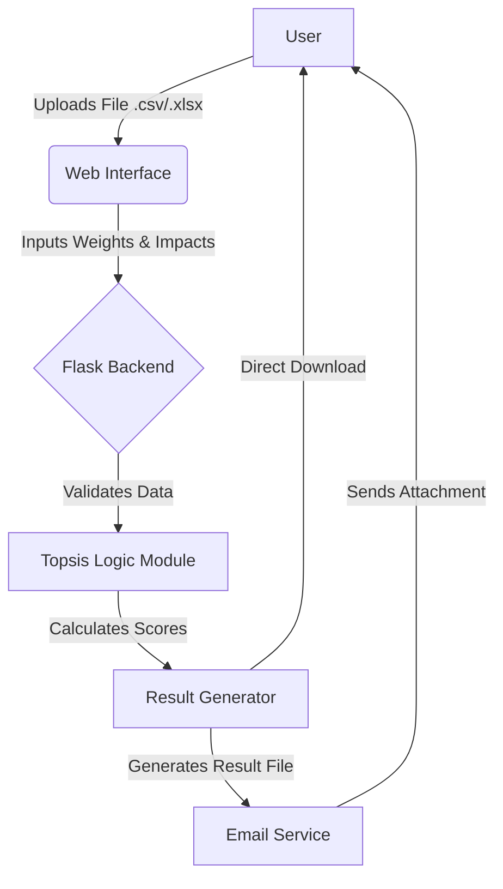

# TOPSIS-Vikas-102303451

[](https://pypi.org/project/Topsis-Vikas-102303451/)
[](https://opensource.org/licenses/MIT)

## Project Description
**TOPSIS** (Technique for Order of Preference by Similarity to Ideal Solution) is a multi-criteria decision analysis method. It evaluates alternatives based on their geometric distance to the ideal best value and the ideal worst value.

## 🔄 System Flowchart

```mermaid
graph LR
    A[Data Input<br>(CSV/Excel)] --> B[Data Validation<br>(Check Numeric/Weights)]
    B --> C[Normalization &<br>Weight Application]
    C --> D[Ideal Solution<br>(Best & Worst)]
    D --> E[Ranking &<br>Result Generation]
    style A fill:#e1f5fe,stroke:#01579b,stroke-width:2px
    style B fill:#fff9c4,stroke:#fbc02d,stroke-width:2px
    style C fill:#e8f5e9,stroke:#2e7d32,stroke-width:2px
    style D fill:#f3e5f5,stroke:#7b1fa2,stroke-width:2px
    style E fill:#ffebee,stroke:#c62828,stroke-width:2px
```

This project implements TOPSIS in Python and provides three interfaces:
1.  **Command Line Interface (CLI)**: For quick local usage.
2.  **Python Package**: Reusable library for your scripts.
3.  **Web Service**: A user-friendly web app to upload data and get results via email.

---

## 🚀 Live Web Service
The web application is deployed and accessible at:
> **[https://topsis-vikas-102303451.vercel.app](https://topsis-vikas-102303451.vercel.app)**

---

## 🛠️ System Architecture

### Workflow Diagram



### How TOPSIS Works (Mathematics)
1.  **Normalization**: Normalize the decision matrix so that each criterion is comparable.
2.  **Weighting**: Multiply the normalized matrix by the weights of each criterion.
3.  **Ideal Best & Worst**: Identify the ideal best ($V^+$) and ideal worst ($V^-$) values for each column.
    *   For **Benefit (+)**: Max value is best, Min is worst.
    *   For **Cost (-)**: Min value is best, Max is worst.
4.  **Separation Measures**: Calculate Euclidean distance of each alternative from $V^+$ and $V^-$.
5.  **Score Calculation**: $P_i = \frac{S_i^-}{S_i^+ + S_i^-}$.
6.  **Ranking**: Sort alternatives by score in descending order.

---

## 📦 Installation & Usage

### 1. Python Package
Install from PyPi:
```bash
pip install Topsis-Vikas-102303451
```

Use in your code:
```python
from topsis_vikas import topsis

# topsis(input_file, weights, impacts, output_file)
topsis("data.csv", "1,1,1,1", "+,+,+,-", "output.csv")
```

### 2. Command Line Interface
```bash
topsis data.csv "1,1,1,1" "+,+,+,-" result.csv
```
*   **Weights**: Comma-separated (e.g., `1,1,1,1`)
*   **Impacts**: Comma-separated `+` or `-` (e.g., `+,+,+,-`)

---

## 💻 Web Application

### Features
*   **Modern UI**: Clean, responsive interface using **CSS Gradients** and **Glassmorphism**.
*   **Auto-Analysis**: Automatically detects the number of criteria in your file.
*   **Email Delivery**: Results delivered directly to your inbox.

### Tech Stack
*   **Frontend**: HTML5, CSS3, JavaScript (Fetch API)
*   **Backend**: Python, Flask
*   **Data Processing**: Pandas, NumPy
*   **Deployment**: Vercel

### Screenshots


---

## 👨‍💻 Author

**Vikas Verma**
*   **Roll Number**: 102303451
*   **Email**: vverma_be22@thapar.edu
*   **GitHub**: [vikasverma](https://github.com/vikasverma)

Constructed with ❤️ for the Thapar Institute of Engineering & Technology.
