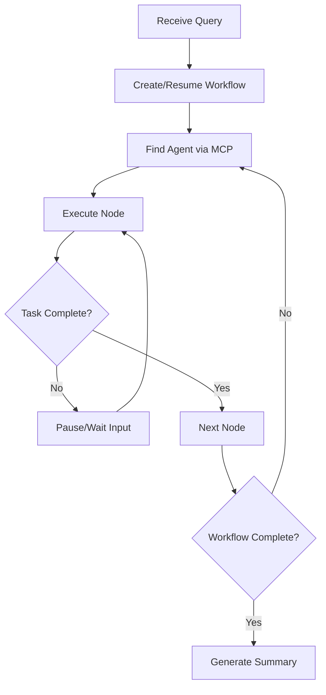

# 🎯 Orchestrator Agent

The **Orchestrator Agent** is the central coordinator of the ABI multi-agent system. It manages workflow execution, coordinates agent communication, and ensures context continuity across complex multi-step tasks.

## 🚀 Status: ✅ **FULLY OPERATIONAL**

## 🎯 Core Responsibilities

- **Workflow Coordination**: Manages complex multi-agent workflows using LangGraph state machines
- **Agent Health Monitoring**: Checks agent availability with retries and exponential backoff
- **Plan Execution**: Receives plans from Planner Agent and coordinates execution
- **Result Synthesis**: Uses LLM to synthesize results from multiple agents
- **Real-time Streaming**: Provides live updates on workflow execution progress
- **Q&A Flow**: Handles questions from Planner Agent and routes to appropriate handlers

## 🏗️ Architecture

### Key Components
- **WorkflowGraph**: LangGraph-based state management with pause/resume capabilities
- **A2A Integration**: Full Agent-to-Agent protocol implementation
- **MCP Client**: Connects to semantic layer for intelligent agent discovery
- **LangChain Integration**: Uses ChatOllama for natural language processing and result synthesis

### Workflow Execution Flow


## 🔧 Configuration

### Environment Variables
```bash
MODEL_NAME=llama3.2:3b
AGENT_HOST=0.0.0.0
AGENT_BASE=https://abi-orchestrator:8002
AGENT_CARD=/app/agent_cards/orchestrator_agent.json
ABI_ROLE=Orchestrator Agent
ABI_NODE=ABI AGENT
PYTHONPATH=/app
```

### Ports
- **8002**: Main A2A API endpoint
- **11435**: Ollama LLM service

## 📡 API Endpoints

### Core Endpoints (A2A Protocol)
- `POST /stream` - Execute workflow with streaming responses
- `GET /card` - Get agent card information
- `GET /health` - Health check endpoint
- `GET /__routes` - List all available routes

### Example Usage
```bash
curl -X POST http://localhost:8002/stream \
  -H "Content-Type: application/json" \
  -d '{
    "query": "Analyze market trends and create a report",
    "context_id": "session-123",
    "task_id": "task-001"
  }'
```

## 🧠 Capabilities

### Workflow Management
- **Dynamic Graph Creation**: Builds workflow graphs based on task requirements
- **Pause/Resume**: Can pause workflows for human input and resume seamlessly
- **Context Preservation**: Maintains state across workflow interruptions
- **Error Recovery**: Handles failures gracefully with retry mechanisms

### Agent Discovery
- **Semantic Matching**: Uses MCP server to find best-fit agents for tasks
- **Capability Assessment**: Evaluates agent skills against task requirements
- **Load Balancing**: Distributes tasks efficiently across available agents

### Human Interaction
- **Question Answering**: Automatically handles user questions during workflow execution
- **Decision Points**: Pauses for human approval on critical decisions
- **Progress Updates**: Provides real-time status updates via streaming

## 🔗 Integration Points

### MCP Server Connection
```python
config = get_mcp_server_config()
async with client.init_session(config.host, config.port, config.transport) as session:
    result = await client.find_agent(session, task_description)
```

### A2A Communication
```python
client = A2AClient(httpx_client, agent_card)
response_stream = client.send_message_stream(request)
```

## 📊 Performance Metrics

- **Workflow Execution**: Handles complex multi-step workflows with 5+ agents
- **Response Time**: Sub-second agent discovery via semantic search
- **Context Retention**: Maintains state across workflow pauses/resumes
- **Streaming**: Real-time updates with minimal latency

## 🛠️ Development

### Local Development
```bash
cd abi-core/agents/orchestrator
docker build -t abi-orchestrator .
docker run -p 8002:8002 abi-orchestrator
```

### Testing
```bash
# Test agent discovery
curl http://localhost:10100/find_agent -d '{"query": "analyze data"}'

# Test workflow execution
curl -X POST http://localhost:8002/stream -d '{"query": "test workflow"}'
```

## 🔍 Monitoring

### Health Checks
- **Agent Status**: Monitors all connected agents
- **MCP Connectivity**: Validates semantic layer connection
- **Workflow State**: Tracks active and paused workflows

### Logging
- **Structured Logging**: JSON-formatted logs for analysis
- **Workflow Tracing**: Complete audit trail of workflow execution
- **Performance Metrics**: Response times and resource usage

## 🚀 Future Enhancements

- **Advanced Scheduling**: Priority-based task scheduling
- **Workflow Templates**: Pre-defined workflow patterns
- **Performance Optimization**: Caching and optimization strategies
- **Multi-tenant Support**: Isolated workflows for different users

---

**Status**: Production Ready ✅  
**Last Updated**: September 2025  
**Maintainer**: José Luis Martínez