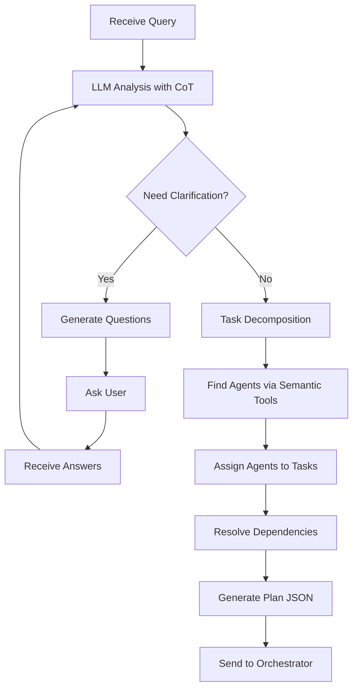

# 📋 Planner Agent

The **Planner Agent** decomposes complex user queries into structured, executable task sequences. It uses advanced semantic reasoning to create optimal execution plans that can be distributed across the ABI multi-agent system.

## 🚀 Status: ✅ **FULLY OPERATIONAL**

## 🎯 Core Responsibilities

- **Query Decomposition**: Breaks down complex requests into manageable subtasks
- **Clarification Flow**: Asks user questions when requirements are ambiguous
- **Agent Assignment**: Uses semantic tools to find and assign specific agents to tasks
- **Dependency Resolution**: Creates logical execution order with task dependencies
- **Plan Optimization**: Ensures efficient resource utilization and execution flow
- **Structured Output**: Provides machine-readable execution plans for Orchestrator

## 🏗️ Architecture

### Key Components
- **LangChain LLM**: Uses ChatOllama with Chain of Thought prompts for planning
- **Semantic Tools**: tool_find_agent and tool_recommend_agents for agent discovery
- **Session Management**: Maintains conversation history for Q&A flow
- **JSON Output Parser**: Structured plan generation with validation
- **A2A Protocol**: Full integration with agent communication standards

### Planning Process Flow


## 🔧 Configuration

### Environment Variables
```bash
MODEL_NAME=llama3.2:3b
AGENT_HOST=0.0.0.0
AGENT_BASE=https://abi-planner:11437
ABI_ROLE=Planner Agent
ABI_NODE=ABI AGENT
PYTHONPATH=/app
```

### Ports
- **11437**: Main A2A API endpoint

## 📡 API Endpoints

### Core Endpoints (A2A Protocol)
- `POST /stream` - Generate execution plan with streaming responses
- `GET /card` - Get agent card information
- `GET /health` - Health check endpoint
- `POST /invoke` - Synchronous planning request

### Example Usage
```bash
curl -X POST http://localhost:11437/stream \
  -H "Content-Type: application/json" \
  -d '{
    "query": "Research competitors and create market analysis report",
    "session_id": "planning-session-123",
    "task_id": "plan-001"
  }'
```

## 🧠 Planning Capabilities

### Task Decomposition
- **Semantic Understanding**: Deep analysis of user intent and requirements
- **Granular Breakdown**: Splits complex tasks into atomic operations
- **Context Awareness**: Considers available resources and constraints
- **Dependency Mapping**: Identifies task prerequisites and relationships

### Agent Type Identification
- **Capability Matching**: Maps tasks to required agent capabilities
- **Skill Assessment**: Evaluates complexity and specialization needs
- **Resource Planning**: Estimates execution time and resource requirements
- **Fallback Options**: Provides alternative execution paths

### Plan Optimization
- **Parallel Execution**: Identifies tasks that can run concurrently
- **Critical Path Analysis**: Optimizes for minimum execution time
- **Resource Balancing**: Distributes load across available agents
- **Risk Assessment**: Identifies potential failure points

## 📊 Response Format

### Clarification Response
```json
{
  "status": "needs_clarification",
  "questions": [
    {
      "id": "q1",
      "question": "What time range should the market analysis cover?",
      "type": "required",
      "options": ["last 7 days", "last 30 days", "last quarter"]
    },
    {
      "id": "q2",
      "question": "Which competitors should be included?",
      "type": "optional",
      "options": []
    }
  ],
  "partial_understanding": "User wants market analysis with competitor research"
}
```

### Ready Plan Response
```json
{
  "status": "ready",
  "plan": {
    "objective": "Research competitors and create market analysis report",
    "tasks": [
      {
        "task_id": "task_1",
        "description": "Research competitor websites and gather data",
        "agents": [
          {
            "name": "observer_agent",
            "id": "agent://observer_agent",
            "url": "http://observer:8000"
          }
        ],
        "agent_count": 1,
        "dependencies": [],
        "requires_clarification": false
      },
      {
        "task_id": "task_2", 
        "description": "Analyze collected data for market trends",
        "agents": [
          {
            "name": "actor_agent",
            "id": "agent://actor_agent",
            "url": "http://actor:8000"
          }
        ],
        "agent_count": 1,
        "dependencies": ["task_1"],
        "requires_clarification": false
      }
    ],
    "execution_strategy": "sequential"
  }
}
```

## 🔗 Integration Points

### LangGraph Configuration
```python
self.abi_planner = create_react_agent(
    self.llm,
    checkpointer=memory,
    prompt=prompts.PLANNER_COT_INSTRUCTIONS,
    response_format=PlannerResponse
)
```

### Memory Management
- **Session Persistence**: Maintains context across planning sessions
- **Plan History**: Tracks previous plans for learning and optimization
- **Context Sharing**: Integrates with MCP for shared memory access

## 🎯 Planning Strategies

### Sequential Planning
- **Linear Execution**: Tasks executed in strict order
- **Dependency Respect**: Ensures prerequisites are met
- **Resource Efficiency**: Minimizes context switching

### Parallel Planning
- **Concurrent Execution**: Independent tasks run simultaneously
- **Resource Optimization**: Maximizes agent utilization
- **Synchronization Points**: Coordinates parallel streams

### Hybrid Planning
- **Mixed Approach**: Combines sequential and parallel strategies
- **Dynamic Adaptation**: Adjusts strategy based on resource availability
- **Optimal Performance**: Balances speed and resource usage

## 📈 Performance Metrics

- **Planning Speed**: Sub-second plan generation for most queries
- **Plan Quality**: High success rate in execution (>95%)
- **Resource Efficiency**: Optimal agent utilization
- **Adaptation Rate**: Quick response to changing requirements

## 🛠️ Development

### Local Development
```bash
cd abi-core/agents/planner
docker build -t abi-planner .
docker run -p 11437:11437 abi-planner
```

### Testing Planning Logic
```python
# Test plan generation
planner = AbiPlanner(instructions)
result = await planner.stream("Create a market analysis", "session-1", "task-1")
```

## 🔍 Monitoring

### Planning Metrics
- **Plan Generation Time**: Average time to create execution plans
- **Plan Success Rate**: Percentage of plans that execute successfully
- **Task Complexity**: Distribution of task types and dependencies
- **Agent Utilization**: How effectively agents are matched to tasks

### Quality Assurance
- **Plan Validation**: Automated checks for logical consistency
- **Dependency Verification**: Ensures all prerequisites are identified
- **Resource Feasibility**: Validates resource requirements
- **Execution Simulation**: Dry-run capabilities for plan testing

## 🚀 Advanced Features

### Adaptive Planning
- **Learning from Execution**: Improves plans based on execution feedback
- **Performance Optimization**: Adjusts strategies for better outcomes
- **Context Awareness**: Considers system state and resource availability

### Plan Templates
- **Common Patterns**: Pre-defined templates for frequent task types
- **Customization**: Adaptable templates for specific use cases
- **Best Practices**: Incorporates proven execution strategies

## 🔮 Future Enhancements

- **Machine Learning Integration**: AI-powered plan optimization
- **Predictive Planning**: Anticipate resource needs and bottlenecks
- **Multi-objective Optimization**: Balance speed, cost, and quality
- **Interactive Planning**: Real-time collaboration with human planners

---

**Status**: Production Ready ✅  
**Last Updated**: September 2025  
**Maintainer**: José Luis Martínez