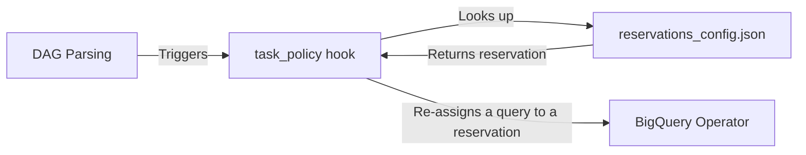

# Airflow Reservations Policy

Airflow Cluster Policy plugin for BigQuery reservation management.

This package integrates with Airflow's [Cluster Policies](https://airflow.apache.org/docs/apache-airflow/stable/administration-and-deployment/cluster-policies.html) to automatically inject BigQuery reservation assignments into your tasks without requiring any changes to your DAG code.

## Features

- **Automatic re-assignment** - intercepts BigQuery operators and re-assigns them to appropriate reservation based on the configuration:
  - `BigQueryInsertJobOperator` - Injects into `configuration.query.query` dict
  - Any BigQuery operator with a `sql` attribute (e.g. `BigQueryExecuteQueryOperator`, `BigQueryCheckOperator`)
- **Lookup-based Configuration** - Uses `dag_id.task_id` → `reservation_id` mappings
- **Python API** - Provides `get_reservation()` for custom BigQuery API calls in `PythonOperator`
- **Performance Optimized** - Config caching with file mtime-based invalidation
- **Graceful Error Handling** - Won't crash Airflow on config errors

## Installation

```bash
pip install airflow-reservations
```

Or add to your `requirements.txt`:

```text
airflow-reservations=0.1.0
```

The policy is automatically registered via Airflow's plugin entrypoint system (requires Airflow 2.6+).

## Configuration

Create a `reservations_config.json` file in your DAGs folder:

```json
{
  "reservation_config": [
    {
      "tag": "standard",
      "reservation": "projects/{project}/locations/{location}/reservations/{name}",
      "tasks": [
        "finance_dag.daily_report",
        "etl_dag.load_analytics"
      ]
    },
    {
      "tag": "on_demand",
      "reservation": "none",
      "tasks": [
        "adhoc_dag.quick_query"
      ]
    },
    {
      "tag": "default",
      "reservation": null,
      "tasks": [
        "marketing_dag.calculate_roas"
      ]
    }
  ]
}
```

### Configuration Fields

| Field         | Description                                    |
| ------------- | ---------------------------------------------- |
| `tag`         | Human-readable label for the reservation group |
| `reservation` | See values below                               |
| `tasks`       | Array of `"dag_id.task_id"` patterns           |

**Reservation values:**

| Value                                           | Behavior                                                                |
| ----------------------------------------------- | ----------------------------------------------------------------------- |
| `"projects/.../locations/.../reservations/..."` | Injects that reservation into the SQL                                   |
| `"none"`                                        | Injects `SET @@reservation='none';` (explicitly use on-demand capacity) |
| `null`                                          | Skips the task entirely (no SQL modification)                           |

### Configuration Path

By default, the config file is loaded from `$AIRFLOW_HOME/dags/reservations_config.json`.

Override the path using the `RESERVATIONS_CONFIG_PATH` environment variable:

```bash
export RESERVATIONS_CONFIG_PATH=/custom/path/to/config.json
```

### TaskGroups and Dynamic Tasks

For tasks inside TaskGroups, use the full task ID path as it appears in Airflow:

```json
{
  "reservation_config": [
    {
      "tag": "standard",
      "reservation": "projects/{project}/locations/{location}/reservations/{name}",
      "tasks": [
        "my_dag.my_task_group.inner_task"
      ]
    }
  ]
}
```

## How It Works

When Airflow parses your DAGs, this plugin's `task_policy` hook is called for each task. For BigQuery tasks, it:

1. Extracts `dag_id` and `task_id` from the task
2. Looks up `dag_id.task_id` in the configuration file
3. If found, prepends `SET @@reservation='...';` to the SQL query



## Usage in Python Operators

For custom BigQuery API calls in `PythonOperator`, use the provided API:

```python
from airflow_reservations import get_reservation

def my_bigquery_task(**context):
    dag_id = context['dag'].dag_id
    task_id = context['task'].task_id

    # Look up reservation for this task
    reservation = get_reservation(dag_id, task_id)

    if reservation:
        # Prepend to your SQL
        sql = f"SET @@reservation='{reservation}';\n{your_sql}"
    else:
        sql = your_sql

    # Execute with BigQuery client...
```

### API Reference

#### `get_reservation(dag_id: str, task_id: str) -> str | None`

Look up the reservation ID for a specific task.

```python
from airflow_reservations import get_reservation

reservation = get_reservation("my_dag", "my_task")
# Returns: "projects/my-project/locations/US/reservations/my-res" or None
```

#### `load_config(force_reload: bool = False) -> dict`

Load the full configuration dictionary.

```python
from airflow_reservations import load_config

config = load_config()
# Returns: {"reservations": {...}}
```

## Generating Configuration

Use Masthead recommendations to generate the `reservations_config.json` file containing the optimal reservation assignments for your tasks. Users are responsible for pulling this configuration into their Airflow environment.

Typical workflow:

1. Masthead analyzes your BigQuery workloads
2. Read Masthead recommendations and generate `reservations_config.json` with optimal assignments
3. Merge the config into your DAGs repository
4. Airflow syncs the updated config file
5. The policy applies reservations on next task parse

## Troubleshooting

### Config not loading

Check that:

1. The config file exists at the expected path
2. The file contains valid JSON
3. Airflow has read permissions

Enable debug logging:

```python
import logging
logging.getLogger("airflow_reservations").setLevel(logging.DEBUG)
```

### Reservations not being applied

Verify:

1. The task type is `BigQueryInsertJobOperator` or `BigQueryExecuteQueryOperator`
2. The `dag_id.task_id` key exactly matches the config
3. For TaskGroups, include the full path (e.g., `dag.group.task`)

## Development

```bash
# Install dev dependencies
pip install -e ".[dev]"

# Run unit tests
pytest tests/ -v

# Run with coverage
pytest tests/ --cov=airflow_reservations

# Run E2E tests (requires Docker)
make e2e

# Run E2E tests with Airflow 2.x
make e2e-airflow2

# Run E2E tests with Airflow 3.x
make e2e-airflow3

# Run E2E tests with all supported Airflow versions
make e2e-all
```

## Supported Versions

This package is tested and compatible with:

- **Airflow 2.6+** (including 2.10.x) - ✅ Fully supported and tested
- **Airflow 3.x** (including 3.1.x) - ✅ Fully supported and tested (see Airflow 3 notes below)
- **Python 3.8+** (tested with 3.11 and 3.12)

### Airflow 3 Notes

In Airflow 3, the Task SDK parses DAGs in a separate process/container from the Scheduler and Worker. To ensure the policy works correctly:

1. **Installation**: The `airflow-reservations` package must be installed in the environment where the Task SDK executes (typically your custom Airflow image).
2. **Config Accessibility**: The `reservations_config.json` file must be accessible to the Task SDK process. If you are using remote DAG storage, ensure the config file is bundled with your DAGs or placed in a shared volume.
3. **Environment Variables**: If you use `RESERVATIONS_CONFIG_PATH`, it must be set in the environment of the worker/execution container as well.

The plugin uses Airflow's standard [Cluster Policies](https://airflow.apache.org/docs/apache-airflow/stable/administration-and-deployment/cluster-policies.html) API, which remains the recommended way to implement cross-cutting concerns in Airflow 3.
