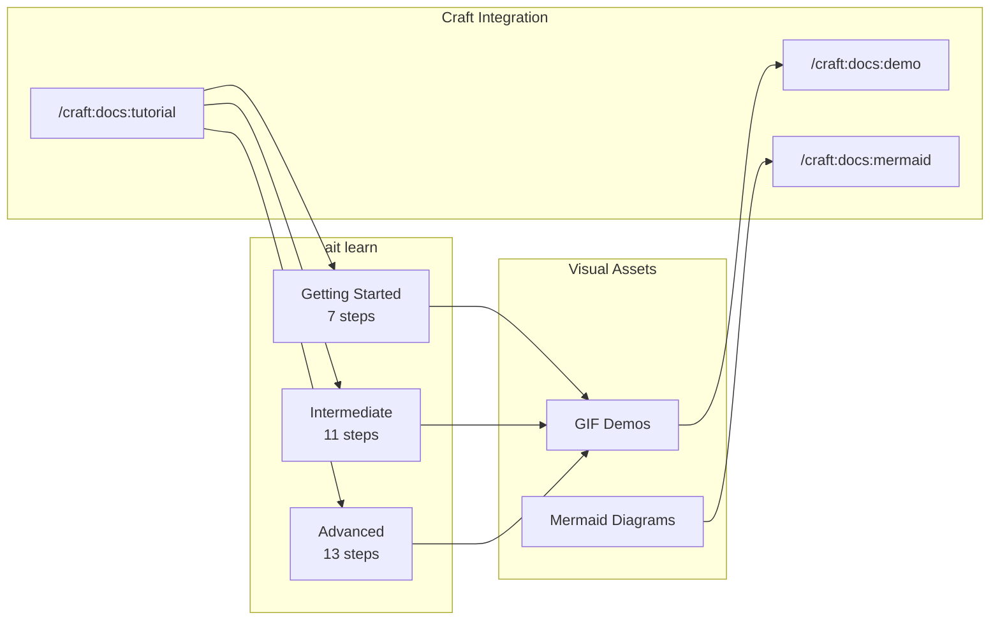

# v0.6.0 Plan - Interactive Tutorial System + Visual Documentation

**Status:** Ready for Release (Week 4 Complete ✅)
**Target:** Mid-January 2026
**Theme:** Interactive onboarding, visual learning, cross-plugin integration
**Effort:** 48-60 hours over 4 weeks
**Brainstorm:** `BRAINSTORM-tutorial-workflow-integration-2025-12-30.md`

---

## Overview

Add `ait learn` command with 3 progressive tutorials (31 total steps), **accompanied by GIF demos and Mermaid diagrams** for every workflow. Integrate with craft plugin for tutorial generation.



**Spec:** `docs/specs/SPEC-interactive-tutorial-system.md` (merged PR #7)

---

## HIGH PRIORITY: Visual Documentation Foundation

### Priority 1: Mermaid Diagram Library (Week 1)

**Location:** `docs/diagrams/`

| Diagram | Type | Purpose |
|---------|------|---------|
| `tutorial-flow.md` | flowchart | Tutorial progression |
| `context-detection.md` | flowchart | How detection works |
| `session-lifecycle.md` | sequence | Session start/stop |
| `release-workflow.md` | flowchart | Release automation |
| `craft-integration.md` | architecture | Plugin integration |
| `worktree-flow.md` | flowchart | Git worktree workflow |

**Tasks:**
- [x] Create `docs/diagrams/` directory ✅
- [x] Add tutorial progression flowchart ✅
- [x] Add context detection diagram ✅
- [x] Add session lifecycle diagram ✅
- [x] Add release workflow diagram ✅
- [x] Add craft integration diagram ✅
- [x] Add worktree flow diagram ✅
- [ ] Embed diagrams in tutorial spec

### Priority 2: Tutorial GIF Pipeline (Week 1-2)

**Location:** `docs/demos/tutorials/`

```
docs/demos/tutorials/
├── getting-started-01-doctor.tape     # ait doctor
├── getting-started-02-detect.tape     # ait detect
├── getting-started-03-switch.tape     # ait switch
├── intermediate-01-claude.tape        # Claude Code settings
├── intermediate-02-workflows.tape     # Workflow commands
├── intermediate-03-sessions.tape      # Session management
├── advanced-01-release.tape           # Release workflow
├── advanced-02-worktrees.tape         # Git worktrees
└── advanced-03-craft.tape             # Craft integration
```

**Tasks:**
- [x] Create `docs/demos/tutorials/` directory ✅
- [x] Create VHS tape for `ait doctor` ✅
- [x] Create VHS tape for `ait detect` ✅
- [x] Create VHS tape for `ait switch` ✅
- [x] Create VHS tapes for intermediate (3) ✅
- [x] Create VHS tapes for advanced (3) ✅
- [ ] Generate all GIFs with VHS tool

### Priority 3: Documentation Reorganization (Week 2)

**New Structure:**
```
docs/
├── tutorials/                    # NEW: Interactive tutorials
│   ├── getting-started/
│   ├── intermediate/
│   └── advanced/
├── diagrams/                     # NEW: Mermaid library
├── demos/
│   ├── tutorials/               # NEW: Tutorial GIFs
│   └── features/                # EXISTING
├── guides/                       # EXISTING
└── reference/                    # EXISTING
```

**Tasks:**
- [ ] Create `docs/tutorials/` structure
- [ ] Move proposals to `docs/_archive/`
- [ ] Update mkdocs.yml navigation
- [ ] Create REFCARD-TUTORIALS.md

---

## Command Interface

```bash
ait learn                        # List all tutorials
ait learn getting-started        # 7 steps, ~10 min
ait learn intermediate           # 11 steps, ~20 min
ait learn advanced               # 13 steps, ~35 min
ait learn <level> --step N       # Resume from step N
```

---

## Tutorial Content

### Level 1: Getting Started (7 steps)
- What is aiterm? → doctor → config → detect → switch → help → next steps
- **GIFs:** 3 demos (doctor, detect, switch)
- **Diagram:** Tutorial progression flowchart

### Level 2: Intermediate (11 steps)
- Claude Code (primary) → workflows → sessions → terminals
- **GIFs:** 3 demos (claude, workflows, sessions)
- **Diagram:** Session lifecycle sequence

### Level 3: Advanced (13 steps)
- Release → workflows → Craft/MCP/IDE → debugging
- **GIFs:** 3 demos (release, worktrees, craft)
- **Diagram:** Release workflow + Craft integration

---

## Implementation Phases

| Phase | Duration | Effort | Tasks |
|-------|----------|--------|-------|
| **0. Visual Foundation** | Week 1 | 6-8h | Diagrams + first GIFs |
| 1. Core Engine | Week 1 | 10-12h | `src/aiterm/utils/tutorial.py` |
| 2. Tutorial Content | Week 1-2 | 8-10h | All 31 steps |
| 3. GIF Generation | Week 2 | 4-6h | All tutorial demos |
| 4. CLI Integration | Week 2 | 4-6h | `ait learn` command |
| 5. Documentation | Week 2-3 | 6-8h | MkDocs + diagrams |
| 6. Testing & Polish | Week 3 | 4-6h | 40+ tests, 90%+ coverage |
| 7. User Testing | Week 3-4 | 4-6h | 3-5 new users |

---

## Core Files

```
# Tutorial Engine
src/aiterm/utils/tutorial.py      # NEW: 600-700 lines
src/aiterm/cli/main.py            # MODIFIED: +50 lines
tests/test_tutorial.py            # NEW: 40+ tests

# Visual Assets
docs/diagrams/                    # NEW: 6+ Mermaid files
docs/demos/tutorials/             # NEW: 9+ VHS tapes
docs/tutorials/                   # NEW: Interactive content

# Documentation
docs/reference/REFCARD-TUTORIALS.md  # NEW
TUTORIAL_GUIDE.md                    # NEW
```

---

## Craft Plugin Integration

### New Command: `/craft:docs:tutorial`

```bash
/craft:docs:tutorial getting-started   # Generate tutorial structure
/craft:docs:tutorial intermediate      # With GIFs and Mermaid
/craft:docs:tutorial advanced

# Options
/craft:docs:tutorial --with-gifs       # Generate VHS tapes
/craft:docs:tutorial --with-diagrams   # Add Mermaid
/craft:docs:tutorial --dry-run         # Preview only
```

**Implementation:** Add `commands/docs/tutorial.md` to craft plugin

### Existing Commands Used

| Command | Purpose |
|---------|---------|
| `/craft:docs:demo` | Generate VHS tapes |
| `/craft:docs:mermaid` | Diagram templates |
| `/craft:docs:guide` | 7-phase guide generation |
| `/craft:git:worktree` | Featured in Advanced tutorial |

---

## Architecture (Nexus Pattern)

```python
# Core components
class TutorialLevel(Enum):
    GETTING_STARTED = "getting-started"
    INTERMEDIATE = "intermediate"
    ADVANCED = "advanced"

@dataclass
class TutorialStep:
    title: str
    description: str
    command: str
    hint: str
    gif_path: Optional[str]       # NEW: GIF demo path
    diagram: Optional[str]        # NEW: Mermaid diagram
    validate: Optional[Callable]

class Tutorial:
    def show_intro(self) -> None: ...
    def show_step(self, step: int) -> None: ...
    def show_gif(self, step: int) -> None: ...  # NEW
    def run(self) -> None: ...
    def show_completion(self) -> None: ...
```

---

## Success Metrics

| Metric | Target |
|--------|--------|
| Tutorial completion rate | 60%+ |
| Time to productivity | <30 min (vs 2 hours) |
| Test coverage | 90%+ |
| Support question reduction | 40% |
| **GIF coverage** | 100% of tutorials |
| **Diagram count** | 6+ Mermaid diagrams |

---

## Dependencies

**Core (existing):**
- `typer` - CLI framework
- `rich` - Terminal formatting
- `questionary` - Interactive prompts

**Visual (optional):**
- `vhs` - GIF recording (Charm Bracelet)
- `gifsicle` - GIF optimization

---

## Related

- v0.5.1: Release automation (complete)
- v0.4.0: Workflow foundation (complete)
- Craft plugin: `/craft:docs:*` commands
- Workflow plugin: `/workflow:brainstorm`
- Spec: `docs/specs/SPEC-interactive-tutorial-system.md`
- Brainstorm: `BRAINSTORM-tutorial-workflow-integration-2025-12-30.md`

---

## Next Steps (Priority Order)

### Week 1: Foundation ✅ COMPLETE
1. [x] Merge tutorial spec (PR #7) ✅
2. [x] Create `docs/diagrams/` directory ✅
3. [x] Add tutorial progression Mermaid diagram ✅
4. [x] Create first VHS tape (`ait doctor`) ✅
5. [x] Create `src/aiterm/utils/tutorial.py` (~615 lines) ✅
6. [x] Add `ait learn` CLI command ✅
7. [x] Add 29 tests for tutorial module ✅

### Week 2: Content + GIFs ✅ COMPLETE
1. [x] Generate all Getting Started GIFs (VHS tool) ✅
2. [x] Generate Intermediate GIFs (3 GIFs) ✅
3. [x] Generate Advanced GIFs (3 GIFs) ✅
4. [x] Create REFCARD-TUTORIALS.md ✅
5. [x] Embed diagrams in tutorial spec ✅
6. [x] Add REFCARD-TUTORIALS to mkdocs.yml ✅

### Week 3: Advanced + Polish ✅ COMPLETE
1. [x] Update mkdocs.yml navigation for tutorials ✅
2. [x] Create `docs/tutorials/` structure (4 pages) ✅
3. [x] User testing checklist created ✅
4. [x] Add more tests (47 tests, exceeds 40+ target) ✅
5. [x] Total tests: 658 (was 640) ✅

### Week 4: Integration + Release ✅ COMPLETE
1. [x] Add `/craft:docs:tutorial` command to craft ✅ (craft v1.12.0)
2. [x] User testing checklist ready ✅ (USER-TESTING-CHECKLIST.md)
3. [x] Documentation polish ✅ (mkdocs builds clean, 75 tutorial tests)
4. [ ] Release as v0.6.0 (ready to release)

---

## Quick Wins (Start Now)

| Task | Time | Impact |
|------|------|--------|
| Create `docs/diagrams/` | 5 min | Foundation |
| Add Mermaid to spec | 15 min | Visual clarity |
| First VHS tape | 20 min | Proof of concept |
| Cross-link craft in spec | 10 min | Integration |
