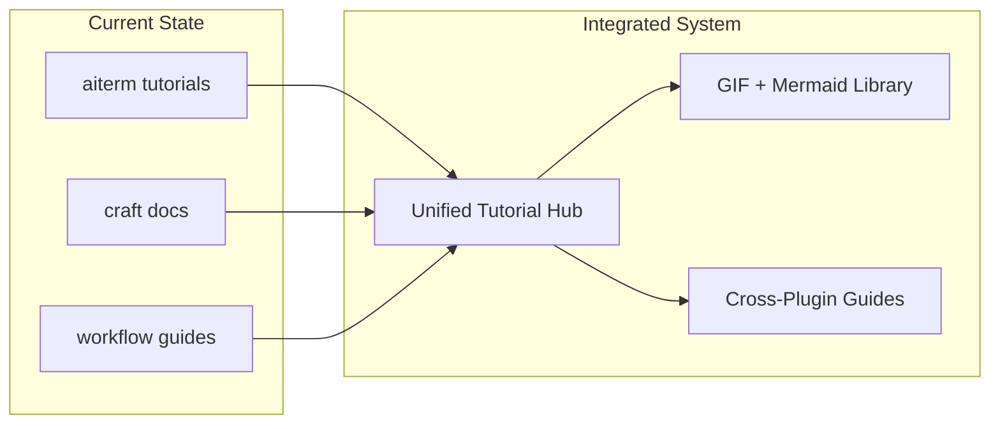
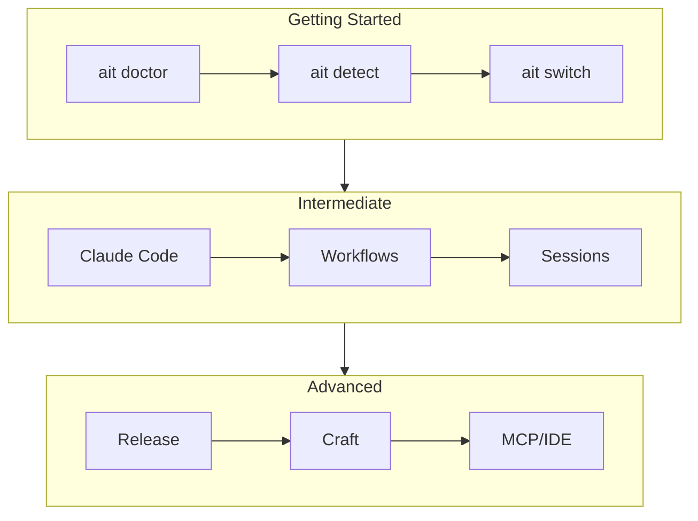

# Tutorial & Workflow Integration - Deep Brainstorm

**Generated:** 2025-12-30
**Mode:** thorough + feature
**Duration:** ~8 minutes (3 parallel agents)
**Context:** aiterm, craft, workflow plugins integration

---

## Overview

Comprehensive plan to integrate tutorials across aiterm and craft, add GIF/Mermaid to all workflows, and reorganize documentation structure.



---

## Quick Wins (< 30 min each)

1. **Create VHS tape template library** in craft
   - Use existing `/craft:docs:demo` patterns
   - Standardize 3 templates: command-showcase, workflow, before-after

2. **Add Mermaid to aiterm tutorial spec**
   - Embed flowcharts in each tutorial level
   - Use `/craft:docs:mermaid` templates

3. **Cross-link craft commands in aiterm Advanced tutorial**
   - Already started (PR #7 improvements)
   - Add `/craft:git:worktree`, `/craft:docs:mermaid`

4. **Create unified REFCARD for tutorial commands**
   - `ait learn` + `/craft:docs:guide` + `/workflow:brainstorm`

5. **Standardize demo GIF naming**
   - Pattern: `{feature}-{action}.gif` (e.g., `tutorial-getting-started.gif`)

---

## Medium Effort (1-2 hours each)

### 1. Tutorial GIF Generation Pipeline

**Location:** `docs/demos/tutorials/`

Create VHS tapes for each aiterm tutorial level:

```
docs/demos/tutorials/
├── getting-started-01-doctor.tape
├── getting-started-02-detect.tape
├── getting-started-03-switch.tape
├── intermediate-01-claude.tape
├── intermediate-02-workflows.tape
├── intermediate-03-sessions.tape
├── advanced-01-release.tape
├── advanced-02-worktrees.tape
└── advanced-03-craft.tape
```

**Implementation:**
```bash
# Use craft demo generator
/craft:docs:demo command-showcase --output docs/demos/tutorials/getting-started-01-doctor.tape

# Commands for getting-started level
# Step 1: ait doctor
# Step 2: ait detect
# Step 3: ait switch
# Step 4: ait --help
```

### 2. Mermaid Diagram Library

**Location:** `docs/diagrams/` (new directory)

Create reusable diagrams:

| Diagram | Type | Purpose |
|---------|------|---------|
| `tutorial-flow.md` | flowchart | Tutorial progression |
| `context-detection.md` | flowchart | How detection works |
| `session-lifecycle.md` | sequence | Session start/stop |
| `release-workflow.md` | flowchart | Release automation |
| `craft-integration.md` | architecture | Plugin integration |
| `worktree-flow.md` | flowchart | Git worktree workflow |

**Template (from craft):**


### 3. Documentation Reorganization

**Current Issues:**
- aiterm has 82 docs files in many directories
- craft has commands organized by category
- workflow has flat structure

**Proposed Structure:**

```
docs/
├── tutorials/                    # NEW: Interactive tutorials
│   ├── getting-started/
│   │   ├── index.md
│   │   ├── step-1-doctor.md
│   │   └── ...
│   ├── intermediate/
│   └── advanced/
├── guides/                       # EXISTING: Long-form guides
│   ├── user-guide.md
│   ├── feature-workflow.md
│   └── git-worktrees.md
├── reference/                    # EXISTING: Quick lookups
│   ├── REFCARD.md
│   └── REFCARD-*.md
├── demos/                        # EXISTING: GIF demos
│   ├── tutorials/               # NEW: Tutorial GIFs
│   └── features/                # EXISTING: Feature GIFs
├── diagrams/                     # NEW: Mermaid library
│   ├── README.md
│   └── *.md
└── integration/                  # NEW: Cross-plugin guides
    ├── craft/
    ├── workflow/
    └── mcp/
```

### 4. Craft Plugin Tutorial Commands

**New commands for craft:**

```bash
# Tutorial generation
/craft:docs:tutorial getting-started   # Generate tutorial structure
/craft:docs:tutorial intermediate      # With GIFs and Mermaid
/craft:docs:tutorial advanced

# Options
/craft:docs:tutorial --with-gifs       # Generate VHS tapes
/craft:docs:tutorial --with-diagrams   # Add Mermaid
/craft:docs:tutorial --dry-run         # Preview only
```

**Implementation in craft:**
```
commands/docs/tutorial.md   # NEW command file
```

### 5. Workflow Help Integration

**Add to workflow plugin:**

```bash
# Tutorial-aware help
/workflow:help tutorial              # Show tutorial integration
/workflow:help brainstorm --visual   # With Mermaid diagram

# Session tracking for tutorials
/workflow:focus --tutorial getting-started
/workflow:done --tutorial-progress
```

---

## Long-term (Future sessions)

### 1. Interactive Tutorial Engine (v0.6.0)

**As specified in SPEC-interactive-tutorial-system.md:**
- `ait learn` command with 3 levels
- 31 total steps (7 + 11 + 13)
- Pause/resume functionality
- Interactive prompts

### 2. Video Walkthrough System

**Location:** `docs/videos/` (future)

- Screen recordings with voiceover
- YouTube integration
- Embedded in MkDocs with custom player

### 3. Cross-Plugin Tutorial Hub

**Unified entry point:**
```bash
/tutorial                        # Hub command
/tutorial aiterm                 # aiterm tutorials
/tutorial craft                  # craft tutorials
/tutorial workflow               # workflow tutorials
```

### 4. AI-Generated Tutorial Content

Using craft agents:
- `tutorial-engineer` agent for content
- `mermaid-expert` for diagrams
- `docs-architect` for structure

---

## Documentation Consolidation Plan

### Phase 1: Audit (Week 1)

| Project | Files | Issue | Action |
|---------|-------|-------|--------|
| aiterm | 82 | Scattered proposals | Archive to `_archive/` |
| craft | 71 commands | Well organized | Model for others |
| workflow | 12 commands | Flat structure | Add categories |
| claude-plugins root | 40+ files | Historical docs | Clean up |

### Phase 2: Reorganize (Week 2)

1. **aiterm:**
   - Move proposals → `docs/_archive/proposals/`
   - Create `docs/tutorials/` structure
   - Add `docs/diagrams/` library
   - Update mkdocs.yml nav

2. **craft:**
   - Add `commands/docs/tutorial.md`
   - Create tutorial templates
   - Add VHS tape templates for tutorials

3. **workflow:**
   - Add tutorial awareness to commands
   - Create visual help mode

### Phase 3: Integrate (Week 3)

1. Cross-reference tutorials between plugins
2. Generate all tutorial GIFs
3. Create Mermaid diagram library
4. Update all REFCARDs

---

## File Changes Summary

### New Files to Create

| File | Location | Purpose |
|------|----------|---------|
| `tutorial.md` | `craft/commands/docs/` | Tutorial generator command |
| `tutorials/` | `aiterm/docs/` | Tutorial content directory |
| `diagrams/` | `aiterm/docs/` | Mermaid library |
| `tutorials/` | `aiterm/docs/demos/` | Tutorial GIF tapes |
| `REFCARD-TUTORIALS.md` | `aiterm/docs/reference/` | Tutorial quick ref |

### Files to Modify

| File | Change |
|------|--------|
| `aiterm/mkdocs.yml` | Add tutorials nav |
| `aiterm/docs/specs/SPEC-interactive-tutorial-system.md` | Add Mermaid diagrams |
| `craft/README.md` | Add tutorial section |
| `workflow/commands/brainstorm.md` | Add --visual flag |

### Files to Archive

| Current Location | Archive To |
|-----------------|------------|
| `aiterm/*.md` proposals | `aiterm/docs/_archive/` |
| `claude-plugins/*.md` historical | `claude-plugins/docs/_archive/` |

---

## Recommended Path

```
┌─────────────────────────────────────────────────────────────┐
│ RECOMMENDED IMPLEMENTATION ORDER                             │
├─────────────────────────────────────────────────────────────┤
│                                                             │
│ Week 1: Foundation                                          │
│   1. ⚡ Create docs/diagrams/ in aiterm                      │
│   2. ⚡ Add Mermaid to tutorial spec                         │
│   3. ⚡ Create VHS tape templates for tutorials              │
│                                                             │
│ Week 2: Generation                                          │
│   4. □ Add /craft:docs:tutorial command                     │
│   5. □ Generate all tutorial GIFs                           │
│   6. □ Create REFCARD-TUTORIALS.md                          │
│                                                             │
│ Week 3: Integration                                         │
│   7. □ Add docs/tutorials/ structure                        │
│   8. □ Cross-link plugins in guides                         │
│   9. □ Archive old proposals                                │
│                                                             │
│ Week 4: Polish                                              │
│   10. □ Update all mkdocs.yml navigation                    │
│   11. □ Deploy and validate                                 │
│   12. □ User testing with 3-5 people                        │
│                                                             │
└─────────────────────────────────────────────────────────────┘
```

---

## Related Commands

| Command | Plugin | Purpose |
|---------|--------|---------|
| `ait learn` | aiterm | Interactive tutorials (v0.6.0) |
| `/craft:docs:guide` | craft | Generate guides with GIFs |
| `/craft:docs:demo` | craft | VHS tape generator |
| `/craft:docs:mermaid` | craft | Diagram templates |
| `/workflow:brainstorm` | workflow | Feature ideation |
| `/workflow:done` | workflow | Session completion |

---

## Success Metrics

| Metric | Target | Measurement |
|--------|--------|-------------|
| Tutorial GIF coverage | 100% | All 31 steps have demo |
| Mermaid diagram count | 10+ | Reusable library |
| Documentation consolidation | 50% reduction | Archived files |
| Cross-plugin references | 20+ | Links between plugins |
| User satisfaction | 4/5 stars | Feedback survey |

---

## Next Steps

1. [ ] Create `docs/diagrams/` directory in aiterm
2. [ ] Add first Mermaid diagram to tutorial spec
3. [ ] Create VHS tape for `ait doctor` command
4. [ ] Draft `/craft:docs:tutorial` command spec
5. [ ] Archive old proposals in claude-plugins root

---

## Files Referenced

**Craft Plugin:**
- `/Users/dt/projects/dev-tools/claude-plugins/craft/commands/docs/guide.md`
- `/Users/dt/projects/dev-tools/claude-plugins/craft/commands/docs/demo.md`
- `/Users/dt/projects/dev-tools/claude-plugins/craft/commands/docs/mermaid.md`
- `/Users/dt/projects/dev-tools/claude-plugins/craft/templates/site/pages/`

**Workflow Plugin:**
- `/Users/dt/projects/dev-tools/claude-plugins/workflow/commands/brainstorm.md`
- `/Users/dt/projects/dev-tools/claude-plugins/workflow/templates/SPEC-TEMPLATE.md`

**aiterm:**
- `/Users/dt/projects/dev-tools/aiterm/docs/specs/SPEC-interactive-tutorial-system.md`
- `/Users/dt/projects/dev-tools/aiterm/docs/demos/`
- `/Users/dt/projects/dev-tools/aiterm/mkdocs.yml`
