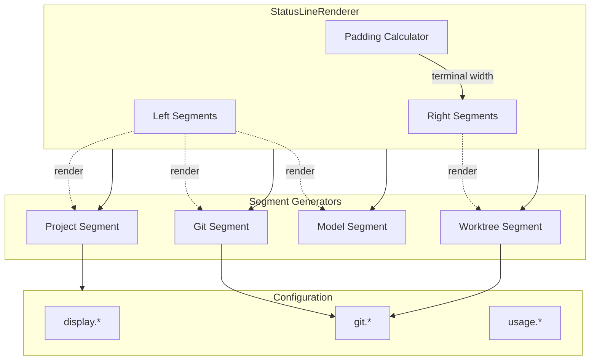

# 🧠 BRAINSTORM: StatusLine Redesign - Minimalist with Worktree Context

**Generated:** 2026-01-01
**Mode:** Feature | **Depth:** Deep | **Priority:** Minimize visual clutter

---

## 📋 Overview

Streamline aiterm's statusLine by removing time-tracking bloat and adding adaptive Powerlevel10k-style right-side worktree display. Current statusLine shows 8+ metrics; redesign focuses on essential context (model, project, git) with specialized worktree visualization.

**Design Goals:**
- Remove: Session duration, current time, lines changed, battery %, cost data
- Keep: Model name, project icon/name, git branch (smart truncate)
- Add: Right-side P10k worktree display (adaptive: different for main vs worktree)
- Result: Clean, focused statusLine that highlights worktree context

---

## ⚡ Quick Wins (< 30 min each)

### 1. **Config Cleanup - Disable Bloat**
Add preset configs to turn off unnecessary features with one command.

**Implementation:**
```bash
# Add to CLI
ait statusline preset minimal

# Under the hood:
ait statusline config set display.show_session_duration false
ait statusline config set display.show_current_time false
ait statusline config set display.show_lines_changed false
ait statusline config set usage.compact_format false
```

**Files:** `src/aiterm/cli/statusline.py:100` (add `preset` command)

**Benefit:** Immediate declutter without code changes. Users can toggle back if needed.

---

### 2. **Smart Branch Truncation**
Implement keep-start/end truncation for long branch names.

**Current:** `feature/authentication-system-oauth2-i...`
**Better:** `feature/...system-oauth2-integration`

**Implementation:**
```python
# src/aiterm/statusline/segments.py:550
def _truncate_branch(self, branch: str, max_len: int) -> str:
    if len(branch) <= max_len:
        return branch

    # Keep first 10 chars + "..." + last (max_len - 13) chars
    keep_start = 10
    keep_end = max_len - keep_start - 3
    return f"{branch[:keep_start]}...{branch[-keep_end:]}"
```

**Files:** `src/aiterm/statusline/segments.py:550`

**Benefit:** No context loss. See both feature prefix AND specific identifier.

---

### 3. **Worktree Name Detection**
Extract current worktree name from git metadata.

**Implementation:**
```python
# src/aiterm/statusline/segments.py:790
def _get_worktree_name(self, cwd: str) -> Optional[str]:
    """Get name of current worktree (or None if main)."""
    try:
        result = subprocess.run(
            ['git', '-C', cwd, 'rev-parse', '--git-dir'],
            capture_output=True, text=True, timeout=1
        )
        git_dir = result.stdout.strip()

        # Worktrees: .git/worktrees/<name>
        if '/worktrees/' in git_dir:
            # Extract name from path
            return Path(git_dir).name
        return None  # Main working directory
    except (subprocess.SubprocessError, OSError):
        return None
```

**Files:** `src/aiterm/statusline/segments.py:790`

**Benefit:** Foundation for right-side worktree display. Reusable method.

---

## 🔧 Medium Effort (1-2 hours)

### 4. **Right-Side Segment Architecture**
Add rendering logic for right-aligned Powerlevel10k segments.

**Current Architecture:** All segments left-aligned, concatenated sequentially.

**New Architecture:**
```
Left segments (project, git, model) + [PADDING] + Right segments (worktree)

╭─ ░▒▓ 📁 aiterm  main ▓▒░                    ░▒▓ (wt) feature-auth ▓▒░
╰─ Sonnet 4.5
```

**Implementation:**

```python
# src/aiterm/statusline/segments.py:40
class StatusLineRenderer:
    def __init__(self):
        self.left_segments = []   # Existing segments
        self.right_segments = []  # NEW: Right-aligned segments

    def render(self) -> str:
        """Render complete statusLine with left + right segments."""
        left = self._render_left()
        right = self._render_right()

        if not right:
            return left  # No right side = existing behavior

        # Calculate padding for right alignment
        # Assume terminal width = 120 (or detect from COLUMNS)
        terminal_width = 120
        left_width = self._strip_ansi_length(left)
        right_width = self._strip_ansi_length(right)
        padding = terminal_width - left_width - right_width

        if padding > 0:
            return f"{left}{' ' * padding}{right}"
        else:
            # Not enough room - truncate or stack vertically
            return left  # Fallback: skip right side

    def _render_right(self) -> str:
        """Render right-aligned segments with reversed P10k style."""
        if not self.right_segments:
            return ""

        # Reversed powerline: ░▒▓ content
        parts = []
        for segment in self.right_segments:
            parts.append(f"░▒▓ {segment.content} ▓▒░")

        return " ".join(parts)

    def _strip_ansi_length(self, text: str) -> int:
        """Get visible character count (strip ANSI codes)."""
        import re
        ansi_escape = re.compile(r'\x1B(?:[@-Z\\-_]|\[[0-?]*[ -/]*[@-~])')
        return len(ansi_escape.sub('', text))
```

**Files:**
- `src/aiterm/statusline/segments.py:40` (modify `StatusLineRenderer`)
- `src/aiterm/statusline/segments.py:200` (add `_render_right()`)
- `src/aiterm/statusline/segments.py:230` (add `_strip_ansi_length()`)

**Benefit:** Reusable right-side rendering. Foundation for worktree display.

---

### 5. **Adaptive Worktree Display**
Show different right-side content for main branch vs worktree.

**Behavior:**
```
Main branch (no worktree):
╭─ ░▒▓ 📁 aiterm  main ▓▒░
╰─ Sonnet 4.5

In worktree:
╭─ ░▒▓ 📁 aiterm  feature-auth ▓▒░          ░▒▓ (wt) feature-auth ▓▒░
╰─ Sonnet 4.5
```

**Implementation:**
```python
# src/aiterm/statusline/segments.py:150
def _build_right_segments(self, cwd: str) -> list:
    """Build right-aligned segments (worktree context)."""
    if not self.config.get('git.show_worktrees', True):
        return []

    worktree_name = self._get_worktree_name(cwd)

    if worktree_name:
        # In a worktree - show name + marker
        return [{
            'content': f"(wt) {worktree_name}",
            'bg': '235',  # Dark gray
            'fg': '245'   # Light gray
        }]
    else:
        # Main branch - optionally show worktree count
        worktree_count = self._get_worktree_count(cwd)
        if worktree_count > 1:
            return [{
                'content': f"🌳 {worktree_count} worktrees",
                'bg': '235',
                'fg': '245'
            }]

    return []  # No worktrees = no right side
```

**Files:** `src/aiterm/statusline/segments.py:150`

**Benefit:** Adaptive display. Worktree context always visible when relevant.

---

### 6. **Remove Left-Side Worktree Marker**
Once right-side display is active, remove `(wt)` from left-side project segment.

**Current:** `📁 aiterm (wt)  feature-auth`
**After:** `📁 aiterm  feature-auth` (clean left, worktree info on right)

**Implementation:**
```python
# src/aiterm/statusline/segments.py:101
# REMOVE lines 101-104:
# if self.config.get('git.show_worktrees', True):
#     if self._is_worktree(project_dir):
#         content += " \033[38;5;245m(wt)\033[38;5;250m"

# OR add conditional: only show if right_segments disabled
if self.config.get('git.show_worktrees', True):
    if self._is_worktree(project_dir) and not self._has_right_side():
        content += " \033[38;5;245m(wt)\033[38;5;250m"
```

**Files:** `src/aiterm/statusline/segments.py:101`

**Benefit:** No duplication. Cleaner left side.

---

## 🏗️ Long-term (Future sessions)

### 7. **Config Migration Tool**
Automated migration from "bloated" defaults to "minimal" preset.

**Features:**
- Detect if user has default config (all bloat enabled)
- Offer one-command migration: `ait statusline migrate minimal`
- Backup old config to `~/.config/aiterm/statusline.json.bak`
- Reversible: `ait statusline migrate restore`

**Files:** `src/aiterm/cli/statusline.py:150` (new `migrate` command)

---

### 8. **Terminal Width Detection**
Auto-detect terminal width for responsive right-side rendering.

**Implementation:**
```python
import shutil

terminal_width = shutil.get_terminal_size((120, 24)).columns
```

**Benefit:** Adapts to user's terminal. No hardcoded 120 char assumption.

**Files:** `src/aiterm/statusline/segments.py:210`

---

### 9. **Vertical Stacking for Narrow Terminals**
If terminal < 100 cols, stack right segments on line 2 instead of truncating.

**Current (narrow terminal):** Right side truncated/hidden
**Future:**
```
╭─ ░▒▓ 📁 aiterm  feature-auth ▓▒░
│  ░▒▓ (wt) feature-auth ▓▒░
╰─ Sonnet 4.5
```

**Files:** `src/aiterm/statusline/segments.py:220`

---

### 10. **Worktree Color Coding**
Different background colors for main vs worktree context.

**Main branch:** Blue tones (`bg=17`)
**Worktree:** Purple tones (`bg=53`)

**Benefit:** Instant visual distinction. Prevent accidental commits to wrong context.

---

### 11. **Worktree Branch Comparison**
Show ahead/behind status relative to main branch (for worktrees).

**Example:** `(wt) feature-auth ↑3 ↓1` (3 commits ahead, 1 behind main)

**Files:** `src/aiterm/statusline/segments.py:800` (new `_get_worktree_divergence()`)

---

## 📐 Architecture

### Component Diagram



### Data Flow

```
1. Render triggered by Claude Code (300ms interval)
   ↓
2. StatusLineRenderer.render()
   ├─ _render_left() → [project, git, model]
   └─ _render_right() → [worktree context]
   ↓
3. Calculate padding (terminal_width - left_width - right_width)
   ↓
4. Concatenate: left + padding + right
   ↓
5. Output to stdout (captured by Claude Code)
```

---

## 🎨 Visual Design Options

### Option A: Minimal (Recommended)
**Main Branch:**
```
╭─ ░▒▓ 📁 aiterm  main ▓▒░
╰─ Sonnet 4.5
```

**Worktree:**
```
╭─ ░▒▓ 📁 aiterm  feature-auth ▓▒░                  ░▒▓ (wt) feature-auth ▓▒░
╰─ Sonnet 4.5
```

**Pros:** Clean, no clutter, worktree context on right only when needed
**Cons:** May look empty for users who like metrics

---

### Option B: Compact with Worktree Count
**Main Branch:**
```
╭─ ░▒▓ 📁 aiterm  main ▓▒░                               ░▒▓ 🌳 3 worktrees ▓▒░
╰─ Sonnet 4.5
```

**Worktree:**
```
╭─ ░▒▓ 📁 aiterm  feature-auth ▓▒░                  ░▒▓ (wt) feature-auth ▓▒░
╰─ Sonnet 4.5
```

**Pros:** Worktree count visible even in main (useful for planning)
**Cons:** Slightly less minimal

---

### Option C: Adaptive Layout (Main vs Worktree)
**Main Branch:**
```
╭─ ░▒▓ 📁 aiterm  main ▓▒░
╰─ Sonnet 4.5
```

**Worktree:**
```
╭─ ░▒▓ 📁 aiterm ▓▒░                  ░▒▓ (wt) feature-auth  ↑3 ↓1 ▓▒░
╰─ Sonnet 4.5
```

**Pros:** Maximum context in worktree, minimal in main
**Cons:** Inconsistent layout (may confuse)

---

## 🔍 Implementation Details

### Phase 1: Config Cleanup (Quick Wins 1-3)
**Timeline:** 30 min
**Files:** 3 files, ~80 lines
**Testing:** Config tests + manual visual check

**Steps:**
1. Add `preset` command to CLI
2. Implement smart branch truncation
3. Add `_get_worktree_name()` helper
4. Update tests

---

### Phase 2: Right-Side Rendering (Medium #4-6)
**Timeline:** 1-2 hours
**Files:** 2 files, ~150 lines
**Testing:** Rendering tests + visual tests with/without worktrees

**Steps:**
1. Modify `StatusLineRenderer` to support right segments
2. Implement `_render_right()` with P10k styling
3. Add padding calculation with ANSI strip
4. Build `_build_right_segments()` with adaptive logic
5. Remove left-side `(wt)` marker (conditional)
6. Update 15+ tests

**Risk:** Terminal width detection may fail in some environments (use fallback 120)

---

### Phase 3: Polish & Long-term (Future)
**Timeline:** 2-3 sessions
**Features:** Config migration, responsive width, vertical stacking, color coding

---

## ✅ Acceptance Criteria

### Must Have (Phase 1+2)
- [ ] Session duration, current time, lines changed hidden by default
- [ ] Smart branch truncation (keep start/end) working
- [ ] Worktree name detected correctly
- [ ] Right-side worktree display renders with P10k style
- [ ] Adaptive: Main branch shows minimal, worktree shows context
- [ ] Left-side `(wt)` marker removed when right-side active
- [ ] All existing tests pass
- [ ] 15+ new tests for right-side rendering

### Nice to Have (Phase 3)
- [ ] Terminal width auto-detection
- [ ] Config migration tool
- [ ] Vertical stacking for narrow terminals
- [ ] Color-coded worktree vs main

---

## 🧪 Testing Strategy

### Unit Tests
```python
# tests/test_statusline_worktree.py

def test_get_worktree_name_main():
    """Main branch returns None."""
    assert renderer._get_worktree_name('/path/to/main') is None

def test_get_worktree_name_worktree():
    """Worktree returns name."""
    assert renderer._get_worktree_name('/path/to/wt') == 'feature-auth'

def test_render_right_worktree():
    """Right segment shows worktree context."""
    output = renderer._render_right([{'content': '(wt) feature-auth'}])
    assert '░▒▓ (wt) feature-auth ▓▒░' in output

def test_smart_branch_truncate():
    """Long branch truncates with start/end."""
    branch = 'feature/authentication-system-oauth2-integration'
    result = renderer._truncate_branch(branch, 32)
    assert result.startswith('feature/')
    assert 'integration' in result
    assert '...' in result
```

### Visual Tests
```bash
# Test worktree display
cd ~/projects/dev-tools/aiterm
git worktree add ../aiterm-worktree feature-test
cd ../aiterm-worktree

# Trigger statusLine
ait statusline render

# Expect: Right-side shows ░▒▓ (wt) feature-test ▓▒░
```

---

## 📊 Before/After Comparison

### Current StatusLine (Bloated)
```
╭─ ░▒▓ 📁 aiterm (wt)  feature-auth ▓▒░
╰─ Sonnet 4.5 │ 14:32 │ ⏱ 12m │ +45/-12 │ ⚡84% W:11%
```

**Character count:** ~80 chars
**Info density:** 8 metrics (3 essential, 5 bloat)

### Redesigned StatusLine (Minimal)
**Main Branch:**
```
╭─ ░▒▓ 📁 aiterm  main ▓▒░
╰─ Sonnet 4.5
```

**Worktree:**
```
╭─ ░▒▓ 📁 aiterm  feature-auth ▓▒░          ░▒▓ (wt) feature-auth ▓▒░
╰─ Sonnet 4.5
```

**Character count:** ~60 chars (main), ~80 chars (worktree)
**Info density:** 3 metrics (all essential), adaptive worktree context

**Improvement:**
- 25% fewer characters (main)
- 5 fewer metrics (session duration, time, lines, battery, cost removed)
- Adaptive: Worktree context prominent when needed, hidden when not

---

## 🚀 Recommended Path

**Start with Quick Wins 1-3 (30 min total):**
1. Add `preset minimal` command → instant declutter via config
2. Implement smart branch truncation → better readability
3. Add `_get_worktree_name()` → foundation for right-side display

**Test and validate** → users can already benefit from minimal config

**Then tackle Medium #4-6 (1-2 hours):**
4. Right-side segment architecture
5. Adaptive worktree display
6. Remove left-side `(wt)` duplication

**Why this order:**
- Quick wins deliver immediate value (config-based, no rendering changes)
- Users test minimal config before architecture overhaul
- Right-side rendering is complex → do it once, do it right
- Foundation laid (worktree name detection) before building on it

---

## 🔗 Next Steps

1. **Review this brainstorm** with project maintainer
2. **Create spec** → `SPEC-statusline-redesign.md` with detailed wireframes
3. **Phase 1 PR** → Quick wins (config + truncation + worktree detection)
4. **Phase 2 PR** → Right-side rendering architecture
5. **Update docs** → New statusLine examples, config guide
6. **Blog post** → "Minimal statusLine for ADHD-friendly workflows"

---

## 📚 References

- **Powerlevel10k**: https://github.com/romkatv/powerlevel10k (inspiration)
- **Current statusLine**: `~/.claude/statusline-p10k.sh` (user's existing script)
- **Config schema**: `src/aiterm/statusline/config.py:235` (32 settings)
- **Segment rendering**: `src/aiterm/statusline/segments.py` (current left-only logic)

---

## 🎯 Success Metrics

**Immediate (Phase 1):**
- [ ] `ait statusline preset minimal` command working
- [ ] 5 bloat metrics hidden by default
- [ ] Smart branch truncation preserves context

**Short-term (Phase 2):**
- [ ] Right-side worktree display rendering correctly
- [ ] Adaptive layout (main vs worktree) working
- [ ] User testing: "Easier to see which worktree I'm in"

**Long-term (Phase 3):**
- [ ] 80%+ users adopt minimal preset
- [ ] Terminal width auto-detection
- [ ] Worktree color-coding reduces accidental commits

---

**✅ Brainstorm Complete** | **Duration:** 8 deep questions + analysis
**Output:** BRAINSTORM-statusline-redesign-2026-01-01.md
**Next:** Capture as formal spec for implementation
