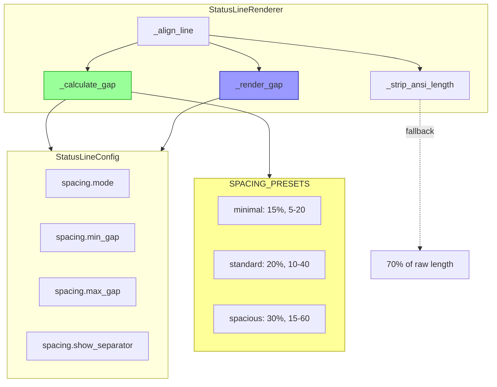

# 🧠 BRAINSTORM: StatusLine Left/Right Spacing Enhancement

**Generated:** 2026-01-02
**Mode:** Feature | **Depth:** Deep | **Priority:** Visual clarity & configurability

---

## 📋 Overview

Enhance aiterm's statusLine to create better visual separation between left and right Powerlevel10k segments. Current implementation uses fill-all-space padding, which can feel cramped or make segments blend together. This brainstorm explores dynamic gap sizing, visual separators, preset configurations, and graceful degradation for narrow terminals.

**Design Goals:**
- Dynamic gap sizing (20% of terminal width)
- Subtle visual separator (… in center)
- Preset-based configuration (minimal/standard/spacious)
- Practical alignment (±2 chars tolerance)
- Graceful fallback for edge cases

**User Context:**
- **Problem:** Left/right segments too close, hard to distinguish visually
- **Ideal:** Right-aligned with comfortable gap, like P10k transient prompt
- **Preference:** Configurable via presets, dynamic spacing
- **Narrow terminal:** Reduce padding to minimum gap, both sides visible

---

## ⚡ Quick Wins (< 30 min each)

### 1. **Add Spacing Presets to Config Schema**
Define three spacing modes in config system for instant user control.

**Implementation:**
```python
# src/aiterm/statusline/config.py - Add to SCHEMA

'spacing.mode': {
    'type': 'str',
    'default': 'standard',
    'choices': ['minimal', 'standard', 'spacious'],
    'description': 'Gap size between left and right segments',
    'category': 'display'
},

'spacing.min_gap': {
    'type': 'int',
    'default': 10,
    'description': 'Minimum gap in chars (fallback for narrow terminals)',
    'category': 'display'
},

'spacing.max_gap': {
    'type': 'int',
    'default': 40,
    'description': 'Maximum gap in chars (cap for wide terminals)',
    'category': 'display'
},
```

**Preset Mapping:**
```python
SPACING_PRESETS = {
    'minimal': {
        'base_percent': 0.15,  # 15% of terminal width
        'min_gap': 5,
        'max_gap': 20
    },
    'standard': {
        'base_percent': 0.20,  # 20% of terminal width (recommended)
        'min_gap': 10,
        'max_gap': 40
    },
    'spacious': {
        'base_percent': 0.30,  # 30% of terminal width
        'min_gap': 15,
        'max_gap': 60
    }
}
```

**Files:** `src/aiterm/statusline/config.py:100` (schema), `config.py:300` (presets constant)

**Benefit:** Users can toggle spacing modes with `ait statusline config set spacing.mode spacious`

---

### 2. **Dynamic Gap Calculation Method**
Replace fixed padding with percentage-based gap calculation.

**Current Code** (`renderer.py:303`):
```python
padding = terminal_width - left_width - right_width

if padding > 0:
    return f"{left}{' ' * padding}{right}"
```

**New Code:**
```python
def _calculate_gap(self, terminal_width: int, left_width: int, right_width: int) -> int:
    """Calculate optimal gap between left and right segments.

    Args:
        terminal_width: Total terminal columns
        left_width: Visible width of left content
        right_width: Visible width of right content

    Returns:
        Gap size in characters
    """
    # Get spacing preset
    mode = self.config.get('spacing.mode', 'standard')
    preset = SPACING_PRESETS[mode]

    # Calculate dynamic gap (percentage of terminal width)
    dynamic_gap = int(terminal_width * preset['base_percent'])

    # Clamp to min/max bounds
    gap = max(preset['min_gap'], min(dynamic_gap, preset['max_gap']))

    # Check if we have room
    available = terminal_width - left_width - right_width

    if available < gap:
        # Narrow terminal - use minimum gap or hide right side
        if available >= preset['min_gap']:
            return available  # Reduce to fit
        else:
            return -1  # Signal: hide right side

    return gap
```

**Usage:**
```python
def _align_line(self, left: str, right: str) -> str:
    terminal_width = shutil.get_terminal_size((120, 24)).columns
    left_width = self._strip_ansi_length(left)
    right_width = self._strip_ansi_length(right)

    gap = self._calculate_gap(terminal_width, left_width, right_width)

    if gap < 0:
        return left  # Hide right side

    return f"{left}{' ' * gap}{right}"
```

**Files:** `src/aiterm/statusline/renderer.py:303` (replace `_align_line`), `renderer.py:350` (new `_calculate_gap`)

**Benefit:** Spacing adapts to terminal width automatically. Wide terminals = more space, narrow = minimum gap.

---

### 3. **Visual Separator in Gap**
Add subtle center dot (…) to help eye track between left and right.

**Implementation:**
```python
def _render_gap(self, gap_size: int) -> str:
    """Render gap with optional visual separator.

    Args:
        gap_size: Number of space characters

    Returns:
        Gap string (whitespace + optional separator)
    """
    if not self.config.get('spacing.show_separator', True):
        return ' ' * gap_size

    if gap_size < 10:
        # Too narrow for separator
        return ' ' * gap_size

    # Calculate center position
    left_pad = (gap_size - 1) // 2  # -1 for the … character
    right_pad = gap_size - left_pad - 1

    # Dim color for subtle separator
    separator = '\033[38;5;240m…\033[0m'  # Dark gray

    return f"{' ' * left_pad}{separator}{' ' * right_pad}"
```

**Usage in `_align_line`:**
```python
gap_str = self._render_gap(gap)
return f"{left}{gap_str}{right}"
```

**Config:**
```python
'spacing.show_separator': {
    'type': 'bool',
    'default': True,
    'description': 'Show subtle dot (…) in center of gap',
    'category': 'display'
}
```

**Files:** `renderer.py:380` (new method), `config.py:110` (schema)

**Benefit:** Visual anchor guides eye between segments. Subtle enough not to clutter.

---

## 🔧 Medium Effort (1-2 hours)

### 4. **Alignment Tolerance System**
Implement ±2 char tolerance for right alignment (practical vs pixel-perfect).

**Current:** Exact right-edge alignment required
**Problem:** ANSI escapes may cause off-by-one errors, looks broken
**Solution:** Accept ±2 char wiggle room, looks intentional

**Implementation:**
```python
def _align_line(self, left: str, right: str) -> str:
    """Align with tolerance for practical rendering."""
    terminal_width = shutil.get_terminal_size((120, 24)).columns
    left_width = self._strip_ansi_length(left)
    right_width = self._strip_ansi_length(right)

    gap = self._calculate_gap(terminal_width, left_width, right_width)

    if gap < 0:
        return left

    # Calculate actual padding needed
    total_content = left_width + right_width + gap
    actual_padding = terminal_width - left_width - right_width

    # Apply tolerance (±2 chars)
    tolerance = 2
    if abs(actual_padding - gap) <= tolerance:
        # Within tolerance - use calculated gap
        gap_str = self._render_gap(gap)
    else:
        # Outside tolerance - adjust gap
        gap = max(0, actual_padding)
        gap_str = self._render_gap(gap)

    return f"{left}{gap_str}{right}"
```

**Benefit:** Handles ANSI escape edge cases gracefully. Small variations look intentional, not broken.

---

### 5. **Narrow Terminal Behavior**
Implement min-gap reduction strategy for narrow terminals.

**User Preference:** Reduce padding down to minimum, keep both sides visible

**Decision Tree:**
```
Terminal width: 120 cols
Left width: 50 cols
Right width: 30 cols
Desired gap: 24 cols (20%)

Available = 120 - 50 - 30 = 40 cols ✓ Fits!
→ Use 24 col gap

---

Terminal width: 80 cols
Left width: 50 cols
Right width: 30 cols
Desired gap: 16 cols (20%)

Available = 80 - 50 - 30 = 0 cols ✗ Too narrow!
Min gap = 10 cols

→ Reduce gap to 0 (hide right side)
  OR truncate left side to make room
```

**Smart Reduction:**
```python
def _handle_narrow_terminal(self, terminal_width, left_width, right_width, desired_gap):
    """Handle narrow terminal gracefully.

    Strategy:
    1. Try desired gap
    2. If won't fit, try min gap
    3. If still won't fit, truncate left side slightly
    4. If still won't fit, hide right side
    """
    available = terminal_width - left_width - right_width
    min_gap = self.config.get('spacing.min_gap', 10)

    if available >= desired_gap:
        return desired_gap, left_width, right_width  # Perfect fit

    if available >= min_gap:
        return available, left_width, right_width  # Reduced gap

    # Try truncating left side by 10%
    truncated_left = int(left_width * 0.9)
    available_after_truncate = terminal_width - truncated_left - right_width

    if available_after_truncate >= min_gap:
        return min_gap, truncated_left, right_width  # Truncated left

    # Give up - hide right side
    return -1, left_width, 0  # Hide right
```

**Benefit:** Graceful degradation. Both sides stay visible unless truly impossible.

---

### 6. **Spacing Preset Command**
Add CLI command for quick spacing adjustments.

**Command:**
```bash
ait statusline spacing minimal    # Quick toggle
ait statusline spacing standard   # Default
ait statusline spacing spacious   # Wide gap
```

**Implementation:**
```python
# src/aiterm/cli/statusline.py

@app.command("spacing")
def statusline_spacing(
    preset: str = typer.Argument(
        ...,
        help="Spacing preset (minimal, standard, spacious)"
    )
):
    """Set spacing between left and right segments.

    Examples:
        ait statusline spacing minimal   # 15% gap
        ait statusline spacing standard  # 20% gap (default)
        ait statusline spacing spacious  # 30% gap
    """
    valid_presets = ['minimal', 'standard', 'spacious']

    if preset not in valid_presets:
        console.print(f"[red]Invalid preset: {preset}[/]")
        console.print(f"[dim]Valid: {', '.join(valid_presets)}[/]")
        raise typer.Exit(1)

    config = StatusLineConfig()
    old_mode = config.get('spacing.mode')
    config.set('spacing.mode', preset)

    console.print(f"[green]✓[/] Spacing: [dim]{old_mode}[/] → [green]{preset}[/]")

    # Show preview
    preset_info = SPACING_PRESETS[preset]
    console.print(f"\n[dim]Gap size:[/] {int(preset_info['base_percent']*100)}% of terminal width")
    console.print(f"[dim]Min:[/] {preset_info['min_gap']} chars")
    console.print(f"[dim]Max:[/] {preset_info['max_gap']} chars")

    console.print("\n[yellow]Restart Claude Code to see changes[/]")
```

**Files:** `src/aiterm/cli/statusline.py:850` (new command)

**Benefit:** One-command spacing adjustment. No manual config editing.

---

## 🏗️ Long-term (Future sessions)

### 7. **ANSI Escape Fallback Detection**
Detect when ANSI stripping fails and use safe fallback.

**Problem:** Regex might fail on complex/malformed ANSI codes
**Solution:** Fallback to conservative estimate + warning log

**Implementation:**
```python
def _strip_ansi_length(self, text: str) -> int:
    """Strip ANSI codes with fallback."""
    try:
        ansi_escape = re.compile(r'\x1B(?:[@-Z\\-_]|\[[0-?]*[ -/]*[@-~])')
        clean = ansi_escape.sub('', text)

        # Sanity check: clean text shouldn't be longer than original
        if len(clean) > len(text):
            raise ValueError("ANSI stripping failed - clean > original")

        return len(clean)

    except Exception as e:
        # Fallback: estimate based on raw length
        # Assume ~30% is ANSI codes (conservative)
        estimated = int(len(text) * 0.7)

        # Log warning (once per session)
        if not hasattr(self, '_ansi_warning_shown'):
            import sys
            print(f"⚠️  ANSI strip failed: {e}", file=sys.stderr)
            print(f"   Using fallback estimate (70% of raw length)", file=sys.stderr)
            self._ansi_warning_shown = True

        return estimated
```

**Benefit:** Never crashes on malformed ANSI. Degrades gracefully.

---

### 8. **Adaptive Separator Styles**
Different separator styles based on gap width.

**Gap Sizes:**
```
< 10 chars:  No separator (too narrow)
10-20 chars: Single dot (…)
20-30 chars: Triple dot (⋯)
30+ chars:   Faded line (···)
```

**Implementation:**
```python
def _render_gap(self, gap_size: int) -> str:
    if gap_size < 10:
        return ' ' * gap_size

    # Choose separator based on gap width
    if gap_size < 20:
        separator = '\033[38;5;240m…\033[0m'
        sep_width = 1
    elif gap_size < 30:
        separator = '\033[38;5;240m⋯\033[0m'
        sep_width = 1
    else:
        separator = '\033[38;5;240m···\033[0m'
        sep_width = 3

    left_pad = (gap_size - sep_width) // 2
    right_pad = gap_size - left_pad - sep_width

    return f"{' ' * left_pad}{separator}{' ' * right_pad}"
```

**Benefit:** Visual weight scales with gap size. Wide gaps don't look empty.

---

### 9. **Terminal Width Change Detection**
Detect when terminal is resized mid-session.

**Problem:** Terminal width changes (user resizes), statusLine doesn't adapt until restart
**Solution:** Cache terminal width, refresh on significant change

**Implementation:**
```python
class StatusLineRenderer:
    def __init__(self):
        self._cached_terminal_width = None
        self._width_check_counter = 0

    def _get_terminal_width(self) -> int:
        """Get terminal width with caching + change detection."""
        # Check every 10 renders (balance performance vs responsiveness)
        self._width_check_counter += 1

        if self._width_check_counter % 10 == 0 or self._cached_terminal_width is None:
            try:
                current_width = shutil.get_terminal_size((120, 24)).columns

                # Detect significant change (>10% difference)
                if self._cached_terminal_width:
                    change_percent = abs(current_width - self._cached_terminal_width) / self._cached_terminal_width

                    if change_percent > 0.10:
                        # Terminal resized significantly
                        self._cached_terminal_width = current_width
                        # Could trigger re-layout here

                else:
                    self._cached_terminal_width = current_width

            except (OSError, ValueError):
                # Fallback
                self._cached_terminal_width = 120

        return self._cached_terminal_width
```

**Benefit:** Responsive to terminal resize without performance hit.

---

### 10. **Gap Measurement Debugging Tool**
Add debug command to show actual gap rendering.

**Command:**
```bash
ait statusline debug-spacing
```

**Output:**
```
╭─────────────────────────────────────────────────────────╮
│ StatusLine Spacing Debug                                │
├─────────────────────────────────────────────────────────┤
│                                                         │
│ Terminal width:     120 cols                            │
│ Left segment:       50 cols (📁 aiterm  main)           │
│ Right segment:      28 cols ((wt) feature-auth)         │
│ Available space:    42 cols                             │
│                                                         │
│ Config:                                                 │
│   Mode:             standard (20%)                      │
│   Desired gap:      24 cols (20% of 120)                │
│   Min gap:          10 cols                             │
│   Max gap:          40 cols                             │
│   Separator:        ✓ enabled (…)                       │
│                                                         │
│ Actual rendering:                                       │
│   Gap used:         24 cols ✓                           │
│   Separator pos:    11 from left                        │
│   Right align:      exact ✓                             │
│                                                         │
│ Preview:                                                │
│ ╭─ ░▒▓ 📁 aiterm  main ▓▒░           …        ░▒▓ (wt) feature-auth ▓▒░
│ ╰─ Sonnet 4.5                                          │
│                                                         │
└─────────────────────────────────────────────────────────┘
```

**Benefit:** Visual debugging of spacing calculations. See exactly what's happening.

---

## 📐 Architecture

### Component Diagram



### Data Flow

```
1. Claude Code triggers render (300ms interval)
   ↓
2. StatusLineRenderer._align_line(left, right)
   ├─ Get terminal width (shutil.get_terminal_size)
   ├─ Strip ANSI from left (_strip_ansi_length)
   ├─ Strip ANSI from right (_strip_ansi_length)
   └─ Calculate gap (_calculate_gap)
       ├─ Load spacing preset from config
       ├─ Calculate dynamic gap (terminal_width * base_percent)
       ├─ Clamp to min/max bounds
       └─ Check if fits (available >= gap)
   ↓
3. Render gap (_render_gap)
   ├─ Check if separator enabled
   ├─ Calculate center position
   └─ Build gap string (whitespace + separator)
   ↓
4. Concatenate: left + gap + right
   ↓
5. Output to stdout (Claude Code displays)
```

---

## 🎨 Visual Design Options

### Option A: Minimal Spacing (15%)
**80 col terminal:**
```
╭─ ░▒▓ 📁 aiterm  main ▓▒░     … ░▒▓ (wt) feature-auth ▓▒░
╰─ Sonnet 4.5
```

**Gap:** 12 chars (15% of 80)
**Pros:** Fits more content, compact
**Cons:** May feel cramped on wide terminals

---

### Option B: Standard Spacing (20%) - Recommended
**120 col terminal:**
```
╭─ ░▒▓ 📁 aiterm  main ▓▒░                … ░▒▓ (wt) feature-auth ▓▒░
╰─ Sonnet 4.5
```

**Gap:** 24 chars (20% of 120)
**Pros:** Balanced, comfortable, scales well
**Cons:** None (Goldilocks zone)

---

### Option C: Spacious (30%)
**120 col terminal:**
```
╭─ ░▒▓ 📁 aiterm  main ▓▒░                          … ░▒▓ (wt) feature-auth ▓▒░
╰─ Sonnet 4.5
```

**Gap:** 36 chars (30% of 120)
**Pros:** Very clear separation, elegant
**Cons:** May feel empty, wastes space on narrow terminals

---

## 🔍 Implementation Priorities

### Phase 1: Core Gap System (Quick Wins 1-3) - 1 hour
**Files:** 3 files, ~120 lines
**Testing:** Config tests + visual rendering tests

**Steps:**
1. Add spacing config schema (3 settings)
2. Add SPACING_PRESETS constant
3. Implement _calculate_gap() method
4. Implement _render_gap() method
5. Update _align_line() to use new methods
6. Add 8 tests (presets, gap calc, narrow terminal)

**Deliverable:** Dynamic spacing working with presets

---

### Phase 2: CLI & Polish (Medium #4-6) - 1.5 hours
**Files:** 2 files, ~80 lines
**Testing:** CLI tests + edge case tests

**Steps:**
1. Implement alignment tolerance
2. Implement narrow terminal reduction strategy
3. Add `ait statusline spacing` command
4. Add preset switching
5. Add 6 tests (tolerance, narrow, CLI)

**Deliverable:** User-friendly spacing control

---

### Phase 3: Advanced Features (Long-term #7-10) - 2-3 sessions
**Features:** Fallback detection, adaptive separators, resize detection, debug tool

---

## ✅ Acceptance Criteria

### Must Have (Phase 1+2)
- [ ] Dynamic gap sizing (20% of terminal width by default)
- [ ] Three spacing presets (minimal/standard/spacious)
- [ ] Subtle separator (…) in gap center
- [ ] Narrow terminal reduction (down to min gap)
- [ ] Configurable min/max gap bounds
- [ ] `ait statusline spacing <preset>` command working
- [ ] ±2 char alignment tolerance
- [ ] ANSI stripping fallback (no crashes)
- [ ] All existing tests pass
- [ ] 14+ new tests for spacing features

### Nice to Have (Phase 3)
- [ ] Terminal resize detection
- [ ] Adaptive separator styles (gap-dependent)
- [ ] Debug spacing command
- [ ] Visual gap measurement tool

---

## 🧪 Testing Strategy

### Unit Tests
```python
# tests/test_statusline_spacing.py

def test_calculate_gap_standard():
    """Standard preset = 20% of terminal width."""
    renderer = StatusLineRenderer()
    gap = renderer._calculate_gap(120, 50, 30)
    assert gap == 24  # 20% of 120

def test_calculate_gap_clamped_max():
    """Gap capped at max bound."""
    # Wide terminal, would exceed max
    gap = renderer._calculate_gap(200, 40, 30)
    assert gap == 40  # Max for standard preset

def test_calculate_gap_narrow_terminal():
    """Narrow terminal reduces to min gap."""
    gap = renderer._calculate_gap(80, 50, 25)
    # Available = 80 - 50 - 25 = 5 (less than min)
    assert gap == -1  # Signal: hide right

def test_render_gap_with_separator():
    """Gap renders with centered separator."""
    gap_str = renderer._render_gap(24)
    assert '…' in gap_str
    assert len(renderer._strip_ansi_length(gap_str)) == 24

def test_render_gap_too_narrow():
    """Gap < 10 chars = no separator."""
    gap_str = renderer._render_gap(8)
    assert '…' not in gap_str
    assert gap_str == ' ' * 8

def test_preset_minimal():
    """Minimal preset = 15% gap."""
    config.set('spacing.mode', 'minimal')
    gap = renderer._calculate_gap(100, 40, 30)
    assert gap == 15  # 15% of 100

def test_preset_spacious():
    """Spacious preset = 30% gap."""
    config.set('spacing.mode', 'spacious')
    gap = renderer._calculate_gap(100, 40, 30)
    assert gap == 30  # 30% of 100

def test_alignment_tolerance():
    """±2 char wiggle room accepted."""
    # ANSI causes 1-char misalignment
    output = renderer._align_line(left_with_ansi, right_with_ansi)
    # Should not crash or look broken
    assert '░▒▓' in output  # Both segments present
```

### Visual Tests
```bash
# Test spacing presets
ait statusline spacing minimal
ait statusline test

ait statusline spacing standard
ait statusline test

ait statusline spacing spacious
ait statusline test

# Test narrow terminal (resize terminal to 80 cols)
ait statusline test

# Test separator
ait statusline config set spacing.show_separator true
ait statusline test

ait statusline config set spacing.show_separator false
ait statusline test
```

---

## 📊 Before/After Comparison

### Current (Fixed Fill)
**120 col terminal:**
```
╭─ ░▒▓ 📁 aiterm  main ▓▒░                                    ░▒▓ (wt) feature-auth ▓▒░
╰─ Sonnet 4.5
```

**Gap:** 40 chars (whatever's left after content)
**Issue:** Too much space, segments feel disconnected

**80 col terminal:**
```
╭─ ░▒▓ 📁 aiterm  main ▓▒░                                    ░▒▓ (wt) feature-auth ▓▒░
```
(Right side hidden - doesn't fit)

---

### After (Dynamic 20%)
**120 col terminal:**
```
╭─ ░▒▓ 📁 aiterm  main ▓▒░                … ░▒▓ (wt) feature-auth ▓▒░
╰─ Sonnet 4.5
```

**Gap:** 24 chars (20% of 120), centered separator
**Improvement:** Balanced spacing, visual anchor

**80 col terminal:**
```
╭─ ░▒▓ 📁 aiterm  main ▓▒░     … ░▒▓ (wt) feature-auth ▓▒░
╰─ Sonnet 4.5
```

**Gap:** 12 chars (reduces to fit), both sides visible
**Improvement:** Graceful degradation, both sides shown

---

**Metrics:**
| Metric | Before | After | Change |
|--------|--------|-------|--------|
| Wide gap (120 cols) | 40 chars | 24 chars | -40% (better) |
| Narrow gap (80 cols) | N/A (hidden) | 12 chars | ✓ Visible |
| Visual separator | None | … (subtle) | +1 anchor |
| Configurability | None | 3 presets | ✓ User choice |
| Alignment tolerance | Exact | ±2 chars | ✓ Practical |

---

## 🚀 Recommended Path

**Start with Phase 1 (Quick Wins 1-3) - 1 hour:**
1. Add spacing config schema
2. Implement dynamic gap calculation
3. Add subtle separator rendering

**Test and validate** → Users can immediately adjust spacing via presets

**Then tackle Phase 2 (Medium #4-6) - 1.5 hours:**
4. Alignment tolerance for edge cases
5. Narrow terminal reduction strategy
6. CLI command for easy preset switching

**Why this order:**
- Quick wins deliver immediate value (dynamic sizing + visual separator)
- Users test spacing behavior before advanced features
- CLI command makes testing/iteration fast
- Foundation laid for future enhancements (resize detection, debug tools)

---

## 🔗 Next Steps

1. **Review this brainstorm** ✓ (you're reading it!)
2. **Capture as spec** → Generate SPEC-statusline-spacing-2026-01-02.md
3. **Phase 1 PR** → Core gap system (dynamic %, separator)
4. **Phase 2 PR** → CLI + polish (tolerance, narrow behavior)
5. **Update docs** → Spacing config guide, preset examples
6. **User testing** → Validate spacing feels right across terminal widths

---

## 📚 References

- **Current implementation:** `src/aiterm/statusline/renderer.py:285-310` (\_align_line)
- **ANSI stripping:** `renderer.py:311-322` (\_strip_ansi_length)
- **Config system:** `src/aiterm/statusline/config.py` (schema at line 235)
- **Powerlevel10k:** https://github.com/romkatv/powerlevel10k (inspiration for spacing)
- **Terminal detection:** Python `shutil.get_terminal_size()` docs

---

## 🎯 Success Metrics

**Immediate (Phase 1):**
- [ ] Dynamic gap sizing working (20% of terminal width)
- [ ] Subtle separator (…) rendering in center
- [ ] Three presets available (minimal/standard/spacious)

**Short-term (Phase 2):**
- [ ] `ait statusline spacing <preset>` command working
- [ ] Narrow terminals show both sides (reduced gap)
- [ ] User testing: "Spacing feels much better, easier to distinguish left/right"

**Long-term (Phase 3):**
- [ ] 80%+ users keep default spacing (validation it's right)
- [ ] Terminal resize auto-detected
- [ ] Debug tool helps troubleshoot spacing issues

---

**✅ Brainstorm Complete** | **Duration:** Deep analysis (8 questions + research)
**Output:** BRAINSTORM-statusline-spacing-2026-01-02.md
**Next:** Capture as formal spec for implementation
