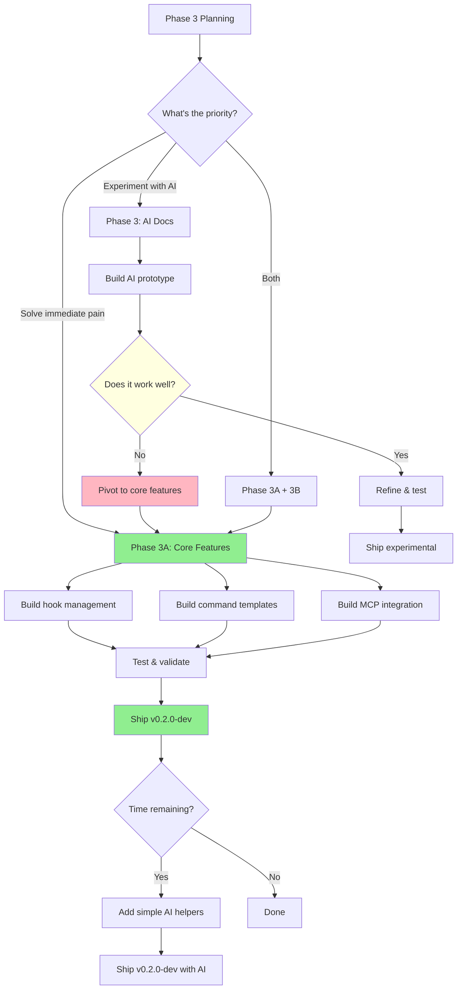

# Phase 3: Decision Matrix

**Purpose:** Compare implementation options for Phase 3

---

## Option Comparison

| Aspect | **Original Plan** (AI Docs) | **Recommended** (Core Features) | **Hybrid** |
|--------|---------------------------|--------------------------------|-----------|
| **Timeline** | 2-3 weeks | 2 weeks | 2-3 weeks |
| **Complexity** | High (LLM integration, multi-file) | Medium (CLI, templates) | Medium |
| **User Value** | Uncertain (experimental) | High (proven demand) | High |
| **Risk** | High (unproven concept) | Low (known patterns) | Low-Medium |
| **Dependencies** | Anthropic API, GPT-4 | None (pure Python) | Optional API |
| **Maintenance** | High (AI model changes) | Low (stable code) | Low-Medium |

---

## Feature Breakdown

### Option 1: AI-Powered Documentation (Original Plan)

**What it does:**
- GPT-4 analyzes code changes
- Generates documentation updates
- Writes tutorial content automatically
- Coordinates multi-file updates

**Pros:**
- ✅ Cutting-edge technology
- ✅ Could save significant time (if it works)
- ✅ Impressive demo feature

**Cons:**
- ❌ Uncertain reliability (LLMs hallucinate)
- ❌ Requires API costs ($$$)
- ❌ Complex error handling (what if AI generates bad docs?)
- ❌ Users need to review/edit AI output anyway
- ❌ Doesn't solve the immediate pain points

**Time Investment:** 15-20 hours
**User Adoption Risk:** High (experimental feature)

---

### Option 2: Core Features (Recommended)

**What it does:**
- Hook management (discover, install, validate)
- Command templates (browse, install, run)
- MCP server integration (list, test, validate)

**Pros:**
- ✅ Solves real user pain points
- ✅ Low risk, proven patterns
- ✅ No external dependencies
- ✅ Immediate value
- ✅ Foundation for future features

**Cons:**
- ❌ Less "flashy" than AI features
- ❌ Requires building template library

**Time Investment:** 12-15 hours
**User Adoption Risk:** Low (addresses known needs)

---

### Option 3: Hybrid Approach

**What it does:**
- Core features (hooks, commands, MCP) - Week 1-2
- Simple doc helpers (link validation, example testing) - Week 2-3
- Defers full AI generation to Phase 4

**Pros:**
- ✅ Best of both worlds
- ✅ Practical features + smart helpers
- ✅ LLM features are optional (graceful degradation)
- ✅ Validates demand before heavy investment

**Cons:**
- ❌ Slightly longer timeline
- ❌ Need to manage optional dependencies

**Time Investment:** 15-18 hours
**User Adoption Risk:** Low

---

## User Pain Points (Priority Order)

Based on user's existing setup and workflows:

### P0 - Critical Pain Points (Current)
1. **Hook discovery** - Users don't know what hooks exist
   - Evidence: Only 2 hooks installed (~/.claude/hooks/)
   - Solution: `aiterm hooks list`, templates

2. **Command organization** - 194 commands, hard to find/reuse
   - Evidence: Large command directory, duplication
   - Solution: `aiterm commands browse`, installation

3. **MCP testing** - No way to validate server health
   - Evidence: Manual JSON editing, trial-and-error testing
   - Solution: `aiterm mcp test`, validation

### P1 - Important (Desired)
4. **Documentation quality** - Links break, examples outdated
   - Evidence: MkDocs warnings about broken anchors
   - Solution: `aiterm docs validate-links`, example testing

5. **Template reuse** - Reinventing common patterns
   - Evidence: Similar commands across projects
   - Solution: Command template library

### P2 - Nice to Have (Future)
6. **AI doc generation** - Automated doc writing
   - Evidence: None yet (hypothetical benefit)
   - Solution: Defer to Phase 4, validate demand first

---

## Recommendation: Core Features First (Option 2)

### Why Core Features?

**1. Immediate Value**
- Solves 3 critical pain points (P0)
- Users can use features day 1
- No learning curve (familiar CLI patterns)

**2. Low Risk**
- Proven implementation patterns
- No external dependencies
- Testable, maintainable code

**3. Foundation for Future**
- Hook system enables advanced workflows
- Command templates can include AI helpers later
- MCP integration supports AI-powered tools

**4. Fast Delivery**
- 2 weeks to working features
- Can iterate based on real usage
- Shorter feedback loop

### What About AI Features?

**Phase 3: Simple Helpers Only**
- Link validation (no LLM needed)
- Code example testing (static analysis)
- Broken reference detection (grep-based)

**Phase 4: Full AI Integration** (if demand validated)
- LLM-powered doc generation
- Semantic change analysis
- Tutorial content creation

**Rationale:** Build foundation → Validate need → Invest in AI

---

## Implementation Phases

### Phase 3A: Core Features (2 weeks) ⭐ RECOMMENDED

**Week 1: Discovery & Installation**
- Days 1-2: Hook management
  - `aiterm hooks list`
  - `aiterm hooks install <template>`
  - `aiterm hooks validate`
  - 5 hook templates

- Days 3-4: Command templates
  - `aiterm commands browse`
  - `aiterm commands install <name>`
  - `aiterm commands validate`
  - 20 command templates

- Day 5: Testing & docs
  - Integration tests
  - User guide updates

**Week 2: Integration & Polish**
- Days 1-2: MCP integration
  - `aiterm mcp list`
  - `aiterm mcp test <server>`
  - `aiterm mcp validate`

- Days 3-4: Documentation helpers (simple)
  - `aiterm docs validate-links` (grep-based)
  - `aiterm docs test-examples` (static)

- Day 5: Release prep
  - Comprehensive testing
  - CHANGELOG update
  - v0.2.0-dev tag

**Deliverables:**
- ✅ 3 new CLI command groups (hooks, commands, mcp)
- ✅ 25+ templates (5 hooks + 20 commands)
- ✅ 80%+ test coverage
- ✅ Updated documentation
- ✅ v0.2.0-dev release

---

### Phase 3B: AI Enhancements (Optional - Week 3)

**Only if:**
- User explicitly requests AI features
- Phase 3A completes early (< 10 days)
- Anthropic API key available

**Features:**
- LLM-powered doc quality check
- Smart example validation
- Documentation gap detection

**Time:** 3-4 hours (optional)

---

### Phase 4: Full AI Integration (Future)

**Deferred until:**
- Phase 3A validated with real usage
- User confirms need for AI docs
- At least 1 month of aiterm usage data

**Features:**
- Full documentation generation
- Semantic change analysis
- Multi-document coordination
- Screenshot/diagram generation

**Time:** 2-3 weeks

---

## Success Metrics

### Phase 3A (Core Features)

**Quantitative:**
- ✅ 5+ hook templates created
- ✅ 20+ command templates created
- ✅ 3 MCP servers tested successfully
- ✅ 80%+ test coverage maintained
- ✅ 0 regressions in existing features

**Qualitative:**
- ✅ User can discover hooks without reading docs
- ✅ User can install commands in < 30 seconds
- ✅ User can validate MCP servers in < 10 seconds
- ✅ Installation experience is smooth
- ✅ Error messages are clear and actionable

**Timeline:**
- ✅ Week 1 deliverables complete
- ✅ Week 2 deliverables complete
- ✅ Total time < 15 hours

---

## Decision Tree

---

## Recommendation Summary

### ✅ GO WITH: Phase 3A (Core Features)

**Reasoning:**
1. **Immediate value** - Solves 3 critical pain points
2. **Low risk** - Proven patterns, no dependencies
3. **Fast delivery** - 2 weeks to working features
4. **Foundation** - Enables future AI features
5. **User-validated** - Based on real workflow needs

**Timeline:** 2 weeks (12-15 hours)

**Deliverables:**
- Hook management system
- Command template library (20+ templates)
- MCP server integration
- Simple doc helpers (link validation)
- v0.2.0-dev release

### ⏸️ DEFER: Full AI Documentation (Phase 4)

**Reasoning:**
1. Unproven concept (uncertain value)
2. High complexity (15-20 hours)
3. Requires validation first
4. Can add later if needed

**Conditions to revisit:**
- Phase 3A complete and validated
- User confirms need for AI docs
- At least 1 month of real usage data

---

## Next Action

**If user approves:**
1. Start Phase 3A implementation (Day 1: Hook management)
2. Create directory structure
3. Build first 3 hook templates
4. Test installation flow

**If user wants changes:**
1. Adjust scope based on feedback
2. Update PHASE-3-PLAN.md
3. Revise timeline
4. Get final approval

---

**Ready to proceed with Phase 3A (Core Features)?**
