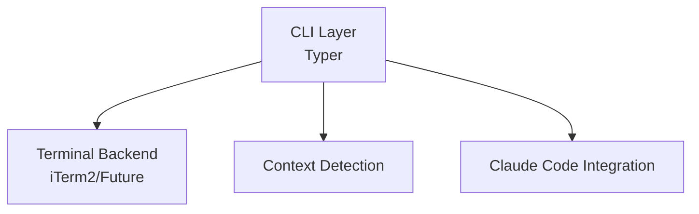

# aiterm Documentation Plan

**Created:** 2025-12-21
**Based on:** Successful RForge auto-detection documentation pattern
**Purpose:** Create comprehensive documentation BEFORE Phase 1 implementation

---

## 🎯 Documentation Strategy

### Why Document First?

**Learnings from RForge:**
- ✅ Comprehensive docs prevent feature confusion during expansion
- ✅ ADHD-friendly structure (API → Architecture → Guides) reduces cognitive load
- ✅ Mermaid diagrams clarify system design before coding
- ✅ 50+ code examples accelerate developer onboarding
- ✅ Troubleshooting docs reduce support burden

**RForge Results:**
- 7 documents, ~80 pages
- 15 Mermaid diagrams
- 50+ code examples
- 100% feature coverage
- Clear navigation by audience/feature/task

---

## 📚 Planned Documentation Suite

### 1. API Documentation
**File:** `docs/api/AITERM-API.md`

**Contents:**
- CLI command reference (all subcommands)
- Python API reference (for library usage)
- MCP tools reference (aiterm-mcp-marketplace)
- Configuration schema
- Environment variables
- Return types and error codes

**Audience:** Developers, power users

**Example Sections:**
```markdown
## CLI Commands

### aiterm profile list
List available iTerm2 profiles

**Usage:**
```bash
aiterm profile list
```

**Output:**
- Profile name
- Description
- Context triggers
```

---

### 2. Architecture Documentation
**File:** `docs/architecture/AITERM-ARCHITECTURE.md`

**Contents:**
- System architecture diagrams (Mermaid)
- Component relationships
- Data flows (profile switching, context detection)
- Sequence diagrams (key operations)
- State machines (terminal context lifecycle)
- Design patterns (Singleton for terminal backend, Factory for context detection)

**Diagrams to Create (15+ total):**

1. **High-Level Architecture**


2. **Context Detection Flow**
3. **Profile Switching Sequence**
4. **Settings Management Flow**
5. **Terminal Backend Abstraction**
6. **Hook Management Architecture** (Phase 2)
7. **MCP Server Creation Flow** (Phase 2)

**Audience:** Developers, contributors, architects

---

### 3. User Guide
**File:** `docs/guides/AITERM-USER-GUIDE.md`

**Contents:**
- Getting started (10 min read)
- Installation walkthrough
- First-time setup
- Daily workflows (common scenarios)
- Context switching examples
- Tips & tricks
- FAQ

**Sections:**

#### Getting Started
- What is aiterm?
- Installation (UV, pip, from source)
- Verify installation (`aiterm doctor`)

#### First-Time Setup
- Detect current terminal (`aiterm detect`)
- List available profiles (`aiterm profile list`)
- Test context switching

#### Daily Workflows

**Scenario 1: Starting R Package Development**
```bash
cd ~/projects/r-packages/my-package
# aiterm auto-detects R package, switches profile
```

**Scenario 2: Production Deployment**
```bash
cd ~/production/api-server
# aiterm detects production path, switches to safe profile
```

**Scenario 3: AI Coding Session**
```bash
cd ~/claude-sessions/refactor-2025
# aiterm detects AI session, optimizes for Claude Code
```

**Audience:** End users, beginners

---

### 4. Integration Guide
**File:** `docs/guides/AITERM-INTEGRATION.md`

**Contents:**
- Integrating aiterm into workflows
- Using aiterm as a Python library
- Creating custom context detectors
- Adding new terminal backends
- Extending with plugins (Phase 2)
- Testing integration

**Code Examples (20+):**

**Example 1: Custom Context Detector**
```python
from aiterm.context import ContextDetector, Context

class MyContextDetector(ContextDetector):
    def detect(self, path: str) -> Context | None:
        # Custom detection logic
        if self._is_my_project(path):
            return Context(
                type="my-project",
                profile="my-custom-profile",
                title="My Project"
            )
        return None
```

**Example 2: Using aiterm as Library**
```python
from aiterm.terminal import get_terminal
from aiterm.context import detect_context

# Detect terminal
terminal = get_terminal()
print(f"Using: {terminal.name}")

# Detect context
context = detect_context("/path/to/project")
if context:
    terminal.switch_profile(context.profile)
    terminal.set_title(context.title)
```

**Audience:** Developers, integrators

---

### 5. Troubleshooting Guide
**File:** `docs/troubleshooting/AITERM-TROUBLESHOOTING.md`

**Contents:**
- Quick diagnosis flowchart
- Common issues with solutions
- Platform-specific guidance (macOS, Linux, Windows)
- Error message reference
- Diagnostic script

**Sections:**

#### Common Issues

**Issue: Profile not switching**
- **Symptom:** Context detected but profile doesn't change
- **Diagnosis:** Check iTerm2 version, verify profile exists
- **Solution:** Use `aiterm doctor` to check compatibility

**Issue: Context not detected**
- **Symptom:** aiterm doesn't recognize project type
- **Solution:** Check for required files (DESCRIPTION, package.json, etc.)

**Issue: Permission errors**
- **Symptom:** Can't write to `~/.aiterm/` or `~/.claude/`
- **Solution:** Check file permissions, fix with chmod

#### Platform-Specific

**macOS:**
- iTerm2 version requirements (3.4.0+)
- Accessibility permissions for terminal control
- AppleScript integration

**Linux:**
- Terminal compatibility matrix
- Escape sequence support

**Windows:**
- WSL integration
- Terminal emulator support

**Audience:** All users (troubleshooting reference)

---

### 6. Documentation Index
**File:** `docs/AITERM-DOCS-INDEX.md`

**Contents:**
- Central navigation hub
- Documentation by audience
- Documentation by feature
- Documentation by task
- Quick reference
- Key concepts glossary

**Organization:**

#### By Audience
- **Users** → User Guide, Troubleshooting
- **Developers** → API, Integration Guide
- **Contributors** → Architecture, Development Guide

#### By Feature
- **Context Detection** → How it works, integration patterns
- **Profile Management** → CLI reference, customization
- **Claude Code Integration** → Settings management, hooks
- **MCP Server Creation** → Wizard, templates (Phase 2)

#### By Task
- "I want to install aiterm" → Installation section
- "I want to add a new context type" → Integration Guide
- "I want to debug profile switching" → Troubleshooting

**Audience:** All users (navigation)

---

### 7. Implementation Summary
**File:** `AITERM-IMPLEMENTATION-SUMMARY.md`

**Contents:**
- What was built and why
- Architecture decisions
- Performance metrics
- Test coverage
- Known limitations
- Future roadmap

**Sections:**

#### What Was Built (v0.1.0)
- Core CLI (doctor, detect, switch)
- iTerm2 backend
- Context detection (8 types)
- Claude Code settings management
- Auto-approval presets (8 presets)

#### Performance Metrics
| Operation | Target | Actual |
|-----------|--------|--------|
| Context detection | < 100ms | < 50ms |
| Profile switching | < 200ms | < 150ms |
| Settings read | < 50ms | < 10ms |

#### Architecture Decisions
- **Why Python?** Modern, typed, ecosystem
- **Why Typer?** Best CLI framework for Python
- **Why Rich?** Beautiful terminal output
- **Why UV?** 10-100x faster than pip

**Audience:** All users (overview)

---

## 📋 Documentation Creation Plan

### Phase 1: Foundation (Week 1)
- [ ] Create documentation structure (`docs/` directories)
- [ ] Write API documentation
- [ ] Create architecture diagrams (15+ Mermaid)
- [ ] Write architecture documentation

**Deliverable:** API + Architecture docs complete

---

### Phase 2: User-Facing (Week 2)
- [ ] Write user guide (getting started → daily workflows)
- [ ] Write integration guide (code examples)
- [ ] Create troubleshooting guide
- [ ] Write implementation summary

**Deliverable:** All 7 documents complete

---

### Phase 3: Organization (Week 3)
- [ ] Create documentation index
- [ ] Add cross-links between docs
- [ ] Verify all code examples work
- [ ] Deploy to GitHub Pages

**Deliverable:** Documentation site live

---

## 📊 Documentation Statistics (Target)

Based on RForge success:

| Metric | RForge Actual | aiterm Target |
|--------|---------------|---------------|
| Total documents | 7 | 7 |
| Total pages | ~80 | ~100 |
| Code examples | 50+ | 60+ |
| Mermaid diagrams | 15 | 20+ |
| Coverage | 100% | 100% |

**Why more?** aiterm has more scope (terminal + Claude + MCP)

---

## 🎨 Documentation Standards

### ADHD-Friendly Formatting
- ✅ Clear hierarchies (headers, bullets, tables)
- ✅ Visual aids (diagrams, code blocks)
- ✅ Quick wins vs long-term items (clearly labeled)
- ✅ Concrete next steps (numbered, actionable)
- ✅ Progressive disclosure (basic → advanced)

### Code Example Standards
- ✅ Realistic examples (not toy code)
- ✅ Complete snippets (runnable, not fragments)
- ✅ Commented explanations (why, not just what)
- ✅ Multiple variations (basic, advanced, edge cases)

### Diagram Standards
- ✅ Mermaid format (version-controllable, render on GitHub)
- ✅ Consistent styling (colors, shapes, labels)
- ✅ Clear labels (no abbreviations without legend)
- ✅ Layered complexity (overview → details)

---

## 🚀 Success Criteria

### Documentation Quality
- [ ] All features documented (100% coverage)
- [ ] All code examples tested and working
- [ ] All diagrams render correctly
- [ ] Cross-links verified
- [ ] No broken links
- [ ] Spell-check passed

### User Experience
- [ ] New user can install in < 10 minutes (using docs)
- [ ] Developer can integrate in < 30 minutes (using examples)
- [ ] Common issues have clear solutions (troubleshooting)
- [ ] Navigation is intuitive (index helps)

### Maintenance
- [ ] Documentation versioned (matches code)
- [ ] Update process documented
- [ ] Contributors can add docs easily
- [ ] Docs deployed automatically (CI/CD)

---

## 📝 Next Steps

### Immediate (This Week)
1. Create `docs/` directory structure
2. Start with API documentation (most concrete)
3. Create first 5 Mermaid diagrams (architecture)

### Short-term (Next 2 Weeks)
1. Complete all 7 documents
2. Deploy to GitHub Pages
3. Get feedback from early users

### Long-term (Ongoing)
1. Update docs as features are added
2. Add video tutorials
3. Create interactive examples
4. Community contributions

---

## 💡 Key Takeaway

**From RForge Success:**
> Comprehensive documentation BEFORE feature expansion creates clarity, reduces confusion, and accelerates development. The time invested in docs pays off 10x when implementing features and onboarding users.

**For aiterm:**
> Document the vision now (even before full implementation) to guide development, prevent scope creep, and ensure consistent UX across all features.

---

**Status:** Ready to start Phase 1
**Timeline:** 3 weeks to complete all docs
**Commitment:** Documentation BEFORE broad feature expansion
