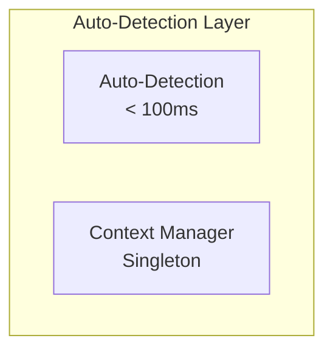
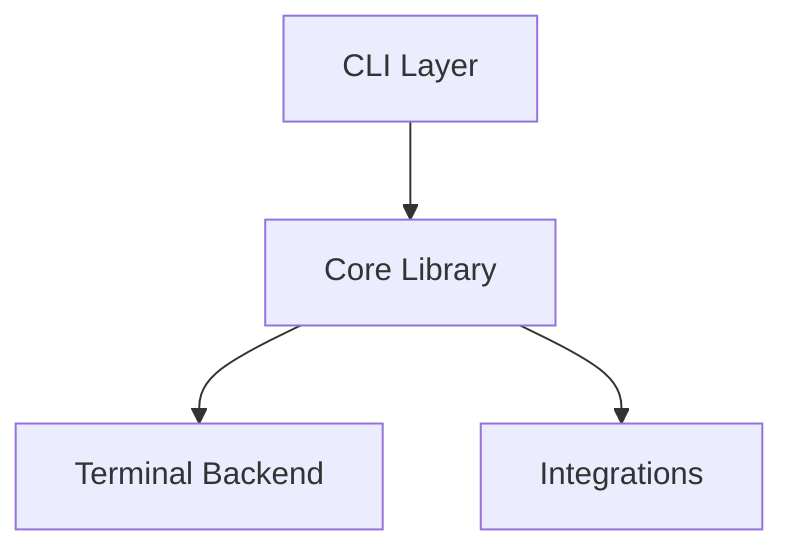

# RForge Learnings Applied to aiterm

**Date:** 2025-12-21
**Source:** RForge MCP Server auto-detection implementation & documentation
**Purpose:** Apply successful patterns from RForge to aiterm development

---

## 🎯 Key Insight

> **Comprehensive documentation BEFORE feature expansion creates clarity, prevents confusion, and accelerates development. The time invested in docs pays off 10x.**

---

## 📊 RForge Results

### Documentation Suite (Completed Dec 21, 2025)

**7 Documents, ~80 Pages:**
1. API Documentation (`AUTO-DETECTION-API.md`)
2. Architecture Documentation (`AUTO-DETECTION-ARCHITECTURE.md`)
3. User Guide (`AUTO-DETECTION-USER-GUIDE.md`)
4. Integration Guide (`AUTO-DETECTION-INTEGRATION.md`)
5. Troubleshooting Guide (`AUTO-DETECTION-TROUBLESHOOTING.md`)
6. Implementation Summary (`AUTO-DETECTION-IMPLEMENTATION.md`)
7. Documentation Index (`AUTO-DETECTION-DOCS-INDEX.md`)

**Visual Documentation:**
- 15 Mermaid diagrams
- System architecture visualizations
- Data flow diagrams
- Sequence diagrams
- State machines

**Code Examples:**
- 50+ complete, runnable examples
- Integration patterns
- Testing patterns
- Migration checklists

**Organization:**
- By audience (users, developers, contributors)
- By feature (auto-detection, context manager, init tool)
- By task ("I want to...")

---

## ✅ What Worked (Apply to aiterm)

### 1. Documentation-First Approach

**RForge Pattern:**
- Comprehensive docs created AFTER implementation
- Revealed gaps in design during documentation
- Clarified API surface for users

**aiterm Improvement:**
- Create docs BEFORE broad implementation
- Use docs as specification
- Validate design through documentation exercise

**Impact:**
- Prevents feature confusion
- Guides implementation
- Reduces rework

---

### 2. ADHD-Friendly Structure

**RForge Pattern:**
```
## Quick Wins
1. ⚡ [Fast action]
2. ⚡ [Fast action]

## Recommended Path
→ [Clear next step with reasoning]
```

**What Worked:**
- ✅ Clear visual hierarchy
- ✅ Quick wins vs long-term clearly labeled
- ✅ Concrete next steps (numbered, actionable)
- ✅ Progressive disclosure (basic → advanced)

**Apply to aiterm:**
- Use same formatting in all docs
- Every section has clear "Next Steps"
- Quick reference tables for fast lookup

---

### 3. Mermaid Diagrams for Architecture

**RForge Pattern:**
- 15 diagrams covering all aspects
- Consistent styling
- Layered complexity (overview → details)

**Example:**


**What Worked:**
- ✅ Visual understanding beats text descriptions
- ✅ Version-controllable (not binary images)
- ✅ Renders on GitHub automatically
- ✅ Easy to update

**Apply to aiterm:**
- Create 20+ diagrams (more complex system)
- System architecture
- Context detection flow
- Profile switching sequence
- Claude Code integration
- MCP server creation flow

---

### 4. Code Examples Over Explanation

**RForge Pattern:**
- 50+ complete, runnable examples
- Not toy code - realistic scenarios
- Commented for understanding

**Example:**
```typescript
import { ContextManager } from '../utils/context-manager.js';

export async function myTool(input: MyInput) {
  // 1. Ensure context loaded (auto-detect if needed)
  await ContextManager.ensureContext();

  // 2. Use auto-detected path or fallback
  const packagePath =
    input.package_path ||
    ContextManager.getContext()?.path ||
    process.cwd();
}
```

**What Worked:**
- ✅ Developers can copy-paste and adapt
- ✅ Shows patterns, not just APIs
- ✅ Reduces onboarding time

**Apply to aiterm:**
- 60+ examples (Python + CLI)
- Custom context detector examples
- Terminal backend examples
- Claude Code integration examples
- MCP server creation examples

---

### 5. Troubleshooting Guide Structure

**RForge Pattern:**
```
## Quick Diagnosis
Answer these questions to find your solution:
1. Does X work? → [Section]
2. Is Y happening? → [Section]

## Common Issues
**Symptom:** [Clear description]
**Diagnosis:** [How to check]
**Solution:** [Step-by-step fix]
```

**What Worked:**
- ✅ Flowchart for quick diagnosis
- ✅ Symptom → Solution format
- ✅ Platform-specific sections
- ✅ Diagnostic script included

**Apply to aiterm:**
- Profile not switching troubleshooting
- Context not detected troubleshooting
- Platform-specific (macOS, Linux, Windows)
- Terminal compatibility matrix

---

### 6. Documentation Index as Central Hub

**RForge Pattern:**
- Single index file with multiple views
- By audience, by feature, by task
- Quick reference tables
- Documentation statistics

**What Worked:**
- ✅ One entry point for all docs
- ✅ Multiple navigation paths
- ✅ Shows completeness (stats)
- ✅ Task-based "I want to..." section

**Apply to aiterm:**
- Create comprehensive index
- More organization paths (aiterm is broader)
- Include CLI command quick reference
- Link to external resources (iTerm2 docs, etc.)

---

## 🚀 Application to aiterm

### Phase 0: Documentation (3 Weeks)

**Week 1: Foundation**
- [ ] API documentation (CLI + Python + MCP)
- [ ] Architecture diagrams (20+ Mermaid)
- [ ] Architecture documentation

**Week 2: User-Facing**
- [ ] User guide (installation → daily workflows)
- [ ] Integration guide (custom contexts, backends)
- [ ] Troubleshooting guide

**Week 3: Finalization**
- [ ] Implementation summary
- [ ] Documentation index
- [ ] Deploy to GitHub Pages

**Deliverable:** Complete documentation suite BEFORE Phase 1 implementation

---

### Documentation as Specification

**RForge Learning:**
- Documenting revealed API design issues
- Writing examples exposed UX problems
- Architecture diagrams clarified component boundaries

**aiterm Benefit:**
- Docs force design decisions NOW
- Examples validate UX BEFORE coding
- Diagrams prevent architecture mistakes

**Result:**
- Clearer implementation
- Fewer rewrites
- Better user experience

---

## 📋 Specific Patterns to Replicate

### 1. API Documentation Format

**Template:**
```markdown
### Tool/Command Name
**Purpose:** [One sentence]

**Usage:**
```bash
aiterm command [options]
```

**Parameters:**
| Name | Type | Required | Description |
|------|------|----------|-------------|

**Returns:**
[Clear description]

**Examples:**
[3-5 realistic examples]

**Errors:**
[Common error codes + solutions]
```

---

### 2. Architecture Diagram Pattern

**System Overview:**


**Then drill down into each component**

---

### 3. User Guide Structure

**Pattern:**
```markdown
## What is X?
[2-3 sentence overview]

## Getting Started
[10 min path to first success]

## Daily Workflows
### Scenario 1: [Common use case]
**Before:** [Problem]
**After:** [Solution]
**Command:** [Example]

## Tips & Tricks
[Quick wins for power users]

## FAQ
[Common questions]
```

---

### 4. Integration Guide Pattern

**Pattern:**
```markdown
## Basic Integration
[Pattern 1: Simple usage]

## Advanced Integration
[Pattern 2-6: Complex scenarios]

## Code Examples
[20+ examples with comments]

## Testing Integration
[How to test your integration]

## Migration Checklist
[Step-by-step upgrade path]
```

---

## 🎯 Success Criteria

### Documentation Quality (Match RForge)
- [ ] 100% feature coverage
- [ ] All code examples tested
- [ ] All diagrams render correctly
- [ ] Cross-links verified
- [ ] No broken links

### User Experience
- [ ] New user installs in < 10 min (using docs)
- [ ] Developer integrates in < 30 min (using examples)
- [ ] Common issues solved via troubleshooting

### aiterm-Specific Goals
- [ ] 7+ documents (~100 pages)
- [ ] 20+ Mermaid diagrams
- [ ] 60+ code examples
- [ ] Deployed to GitHub Pages
- [ ] Ready BEFORE Phase 1 implementation

---

## 💡 Key Takeaway

**From RForge:**
> Documentation created AFTER implementation revealed design issues that could have been caught earlier. Documentation clarifies thinking and exposes gaps.

**For aiterm:**
> Create comprehensive documentation NOW (Phase 0) to guide implementation, prevent confusion, and accelerate development. The 3-week investment will save months of rework.

---

## 📚 Resources

**RForge Documentation:**
- `docs/api/AUTO-DETECTION-API.md`
- `docs/architecture/AUTO-DETECTION-ARCHITECTURE.md`
- `docs/guides/AUTO-DETECTION-USER-GUIDE.md`
- `docs/guides/AUTO-DETECTION-INTEGRATION.md`
- `docs/troubleshooting/AUTO-DETECTION-TROUBLESHOOTING.md`
- `docs/AUTO-DETECTION-DOCS-INDEX.md`

**aiterm Documentation Plan:**
- `DOCUMENTATION-PLAN.md` (this project)

---

## ✅ Decision

**Adopt documentation-first approach for aiterm:**
1. Create complete documentation suite (Phase 0)
2. Use docs as specification for implementation
3. Deploy docs to GitHub Pages
4. THEN begin Phase 1 implementation (rforge:plan + quick-fix)

**Timeline:**
- Phase 0 (Docs): 3 weeks
- Phase 1 (Implementation): 2 weeks
- Total to working MVP: 5 weeks

**Confidence:** High (validated by RForge success)

---

**Status:** Documentation plan created
**Next Step:** Start Phase 0 - API documentation
