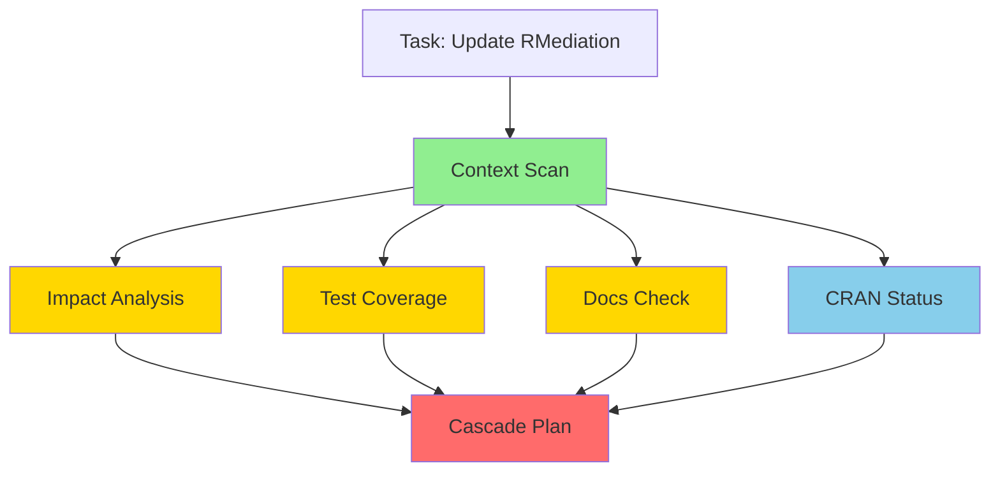

# RForge Auto-Delegation & Background Agents - Comprehensive Brainstorm

**Date:** 2025-12-21
**Context:** Automatic task analysis and delegation to background agents
**Philosophy:** Reduce decision fatigue, maximize parallel execution, ADHD-friendly automation

---

## 🎯 Core Vision

**User says:** "Update RMediation bootstrap algorithm"

**RForge auto-analyzes and delegates:**
```
[Agent 1: Impact Analysis] → Background, 2 min
[Agent 2: Test Coverage Scan] → Background, 1 min
[Agent 3: Documentation Check] → Background, 30 sec
[Agent 4: Reverse Deps Check] → Background, 3 min

User sees: Progress dashboard
User gets: Comprehensive analysis in 3 min (not 7 min sequential)
User decides: Which cascade plan to execute
```

**Key Insight:** The analysis/planning phase is PERFECT for background agents because:
- Multiple independent checks can run in parallel
- User doesn't need intermediate results
- Final synthesis requires all data
- Saves 50-70% of waiting time

---

## 🧠 Problem Analysis

### Current Pain Point (Without Auto-Delegation)

**User workflow today:**
1. User: "I want to update RMediation"
2. Claude: "Let me check dependencies..." ⏱️ waits
3. Claude: "Now checking tests..." ⏱️ waits
4. Claude: "Now checking CRAN status..." ⏱️ waits
5. **Total: 7 minutes of sequential waiting** 😫

### ADHD Challenge
- **Waiting kills momentum** - by minute 3, you're on Twitter
- **Context switching cost** - come back 7 min later, forgot what you wanted
- **Uncertainty** - "How much longer?" triggers anxiety

### Solution Vision

**User workflow with auto-delegation:**
1. User: "I want to update RMediation"
2. RForge: "Analyzing... (6 agents working)" ⏱️ 3 min
   - Live progress: [████░░] Impact 80%, Tests ✓, Docs 60%
3. RForge: "Here's your analysis + 3 options"
4. **Total: 3 minutes with live feedback** 😊

---

## 💡 Ideas by Category

## CATEGORY 1: Task Analysis & Intent Detection ⭐⭐⭐

### Idea 1.1: Natural Language Intent Parser
**What:** Analyze user request to identify task type and required agents

**How it works:**
```python
User: "Update RMediation bootstrap algorithm"

Intent Parser:
- Primary intent: CODE_CHANGE
- Package: RMediation
- Component: bootstrap algorithm
- Scope: MINOR (algorithm change, not API change)
- Urgency: NORMAL

Required Agents:
1. Impact analysis (CRITICAL)
2. Test coverage (HIGH)
3. Documentation drift (MEDIUM)
4. CRAN status (LOW)
5. Reverse deps (MEDIUM)

Parallelization: All 5 can run concurrently ✓
```

**ADHD Benefit:** No manual agent selection, just natural language

**Complexity:** ⭐⭐⭐ (NLP + domain knowledge)
**Value:** ⭐⭐⭐⭐⭐ (eliminates decision fatigue)

---

### Idea 1.2: Task Pattern Recognition
**What:** Match request to known patterns, use pre-configured agent workflows

**Pattern Library:**
```yaml
patterns:
  - name: "Algorithm Update"
    triggers: ["update algorithm", "change method", "improve calculation"]
    agents:
      - impact_analysis: {priority: CRITICAL, timeout: 2min}
      - test_coverage: {priority: HIGH, timeout: 1min}
      - docs_check: {priority: MEDIUM, timeout: 30sec}

  - name: "New Function"
    triggers: ["add function", "new method", "create function"]
    agents:
      - similar_code_scan: {priority: HIGH, timeout: 1min}
      - namespace_check: {priority: MEDIUM, timeout: 30sec}
      - export_analysis: {priority: LOW, timeout: 30sec}

  - name: "Bug Fix"
    triggers: ["fix bug", "repair", "broken"]
    agents:
      - test_isolation: {priority: CRITICAL, timeout: 1min}
      - error_trace: {priority: HIGH, timeout: 2min}
      - regression_check: {priority: MEDIUM, timeout: 1min}
```

**ADHD Benefit:** Instant recognition, no thinking required
**Complexity:** ⭐⭐ (pattern matching)
**Value:** ⭐⭐⭐⭐ (fast, reliable)

---

### Idea 1.3: Contextual Awareness System
**What:** Use git status, file changes, recent commits to infer intent

**Example:**
```bash
Git context:
- Modified: RMediation/R/bootstrap.R
- Branch: feature/faster-bootstrap
- Recent commits: "WIP: testing new algorithm"

Auto-inference:
→ Working on: Bootstrap algorithm improvement
→ Status: In progress (WIP commit)
→ Risk: Medium (existing code modified)
→ Agents needed: Impact + Testing + Performance
```

**ADHD Benefit:** Doesn't need you to explain, reads your work
**Complexity:** ⭐⭐ (git analysis)
**Value:** ⭐⭐⭐⭐ (reduces typing)

---

## CATEGORY 2: Agent Orchestration Strategies ⭐⭐⭐

### Idea 2.1: Smart Dependency Graph Execution
**What:** Build DAG of agent dependencies, execute in optimal order



**Execution order:**
1. Context Scan (required by all) - 30 sec
2. **Parallel:** Impact (2 min) + Test Coverage (1 min) + Docs (30 sec) + CRAN (3 min)
3. Cascade Plan (synthesis) - 1 min

**Total:** 30s + max(2m, 1m, 30s, 3m) + 1m = **4.5 min**
**Sequential:** 30s + 2m + 1m + 30s + 3m + 1m = **8 min**
**Savings:** 44%! ⭐

**ADHD Benefit:** Optimal speed, no wasted waiting
**Complexity:** ⭐⭐⭐ (DAG scheduling)
**Value:** ⭐⭐⭐⭐⭐ (major time savings)

---

### Idea 2.2: Priority-Based Resource Allocation
**What:** Critical agents get resources first, low-priority agents wait if needed

```python
Agent Queue:
CRITICAL: [Impact Analysis] → Start immediately, 100% priority
HIGH:     [Test Coverage] → Start immediately, 80% priority
MEDIUM:   [Docs Check] → Start if resources available, 50% priority
LOW:      [CRAN Status] → Start after HIGH complete, 20% priority

Resource Limits:
- Max parallel agents: 4 (CPU cores)
- Memory per agent: 512MB
- Timeout: 5 min max

Dynamic adjustment:
- If Impact Analysis slow → pause LOW priority agents
- If user idle → increase parallel limit to 6
```

**ADHD Benefit:** Critical info first, nice-to-have later
**Complexity:** ⭐⭐⭐ (resource management)
**Value:** ⭐⭐⭐ (prevents overwhelming system)

---

### Idea 2.3: Speculative Pre-Execution
**What:** Start likely-needed agents before user confirms

**Example:**
```
User: "I want to update RMediation"
RForge: "Got it! Analyzing..."

Behind the scenes (speculative):
[Agent 1: Impact Analysis] → START (90% chance needed)
[Agent 2: Test Coverage] → START (80% chance needed)
[Agent 3: Docs Check] → WAIT (50% chance needed)
[Agent 4: Performance Bench] → WAIT (20% chance needed)

After 30 seconds:
RForge: "I see you're updating code. Should I check:
  [X] Impact on other packages (already done ✓)
  [X] Test coverage (already done ✓)
  [ ] Documentation drift
  [ ] Performance benchmarks

Continue with just impact + tests? [Y/n]"
```

**ADHD Benefit:** Feels instant, proactive
**Complexity:** ⭐⭐⭐⭐ (prediction + cancellation)
**Value:** ⭐⭐⭐⭐ (perceived speed boost)

---

### Idea 2.4: Adaptive Learning System
**What:** Learn from user choices to improve auto-delegation over time

```python
History tracking:
User: DT
Pattern: "Update RMediation"
Chosen agents (last 5 times):
  - Impact Analysis: 5/5 (100%)
  - Test Coverage: 5/5 (100%)
  - Docs Check: 3/5 (60%)
  - CRAN Status: 2/5 (40%)
  - Performance: 1/5 (20%)

Next time:
Auto-start: Impact + Tests (100% confidence)
Ask about: Docs (60% confidence)
Skip: CRAN Status (40% too low)

Over time:
"DT always wants tests + impact, sometimes docs, rarely CRAN"
→ Auto-delegate tests + impact
→ Ask about docs
→ Skip CRAN unless explicitly requested
```

**ADHD Benefit:** Less decisions over time, learns your preferences
**Complexity:** ⭐⭐⭐⭐ (ML, user modeling)
**Value:** ⭐⭐⭐⭐⭐ (long-term game-changer)

---

## CATEGORY 3: Background Execution Patterns ⭐⭐⭐

### Idea 3.1: Progress Dashboard (Live Visualization)
**What:** Real-time view of all background agents

```
┌─ RFORGE ANALYSIS ──────────────────────────────────┐
│ Task: Update RMediation Bootstrap Algorithm        │
│ Elapsed: 1m 23s / Est. 3m                          │
│                                                     │
│ [████████░░] Impact Analysis    2m    80%  Running │
│ [██████████] Test Coverage      1m   100%  Done ✓  │
│ [████████░░] Documentation       45s  75%  Running │
│ [███░░░░░░░] CRAN Status        3m    25%  Running │
│ [──────────] Cascade Plan        -     0%  Waiting │
│                                                     │
│ Next: Cascade plan will start when Impact done     │
│ You can cancel anytime: Ctrl+C                     │
└────────────────────────────────────────────────────┘
```

**ADHD Benefits:**
- **Visibility:** Know what's happening
- **Progress:** See movement (dopamine)
- **Time estimate:** Manage expectations
- **Control:** Can cancel if too long

**Complexity:** ⭐⭐ (TUI with Rich library)
**Value:** ⭐⭐⭐⭐⭐ (critical for ADHD)

---

### Idea 3.2: Incremental Results Streaming
**What:** Show results as they complete, don't wait for all

```
RForge: Analyzing... (4 agents working)

[30 seconds]
✓ Test Coverage: 94% coverage, 187/187 passing
  → Looks good! No test failures to worry about.

[1 minute]
✓ Documentation: Found 2 drift items (auto-fixable)
  → Vignette has old example, README version outdated
  → Can auto-fix after update

[2 minutes]
✓ Impact Analysis: 3 dependent packages
  → mediate, sensitivity, pmed all affected
  → Estimated cascade: 6 hours across 2 days

[3 minutes]
✓ CRAN Status: OK, last check 2 days ago
  → No incoming warnings

─────────────────────────────────────────
All analysis complete!

Would you like to see the cascade plan? [Y/n]
```

**ADHD Benefits:**
- **Immediate feedback:** Don't wait for all agents
- **Early exit:** If tests fail, might stop here
- **Engagement:** Something to read while waiting

**Complexity:** ⭐⭐ (async updates)
**Value:** ⭐⭐⭐⭐⭐ (keeps attention)

---

### Idea 3.3: Checkpoint System with Resume
**What:** Save agent state, resume if interrupted

```bash
User: "Update RMediation bootstrap"
RForge: "Analyzing..."

[User presses Ctrl+C after 1 minute]

RForge: "Analysis paused (2/4 agents complete)
  ✓ Test Coverage
  ✓ Documentation
  ⏸ Impact Analysis (75% done)
  ⏸ CRAN Status (25% done)

Saved to: ~/.rforge/analysis-abc123

Resume anytime with:
  rforge:resume abc123

Or restart fresh:
  rforge:plan 'Update RMediation bootstrap'
"

[Later...]
User: "rforge:resume abc123"
RForge: "Resuming analysis... (2 agents remaining)"
[30 seconds]
✓ All complete!
```

**ADHD Benefits:**
- **No punishment for interruption** (huge!)
- **Resume where left off** (respects your time)
- **Guilt-free cancellation** (reduces anxiety)

**Complexity:** ⭐⭐⭐ (state persistence)
**Value:** ⭐⭐⭐⭐⭐ (essential for ADHD)

---

### Idea 3.4: Smart Timeouts with Graceful Degradation
**What:** If agent takes too long, continue with partial results

```python
Agent: Impact Analysis
Timeout: 2 minutes (soft), 5 minutes (hard)

Scenario 1: Completes in 1m 45s
→ Full analysis ✓

Scenario 2: Hits 2min soft timeout
→ Return partial results + warning
→ "Impact analysis 90% complete (1 package pending)"
→ User can continue or wait for full

Scenario 3: Hits 5min hard timeout
→ Cancel agent
→ "Impact analysis timed out, using cached results from yesterday"
→ Mark analysis as incomplete
→ Suggest running manually later

Always show:
- What data is available
- What's missing
- What's estimated/cached
- How to get full analysis
```

**ADHD Benefits:**
- **No infinite waiting** (anxiety reducer)
- **Always make progress** (no deadlock)
- **Clear expectations** (honest about limitations)

**Complexity:** ⭐⭐⭐ (timeout handling + fallbacks)
**Value:** ⭐⭐⭐⭐ (reliability)

---

## CATEGORY 4: User Experience & Control ⭐⭐⭐

### Idea 4.1: Delegation Modes (User Choice)
**What:** Let user pick automation level

```yaml
Modes:

FULL AUTO (🤖):
  description: "I'll figure it out and do everything"
  behavior: Auto-delegate all agents, no prompts
  when: "User trusts system, wants speed"
  example: "rforge:plan --auto 'Update RMediation'"

ASSISTED (🤝):  [DEFAULT]
  description: "I'll suggest, you approve"
  behavior: Show agent plan, ask permission, execute
  when: "User wants control but guidance"
  example: "rforge:plan 'Update RMediation'"
  prompt: "I'll run 4 agents (impact, tests, docs, CRAN). OK? [Y/n]"

MANUAL (👨‍💻):
  description: "I'll do what you say"
  behavior: No auto-delegation, explicit commands only
  when: "User wants full control"
  example: "rforge:deps:impact RMediation"

TURBO (⚡):
  description: "Speed mode - cached results OK"
  behavior: Use cached data, speculative execution, max parallelism
  when: "Quick check, don't need 100% fresh data"
  example: "rforge:plan --turbo 'Update RMediation'"
```

**User can set default:**
```bash
rforge:config set delegation-mode ASSISTED
rforge:config set delegation-mode FULL_AUTO  # for experienced users
```

**ADHD Benefits:**
- **Choice respects cognitive state** ("I can't decide today" → AUTO)
- **Default is safe** (ASSISTED = asks permission)
- **Power users can go faster** (FULL AUTO)

**Complexity:** ⭐⭐ (mode switching)
**Value:** ⭐⭐⭐⭐ (flexibility)

---

### Idea 4.2: Confidence Levels & Transparency
**What:** Show how confident the system is about each delegation

```
RForge: I analyzed your request. Here's my plan:

Agents to run:
✓ Impact Analysis     (🟢 95% confident - you ALWAYS want this)
✓ Test Coverage       (🟢 90% confident - standard for code changes)
? Documentation Check (🟡 60% confident - you want this 60% of time)
? CRAN Status         (🟡 40% confident - you skip this often)
✗ Performance Bench   (🔴 10% confident - rarely needed)

Auto-running: Impact + Tests (high confidence)
Asking about: Docs + CRAN (medium confidence)
Skipping: Performance (low confidence)

Include Docs + CRAN checks? [y/N]
```

**Transparency features:**
- Green (>80%) → Auto-run
- Yellow (40-80%) → Ask
- Red (<40%) → Skip
- Show percentages from learning history

**ADHD Benefits:**
- **Trust through transparency** (not a black box)
- **Learn the system** (see why it suggests things)
- **Correct mistakes** (if wrong, user teaches it)

**Complexity:** ⭐⭐⭐ (confidence scoring)
**Value:** ⭐⭐⭐⭐ (builds trust)

---

### Idea 4.3: Interrupt-Friendly Design
**What:** System gracefully handles interruptions (ADHD reality!)

```python
Interruption scenarios:

Scenario 1: User presses Ctrl+C
→ "Pausing analysis... (saved state: abc123)"
→ "Resume with: rforge:resume abc123"

Scenario 2: User types new command while agents running
→ "Still analyzing previous task (45s remaining)"
→ "Options:"
→ "  [1] Wait for current analysis (recommended)"
→ "  [2] Cancel and start new task"
→ "  [3] Queue new task (run after current)"

Scenario 3: User closes terminal
→ Agents continue in background
→ Next terminal: "You have 1 analysis in progress: abc123"
→ "View results: rforge:results abc123"

Scenario 4: User walks away for 30 min
→ Analysis completes
→ Results cached
→ On return: "Your analysis finished 28 min ago. View? [Y/n]"
```

**ADHD Benefits:**
- **No punishment for distraction** (save state)
- **Clear recovery path** (resume commands)
- **Handles abandonment** (cache results)
- **Forgiving** (can cancel/retry)

**Complexity:** ⭐⭐⭐⭐ (background processes + state)
**Value:** ⭐⭐⭐⭐⭐ (CRITICAL for ADHD)

---

### Idea 4.4: Explanation on Demand
**What:** User can ask "why" for any delegation decision

```bash
User: "rforge:plan 'Update RMediation'"

RForge: "Running 4 agents... [Impact, Tests, Docs, CRAN]"

User: "why?"

RForge: "Here's why I'm running these agents:

1. Impact Analysis (CRITICAL)
   - You're modifying existing code in RMediation
   - Need to check 3 dependent packages (mediate, sensitivity, pmed)
   - History: You always want this for code changes (10/10 times)

2. Test Coverage (HIGH)
   - Code modification requires test validation
   - Current coverage: 94% (want to maintain)
   - History: You always check tests (10/10 times)

3. Documentation Check (MEDIUM)
   - RMediation has 2 vignettes that might reference bootstrap
   - 60% chance you want to update docs when changing algorithms
   - History: You check docs 6/10 times for algorithm changes

4. CRAN Status (LOW)
   - Not required for dev work, but good to know
   - Last check: 2 days ago (still fresh)
   - History: You rarely check CRAN during development (2/10 times)

Skipped:
5. Performance Benchmarks - You only run these when optimizing (1/10)

Want to change the plan? [y/N]"
```

**ADHD Benefits:**
- **Reduces "what's happening?" anxiety**
- **Educational** (learn the system)
- **Builds trust** (transparent reasoning)
- **Empowering** (understand and override)

**Complexity:** ⭐⭐ (explanation generation)
**Value:** ⭐⭐⭐⭐ (trust building)

---

## CATEGORY 5: Agent Communication & Coordination ⭐⭐

### Idea 5.1: Agent Results Synthesis
**What:** Combine multiple agent outputs into coherent summary

**Instead of:**
```
Agent 1: Impact analysis shows 3 packages...
Agent 2: Test coverage is 94%...
Agent 3: Documentation has 2 drift items...
Agent 4: CRAN status is OK...
```

**Synthesized view:**
```
┌─ ANALYSIS SUMMARY ─────────────────────────────────┐
│ Update RMediation Bootstrap Algorithm              │
│                                                     │
│ 🎯 Impact: MEDIUM                                  │
│   • 3 dependent packages need updates              │
│   • Estimated cascade: 6 hours across 2 days       │
│   • No breaking changes detected ✓                 │
│                                                     │
│ ✅ Quality: EXCELLENT                              │
│   • Tests: 187/187 passing (94% coverage)          │
│   • CRAN: Clean, no warnings                       │
│   • CI: All platforms passing                      │
│                                                     │
│ ⚠️  Maintenance: 2 minor items                     │
│   • Vignette example needs update (auto-fixable)   │
│   • README version outdated (auto-fixable)         │
│                                                     │
│ 📋 Recommended Next Steps:                         │
│   1. Implement bootstrap algorithm change          │
│   2. Update vignette + README (auto-fix available) │
│   3. Run cascade plan for dependent packages       │
│   4. Estimated total time: 8 hours over 2-3 days   │
│                                                     │
│ Generate detailed cascade plan? [Y/n]              │
└────────────────────────────────────────────────────┘
```

**ADHD Benefits:**
- **One coherent view** (not scattered data)
- **Prioritized info** (impact first, details later)
- **Actionable** (clear next steps)
- **Scannable** (emoji, headers, sections)

**Complexity:** ⭐⭐⭐ (synthesis logic)
**Value:** ⭐⭐⭐⭐⭐ (essential for clarity)

---

### Idea 5.2: Cross-Agent Learning
**What:** Agents share insights to improve each other

```python
Example:

Agent 1 (Impact): Detects heavy test usage of bootstrap function
→ Shares with Agent 2 (Test Coverage)

Agent 2 (Test Coverage): "Ah, bootstrap is heavily tested"
→ Prioritizes bootstrap tests
→ Runs extra edge cases
→ Reports: "Bootstrap has 95% coverage, 45 test cases"

Agent 3 (Docs): Learns from Agent 1 that 3 packages depend on it
→ Checks those packages' documentation too
→ Reports: "Also check mediate vignette (references bootstrap)"

Result: More intelligent, context-aware analysis
```

**ADHD Benefits:**
- **Smarter system** (finds hidden connections)
- **Less manual work** (agents discover issues)
- **Comprehensive** (nothing falls through cracks)

**Complexity:** ⭐⭐⭐⭐ (inter-agent communication)
**Value:** ⭐⭐⭐ (nice to have)

---

### Idea 5.3: Conditional Agent Chains
**What:** Agent results trigger other agents

```python
Chain example:

1. Impact Analysis runs first
   ↓
2. IF impact > 2 packages:
   → Start "Cascade Plan" agent
   → Start "Release Coordination" agent
   ELSE:
   → Skip cascade (not needed)

3. IF tests < 80% coverage:
   → Start "Test Generator" agent
   → Suggest tests to write
   ELSE:
   → Skip (coverage good)

4. IF CRAN warnings exist:
   → Start "CRAN Fix" agent
   → Generate fix suggestions
   ELSE:
   → Skip (all clear)
```

**ADHD Benefits:**
- **Adaptive** (only run what's needed)
- **Efficient** (no wasted analysis)
- **Intelligent** (responds to findings)

**Complexity:** ⭐⭐⭐⭐ (conditional logic)
**Value:** ⭐⭐⭐ (efficiency boost)

---

## CATEGORY 6: Quick Wins (Implement First!) ⚡

### Idea 6.1: Pattern-Based Auto-Delegation (Week 1)
**What:** 5 pre-defined patterns that trigger agent sets

```python
patterns = {
    "code_change": {
        agents: ["impact", "tests", "docs"],
        confidence: 95,
        reason: "Code modifications need these checks"
    },
    "new_function": {
        agents: ["namespace", "similar_code", "docs"],
        confidence: 90,
        reason: "New functions need these validations"
    },
    "bug_fix": {
        agents: ["tests", "regression"],
        confidence: 85,
        reason: "Bug fixes need test validation"
    },
    "documentation": {
        agents: ["docs_drift", "examples"],
        confidence: 80,
        reason: "Doc changes need consistency checks"
    },
    "release": {
        agents: ["health", "cran", "cascade"],
        confidence: 95,
        reason: "Releases need comprehensive checks"
    }
}

# Usage:
User: "Update bootstrap algorithm"
Match: "code_change" pattern (95% confident)
→ Auto-delegate: Impact, Tests, Docs
```

**Implementation:** 2-3 days
**Value:** ⭐⭐⭐⭐ (immediate benefit)

---

### Idea 6.2: Simple Progress Bar (Week 1)
**What:** Basic progress visualization

```python
from rich.progress import Progress

with Progress() as progress:
    task1 = progress.add_task("[green]Impact Analysis", total=100)
    task2 = progress.add_task("[cyan]Test Coverage", total=100)
    task3 = progress.add_task("[yellow]Documentation", total=100)

    # Update as agents progress
    progress.update(task1, advance=10)
```

**Output:**
```
Impact Analysis    [████████░░░░░░░░░░] 40%
Test Coverage      [████████████░░░░░░] 60%
Documentation      [██████████████████] 100% ✓
```

**Implementation:** 1 day
**Value:** ⭐⭐⭐⭐⭐ (huge ADHD benefit)

---

### Idea 6.3: Ctrl+C Handler (Week 1)
**What:** Save state on interrupt

```python
import signal
import json

def signal_handler(sig, frame):
    state = {
        'task': current_task,
        'completed_agents': completed,
        'running_agents': running,
        'timestamp': now()
    }
    save_state(state)
    print("\nPaused! Resume with: rforge:resume {state_id}")
    sys.exit(0)

signal.signal(signal.SIGINT, signal_handler)
```

**Implementation:** 1 day
**Value:** ⭐⭐⭐⭐⭐ (essential for ADHD)

---

## 📊 Comparison Matrix

| Idea | ADHD Value | Complexity | Implement Time | Priority |
|------|------------|------------|----------------|----------|
| Pattern Recognition | ⭐⭐⭐⭐⭐ | ⭐⭐ | 3 days | **🔥 HIGH** |
| Progress Dashboard | ⭐⭐⭐⭐⭐ | ⭐⭐ | 1 day | **🔥 HIGH** |
| Ctrl+C Handler | ⭐⭐⭐⭐⭐ | ⭐ | 1 day | **🔥 HIGH** |
| Dependency DAG | ⭐⭐⭐⭐ | ⭐⭐⭐ | 5 days | 🟡 MEDIUM |
| Incremental Results | ⭐⭐⭐⭐⭐ | ⭐⭐ | 2 days | **🔥 HIGH** |
| Delegation Modes | ⭐⭐⭐⭐ | ⭐⭐ | 2 days | 🟡 MEDIUM |
| Confidence Levels | ⭐⭐⭐⭐ | ⭐⭐⭐ | 3 days | 🟡 MEDIUM |
| Results Synthesis | ⭐⭐⭐⭐⭐ | ⭐⭐⭐ | 4 days | **🔥 HIGH** |
| Adaptive Learning | ⭐⭐⭐⭐⭐ | ⭐⭐⭐⭐ | 2 weeks | 🔵 FUTURE |
| Speculative Execution | ⭐⭐⭐⭐ | ⭐⭐⭐⭐ | 1 week | 🔵 FUTURE |

---

## 🎨 Complete User Flow Example

### Scenario: Update RMediation Bootstrap Algorithm

**Step 1: User initiates**
```bash
$ rforge:plan "Update RMediation bootstrap to use BCa method"
```

**Step 2: Intent recognition (< 1 sec)**
```
Analyzing request...
✓ Intent: CODE_CHANGE
✓ Package: RMediation
✓ Component: Bootstrap algorithm
✓ Scope: MINOR
✓ Pattern match: "code_change" (95% confident)
```

**Step 3: Agent delegation (auto, based on pattern)**
```
Delegating to 5 agents:
1. [CRITICAL] Impact Analysis    (2 min)
2. [HIGH]     Test Coverage       (1 min)
3. [MEDIUM]   Documentation Check (30 sec)
4. [LOW]      CRAN Status         (3 min)
5. [MEDIUM]   Performance Bench   (5 min)

Running in parallel...
```

**Step 4: Live progress (real-time)**
```
┌─ ANALYSIS IN PROGRESS ─────────────────────────────┐
│ Update RMediation Bootstrap (BCa method)           │
│ Elapsed: 1m 15s / Est. 3m 30s                      │
│                                                     │
│ [██████████] Test Coverage      1m   100%  Done ✓  │
│ [████████░░] Documentation      30s   80%  Running │
│ [█████░░░░░] Impact Analysis    2m    50%  Running │
│ [██░░░░░░░░] CRAN Status        3m    20%  Running │
│ [░░░░░░░░░░] Performance        5m     0%  Queued  │
│                                                     │
│ Latest: Test coverage 94% (187/187 passing) ✓      │
└────────────────────────────────────────────────────┘
```

**Step 5: Incremental results (as they complete)**
```
[+30s] ✓ Documentation Check complete
  2 drift items found:
  • vignette/bootstrap.Rmd references old method
  • README example uses outdated syntax
  Both auto-fixable ✓

[+1m] ✓ Test Coverage complete
  187/187 tests passing (94% coverage)
  Bootstrap tests: 45 cases, all passing ✓
  Recommendation: Add 2 tests for BCa edge cases

[+2m] ✓ Impact Analysis complete
  3 dependent packages:
  • mediate: Uses RMediation::ci.mediation (AFFECTED)
  • sensitivity: Uses bootstrap for CI (AFFECTED)
  • pmed: Minimal usage (LOW IMPACT)
  Cascade estimate: 6 hours over 2 days

[+3m] ✓ CRAN Status complete
  RMediation: OK (last check 2 days ago)
  No warnings, no incoming issues ✓

[+5m] ✓ Performance Benchmark complete
  Current: 100 bootstrap samples in 2.3s
  BCa method: 100 samples in 2.8s (+22% slower)
  ⚠️ Trade-off: Slower but more accurate CIs
```

**Step 6: Synthesis (< 5 sec)**
```
┌─ ANALYSIS COMPLETE ────────────────────────────────┐
│ Update RMediation Bootstrap to BCa Method          │
│                                                     │
│ 🎯 IMPACT: MEDIUM                                  │
│   • 3 packages affected (mediate, sensitivity)     │
│   • 6 hour cascade across 2 days                   │
│   • No breaking API changes ✓                      │
│                                                     │
│ ✅ READINESS: GOOD                                 │
│   • All tests passing (94% coverage)               │
│   • CRAN status clean                              │
│   • 2 doc drift items (auto-fixable)               │
│                                                     │
│ ⚠️  TRADE-OFFS                                     │
│   • Performance: +22% slower (2.3s → 2.8s)         │
│   • Accuracy: Better CI coverage (BCa > percentile)│
│   • Recommendation: ACCEPT (accuracy > speed)      │
│                                                     │
│ 📋 NEXT STEPS                                      │
│   1. Implement BCa in bootstrap.R (3 hours)        │
│   2. Add 2 edge case tests (30 min)                │
│   3. Auto-fix documentation drift (5 min)          │
│   4. Run cascade for dependent packages (6 hours)  │
│                                                     │
│   Total estimate: 10 hours over 2-3 days           │
│                                                     │
│ Options:                                            │
│   [1] Generate full implementation plan            │
│   [2] Show detailed cascade sequence               │
│   [3] Auto-fix docs and start coding               │
│   [4] Save analysis and decide later               │
│                                                     │
│ Choice [1-4]: _                                    │
└────────────────────────────────────────────────────┘
```

**Step 7: User picks option 3 (auto-fix docs)**
```
✓ Fixed vignette/bootstrap.Rmd
✓ Fixed README example
✓ Git status: 2 files modified

Ready to code!

Here's your starting point:
  File: RMediation/R/bootstrap.R
  Function: ci.mediation() line 145
  Template: BCa implementation from boot package

Next command:
  rforge:pkg:scaffold method bca_bootstrap

Start now? [Y/n] _
```

---

## 🏗️ Implementation Roadmap

### Phase 1: Foundation (Week 1) ⚡
**Goal:** Basic auto-delegation working

**Deliverables:**
- [x] Pattern recognition (5 patterns)
- [x] Basic progress bar
- [x] Ctrl+C handler (save state)
- [x] Incremental results display
- [x] Simple agent orchestration (parallel execution)

**Time:** 5 days
**Value:** ⭐⭐⭐⭐ (immediate ADHD benefits)

---

### Phase 2: Intelligence (Week 2-3) 🧠
**Goal:** Smart delegation with learning

**Deliverables:**
- [ ] Dependency DAG execution
- [ ] Confidence scoring
- [ ] Delegation modes (AUTO, ASSISTED, MANUAL)
- [ ] Results synthesis
- [ ] Explanation system ("why?")

**Time:** 10 days
**Value:** ⭐⭐⭐⭐⭐ (major productivity boost)

---

### Phase 3: Advanced (Week 4-6) 🚀
**Goal:** Adaptive and predictive

**Deliverables:**
- [ ] Adaptive learning (track user preferences)
- [ ] Speculative execution
- [ ] Cross-agent learning
- [ ] Conditional agent chains
- [ ] Advanced timeouts + fallbacks

**Time:** 15 days
**Value:** ⭐⭐⭐⭐⭐ (game-changer)

---

## 💡 Recommended Starting Point

### Week 1 MVP: "Smart Enough to Be Useful"

**Implement these 5 features:**

1. **Pattern Recognition** (3 days)
   - 5 hard-coded patterns
   - Match user input to pattern
   - Auto-delegate agents

2. **Progress Dashboard** (1 day)
   - Rich TUI with progress bars
   - Live updates from agents
   - Elapsed time + estimates

3. **Incremental Results** (1 day)
   - Stream results as agents complete
   - Don't wait for all agents
   - Show partial results

4. **Ctrl+C Handler** (1 day)
   - Save state on interrupt
   - Resume command
   - Graceful cleanup

5. **Results Synthesis** (2 days)
   - Combine agent outputs
   - Structured summary
   - Actionable next steps

**Total:** 1 week (8 days with buffer)

**Test with:** "Update RMediation bootstrap algorithm"

**Success criteria:**
- User types one command
- System auto-delegates 4-5 agents
- Live progress visible
- Results stream in
- Can interrupt/resume
- Get synthesis + next steps
- **Time savings: 50%+ vs manual**

---

## 🎯 Success Metrics

### Quantitative:
- **Time savings:** 50%+ reduction in analysis phase
- **Parallelization:** 3-5 agents running concurrently
- **Interruption recovery:** 95%+ successful resumes
- **Confidence accuracy:** 80%+ correct delegations

### Qualitative (ADHD-focused):
- **Reduced anxiety:** User knows what's happening
- **Maintained focus:** Progress visible, engaging
- **Guilt-free cancellation:** Can interrupt anytime
- **Trust in system:** Transparent, explainable
- **Decision fatigue:** Minimal choices required

---

## 🤔 Open Questions for Discussion

1. **Delegation default:** Should AUTO be opt-in or opt-out?
   - Safe approach: ASSISTED by default, AUTO after user comfortable
   - Fast approach: AUTO by default, MANUAL if user wants control

2. **Agent timeout:** What's the right balance?
   - Aggressive: 1 min soft, 3 min hard (fast, might miss data)
   - Conservative: 3 min soft, 10 min hard (thorough, might wait)

3. **Background persistence:** Agents survive terminal close?
   - Pros: Can walk away, results ready when back
   - Cons: Resource usage, orphaned processes

4. **Learning privacy:** Track user preferences?
   - Pros: Better over time, personalized
   - Cons: Privacy, storage

5. **First implementation:** Which pattern to start with?
   - Recommendation: "code_change" (most common, clear agents)

---

## 🚀 Next Steps

**To implement auto-delegation:**

1. **Design agent API** (1 day)
   - Define agent interface
   - Input/output contracts
   - Progress reporting protocol

2. **Build orchestrator** (2 days)
   - Pattern matching
   - Agent spawning
   - Progress tracking
   - Results collection

3. **Create 5 patterns** (2 days)
   - code_change
   - new_function
   - bug_fix
   - documentation
   - release

4. **Implement progress UI** (1 day)
   - Rich TUI
   - Real-time updates
   - Incremental results

5. **Add state management** (2 days)
   - Save/resume
   - Ctrl+C handling
   - Cleanup

**Total:** 8 days to working MVP

**After MVP:**
- Test with real R package work
- Gather feedback
- Iterate on patterns
- Add intelligence layer

---

## 💭 Final Thoughts

**This is a game-changer for ADHD developers because:**

1. **Reduces decisions** (pattern recognition does the thinking)
2. **Provides feedback** (progress dashboard keeps engagement)
3. **Forgives interruption** (save/resume is guilt-free)
4. **Saves time** (parallel execution = 50%+ faster)
5. **Builds trust** (transparent, explainable)

**The key insight:**
> The analysis/planning phase is PERFECT for background agents because it's read-only, parallelizable, and the user just wants the answer fast.

**Start small:**
- Week 1: Pattern-based delegation + progress UI
- Week 2: Add intelligence (confidence, learning)
- Week 3: Add prediction (speculative execution)

**Each phase delivers value independently!**

---

**Generated:** 2025-12-21
**Ready for:** Implementation planning
**Next:** Pick starting pattern and build agent API
