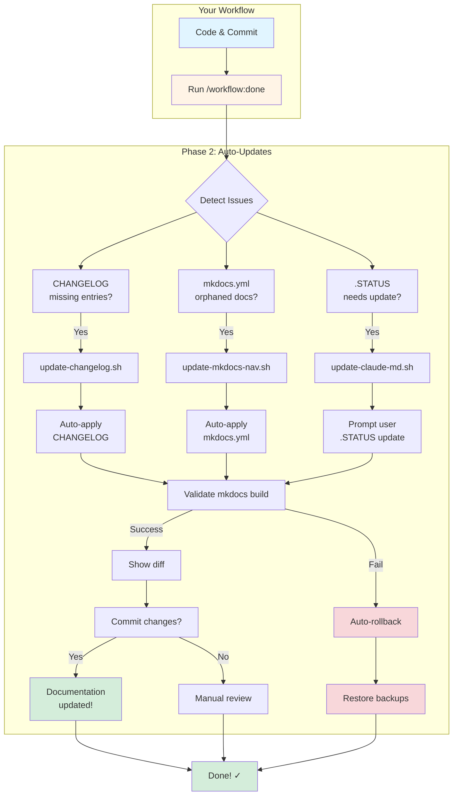
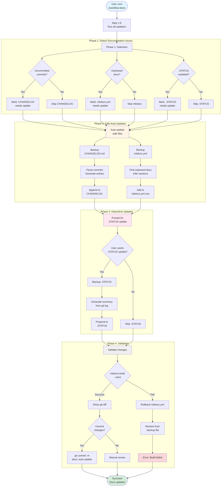
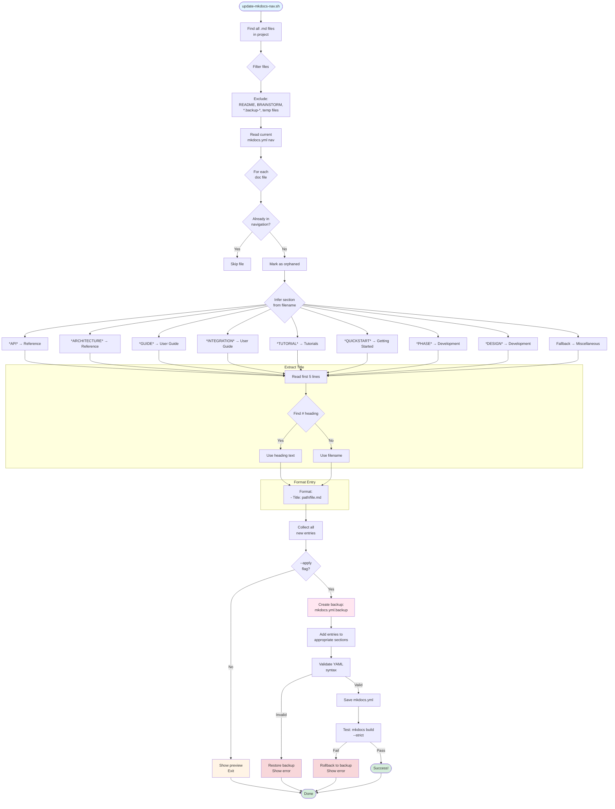
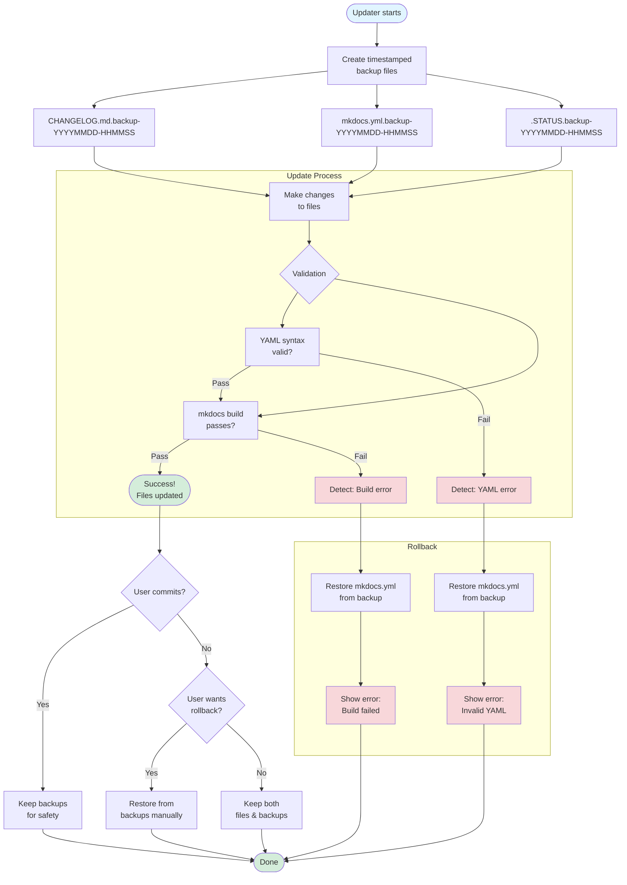
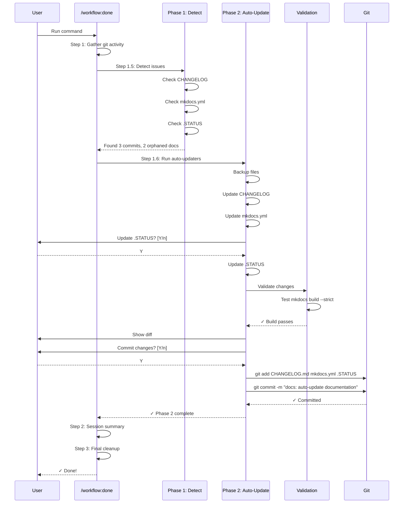
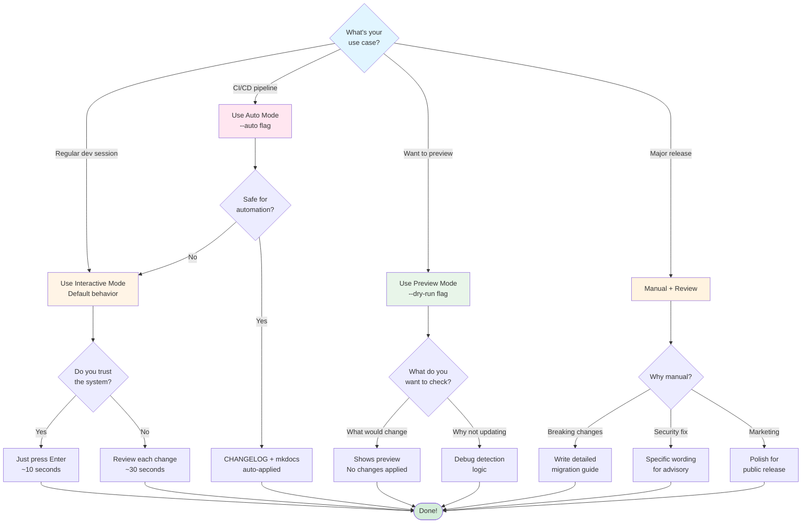
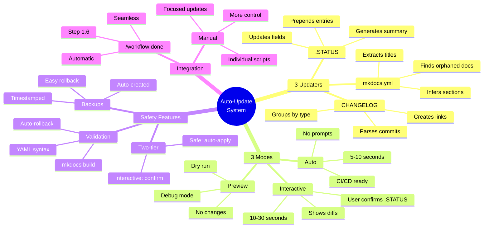
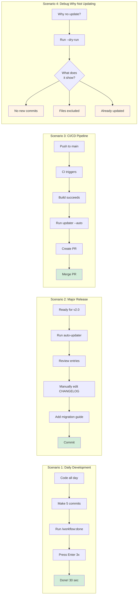

# Documentation Auto-Update Workflow Diagram

This document contains visual workflow diagrams for the auto-update system.

---

## High-Level System Overview



---

## Detailed Update Flow



---

## Individual Updater: CHANGELOG Flow

```mermaid
flowchart LR
    Start([update-changelog.sh]) --> Input[Input:<br/>Git commits]

    Input --> LastUpdate[Find last<br/>CHANGELOG commit]

    LastUpdate --> Range[Get commit range:<br/>last..HEAD]

    Range --> Parse{For each<br/>commit}

    Parse --> ConvCheck{Conventional<br/>format?}

    ConvCheck -->|Yes| Extract[Extract:<br/>type, scope, subject]
    ConvCheck -->|No| Warn[Mark as<br/>non-conventional]

    Extract --> TypeMap{Map type to<br/>section}
    Warn --> TypeMap

    TypeMap --> Added[feat → Added]
    TypeMap --> Fixed[fix → Fixed]
    TypeMap --> Changed[refactor/perf → Changed]
    TypeMap --> Docs[docs → Documentation]
    TypeMap --> Tests[test → Tests]
    TypeMap --> Build[build → Build System]
    TypeMap --> CI[ci → CI/CD]
    TypeMap --> Skip[chore/style → Skip]

    Added --> Format
    Fixed --> Format
    Changed --> Format
    Docs --> Format
    Tests --> Format
    Build --> Format
    CI --> Format

    subgraph "Formatting"
        Format[Format entry:<br/>- **scope**: subject]
        Format --> Link[Add GitHub<br/>commit link]
        Link --> Group[Group by<br/>section]
    end

    Group --> Check{--apply<br/>flag?}

    Check -->|No| Preview[Show preview<br/>Exit]
    Check -->|Yes| Backup[Create backup:<br/>.backup-YYYYMMDD]

    Backup --> Insert[Insert after<br/>[Unreleased]]

    Insert --> Save[Save CHANGELOG.md]

    Preview --> End([Done])
    Save --> End

    style Start fill:#e1f5ff
    style End fill:#d4edda
    style Preview fill:#fff4e6
    style Backup fill:#ffe6f0
```

---

## Individual Updater: mkdocs Navigation Flow



---

## Individual Updater: .STATUS Update Flow

```mermaid
flowchart LR
    Start([update-claude-md.sh]) --> FindFile{Find status<br/>file}

    FindFile --> CheckStatus[Check .STATUS]
    FindFile --> CheckClaude[Check CLAUDE.md]

    CheckStatus -->|Found| UseStatus[Use .STATUS]
    CheckClaude -->|Found| UseClaude[Use CLAUDE.md]
    CheckStatus -->|Not found| CheckClaude
    CheckClaude -->|Not found| Error[Error: No file]

    UseStatus --> Input
    UseClaude --> Input

    subgraph "Gather Input"
        Input[Choose input<br/>method]

        Input --> CustomCheck{Custom<br/>--session arg?}

        CustomCheck -->|Yes| Custom[Use custom<br/>summary]
        CustomCheck -->|No| Auto[Auto-generate<br/>from git]

        Auto --> GitLog[Get recent<br/>commits]
        GitLog --> Stats[Get changed<br/>files stats]
        Stats --> GenSummary[Format:<br/>- commits<br/>- files<br/>- messages]
    end

    Custom --> Format
    GenSummary --> Format

    subgraph "Format Entry"
        Format[Format entry:<br/>✅ Session Completion<br/>+ date<br/>+ summary]

        Format --> UpdateFields[Update fields:<br/>updated: date<br/>progress: %]
    end

    UpdateFields --> Check{--apply<br/>flag?}

    Check -->|No| Preview[Show preview<br/>Exit]
    Check -->|Yes| Backup[Create backup:<br/>.STATUS.backup]

    Backup --> FindSection{Find section:<br/>## ✅ Just Completed}

    FindSection -->|Found| Prepend[Prepend new entry<br/>to section]
    FindSection -->|Not found| Create[Create section<br/>+ entry]

    Prepend --> Save[Save file]
    Create --> Save

    Preview --> End([Done])
    Save --> End
    Error --> End

    style Start fill:#e1f5ff
    style End fill:#d4edda
    style Preview fill:#fff4e6
    style Backup fill:#ffe6f0
    style Error fill:#f8d7da
```



---

## Safety & Rollback Flow



---

## Time Comparison: Manual vs. Automatic

```mermaid
gantt
    title Documentation Update Time Comparison
    dateFormat X
    axisFormat %s

    section Manual Process
    Read git log           :0, 180s
    Copy commit messages   :180s, 120s
    Format CHANGELOG       :300s, 180s
    Find new docs          :480s, 90s
    Update mkdocs.yml      :570s, 120s
    Update .STATUS         :690s, 90s
    Review & commit        :780s, 120s

    section Automatic Process
    Run /workflow:done     :0, 5s
    Press Enter (3 times)  :5s, 10s
    Review diff            :15s, 15s

    section Time Saved
    15 minutes saved!      :30s, 870s
```

---

## Integration with /workflow:done



---

## Decision Tree: Which Mode to Use?



---

## Key Concepts Summary



---

## Usage Examples by Scenario



---

## Conclusion

These diagrams illustrate the complete workflow of the Documentation Auto-Update system:

1. **High-level flow** - From coding to committed documentation
2. **Detailed update** - Each phase with decision points
3. **Individual updaters** - How each script works internally
4. **Safety & rollback** - Protection mechanisms
5. **Time comparison** - Visual proof of time savings
6. **Integration** - How it fits into /workflow:done
7. **Decision tree** - Which mode to use when
8. **Mental model** - Key concepts at a glance
9. **Usage scenarios** - Real-world examples

**For more details, see:**
- Full tutorial: `docs/AUTO-UPDATE-TUTORIAL.md`
- Quick reference: `docs/AUTO-UPDATE-REFCARD.md`
- Design docs: `PHASE-2-DESIGN.md`, `PHASE-2-COMPLETE.md`
