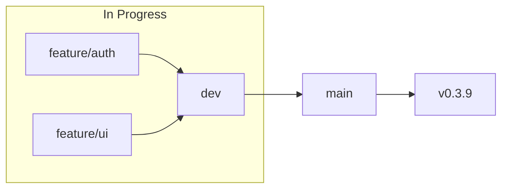

# Feature Branch + Worktree Workflow - Next Steps

**Created:** 2025-12-28
**Related:** [FEATURE-BRANCH-WORKFLOW.md](./FEATURE-BRANCH-WORKFLOW.md)
**Scope:** Combines feature branch discipline with git worktrees

---

## Implementation Phases

```
Phase 0: Quick Wins (Now)
   ↓
Phase 1: Visibility (v0.4.0)
   ↓
Phase 2: Automation (v0.4.x)
   ↓
Phase 3: Integration (v0.5.x)
```

---

## Phase 0: Quick Wins (Do Now - 1 hour total)

### 0.1 Feature Branch Aliases (5 min)

Add to `~/.config/zsh/functions/git-helpers.zsh`:

```bash
# Feature branch workflow
alias gfs='git checkout dev && git pull && git checkout -b feature/'
alias gfh='git checkout main && git pull && git checkout -b hotfix/'
alias gfp='git push -u origin HEAD && gh pr create --base dev'
alias gfr='git checkout dev && gh pr create --base main'
alias gfstatus='git log --oneline dev..HEAD'
```

- [ ] Add aliases to git-helpers.zsh
- [ ] Source and test

### 0.2 Worktree Aliases (5 min)

```bash
# Worktree navigation
alias wt='cd ~/.git-worktrees'
alias wtl='git worktree list'

# Worktree creation function
_wt_create() {
    local branch="$1"
    local project=$(basename $(git rev-parse --show-toplevel))
    local folder=$(echo "$branch" | tr '/' '-')
    mkdir -p ~/.git-worktrees/$project
    git worktree add ~/.git-worktrees/$project/$folder "$branch"
    echo "✅ Created: ~/.git-worktrees/$project/$folder"
}
alias wtc='_wt_create'
```

- [ ] Add worktree aliases/functions
- [ ] Create `~/.git-worktrees` folder

### 0.3 GitHub Branch Protection (10 min)

On GitHub (for aiterm, craft, scribe, atlas):

```
Settings → Branches → Add rule
├── Branch name pattern: main
├── ✓ Require a pull request before merging
├── ✓ Require status checks to pass (if CI exists)
└── ✓ Do not allow bypassing the above settings
```

- [ ] aiterm: Add branch protection
- [ ] craft: Add branch protection
- [ ] scribe: Add branch protection
- [ ] atlas: Add branch protection

### 0.4 Pre-push Warning Hook (10 min)

Create `~/.config/git/hooks/pre-push`:

```bash
#!/bin/bash
# Global pre-push hook for feature branch workflow

current_branch=$(git branch --show-current)

if [ "$current_branch" = "main" ]; then
    echo ""
    echo "⚠️  WARNING: Pushing directly to main"
    echo "   Consider using the feature branch workflow:"
    echo "   → gfp (feature → dev)"
    echo "   → gfr (dev → main)"
    echo ""
    read -p "Continue anyway? [y/N] " -n 1 -r
    echo
    [[ $REPLY =~ ^[Yy]$ ]] || exit 1
fi
```

- [ ] Create hook file
- [ ] Make executable: `chmod +x`
- [ ] Configure: `git config --global core.hooksPath ~/.config/git/hooks`

---

## Phase 1: Visibility (v0.4.0 - This Week)

### 1.1 `ait feature status` Command

Show feature pipeline visualization:

```python
# src/aiterm/cli/feature.py
@app.command()
def status():
    """Show feature pipeline status across branches"""
    # Parse git branch info
    # Show: in-progress, in-dev, in-main
    # Highlight worktree locations
```

- [ ] Create `src/aiterm/cli/feature.py`
- [ ] Register in main CLI
- [ ] Add tests
- [ ] Update docs

### 1.2 `ait feature list` Command

List all features with worktree info:

```bash
$ ait feature list
┌─ Features ────────────────────────────────────────┐
│                                                   │
│ feature/user-auth                                 │
│ ├── Worktree: ~/.git-worktrees/aiterm/feature-.. │
│ ├── Status: 5 commits ahead of dev               │
│ └── Last commit: 2 hours ago                     │
│                                                   │
│ feature/api-refactor                              │
│ ├── Worktree: (none - in main repo)              │
│ └── Status: 2 commits ahead of dev               │
│                                                   │
└───────────────────────────────────────────────────┘
```

- [ ] Add `list` subcommand
- [ ] Show worktree paths
- [ ] Show commit status

### 1.3 `ait feature cleanup` Command

Remove merged worktrees and branches:

```python
@app.command()
def cleanup(dry_run: bool = False):
    """Clean up merged feature branches and worktrees"""
    # Find merged branches
    # Check for worktrees
    # Prompt for removal
    # git worktree prune
```

- [ ] Find merged branches
- [ ] Identify orphaned worktrees
- [ ] Safe removal with confirmation
- [ ] Prune git worktree references

---

## Phase 2: Automation (v0.4.x - Week 2-3)

### 2.1 `ait feature start <name>` Command

Create worktree + branch + install deps:

```bash
$ ait feature start user-auth
✓ Switched to dev, pulled latest
✓ Created branch: feature/user-auth
✓ Created worktree: ~/.git-worktrees/aiterm/feature-user-auth
✓ Detected: Python/uv
✓ Installed dependencies
✓ Ready at: ~/.git-worktrees/aiterm/feature-user-auth
```

- [ ] Create branch from dev
- [ ] Create worktree
- [ ] Detect project type
- [ ] Install dependencies
- [ ] Option: `--no-worktree` for simple branch

### 2.2 `ait feature hotfix <name>` Command

Same as start but from main:

- [ ] Create from main instead of dev
- [ ] Use `hotfix/` prefix
- [ ] Fast-track to main option

### 2.3 `ait feature sync` Command

Rebase/merge with upstream:

```bash
$ ait feature sync
✓ Fetched latest from origin
✓ Rebased feature/user-auth onto dev
✓ No conflicts
```

- [ ] Fetch origin
- [ ] Rebase onto dev (or merge)
- [ ] Handle conflicts gracefully

### 2.4 `ait feature promote` Command

Create PR to dev:

```bash
$ ait feature promote
✓ Pushed to origin/feature/user-auth
✓ Created PR #42: feature/user-auth → dev
→ https://github.com/Data-Wise/aiterm/pull/42
```

- [ ] Push to origin
- [ ] Create PR via `gh`
- [ ] Option: `--merge` for direct merge

### 2.5 `ait feature release` Command

Create PR from dev to main:

```bash
$ ait feature release
✓ Created PR #43: dev → main
→ https://github.com/Data-Wise/aiterm/pull/43
```

- [ ] Verify on dev branch
- [ ] Create PR to main
- [ ] Option: `--changelog` to generate

### 2.6 GitHub Actions Enforcement

Create `.github/workflows/branch-protection.yml`:

```yaml
name: Branch Protection

on:
  pull_request:
    branches: [main]

jobs:
  check-source:
    runs-on: ubuntu-latest
    steps:
      - name: Verify PR from dev
        if: github.head_ref != 'dev'
        run: |
          echo "❌ PRs to main must come from dev branch"
          echo "Current source: ${{ github.head_ref }}"
          exit 1
```

- [ ] Create workflow file
- [ ] Apply to key repos

---

## Phase 3: Craft Integration (v0.5.x - Week 4+)

### 3.1 `/craft:git:feature` Skill

Full Claude Code integration:

```bash
/craft:git:feature start authentication --with-tests
/craft:git:feature promote --run-checks --changelog
/craft:git:feature release --version-bump minor
```

- [ ] Create skill file
- [ ] Integration with `/craft:check`
- [ ] Auto-changelog generation

### 3.2 Enhanced `/craft:git:worktree`

Add feature workflow integration:

- [ ] `move --to-feature` option
- [ ] Auto-detect branch type
- [ ] Link with feature status

### 3.3 Pipeline Visualization

Mermaid diagram generation:

```bash
/craft:git:feature diagram
```



- [ ] Generate Mermaid from git state
- [ ] Include in status output

---

## Files to Create/Modify

| File | Phase | Action |
|------|-------|--------|
| `~/.config/zsh/functions/git-helpers.zsh` | 0 | Add aliases |
| `~/.config/git/hooks/pre-push` | 0 | Create hook |
| `~/.git-worktrees/` | 0 | Create folder |
| `src/aiterm/cli/feature.py` | 1 | New command group |
| `.github/workflows/branch-protection.yml` | 2 | Create workflow |
| `craft/skills/git/feature.md` | 3 | New skill |
| `V0.4.0-PLAN.md` | - | Update with feature workflow |

---

## Success Metrics

| Metric | Target |
|--------|--------|
| No accidental main merges | 0 in 30 days |
| Feature branch adoption | 100% of new features |
| Worktree usage | 50%+ of long features |
| Cleanup frequency | Weekly |
| Pipeline visibility | Status check daily |

---

## Dependencies

- [x] `/craft:git:worktree` command exists
- [ ] GitHub CLI (`gh`) installed
- [ ] Branch protection enabled on repos
- [ ] aiterm v0.4.0 release

---

## Quick Reference

```bash
# Phase 0 Aliases (after setup)
gfs       # Start feature from dev
gfh       # Start hotfix from main
gfp       # Promote (PR to dev)
gfr       # Release (PR dev → main)

wt        # Go to worktrees folder
wtl       # List worktrees
wtc       # Create worktree

# Phase 1+ Commands (v0.4.0)
ait feature status
ait feature list
ait feature cleanup

# Phase 2+ Commands (v0.4.x)
ait feature start <name>
ait feature hotfix <name>
ait feature sync
ait feature promote
ait feature release
```

---

*Status: Planning*
*Target: v0.4.x*
*Scope: Feature branches + Worktrees integration*
