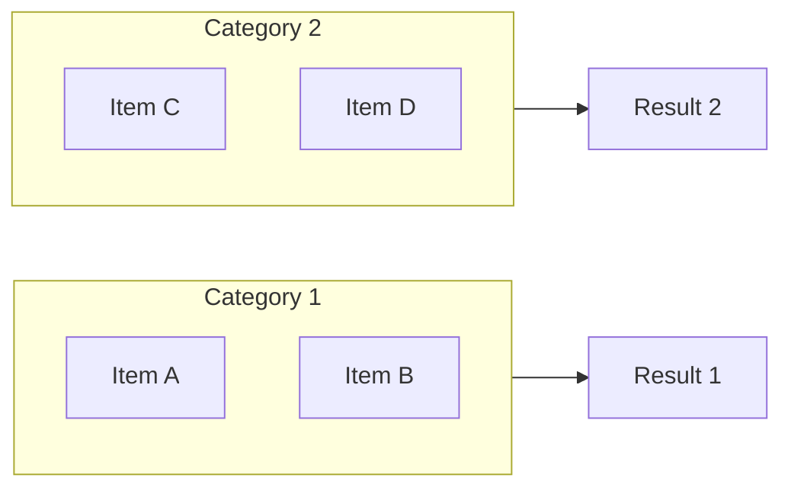

# Craft Plugin Enhancement Proposal: Worktree & Mermaid Support

**Generated:** 2025-12-28
**Context:** aiterm project, craft plugin v1.7.0
**Trigger:** Git Worktrees Guide creation + Mermaid rendering fixes

## Overview

Enhance the craft plugin with learnings from the Git Worktrees Guide session:
1. **Mermaid diagram validation and templates**
2. **Git worktree workflow support**
3. **Documentation site improvements**

---

## Quick Wins (< 30 min each)

### 1. Mermaid Syntax Linter Skill
**Effort:** 20 min | **Impact:** High

Add a skill that validates Mermaid syntax before deployment:

```yaml
# skills/mermaid-linter.md
---
name: mermaid-linter
description: Validate Mermaid diagram syntax in markdown files
---

Scan markdown files for mermaid code blocks and validate:
- Syntax correctness (graph, flowchart, sequence, etc.)
- Text length in boxes (warn if > 20 chars)
- Node naming conventions
- Missing end statements
```

**Why:** Prevents broken diagrams from being deployed.

---

### 2. Mermaid Best Practices in docs:generate
**Effort:** 15 min | **Impact:** Medium

Update `craft:docs:generate` to include Mermaid guidance:

```markdown
## Diagram Guidelines
- Keep node text SHORT (< 15 chars ideal)
- Use abbreviations: `~/.git-worktrees/...` not full paths
- Use subgraphs for grouping related items
- Test rendering locally before committing
```

**Why:** Documents our hard-won learnings.

---

### 3. mkdocs.yml Mermaid Config Check
**Effort:** 15 min | **Impact:** High

Add to `craft:site:status` command:

```bash
# Check for Mermaid configuration
if ! grep -q "custom_fences" mkdocs.yml; then
  echo "WARNING: Mermaid custom_fences not configured"
  echo "Add pymdownx.superfences with custom_fences for mermaid"
fi

if ! grep -q "mermaid" mkdocs.yml; then
  echo "WARNING: mermaid.js CDN not included in extra_javascript"
fi
```

**Why:** Prevents "diagrams showing as code" issue.

---

### 4. Worktree Detection in craft:check
**Effort:** 20 min | **Impact:** Medium

Enhance `craft:check` to detect worktree context:

```bash
# Detect if running in a worktree
if git rev-parse --is-inside-work-tree &>/dev/null; then
  worktree_root=$(git rev-parse --show-toplevel)
  git_dir=$(git rev-parse --git-dir)

  if [[ "$git_dir" == *".git/worktrees/"* ]]; then
    echo "Running in worktree: $worktree_root"
    echo "Main repo: $(dirname $(dirname $git_dir))"
  fi
fi
```

**Why:** Context awareness for parallel development.

---

## Medium Effort (1-2 hours)

### 5. Mermaid Diagram Templates Command
**Effort:** 1 hour | **Impact:** High

New command: `craft:docs:mermaid <type>`

```bash
# Usage
craft:docs:mermaid dependency   # Dependency graph template
craft:docs:mermaid workflow     # Workflow diagram template
craft:docs:mermaid architecture # Architecture diagram template
craft:docs:mermaid comparison   # Side-by-side comparison template
```

**Templates based on Git Worktrees Guide patterns:**



**Why:** Reusable patterns save time, ensure consistency.

---

### 6. Worktree-Aware Session Tracking
**Effort:** 1.5 hours | **Impact:** High

Enhance `ait sessions` to understand worktrees:

```json
{
  "session_id": "123456",
  "project": "scribe",
  "path": "~/.git-worktrees/scribe/mission-control-hud",
  "is_worktree": true,
  "main_repo": "~/projects/dev-tools/scribe",
  "branch": "feat/mission-control-hud",
  "other_worktrees": [
    "~/.git-worktrees/scribe/wonderful-wilson"
  ]
}
```

**New commands:**
- `ait sessions worktrees` - List all worktrees with active sessions
- `ait sessions switch <worktree>` - Show how to switch to another worktree

**Why:** Parallel development needs parallel session awareness.

---

### 7. Site Theme Mermaid CSS Preset
**Effort:** 1 hour | **Impact:** Medium

Add Mermaid CSS to all theme presets:

```css
/* Mermaid overflow fixes - add to all presets */
.mermaid {
  overflow-x: auto;
  text-align: center;
}

.mermaid svg {
  max-width: 100%;
  height: auto;
}

.mermaid .nodeLabel {
  font-size: 12px !important;
}
```

Update `craft:site:theme` to include Mermaid CSS automatically.

**Why:** Every docs site with Mermaid needs these fixes.

---

### 8. Worktree Setup Command
**Effort:** 1.5 hours | **Impact:** High

New command: `craft:git:worktree <action>`

```bash
# Usage
craft:git:worktree setup       # First-time worktree folder setup
craft:git:worktree create      # Create worktree for current branch
craft:git:worktree move        # Move current branch to worktree
craft:git:worktree list        # List all worktrees with status
craft:git:worktree clean       # Remove merged worktrees
```

**Move workflow (from our session):**
```bash
# Automates: stash → checkout main → create worktree → pop stash → install deps
craft:git:worktree move feat/my-feature
```

**Why:** The "move existing branch to worktree" workflow is complex - automate it!

---

## Long-term (Future sessions)

### 9. Mermaid Live Preview Server
**Effort:** 3-4 hours | **Impact:** Medium

Local preview server for Mermaid diagrams:

```bash
craft:docs:mermaid preview docs/guide.md
# Opens browser with live-reloading Mermaid preview
# Shows only the diagrams, hot-reloads on save
```

**Why:** Faster iteration on diagram design.

---

### 10. Worktree Project Templates
**Effort:** 2-3 hours | **Impact:** Medium

Template system for worktree-based workflows:

```yaml
# ~/.config/craft/worktree-templates/feature-dev.yml
name: Feature Development
structure:
  - main: main branch (stable)
  - feature: ~/.git-worktrees/{project}/{branch}
  - hotfix: ~/.git-worktrees/{project}/hotfix-*
ports:
  main: 3000
  feature: 3001
  hotfix: 3002
install_commands:
  node: npm install
  python: uv pip install -e .
  rust: # nothing needed
```

**Why:** Standardize worktree patterns across projects.

---

### 11. Documentation Quality Dashboard
**Effort:** 4-5 hours | **Impact:** High

Comprehensive docs health check:

```bash
craft:docs:health
# Output:
# Mermaid Diagrams: 15 found, 15 valid
# Links: 204 checked, 2 broken
# Code Examples: 533 found, 29 invalid
# Worktree Docs: Up to date with main
# Last Deploy: 2 hours ago
# Recommended: Fix 2 broken links before next deploy
```

**Why:** Single command for documentation health.

---

## Implementation Priority

| Priority | Item | Effort | Impact | Rationale |
|----------|------|--------|--------|-----------|
| 1 | mkdocs.yml Mermaid check | 15m | High | Prevents common issue |
| 2 | Worktree detection | 20m | Medium | Context awareness |
| 3 | Mermaid linter skill | 20m | High | Quality gate |
| 4 | Mermaid templates | 1h | High | Reusable patterns |
| 5 | Worktree setup command | 1.5h | High | Automates complex workflow |
| 6 | Site theme Mermaid CSS | 1h | Medium | Consistency |
| 7 | Worktree session tracking | 1.5h | High | Parallel dev support |
| 8 | Best practices docs | 15m | Medium | Knowledge capture |

---

## Recommended Path

**Start with Quick Wins 1-4** (total ~1 hour):
- Immediate value with minimal effort
- Captures learnings while fresh
- Prevents issues we just debugged

**Then Medium Effort 5 & 8** (total ~2.5 hours):
- Mermaid templates (most reusable)
- Worktree setup command (most impactful)

**Why this order:**
1. Quick wins validate the approach
2. Templates enable consistent quality
3. Automation reduces friction for parallel development

---

## Next Steps

1. [ ] Add Mermaid config check to `craft:site:status` (Quick Win #3)
2. [ ] Create Mermaid linter skill (Quick Win #1)
3. [ ] Update docs:generate with Mermaid guidelines (Quick Win #2)
4. [ ] Add worktree detection to craft:check (Quick Win #4)
5. [ ] Design Mermaid template system (Medium #5)
6. [ ] Implement worktree setup command (Medium #8)

---

## Appendix: Mermaid Learnings from Session

### What Broke
1. Diagrams showing as raw code (missing `custom_fences`)
2. Text overflowing boxes (labels too long)
3. No overflow scrolling (missing CSS)

### What Fixed It

**mkdocs.yml:**
```yaml
markdown_extensions:
  - pymdownx.superfences:
      custom_fences:
        - name: mermaid
          class: mermaid
          format: !!python/name:pymdownx.superfences.fence_code_format

extra_javascript:
  - https://unpkg.com/mermaid@10/dist/mermaid.min.js
```

**CSS:**
```css
.mermaid {
  overflow-x: auto;
  text-align: center;
}

.mermaid svg {
  max-width: 100%;
  height: auto;
}

.mermaid .nodeLabel {
  font-size: 12px !important;
}
```

**Diagram Text:**
- Use `...` for long paths: `~/.git-worktrees/.../branch`
- Abbreviate: "R renv" not "R with renv"
- Max ~15 characters per node label
