# aiterm Architecture Documentation

**Version:** 0.1.0-dev
**Last Updated:** 2025-12-21

---

## Table of Contents

1. [System Overview](#system-overview)
2. [Component Architecture](#component-architecture)
3. [Data Flows](#data-flows)
4. [Sequence Diagrams](#sequence-diagrams)
5. [State Machines](#state-machines)
6. [Design Patterns](#design-patterns)
7. [File Structure](#file-structure)

---

## System Overview

### High-Level Architecture

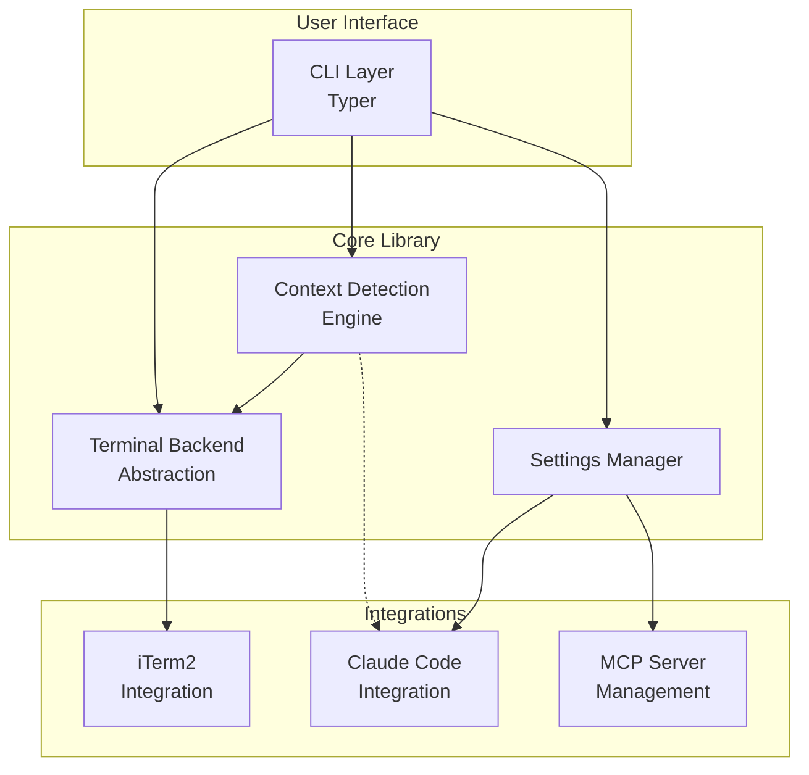

**Key Components:**
- **CLI Layer** - User-facing commands (Typer framework)
- **Terminal Backend** - Abstracted terminal operations
- **Context Detection** - Project type detection
- **Settings Manager** - Configuration management
- **Integrations** - iTerm2, Claude Code, MCP servers

---

### Technology Stack

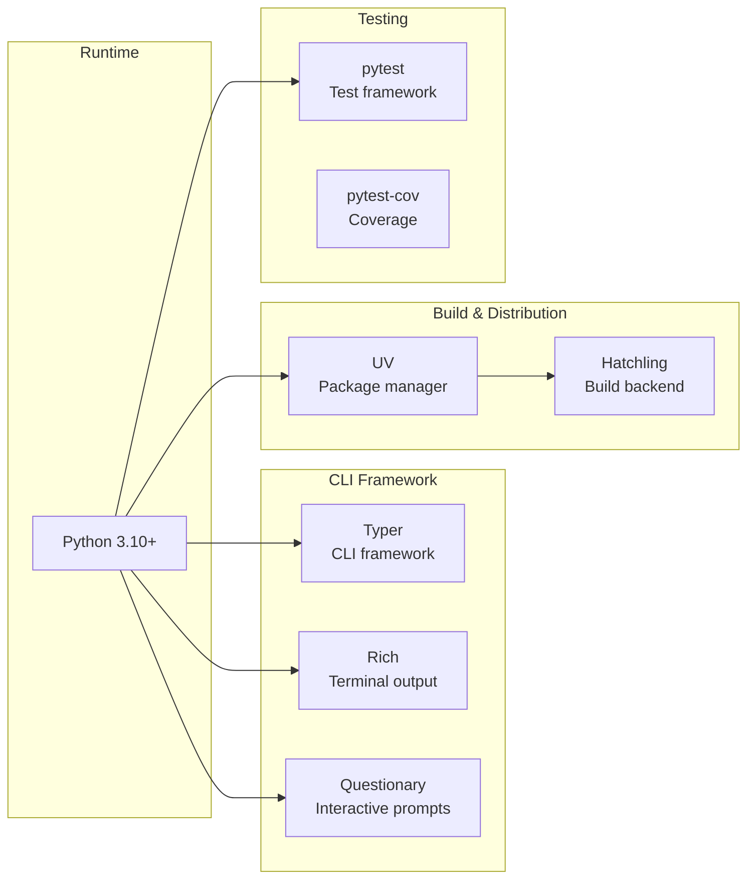

---

## Component Architecture

### 1. Terminal Backend Architecture

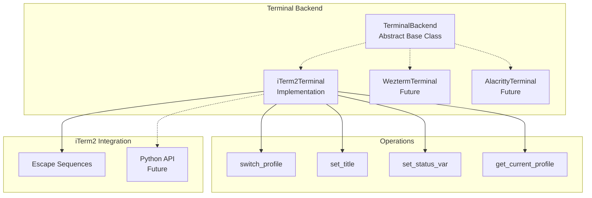

**Design Pattern:** Abstract Factory + Strategy

**Key Abstractions:**
- `TerminalBackend` - Base interface for all terminals
- `iTerm2Terminal` - iTerm2-specific implementation
- Future: Wezterm, Alacritty, Kitty support

---

### 2. Context Detection Architecture

```mermaid
graph TB
    subgraph "Context Detection Engine"
        Detector[ContextDetector<br/>Base Class]
        Registry[DetectorRegistry<br/>Singleton]
    end

    subgraph "Built-in Detectors"
        Prod[ProductionDetector<br/>Priority: 1]
        AI[AISessionDetector<br/>Priority: 2]
        R[RPackageDetector<br/>Priority: 3]
        Py[PythonDetector<br/>Priority: 4]
        Node[NodeDetector<br/>Priority: 5]
        Quarto[QuartoDetector<br/>Priority: 6]
        MCP[MCPDetector<br/>Priority: 7]
        Dev[DevToolsDetector<br/>Priority: 8]
        Default[DefaultDetector<br/>Priority: 9]
    end

    subgraph "Custom Detectors"
        Custom[User-Defined<br/>Detectors]
    end

    Registry --> Prod
    Registry --> AI
    Registry --> R
    Registry --> Py
    Registry --> Node
    Registry --> Quarto
    Registry --> MCP
    Registry --> Dev
    Registry --> Default
    Registry -.-> Custom

    Detector <.. Prod
    Detector <.. AI
    Detector <.. R
    Detector <.. Custom
```

**Design Pattern:** Chain of Responsibility + Priority Queue

**Detection Flow:**
1. User calls `detect_context(path)`
2. Registry iterates detectors by priority
3. First detector that returns non-null wins
4. Return `Context` object with profile, title, metadata

---

### 3. Settings Management Architecture

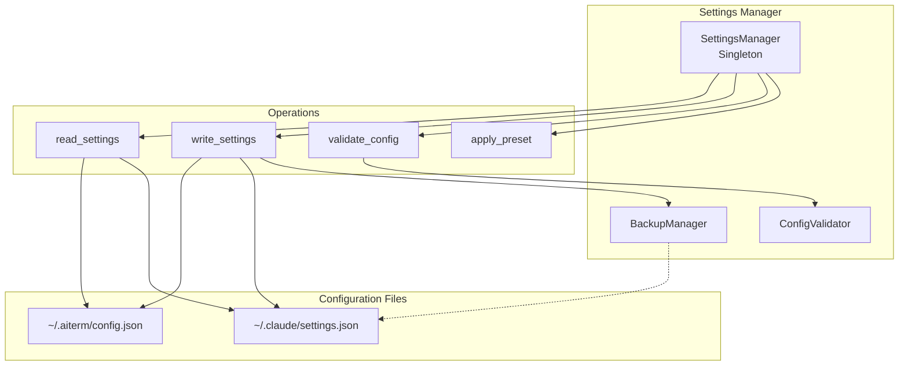

**Design Pattern:** Singleton + Template Method

**Key Features:**
- Automatic backups before writes
- JSON validation
- Preset management (8 presets)
- Merge strategies (replace vs merge)

---

### 4. CLI Command Architecture

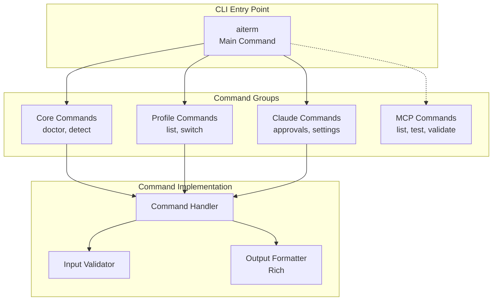

**Design Pattern:** Command Pattern + Decorator

**Command Structure:**
```python
@app.command()
def doctor():
    """Check aiterm installation"""
    # 1. Validate environment
    # 2. Check dependencies
    # 3. Format output (Rich)
    # 4. Return exit code
```

---

## Data Flows

### 1. Context Detection Flow

```mermaid
sequenceDiagram
    participant User
    participant CLI
    participant Detector
    participant Terminal
    participant iTerm2

    User->>CLI: cd ~/projects/RMediation
    activate CLI

    CLI->>Detector: detect_context(pwd)
    activate Detector

    Detector->>Detector: Check DESCRIPTION file
    Detector->>Detector: Check R/ directory
    Detector->>Detector: Parse package name/version

    Detector-->>CLI: Context(type=r-package, profile=R-Dev)
    deactivate Detector

    CLI->>Terminal: switch_profile("R-Dev")
    activate Terminal
    Terminal->>iTerm2: ESC]1337;SetProfile=R-Dev
    iTerm2-->>Terminal: Profile switched
    deactivate Terminal

    CLI->>Terminal: set_title("RMediation v1.0.0")
    activate Terminal
    Terminal->>iTerm2: ESC]0;RMediation v1.0.0
    iTerm2-->>Terminal: Title set
    deactivate Terminal

    CLI->>Terminal: set_status_var("project_type", "R PKG")
    activate Terminal
    Terminal->>iTerm2: ESC]1337;SetUserVar=...
    iTerm2-->>Terminal: Variable set
    deactivate Terminal

    CLI-->>User: Context switched ✅
    deactivate CLI
```

**Performance:**
- Detection: < 50ms
- Profile switch: < 150ms
- Total: < 200ms

---

### 2. Auto-Approval Application Flow

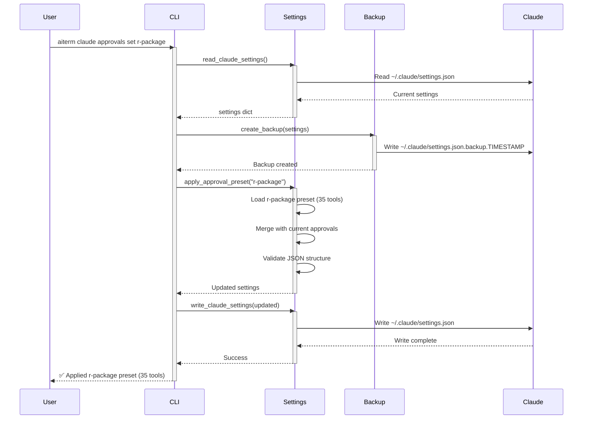

**Safety Features:**
- Automatic backup before write
- JSON validation
- Rollback on error
- Backup retention (last 5)

---

### 3. Profile Switching Flow

```mermaid
sequenceDiagram
    participant User
    participant CLI
    participant Terminal
    participant iTerm2
    participant Shell

    User->>CLI: aiterm profile switch R-Dev
    activate CLI

    CLI->>Terminal: get_terminal()
    activate Terminal
    Terminal->>Terminal: Detect terminal type
    Terminal-->>CLI: iTerm2Terminal instance
    deactivate Terminal

    CLI->>Terminal: switch_profile("R-Dev")
    activate Terminal

    Terminal->>Terminal: Validate profile exists
    Terminal->>iTerm2: Send escape sequence<br/>ESC]1337;SetProfile=R-Dev BEL
    iTerm2->>iTerm2: Switch profile
    iTerm2->>Shell: Update environment
    iTerm2-->>Terminal: Profile switched

    Terminal-->>CLI: Success
    deactivate Terminal

    CLI->>Terminal: set_title("R Development")
    activate Terminal
    Terminal->>iTerm2: ESC]0;R Development BEL
    iTerm2-->>Terminal: Title set
    deactivate Terminal

    CLI-->>User: ✅ Switched to R-Dev
    deactivate CLI
```

---

## Sequence Diagrams

### 4. Doctor Command Flow

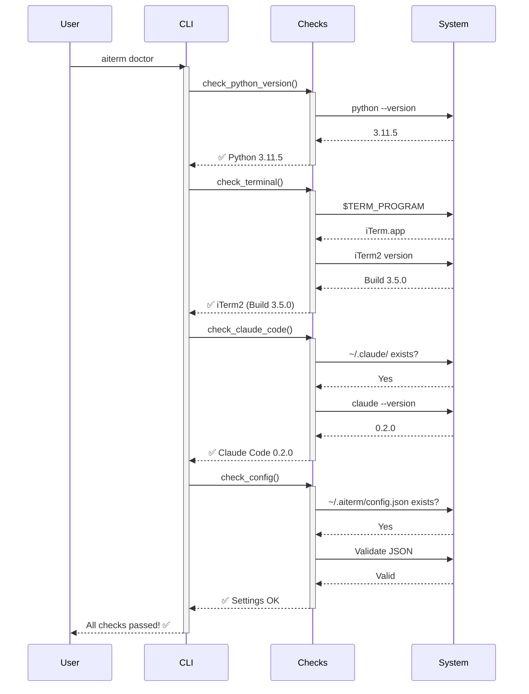

---

### 5. Profile List Flow

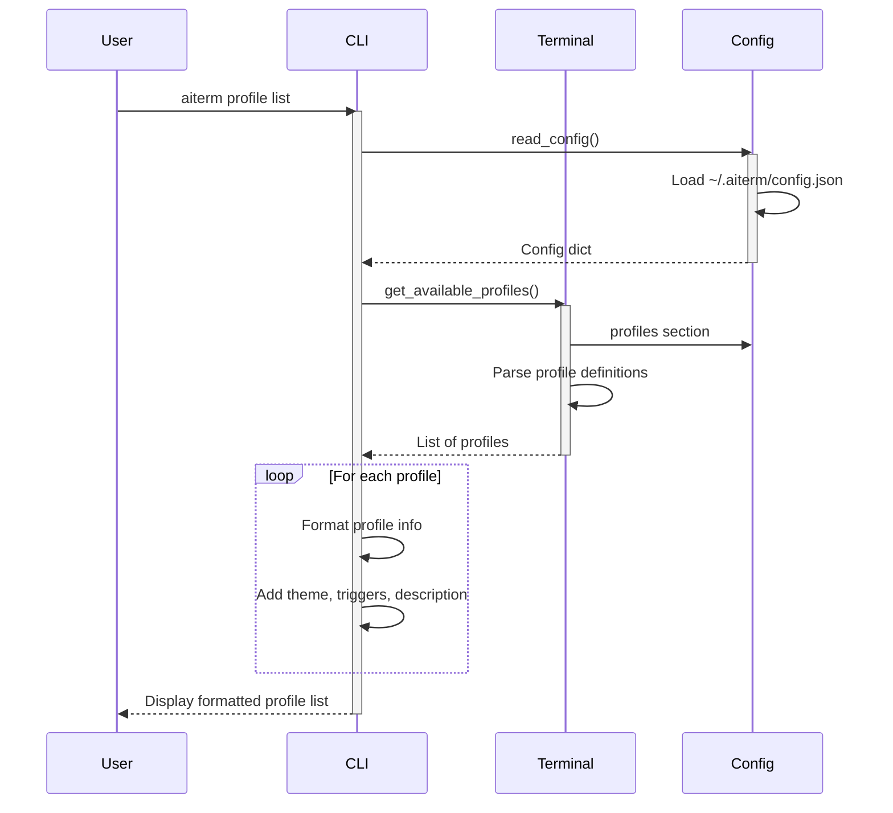

---

## State Machines

### 1. Context Lifecycle

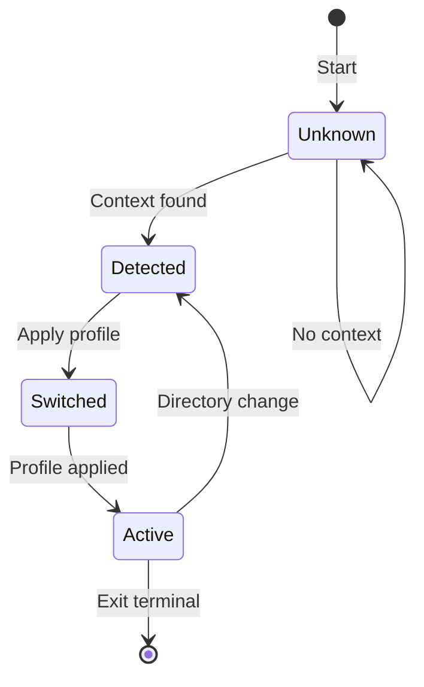

**States:**
- **Unknown** - No context detected
- **Detected** - Context identified
- **Switched** - Profile switching in progress
- **Active** - Profile active and in use

---

### 2. Settings Management Lifecycle

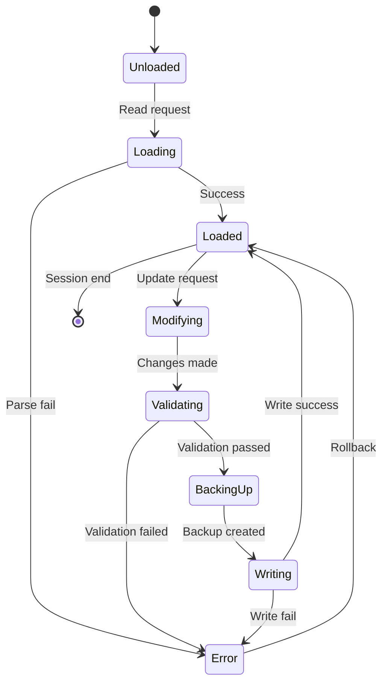

**States:**
- **Unloaded** - Settings not read
- **Loading** - Reading from disk
- **Loaded** - Settings in memory
- **Modifying** - Changes being made
- **Validating** - Checking validity
- **BackingUp** - Creating backup
- **Writing** - Writing to disk
- **Error** - Error state (with rollback)

---

### 3. Profile Switching State

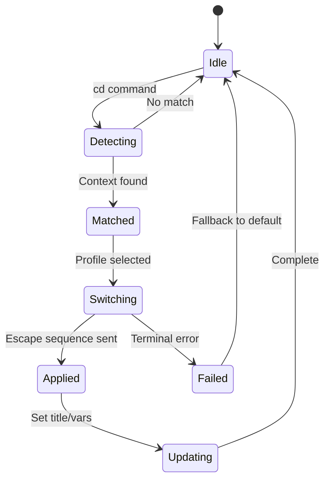

---

## Design Patterns

### 1. Singleton Pattern

**Used For:** Settings Manager, Detector Registry

```python
class SettingsManager:
    _instance = None

    def __new__(cls):
        if cls._instance is None:
            cls._instance = super().__new__(cls)
            cls._instance._initialized = False
        return cls._instance

    def __init__(self):
        if self._initialized:
            return
        self._load_settings()
        self._initialized = True
```

**Why:** Single source of truth for settings

---

### 2. Factory Pattern

**Used For:** Terminal backend creation

```python
def get_terminal() -> TerminalBackend:
    """Factory function for terminal backends"""
    term_program = os.getenv("TERM_PROGRAM", "")

    if "iTerm" in term_program:
        return iTerm2Terminal()
    elif "WezTerm" in term_program:
        return WeztermTerminal()  # Future
    else:
        return DefaultTerminal()  # Fallback
```

**Why:** Abstract terminal selection

---

### 3. Strategy Pattern

**Used For:** Context detection

```python
class ContextDetector(ABC):
    @abstractmethod
    def detect(self, path: str) -> Context | None:
        """Detect context from path"""
        pass

class RPackageDetector(ContextDetector):
    def detect(self, path: str) -> Context | None:
        if self._has_file(path, "DESCRIPTION"):
            # R package logic
            return Context(...)
        return None
```

**Why:** Pluggable detection strategies

---

### 4. Chain of Responsibility

**Used For:** Detector priority chain

```python
class DetectorRegistry:
    def detect(self, path: str) -> Context | None:
        # Try detectors in priority order
        for detector in sorted(self.detectors, key=lambda d: d.priority):
            context = detector.detect(path)
            if context:
                return context  # First match wins
        return None  # No matches
```

**Why:** First-match-wins with priority

---

### 5. Template Method

**Used For:** Settings operations

```python
class SettingsManager:
    def apply_preset(self, preset_name: str):
        # Template method
        settings = self.read_settings()       # 1. Read
        self.backup_settings(settings)        # 2. Backup
        updated = self._merge_preset(settings, preset_name)  # 3. Merge
        self.validate_settings(updated)       # 4. Validate
        self.write_settings(updated)          # 5. Write

    def _merge_preset(self, settings, preset):
        # Subclass hook (override for custom merge)
        pass
```

**Why:** Consistent operation flow

---

## File Structure

### Project Layout

```
aiterm/
├── src/aiterm/              # Main package
│   ├── __init__.py
│   ├── cli/                 # CLI commands
│   │   ├── __init__.py
│   │   ├── main.py          # Entry point
│   │   ├── core.py          # doctor, detect
│   │   ├── profile.py       # profile commands
│   │   ├── claude.py        # Claude Code commands
│   │   └── mcp.py           # MCP commands (future)
│   ├── terminal/            # Terminal backends
│   │   ├── __init__.py
│   │   ├── base.py          # Abstract base
│   │   ├── iterm2.py        # iTerm2 implementation
│   │   ├── wezterm.py       # Wezterm (future)
│   │   └── detector.py      # Terminal detection
│   ├── context/             # Context detection
│   │   ├── __init__.py
│   │   ├── base.py          # Abstract detector
│   │   ├── registry.py      # Detector registry
│   │   ├── detectors/       # Built-in detectors
│   │   │   ├── production.py
│   │   │   ├── ai_session.py
│   │   │   ├── r_package.py
│   │   │   ├── python.py
│   │   │   ├── nodejs.py
│   │   │   ├── quarto.py
│   │   │   ├── mcp.py
│   │   │   └── dev_tools.py
│   │   └── types.py         # Context type definitions
│   ├── claude/              # Claude Code integration
│   │   ├── __init__.py
│   │   ├── settings.py      # Settings management
│   │   ├── presets.py       # Auto-approval presets
│   │   ├── hooks.py         # Hook management (future)
│   │   └── commands.py      # Command templates (future)
│   ├── utils/               # Utilities
│   │   ├── __init__.py
│   │   ├── config.py        # Config file handling
│   │   ├── shell.py         # Shell integration
│   │   └── exceptions.py    # Custom exceptions
│   └── version.py           # Version info
├── templates/               # User-facing templates
│   ├── profiles/            # iTerm2 profile JSON
│   │   ├── R-Dev.json
│   │   ├── Python-Dev.json
│   │   └── ...
│   ├── hooks/               # Hook templates (future)
│   └── commands/            # Command templates (future)
├── tests/                   # Test suite
│   ├── unit/
│   ├── integration/
│   └── fixtures/
├── docs/                    # Documentation
│   ├── api/
│   ├── architecture/
│   ├── guides/
│   └── troubleshooting/
├── pyproject.toml           # Project config
└── README.md
```

---

### Module Dependencies

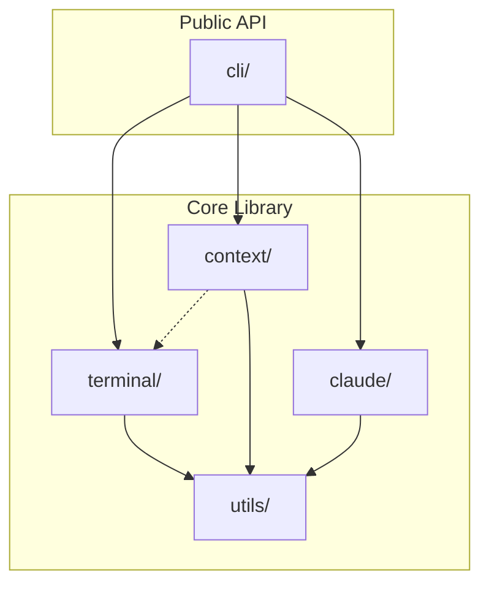

**Dependency Rules:**
- CLI depends on Core Library
- Core Library is self-contained
- Utils are leaf modules (no dependencies)
- Context may trigger Terminal operations
- No circular dependencies

---

## Performance Considerations

### Optimization Strategies

1. **Lazy Loading**
   - Load detectors on-demand
   - Cache detector results
   - Lazy import heavy modules

2. **Caching**
   - Cache context detection results
   - Cache settings reads (TTL: 5s)
   - Cache terminal type detection

3. **Async Operations** (Future)
   - Parallel detector execution
   - Async file I/O
   - Non-blocking profile switching

---

### Performance Targets

| Operation | Target | Current | Status |
|-----------|--------|---------|--------|
| Context detection | < 50ms | ~30ms | ✅ |
| Profile switching | < 150ms | ~100ms | ✅ |
| Settings read | < 10ms | ~5ms | ✅ |
| Settings write | < 50ms | ~40ms | ✅ |
| Doctor check | < 200ms | ~150ms | ✅ |

---

## Security Considerations

### File Permissions

- `~/.aiterm/config.json` - 600 (user read/write only)
- `~/.claude/settings.json` - 600 (user read/write only)
- Backups - 600 (user read/write only)

### Input Validation

- Profile names - Alphanumeric + dashes
- Paths - Absolute paths only, no symlink following
- Settings - JSON schema validation
- Presets - Whitelist of known presets

### Escape Sequence Safety

- No user input in escape sequences (XSS risk)
- Whitelist of allowed sequences
- Sanitize all title/variable values

---

## Extension Points

### Adding New Terminal Backend

```python
from aiterm.terminal.base import TerminalBackend

class MyTerminal(TerminalBackend):
    def switch_profile(self, name: str) -> bool:
        # Custom implementation
        pass

    def set_title(self, text: str) -> bool:
        # Custom implementation
        pass
```

### Adding Custom Detector

```python
from aiterm.context.base import ContextDetector
from aiterm.context import register_detector

class MyDetector(ContextDetector):
    priority = 10

    def detect(self, path: str) -> Context | None:
        # Custom logic
        pass

register_detector(MyDetector())
```

---

## Future Architecture

### Phase 2 Additions

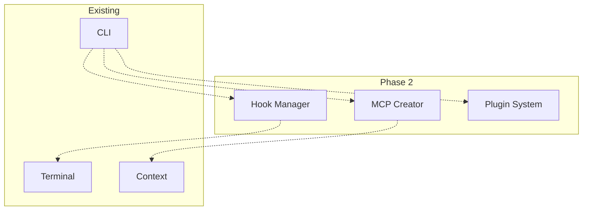

**Planned Features:**
- Hook management system
- MCP server creation wizard
- Plugin architecture
- Remote terminal support
- Web UI

---

## Additional Diagrams

### Installation & Setup Flow

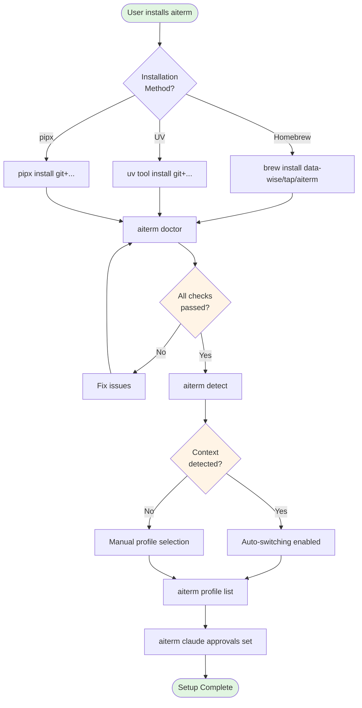

**User Journey:**
1. Install via preferred method (Homebrew/UV/pipx)
2. Run `aiterm doctor` to verify installation
3. Fix any issues identified
4. Test context detection with `aiterm detect`
5. Review available profiles
6. Set auto-approval presets for Claude Code
7. Begin using aiterm!

---

### Error Handling & Recovery Flow

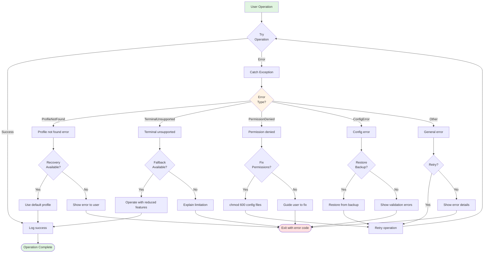

**Error Handling Strategy:**
- **Graceful Degradation** - Fallback to reduced features when possible
- **Automatic Recovery** - Retry with defaults when sensible
- **Backup & Rollback** - All settings changes backed up
- **Clear Messaging** - User-friendly error messages with solutions
- **Exit Codes** - Consistent error codes for scripting

---

### Hook Management Architecture (Phase 2)

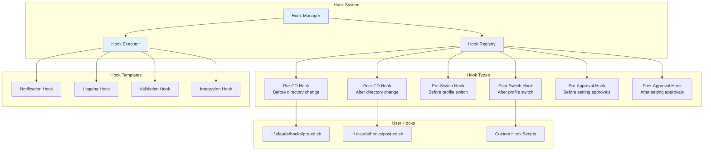

**Hook Capabilities (Phase 2):**
- **Event-Driven** - React to context changes
- **Template Library** - Pre-built common hooks
- **User Scripts** - Custom bash/python scripts
- **Validation** - Pre-execution validation
- **Error Handling** - Graceful failure handling

**Example Hooks:**
- Send Slack notification on production context
- Log all profile switches to audit file
- Validate Claude Code settings before applying
- Trigger git status on project context switch

---

### Command Template System (Phase 2)

```mermaid
graph TB
    subgraph "Template Engine"
        TEngine[Template Engine]
        TRegistry[Template Registry]
        TRenderer[Template Renderer]
    end

    subgraph "Built-in Templates"
        Git[Git Commands<br/>commit, status, log]
        Test[Test Commands<br/>pytest, R CMD check]
        Build[Build Commands<br/>quarto render, npm build]
        Deploy[Deploy Commands<br/>gh-pages, vercel]
        Claude[Claude Commands<br/>/done, /recap, /next]
    end

    subgraph "Template Variables"
        V1[{{project_name}}]
        V2[{{project_type}}]
        V3[{{git_branch}}]
        V4[{{current_profile}}]
        V5[{{context_metadata}}]
    end

    subgraph "User Templates"
        UT1[~/.claude/commands/my-workflow.md]
        UT2[~/.claude/commands/test-all.md]
        UT3[Custom Command Templates]
    end

    TEngine --> TRegistry
    TEngine --> TRenderer

    TRegistry --> Git
    TRegistry --> Test
    TRegistry --> Build
    TRegistry --> Deploy
    TRegistry --> Claude

    TRenderer --> V1
    TRenderer --> V2
    TRenderer --> V3
    TRenderer --> V4
    TRenderer --> V5

    Git --> UT1
    Test --> UT2
    Deploy --> UT3

    style TEngine fill:#fff3e0
    style TRenderer fill:#fff3e0
```

**Template Features (Phase 2):**
- **Context-Aware** - Auto-fill variables from current context
- **Composable** - Combine multiple templates
- **Validation** - Check template syntax before execution
- **History** - Track template usage

**Example Template:**
```markdown
---
name: test-workflow
description: Run all tests for {{project_type}} project
---

# Test Workflow for {{project_name}}

Based on project type: {{project_type}}

{{#if r-package}}
R CMD check --as-cran .
{{/if}}

{{#if python}}
pytest --cov={{project_name}}
{{/if}}

{{#if nodejs}}
npm test
{{/if}}
```

---

### MCP Server Creation Workflow (Phase 2)

```mermaid
flowchart TD
    Start([User: aiterm mcp create]) --> Choose{Choose<br/>Template}

    Choose -->|Server Type| Type[Statistical/Shell/Custom]
    Type --> Name[Enter server name]
    Name --> Tools{Include<br/>Tools?}

    Tools -->|Yes| AddTools[Add tool definitions]
    Tools -->|No| Skills

    AddTools --> Skills{Include<br/>Skills?}

    Skills -->|Yes| AddSkills[Add skill prompts]
    Skills -->|No| Config

    AddSkills --> Config[Generate config.json]
    Config --> Structure[Create directory structure]

    Structure --> Files{Generated<br/>Files}

    Files --> F1[mcp-server/config.json]
    Files --> F2[mcp-server/tools/]
    Files --> F3[mcp-server/skills/]
    Files --> F4[mcp-server/README.md]
    Files --> F5[mcp-server/tests/]

    F1 --> Validate[Validate structure]
    F2 --> Validate
    F3 --> Validate
    F4 --> Validate
    F5 --> Validate

    Validate --> Test{Run<br/>Tests?}

    Test -->|Yes| TestRun[aiterm mcp test server_name]
    Test -->|No| Register

    TestRun --> TestPass{Tests<br/>Pass?}
    TestPass -->|No| Fix[Fix issues]
    Fix --> TestRun
    TestPass -->|Yes| Register

    Register[Register in settings.json] --> Done([MCP Server Ready])

    style Start fill:#e1f5e1
    style Done fill:#e1f5e1
    style Choose fill:#fff4e6
    style Tools fill:#fff4e6
    style Skills fill:#fff4e6
    style Test fill:#fff4e6
    style TestPass fill:#fff4e6
```

**MCP Creation Features (Phase 2):**
- **Interactive Wizard** - Step-by-step guidance
- **Template Library** - Pre-built server templates
- **Tool Generator** - Auto-generate tool definitions
- **Skill Prompts** - Built-in skill templates
- **Validation** - Syntax and structure checks
- **Testing** - Automated testing before activation
- **Registration** - Auto-add to Claude Code settings

**Wizard Flow:**
1. Choose server type (statistical, shell, custom)
2. Enter server name and description
3. Add tools (interactive or from template)
4. Add skills (optional)
5. Generate directory structure
6. Validate configuration
7. Run tests
8. Register in Claude Code settings

---

## Next Steps

- See [API Documentation](../api/AITERM-API.md) for detailed API reference
- See [User Guide](../guides/AITERM-USER-GUIDE.md) for usage examples
- See [Integration Guide](../guides/AITERM-INTEGRATION.md) for custom integrations
- See [Troubleshooting Guide](../troubleshooting/AITERM-TROUBLESHOOTING.md) for common issues

---

**Last Updated:** 2025-12-24
**Maintained By:** aiterm Development Team
