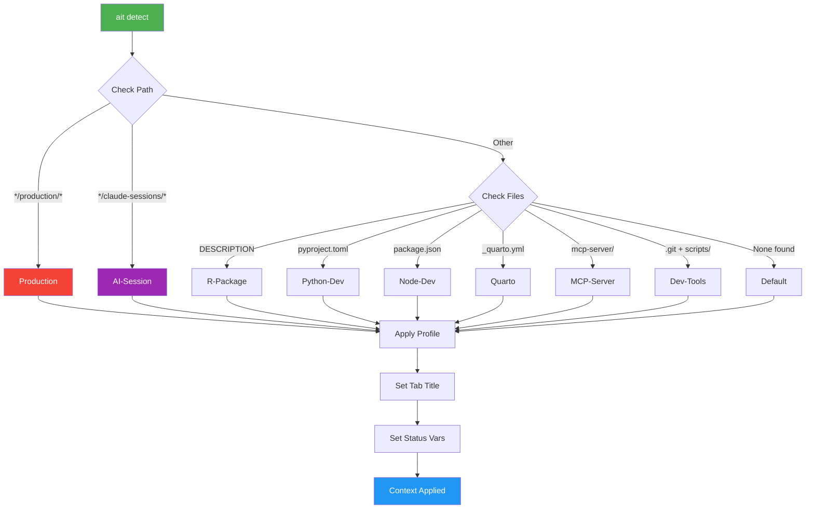

# Context Detection Flow

```mermaid
flowchart TD
    Start["ait detect"] --> CheckPath{"Check Path"}

    CheckPath -->|"*/production/*"| Prod["Production"]
    CheckPath -->|"*/claude-sessions/*"| AI["AI-Session"]
    CheckPath -->|Other| CheckFiles{"Check Files"}

    CheckFiles -->|"DESCRIPTION"| RPkg["R-Package"]
    CheckFiles -->|"pyproject.toml"| Python["Python-Dev"]
    CheckFiles -->|"package.json"| Node["Node-Dev"]
    CheckFiles -->|"_quarto.yml"| Quarto["Quarto"]
    CheckFiles -->|"mcp-server/"| MCP["MCP-Server"]
    CheckFiles -->|".git + scripts/"| DevTools["Dev-Tools"]
    CheckFiles -->|None found| Default["Default"]

    Prod --> Apply["Apply Profile"]
    AI --> Apply
    RPkg --> Apply
    Python --> Apply
    Node --> Apply
    Quarto --> Apply
    MCP --> Apply
    DevTools --> Apply
    Default --> Apply

    Apply --> SetTitle["Set Tab Title"]
    SetTitle --> SetVars["Set Status Vars"]
    SetVars --> Done["Context Applied"]

    style Start fill:#4caf50,color:#fff
    style Done fill:#2196f3,color:#fff
    style Prod fill:#f44336,color:#fff
    style AI fill:#9c27b0,color:#fff
```
