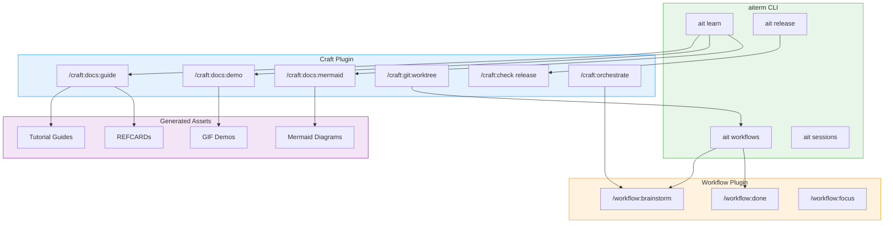

# Craft Plugin Integration

## Key Integration Points

| aiterm | craft | Purpose |
|--------|-------|---------|
| `ait learn` | `/craft:docs:guide` | Generate tutorial content |
| `ait learn` | `/craft:docs:demo` | Create GIF recordings |
| `ait release` | `/craft:check release` | Pre-release audit |
| `ait workflows` | `/craft:git:worktree` | Parallel development |
