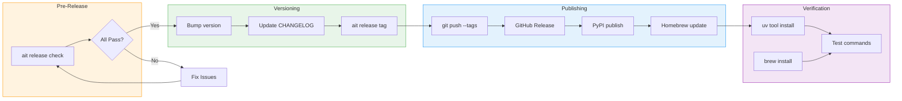

# Release Workflow


```mermaid
flowchart LR
    subgraph CHECK["Pre-Release"]
        A1["ait release check"]
        A2{"All Pass?"}
        A1 --> A2
    end

    subgraph TAG["Versioning"]
        B1["Bump version"]
        B2["Update CHANGELOG"]
        B3["ait release tag"]
        B1 --> B2 --> B3
    end

    subgraph PUBLISH["Publishing"]
        C1["git push --tags"]
        C2["GitHub Release"]
        C3["PyPI publish"]
        C4["Homebrew update"]
        C1 --> C2 --> C3 --> C4
    end

    subgraph VERIFY["Verification"]
        D1["uv tool install"]
        D2["brew install"]
        D3["Test commands"]
        D1 --> D3
        D2 --> D3
    end

    A2 -->|Yes| B1
    A2 -->|No| Fix["Fix Issues"]
    Fix --> A1

    B3 --> C1
    C4 --> D1

    style CHECK fill:#fff3e0,stroke:#ff9800
    style TAG fill:#e8f5e9,stroke:#4caf50
    style PUBLISH fill:#e3f2fd,stroke:#2196f3
    style VERIFY fill:#f3e5f5,stroke:#9c27b0
```

## Commands

```bash
# Full automated release
ait release full 0.6.0

# Or step-by-step
ait release check
ait release tag 0.6.0
ait release pypi
ait release homebrew
```
