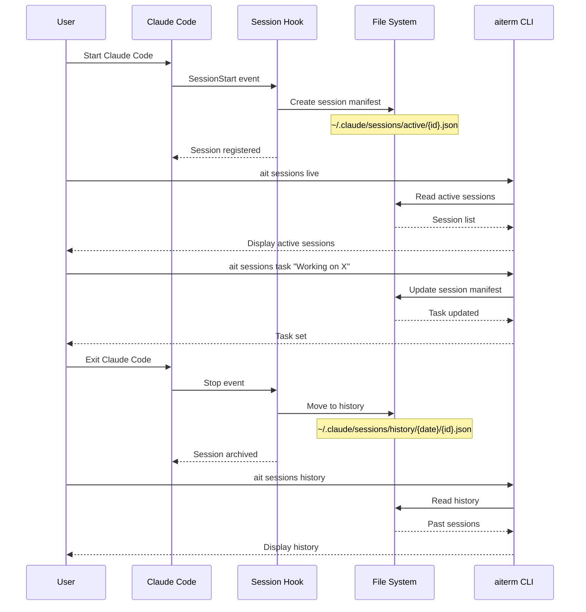

# Session Lifecycle

```mermaid
sequenceDiagram
    participant User
    participant Claude as Claude Code
    participant Hook as Session Hook
    participant FS as File System
    participant AIT as aiterm CLI

    User->>Claude: Start Claude Code
    Claude->>Hook: SessionStart event
    Hook->>FS: Create session manifest
    Note over FS: ~/.claude/sessions/active/{id}.json

    Hook-->>Claude: Session registered

    User->>AIT: ait sessions live
    AIT->>FS: Read active sessions
    FS-->>AIT: Session list
    AIT-->>User: Display active sessions

    User->>AIT: ait sessions task "Working on X"
    AIT->>FS: Update session manifest
    FS-->>AIT: Task updated
    AIT-->>User: Task set

    User->>Claude: Exit Claude Code
    Claude->>Hook: Stop event
    Hook->>FS: Move to history
    Note over FS: ~/.claude/sessions/history/{date}/{id}.json

    Hook-->>Claude: Session archived

    User->>AIT: ait sessions history
    AIT->>FS: Read history
    FS-->>AIT: Past sessions
    AIT-->>User: Display history
```
