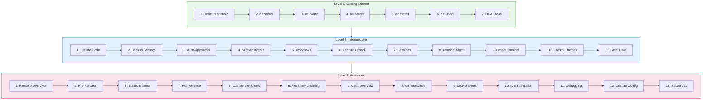

# Tutorial Progression

```mermaid
flowchart TD
    subgraph L1["Level 1: Getting Started"]
        A1["1. What is aiterm?"]
        A2["2. ait doctor"]
        A3["3. ait config"]
        A4["4. ait detect"]
        A5["5. ait switch"]
        A6["6. ait --help"]
        A7["7. Next Steps"]
        A1 --> A2 --> A3 --> A4 --> A5 --> A6 --> A7
    end

    subgraph L2["Level 2: Intermediate"]
        B1["1. Claude Code"]
        B2["2. Backup Settings"]
        B3["3. Auto-Approvals"]
        B4["4. Safe Approvals"]
        B5["5. Workflows"]
        B6["6. Feature Branch"]
        B7["7. Sessions"]
        B8["8. Terminal Mgmt"]
        B9["9. Detect Terminal"]
        B10["10. Ghostty Themes"]
        B11["11. Status Bar"]
        B1 --> B2 --> B3 --> B4 --> B5
        B5 --> B6 --> B7 --> B8 --> B9
        B9 --> B10 --> B11
    end

    subgraph L3["Level 3: Advanced"]
        C1["1. Release Overview"]
        C2["2. Pre-Release"]
        C3["3. Status & Notes"]
        C4["4. Full Release"]
        C5["5. Custom Workflows"]
        C6["6. Workflow Chaining"]
        C7["7. Craft Overview"]
        C8["8. Git Worktrees"]
        C9["9. MCP Servers"]
        C10["10. IDE Integration"]
        C11["11. Debugging"]
        C12["12. Custom Config"]
        C13["13. Resources"]
        C1 --> C2 --> C3 --> C4 --> C5
        C5 --> C6 --> C7 --> C8 --> C9
        C9 --> C10 --> C11 --> C12 --> C13
    end

    L1 --> L2
    L2 --> L3

    style L1 fill:#e8f5e9,stroke:#4caf50
    style L2 fill:#e3f2fd,stroke:#2196f3
    style L3 fill:#fce4ec,stroke:#e91e63
```
