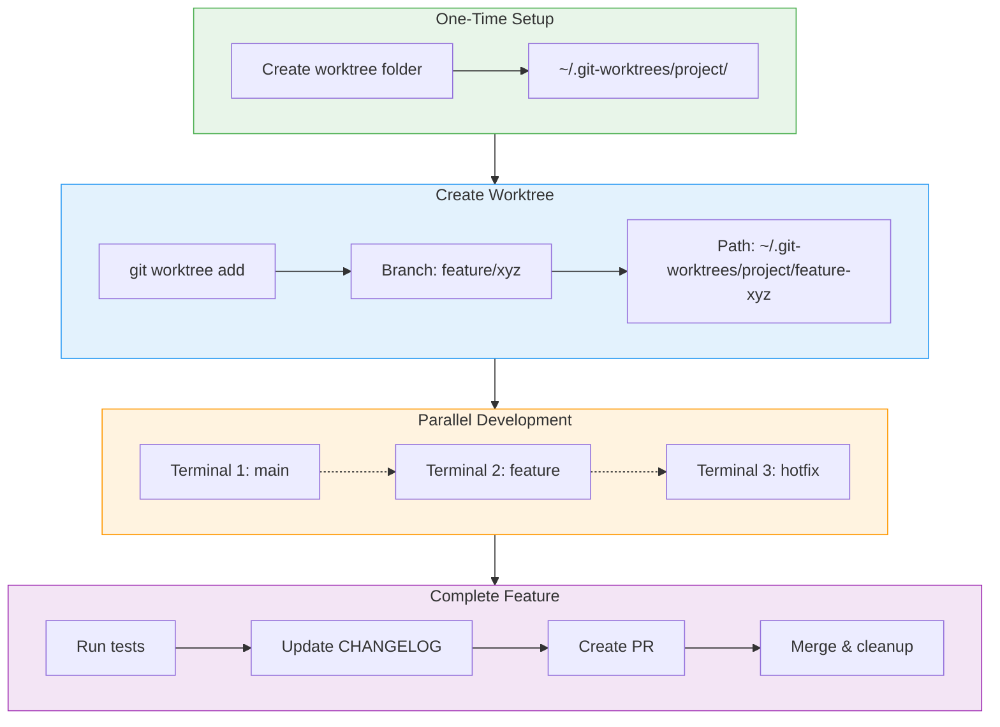

# Git Worktree Workflow



## Commands

```bash
# Setup (once per project)
/craft:git:worktree setup

# Create worktree for feature branch
/craft:git:worktree create feature/new-thing

# List all worktrees
/craft:git:worktree list

# Complete feature (tests + changelog + PR)
/craft:git:worktree finish

# Cleanup merged worktrees
/craft:git:worktree clean
```

## Benefits

- No branch switching needed
- Each terminal stays on its branch
- Uncommitted work stays put
- Perfect for Claude Code sessions
