# Feature Branch Workflow

Rich CLI commands for managing feature branches and git worktrees.

**Added in:** v0.3.13 | **Updated:** v0.6.3 (promote/release commands)

---


---

## Overview

The feature workflow commands provide:

- **Pipeline Visualization** - See your feature branches in a tree view
- **Worktree Integration** - Parallel development with git worktrees
- **Dependency Automation** - Auto-install deps when creating branches
- **PR Automation** - Create PRs to dev (promote) and main (release)
- **Cleanup Tools** - Remove merged branches and worktrees

```bash
ait feature status    # Show pipeline
ait feature list      # List all features
ait feature start     # Create new feature
ait feature promote   # Create PR to dev
ait feature release   # Create PR from dev to main
ait feature cleanup   # Remove merged
```

---

## Commands

### `ait feature status`

Show a rich pipeline visualization of your feature branches.

```bash
ait feature status
```

**Output:**
```
╭──────────────────────────────────────────────────────────────────────────────╮
│ my-project - Feature Pipeline                                                │
╰──────────────────────────────────────────────────────────────────────────────╯
main
└── dev
    ├── ● feature/auth +3
    ├── ○ feature/api-v2 +12 📁 ~/.git-worktrees/my-project/api-v2
    ├── ○ feature/new-idea (new)
    └── ○ feature/old-feature (merged)

Summary: 4 features (2 in progress, 1 new, 1 merged)
Tip: Run 'ait feature cleanup' to remove merged branches
```

**Legend:**

| Symbol | Meaning |
|--------|---------|
| `●` | Current branch (you are here) |
| `○` | Other branch |
| `+N` | Commits ahead of dev |
| `(new)` | Just created, no commits yet |
| `(merged)` | Has commits that were merged into dev |
| `📁` | Has a worktree |

**Branch States:**

| State | Description | Action |
|-------|-------------|--------|
| **active** | Has commits ahead of dev | Keep working |
| **new** | Just created, 0 commits | Start adding commits |
| **merged** | All commits merged to dev | Safe to cleanup |

---

### `ait feature list`

List feature branches with detailed information.

```bash
# List active features only
ait feature list

# Include merged features
ait feature list --all
```

**Output:**
```
                                Feature Branches
┏━━━━┳━━━━━━━━━━━━━━━━━━━━━┳━━━━━━━━━┳━━━━━━━━┳━━━━━━━━━━━━━━━━━━━━━━━━━━━━━━━━┓
┃    ┃ Branch              ┃ Commits ┃ Status ┃ Worktree                       ┃
┡━━━━╇━━━━━━━━━━━━━━━━━━━━━╇━━━━━━━━━╇━━━━━━━━╇━━━━━━━━━━━━━━━━━━━━━━━━━━━━━━━━┩
│ ●  │ feature/auth        │       3 │ active │ -                              │
│ ○  │ feature/api-v2      │      12 │ active │ ~/.git-worktrees/project/api-v2│
│ ○  │ feature/new-idea    │       - │ new    │ -                              │
└────┴─────────────────────┴─────────┴────────┴────────────────────────────────┘
```

**Status Values:**

| Status | Color | Meaning |
|--------|-------|---------|
| `active` | green | Has commits, work in progress |
| `new` | cyan | Just created, no commits yet |
| `merged` | yellow | Ready for cleanup |

---

### `ait feature start`

Create a new feature branch with optional worktree and dependency installation.

```bash
# Basic: create feature/my-feature from dev
ait feature start my-feature

# With worktree: parallel development
ait feature start my-feature --worktree

# Skip dependency installation
ait feature start my-feature --no-install

# Start from different base branch
ait feature start hotfix --base main
```

**Options:**

| Option | Short | Description |
|--------|-------|-------------|
| `--worktree` | `-w` | Create in a git worktree at `~/.git-worktrees/<project>/<name>` |
| `--no-install` | | Skip automatic dependency installation |
| `--base` | `-b` | Base branch (default: `dev`) |

**What it does:**

1. Fetches latest from origin
2. Creates `feature/<name>` branch from base
3. (Optional) Creates worktree at `~/.git-worktrees/<project>/<name>`
4. (Optional) Installs dependencies based on project type:
   - **Python**: `uv sync` or `pip install -r requirements.txt`
   - **Node**: `bun install`, `pnpm install`, or `npm install`
   - **R**: Detects `DESCRIPTION` file (deps via renv/pak)

---

### `ait feature cleanup`

Interactively clean up merged feature branches and their worktrees.

```bash
# Interactive cleanup
ait feature cleanup

# Preview what would be deleted
ait feature cleanup --dry-run

# Delete without confirmation
ait feature cleanup --force
```

**Options:**

| Option | Short | Description |
|--------|-------|-------------|
| `--dry-run` | `-n` | Show what would be deleted without making changes |
| `--force` | `-f` | Delete without confirmation prompt |

**Example output:**
```
Found 2 merged feature branches:

┏━━━━━━━━━━━━━━━━━━━━━━━━━━━┳━━━━━━━━━━━━━━━━━━━━━━━━━━━━━━━━━━━━━━━━━━━━━━━━┓
┃ Branch                    ┃ Worktree                                       ┃
┡━━━━━━━━━━━━━━━━━━━━━━━━━━━╇━━━━━━━━━━━━━━━━━━━━━━━━━━━━━━━━━━━━━━━━━━━━━━━━┩
│ feature/old-auth          │ ~/.git-worktrees/project/old-auth              │
│ feature/deprecated-api    │ -                                              │
└───────────────────────────┴────────────────────────────────────────────────┘

Delete these branches? [y/N]: y
Removing worktree: ~/.git-worktrees/project/old-auth
Deleting branch: feature/old-auth
Deleting branch: feature/deprecated-api

✓ Cleaned up 2 merged branches.
```

---

### `ait feature promote`

Create a pull request from your feature branch to dev.

```bash
# Create PR from current feature branch to dev
ait feature promote

# Create as draft PR
ait feature promote --draft

# Custom title
ait feature promote --title "Add authentication system"

# Target different base branch
ait feature promote --base main

# Open PR in browser after creation
ait feature promote --web
```

**Options:**

| Option | Short | Description |
|--------|-------|-------------|
| `--draft` | `-d` | Create as draft PR |
| `--title` | `-t` | PR title (default: branch name) |
| `--base` | `-b` | Target branch (default: `dev`) |
| `--web` | `-w` | Open PR in browser after creation |

**Requirements:**

- GitHub CLI (`gh`) must be installed and authenticated
- Must be on a feature branch (starts with `feature/` or `feat/`)

**What it does:**

1. Checks if PR already exists for the branch
2. Pushes current branch to origin
3. Creates PR with commit summary as body
4. Optionally opens in browser

---

### `ait feature release`

Create a release PR from dev to main.

```bash
# Create release PR from dev to main
ait feature release

# Create as draft PR
ait feature release --draft

# Custom title
ait feature release --title "v1.0.0 Release"

# Open PR in browser after creation
ait feature release --web
```

**Options:**

| Option | Short | Description |
|--------|-------|-------------|
| `--draft` | `-d` | Create as draft PR |
| `--title` | `-t` | PR title (default: "Release: merge dev to main") |
| `--body` | `-b` | Custom PR body |
| `--web` | `-w` | Open PR in browser after creation |

**Requirements:**

- GitHub CLI (`gh`) must be installed and authenticated
- Should be on `dev` branch (warns if not)

**What it does:**

1. Checks if release PR already exists
2. Fetches latest changes from origin
3. Shows commits to be merged
4. Pushes dev to origin
5. Creates PR with commit summary
6. Optionally opens in browser

---

## Workflow Examples

### Starting a New Feature

```bash
# 1. Start feature with worktree
ait feature start auth-redesign --worktree

# 2. Navigate to worktree
cd ~/.git-worktrees/my-project/auth-redesign

# 3. Start Claude Code in worktree
claude

# 4. Work on feature...
```

### Checking Feature Status

```bash
# Quick pipeline view
ait feature status

# Detailed list with worktrees
ait feature list
```

### Promoting a Feature

When your feature is ready for review:

```bash
# 1. Check your feature status
ait feature status

# 2. Create PR to dev branch
ait feature promote

# 3. Or create as draft for early feedback
ait feature promote --draft --web
```

### Making a Release

When dev is ready to merge to main:

```bash
# 1. Switch to dev branch
git checkout dev

# 2. Check what will be released
ait feature release --dry-run  # Coming soon

# 3. Create release PR
ait feature release

# 4. Or create with custom title
ait feature release --title "v1.0.0 Release" --web
```

### After Merging a PR

```bash
# Clean up merged branches
ait feature cleanup

# Or preview first
ait feature cleanup --dry-run
```

---

## The 3-Layer Architecture

Choose the right tool for the task:

```mermaid
graph LR
    subgraph LAYERS["Choose by Need"]
        L1["🚀 flow-cli<br/>Instant (sub-10ms)"]
        L2["📊 aiterm<br/>Rich visualization"]
        L3["🤖 craft<br/>AI-assisted"]
    end

    L1 -->|"Speed"| USE1["g feature start"]
    L2 -->|"Insight"| USE2["ait feature status"]
    L3 -->|"Automation"| USE3["/craft:git:worktree finish"]
```



### Quick Reference

| Action | flow-cli | aiterm | craft |
|--------|----------|--------|-------|
| Start feature | `g feature start NAME` | `ait feature start NAME` | `/craft:git:worktree create` |
| With worktree | `g feature start NAME -w` | `ait feature start NAME --worktree` | `/craft:git:worktree create` |
| Check status | `g status` | `ait feature status` | - |
| List features | `g feature list` | `ait feature list` | - |
| PR to dev | `g feature pr` | `ait feature promote` | `/craft:git:worktree finish` |
| PR dev→main | - | `ait feature release` | - |
| Cleanup | `g feature prune` | `ait feature cleanup` | `/craft:git:worktree clean` |

### craft Integration

Use `/craft:git:worktree finish` for AI-assisted feature completion:

1. **Run Tests** - Auto-detects project type (npm/pytest/cargo/go/R)
2. **Generate Changelog** - Analyzes commits, writes CHANGELOG entry
3. **Create PR** - Generates description, test plan, links issues

```bash
# In Claude Code, within your worktree:
/craft:git:worktree finish
```

See the [Feature Workflow Tutorial](../guides/FEATURE-WORKFLOW-TUTORIAL.md) for the complete workflow.

---

## Git Worktrees

The feature workflow integrates with git worktrees for parallel development.

### Default Worktree Location

```
~/.git-worktrees/
└── <project-name>/
    ├── feature-auth/
    ├── feature-api-v2/
    └── hotfix-security/
```

### Benefits

- Work on multiple features simultaneously
- Each worktree has its own working directory
- No need to stash/switch branches
- Dependencies installed per-worktree

### Learn More

See the [Git Worktrees Guide](../guides/GIT-WORKTREES-GUIDE.md) for a comprehensive tutorial.

---

## Tips

!!! tip "Use worktrees for parallel work"
    When working on multiple features, use `--worktree` to avoid constant branch switching.

!!! tip "Clean up regularly"
    Run `ait feature cleanup` after merging PRs to keep your repo tidy.

!!! tip "Check status before starting"
    Run `ait feature status` to see the current state before creating new features.

---

## Related Commands

- [`ait ghost`](terminals.md#ghostty-support-v039-enhanced-v0315) - Ghostty terminal shortcuts
- [`ait switch`](context-detection.md) - Terminal-aware context switching
- [`ait sessions`](sessions.md) - Session coordination
