# Feature Workflow Tutorial: The 3-Layer Architecture

**Level:** Intermediate
**Time to read:** 20 minutes
**What you'll learn:** How to use flow-cli, aiterm, and craft together for a complete feature workflow

---

## Overview: The 3-Layer Approach

When building features, you have three tools that work together at different speeds and capabilities:

```mermaid
graph TD
    subgraph LAYERS["The 3-Layer Architecture"]
        L1["🚀 Layer 1: flow-cli<br/>Instant shell commands<br/>g feature start, wt create"]
        L2["📊 Layer 2: aiterm<br/>Rich visualization<br/>ait feature status/list"]
        L3["🤖 Layer 3: craft<br/>AI-assisted automation<br/>/craft:git:worktree finish"]
    end

    L1 -->|"Need more info?"| L2
    L2 -->|"Need AI help?"| L3

    USE["Choose based on need:<br/>Speed → flow-cli<br/>Insight → aiterm<br/>Automation → craft"]
```



| Layer | Tool | Speed | Best For |
|-------|------|-------|----------|
| **1. Shell** | flow-cli (`g`, `wt`) | ⚡ Instant | Quick actions, muscle memory |
| **2. Rich CLI** | aiterm (`ait feature`) | 🔄 1-2 sec | Status views, diagnostics |
| **3. AI** | craft (`/craft:git:*`) | 🤖 Varies | Complex automation, PR generation |

---

## Getting Started: A Complete Feature Journey

### Scenario: Adding MCP Server Support to aiterm

You want to add MCP server integration to aiterm. Here's the complete workflow from start to finish.


---

## Part 1: Starting the Feature

### Option A: Quick Start with flow-cli (Instant)

```bash
# Create feature branch with worktree in one command
g feature start mcp-integration --worktree

# What this does:
# 1. Creates branch: feature/mcp-integration
# 2. Creates worktree: ~/.git-worktrees/aiterm/mcp-integration/
# 3. Switches to the worktree
# 4. Runs dependency install (npm/pip/etc)
```

### Option B: Detailed Setup with craft (AI-Assisted)

```bash
# In Claude Code, use craft for guided setup
/craft:git:worktree create feature/mcp-integration

# Craft will:
# 1. Check for existing worktrees
# 2. Create with proper folder structure
# 3. Set up dependencies based on project type
# 4. Provide next steps
```

### Option C: Manual Setup (Full Control)

```bash
# Step 1: Create parent folder (once per project)
mkdir -p ~/.git-worktrees/aiterm

# Step 2: Create the worktree
cd ~/projects/dev-tools/aiterm
git worktree add ~/.git-worktrees/aiterm/mcp-integration feature/mcp-integration

# Step 3: Install dependencies
cd ~/.git-worktrees/aiterm/mcp-integration
pip install -e ".[dev]"
```

### Result: Isolated Development Environment

```mermaid
graph TD
    subgraph RESULT["Your Setup After Starting"]
        MAIN["📁 ~/projects/.../aiterm<br/>Branch: dev (stable)"]

        FEATURE["📁 ~/.git-worktrees/.../mcp-integration<br/>Branch: feature/mcp-integration"]
    end

    MAIN ---|"Shared git history"| FEATURE

    WORKFLOW["Now you can:<br/>• Work on feature in isolation<br/>• Run dev servers on different ports<br/>• Keep main branch stable"]
```



---

## Part 2: Checking Status While Working

### Quick Status with flow-cli

```bash
# Where am I? What branch?
g status              # → Shows branch, clean/dirty, ahead/behind

# List all feature branches
g feature list        # → Shows active features across all worktrees
```

### Rich Status with aiterm


```bash
# Comprehensive feature status
ait feature status

# Output:
# ┌─ Feature: mcp-integration ─────────────────────┐
# │ Branch:     feature/mcp-integration            │
# │ Worktree:   ~/.git-worktrees/aiterm/mcp-...    │
# │ Status:     🔧 In Progress                     │
# │ Commits:    5 ahead of dev                     │
# │ Files:      3 modified, 1 new                  │
# │ Tests:      ✅ 135/135 passing                 │
# │ Coverage:   85.2%                              │
# └────────────────────────────────────────────────┘

# List all features with summary
ait feature list

# Output:
# ┌─ Active Features ─────────────────────────────────────────┐
# │ feature/mcp-integration     │ 5 commits │ ✅ tests pass   │
# │ feature/session-tracking    │ 2 commits │ ⚠️ needs tests  │
# │ hotfix/cli-crash           │ 1 commit  │ ✅ ready        │
# └───────────────────────────────────────────────────────────┘
```

### When to Use Each

| Need | Command | Why |
|------|---------|-----|
| Quick check | `g status` | Instant, in shell prompt |
| Full overview | `ait feature status` | Rich visualization, test results |
| Multiple features | `ait feature list` | See all at once |
| Deep diagnostics | `ait doctor` | Full system check |

---

## Part 3: Developing the Feature

### Working in the Worktree

```bash
# Navigate to worktree
cd ~/.git-worktrees/aiterm/mcp-integration

# Or use alias (if configured)
wt mcp-integration

# Start Claude Code in the worktree
claude

# Claude sees:
# - Correct branch: feature/mcp-integration
# - All changes isolated to this worktree
# - No interference with main branch
```

### Running Tests

```bash
# Layer 1: Quick test run
pt                           # Project test (auto-detected)

# Layer 2: Rich test output
ait test run

# Layer 3: AI-assisted test analysis
/craft:test:run              # Runs + analyzes failures
```

### Committing Changes

```bash
# Standard git workflow
git add src/aiterm/mcp/
git commit -m "feat(mcp): add server configuration module"

# Or use craft for AI-generated messages
/craft:git:commit            # Analyzes changes, suggests message
```

---

## Part 4: Completing the Feature

### The craft finish Workflow


When your feature is ready, use craft for AI-assisted completion:

```bash
# In Claude Code, within your worktree:
/craft:git:worktree finish
```

**What craft does:**

```mermaid
flowchart TD
    START["🚀 /craft:git:worktree finish"]

    START --> STEP1["Step 1: Run Tests"]
    STEP1 --> TEST_CHECK{"Tests pass?"}

    TEST_CHECK -->|"No"| FIX["Fix issues first"]
    FIX --> STEP1

    TEST_CHECK -->|"Yes"| STEP2["Step 2: Generate Changelog"]
    STEP2 --> CHANGELOG["• Analyze commits<br/>• Write CHANGELOG entry<br/>• Categorize changes"]

    CHANGELOG --> STEP3["Step 3: Create PR"]
    STEP3 --> PR["• Generate description<br/>• Add test plan<br/>• Link related issues"]

    PR --> DONE["✅ Feature complete!<br/>PR ready for review"]
```



### Step-by-Step Breakdown

**Step 1: Run Tests**

Craft auto-detects your project type and runs appropriate tests:

| Project Type | Test Command | Detection |
|--------------|--------------|-----------|
| Node.js | `npm test` | `package.json` |
| Python | `pytest` | `pyproject.toml` or `setup.py` |
| R Package | `R CMD check` | `DESCRIPTION` |
| Rust | `cargo test` | `Cargo.toml` |
| Go | `go test ./...` | `go.mod` |

**Step 2: Generate Changelog Entry**

Craft analyzes your commits and generates a CHANGELOG entry:

```markdown
## [Unreleased]

### Added
- MCP server configuration management (`ait mcp list/test/validate`)
- Support for filesystem, memory, and custom MCP servers
- Server health monitoring with automatic retry

### Changed
- Updated Claude integration to use new MCP settings format
```

**Step 3: Create Pull Request**

Craft generates a comprehensive PR:

```markdown
## Summary
- Add MCP server integration for enhanced Claude Code workflows
- Implement server configuration, testing, and validation commands
- Include health monitoring with automatic reconnection

## Test Plan
- [ ] Run `ait mcp list` to verify server detection
- [ ] Run `ait mcp test filesystem` to validate connectivity
- [ ] Run full test suite with `pytest`

## Related Issues
Closes #42
```

---

## Part 5: After the PR

### Cleanup Options

**Quick cleanup with flow-cli:**

```bash
# After PR is merged
g feature prune              # Remove merged branches
wt clean                     # Remove stale worktrees
```

**Detailed cleanup with aiterm:**

```bash
# Preview what will be cleaned
ait feature cleanup --dry-run

# Output:
# ┌─ Cleanup Preview ───────────────────────────────────────┐
# │ Will remove:                                            │
# │   • feature/mcp-integration (merged)                    │
# │   • ~/.git-worktrees/aiterm/mcp-integration/            │
# │                                                         │
# │ Will keep:                                              │
# │   • feature/session-tracking (not merged)               │
# │   • hotfix/cli-crash (PR pending)                       │
# └─────────────────────────────────────────────────────────┘

# Execute cleanup
ait feature cleanup
```

---

## Quick Reference: 3-Layer Commands

### Starting Features

| Action | Layer 1 (flow-cli) | Layer 2 (aiterm) | Layer 3 (craft) |
|--------|-------------------|------------------|-----------------|
| Create feature | `g feature start NAME` | `ait feature start NAME` | `/craft:git:worktree create` |
| With worktree | `g feature start NAME -w` | `ait feature start NAME --worktree` | `/craft:git:worktree create` |
| List features | `g feature list` | `ait feature list` | - |

### Working on Features

| Action | Layer 1 (flow-cli) | Layer 2 (aiterm) | Layer 3 (craft) |
|--------|-------------------|------------------|-----------------|
| Check status | `g status` | `ait feature status` | - |
| Run tests | `pt` | `ait test run` | `/craft:test:run` |
| Commit | `git commit` | - | `/craft:git:commit` |
| Sync with main | `g feature sync` | - | - |

### Completing Features

| Action | Layer 1 (flow-cli) | Layer 2 (aiterm) | Layer 3 (craft) |
|--------|-------------------|------------------|-----------------|
| Finish & PR | `g feature finish` | - | `/craft:git:worktree finish` |
| Cleanup | `g feature prune` | `ait feature cleanup` | `/craft:git:worktree clean` |

---

## Workflow Decision Tree

```mermaid
flowchart TD
    START["Starting a new feature?"]

    START --> Q1{"Need AI assistance<br/>or complex setup?"}

    Q1 -->|"No, simple feature"| FLOW["Use flow-cli<br/>g feature start NAME -w"]
    Q1 -->|"Yes, complex"| CRAFT["Use craft<br/>/craft:git:worktree create"]

    FLOW --> WORK["Work on feature..."]
    CRAFT --> WORK

    WORK --> Q2{"Need status/diagnostics?"}

    Q2 -->|"Quick check"| GSTATUS["g status"]
    Q2 -->|"Full overview"| AITSTATUS["ait feature status"]

    GSTATUS --> CONTINUE["Continue working..."]
    AITSTATUS --> CONTINUE

    CONTINUE --> Q3{"Ready to finish?"}

    Q3 -->|"Simple merge"| GFINISH["g feature finish"]
    Q3 -->|"Need tests/changelog/PR"| CRAFTFINISH["/craft:git:worktree finish"]

    GFINISH --> CLEANUP["Cleanup"]
    CRAFTFINISH --> CLEANUP

    CLEANUP --> DONE["✅ Feature complete!"]
```



---

## Best Practices

### DO ✅

| Practice | Why |
|----------|-----|
| **Use worktrees for parallel work** | Isolated environments, no branch switching |
| **Start with flow-cli for speed** | Muscle memory, instant feedback |
| **Use aiterm for diagnostics** | Rich output when you need details |
| **Use craft for finishing** | AI handles tests, changelog, PR |
| **Clean up after merge** | Keep system tidy |

### DON'T ❌

| Anti-Pattern | Why It's Bad |
|--------------|--------------|
| **Switching branches in worktrees** | Defeats the purpose |
| **Skipping tests before finish** | craft will catch it anyway |
| **Ignoring cleanup** | Stale worktrees waste disk space |
| **Using craft for everything** | Overkill for simple tasks |

---

## Troubleshooting

### "Branch is already checked out"

```bash
# Can't create worktree - branch exists elsewhere
git worktree list         # Find where it's checked out
cd ~/.git-worktrees/...   # Go to existing worktree
```

### "Tests failing in finish"

```bash
# Fix tests first, then retry
pytest                    # Run tests locally
# Fix issues...
/craft:git:worktree finish  # Retry
```

### "Can't find feature branch"

```bash
# List all features
ait feature list

# Or check git branches
git branch -a | grep feature
```

---

## Summary



```mermaid
graph LR
    subgraph KEY["🔑 Key Takeaways"]
        K1["3 layers: shell → rich → AI"]
        K2["flow-cli for speed"]
        K3["aiterm for insight"]
        K4["craft for automation"]
        K5["Use worktrees for isolation"]
        K6["/craft:git:worktree finish = complete workflow"]
    end
```

| Layer | Tool | When to Use |
|-------|------|-------------|
| **Shell** | flow-cli | Quick commands, muscle memory |
| **Rich** | aiterm | Status, diagnostics, visualization |
| **AI** | craft | Complex automation, PR generation |

---

## See Also

- [Git Worktrees Guide](./GIT-WORKTREES-GUIDE.md) - Deep dive on worktrees
- [Craft Reference Card](../reference/REFCARD-CRAFT.md) - All craft commands
- [Commands Reference](../reference/commands.md) - Complete CLI reference

---

*Remember: Choose the right layer for the task. Speed when you need it, power when you want it.* ⚡🤖
