# Git Worktrees: A Beginner's Guide

**Level:** Beginner-friendly
**Time to read:** 15 minutes
**What you'll learn:** The difference between branches and worktrees, and when to use each

---


---

## Getting Started: A Practical Example

### Scenario: Two Features for Aiterm

You want to work on two features for aiterm simultaneously:
- **Feature A:** Add MCP server support
- **Feature B:** Improve CLI help messages

Here's exactly what to do:

```bash
# Step 1: Go to your project
cd ~/projects/dev-tools/aiterm

# Step 2: Create the worktree parent folder (ONE TIME ONLY, per project)
mkdir -p ~/.git-worktrees/aiterm

# Step 3: Create worktree for Feature A
git worktree add ~/.git-worktrees/aiterm/feature-mcp feature/mcp

# Step 4: Create worktree for Feature B
git worktree add ~/.git-worktrees/aiterm/feature-help feature/help

# Step 5: Install dependencies in each worktree
cd ~/.git-worktrees/aiterm/feature-mcp && npm install
cd ~/.git-worktrees/aiterm/feature-help && npm install
```

**Result — Three separate folders:**

```mermaid
graph TD
    subgraph RESULT["Your Setup After These Commands"]
        M["📁 ~/projects/.../aiterm<br/>Branch: dev"]

        A["📁 ~/.git-worktrees/.../feature-mcp<br/>Branch: feature/mcp"]

        B["📁 ~/.git-worktrees/.../feature-help<br/>Branch: feature/help"]
    end

    M --- A
    M --- B
```

Now you can:
- **Terminal 1:** Work in `~/projects/dev-tools/aiterm/` on main dev branch
- **Terminal 2:** Work in `~/.git-worktrees/aiterm/feature-mcp/` on MCP feature
- **Terminal 3:** Work in `~/.git-worktrees/aiterm/feature-help/` on help feature

**No interference. No branch switching. Each folder is independent.**

---

### What's Automatically Created vs What You Create

**Important:** The `~/.git-worktrees/` folder is **NOT created automatically** by git. You must create it yourself. This is just a naming convention — you can call it anything you want.

| What | Who Creates It | When | Created Automatically? |
|------|---------------|------|------------------------|
| `~/.git-worktrees/` | **You** | First time using worktrees | ❌ No — run `mkdir -p ~/.git-worktrees` |
| `~/.git-worktrees/aiterm/` | **You** | First worktree for aiterm | ❌ No — run `mkdir -p ~/.git-worktrees/aiterm` |
| `~/.git-worktrees/aiterm/feature-mcp/` | **Git** | When you run `git worktree add` | ✅ Yes |
| Files inside (src/, docs/, etc.) | **Git** | When you run `git worktree add` | ✅ Yes |
| `node_modules/` | **You** | After creating worktree | ❌ No — run `npm install` |

```mermaid
flowchart TD
    subgraph YOU["🧑 You Create Manually (NOT automatic)"]
        Y1["~/.git-worktrees/<br/>Create once: mkdir -p ~/.git-worktrees"]
        Y2["~/.git-worktrees/aiterm/<br/>Create once per project: mkdir -p ~/.git-worktrees/aiterm"]
    end

    subgraph GIT["🤖 Git Creates Automatically"]
        G1["~/.git-worktrees/aiterm/feature-mcp/<br/>Created by: git worktree add"]
        G2["All files inside (src/, docs/, tests/, etc.)"]
    end

    subgraph NPM["📦 You Run After"]
        N1["node_modules/<br/>Created by: npm install"]
    end

    Y1 --> Y2
    Y2 -->|"git worktree add"| G1
    G1 --> G2
    G2 -->|"npm install"| N1
    N1 --> DONE["✅ Ready to work!"]
```

**Why this naming?**
- `~/.git-worktrees/` — The `.` makes it hidden, `git-worktrees` is descriptive
- You could use `~/.worktrees/`, `~/.wt/`, or any name you prefer
- The important thing is consistency and keeping it outside your projects

---

### Does Git Worktree Have a Default Location?

**No!** Git worktree has NO default location. You specify the full path every time:

```bash
git worktree add /any/path/you/want branch-name
#                ↑
#                YOU decide where it goes
```

Different tools use different conventions:

| Tool | Worktree Location | How Created |
|------|-------------------|-------------|
| **Manual (you)** | `~/.git-worktrees/project/branch/` | You choose the path |
| **claude-squad** | `~/.claude-squad/worktrees/hash.../` | Auto-created by tool |
| **Other tools** | Varies | Depends on tool |

**The key point:** YOU control where worktrees go. There's no magic default.

---

### Avoiding Cross-Project Interference

**Question:** If aiterm and flow-cli both have worktrees, can they interfere?

**Answer:** Only if you put them in the SAME folder without project separation.

```mermaid
graph TD
    subgraph BAD["❌ BAD: Flat structure (can cause confusion)"]
        B1["~/.worktrees/"]
        B2["  ├── feature-mcp/      ← Which project?"]
        B3["  ├── feature-help/     ← aiterm or flow-cli?"]
        B4["  └── hotfix/           ← No way to tell!"]
    end

    subgraph GOOD["✅ GOOD: Project subfolders (isolated)"]
        G1["~/.git-worktrees/"]
        G2["  ├── aiterm/"]
        G3["  │     ├── feature-mcp/"]
        G4["  │     └── feature-help/"]
        G5["  └── flow-cli/"]
        G6["        ├── feature-mcp/    ← Same branch name, different project!"]
        G7["        └── refactor/"]
    end
```

**With project subfolders:**
- `aiterm/feature-mcp/` and `flow-cli/feature-mcp/` are completely separate
- Same branch name in different projects = no conflict
- Easy to see which worktrees belong to which project

**Rule:** Always use the pattern `~/.git-worktrees/PROJECT/BRANCH/`

---

### Quick Start Commands

```bash
# === FIRST TIME EVER ===
# Create the top-level worktrees folder (once, ever)
mkdir -p ~/.git-worktrees

# === FIRST TIME FOR A PROJECT ===
# Create project subfolder (once per project)
mkdir -p ~/.git-worktrees/aiterm

# === EACH NEW WORKTREE ===
# Create the worktree (git creates the branch folder)
cd ~/projects/dev-tools/aiterm
git worktree add ~/.git-worktrees/aiterm/BRANCH-NAME BRANCH-NAME

# Install dependencies
cd ~/.git-worktrees/aiterm/BRANCH-NAME
npm install  # or pip install, etc.

# === WHEN DONE WITH A WORKTREE ===
git worktree remove ~/.git-worktrees/aiterm/BRANCH-NAME
```

---

Now that you've seen the practical example, let's understand **why** this works...

---

## Part 1: Understanding Branches (The Basics)

### What is a Branch?

Think of your project like a **book you're writing**. The `main` branch is the published version. When you want to try a new chapter without messing up the original, you create a branch.

```mermaid
graph TD
    subgraph "Your Project"
        MAIN["📖 main branch<br/>(the 'real' version)<br/>Chapter 1 ✓ Chapter 2 ✓ Chapter 3 ✓"]
    end

    MAIN -->|"I want to try<br/>a new ending..."| FEATURE["📝 feature/new-ending<br/>(experimental version)<br/>Chapter 1 ✓ Chapter 2 ✓ Chapter 3..."]
```

**Key point:** A branch is just a **different version** of your code. It's like "Save As" for your entire project.

---

### The Traditional Way: One Folder, Many Branches

Normally, you have **one folder** and you **switch between branches**:

```mermaid
graph TD
    subgraph FOLDER["📁 ~/my-project/ (your ONE folder)"]
        A["You're on: main<br/>(working, working...)"]
        B["git checkout feature-a<br/>⚡ SWITCH! Files change!"]
        C["Now on: feature-a<br/>(working, working...)"]
        D["git checkout main<br/>⚡ SWITCH BACK! Files change again!"]
    end

    A --> B --> C --> D
```

**The problem:** When you switch branches, **all your files change**. If you have:
- Unsaved work → It might get lost or mixed up
- A dev server running → It gets confused
- Two terminals open → They fight over the same files

---

## Part 2: The Problem with Branch Switching

### A Real-World Disaster

Imagine this scenario:


**What goes wrong:**
- Changes from feature-a appear in feature-b
- Uncommitted work vanishes when switching
- You accidentally commit feature-a code to feature-b
- Dev servers crash because files keep changing

---

## Part 3: Worktrees (The Solution)

### What is a Worktree?

A worktree is simple: **each branch gets its own folder**.

Instead of switching branches in one folder, you have multiple folders—each permanently connected to one branch.


---

### Branches vs Worktrees: The Difference

```mermaid
graph LR
    subgraph BRANCHES["🔀 BRANCHES (Traditional)"]
        B1["📁 ONE folder"]
        B2["Switch between versions"]
        B3["Less disk space"]
        B4["⚠️ Must commit before switch"]
        B5["Good for: solo work"]
    end

    subgraph WORKTREES["🌳 WORKTREES (Parallel)"]
        W1["📁📁📁 Multiple folders"]
        W2["Each folder locked to branch"]
        W3["More disk space"]
        W4["✅ Work on many at once"]
        W5["Good for: parallel work"]
    end
```

---

### The Magic: They Share Git History

Here's the clever part: worktrees share the same `.git` database. They're not copies—they're **views** into the same repository.

```mermaid
graph TB
    subgraph GIT["🗄️ Shared Git Database"]
        DB[".git repository<br/>(commits, branches, history)"]
    end

    subgraph WT1["Worktree 1"]
        F1["📁 ~/my-project/<br/>Branch: main<br/>Own working files"]
    end

    subgraph WT2["Worktree 2"]
        F2["📁 ~/worktrees/feature-a/<br/>Branch: feature-a<br/>Own working files"]
    end

    subgraph WT3["Worktree 3"]
        F3["📁 ~/worktrees/feature-b/<br/>Branch: feature-b<br/>Own working files"]
    end

    DB <--> F1
    DB <--> F2
    DB <--> F3
```

**What this means:**
- Commits in one worktree are visible in all others
- Branches are shared across all worktrees
- But each worktree has its own files (uncommitted changes are isolated)

---

## Part 4: When to Use What

### Use Regular Branches When:

- ✅ You only work on one thing at a time
- ✅ You always commit before switching
- ✅ You have limited disk space
- ✅ You're working solo

### Use Worktrees When:

- ✅ You work on multiple features simultaneously
- ✅ You have multiple terminals/editors open
- ✅ You run dev servers that shouldn't be interrupted
- ✅ You often forget to commit before switching
- ✅ You're reviewing a PR while working on something else
- ✅ You use AI coding assistants in parallel terminals

---

## Part 5: How Worktree Folders Work

### Why Are Worktrees OUTSIDE the Project Folder?

This is important! Worktrees should **never** live inside your project. Here's why:

```mermaid
graph TD
    subgraph BAD["❌ BAD: Worktree Inside Project"]
        B1["~/projects/dev-tools/aiterm/"]
        B2["  ├── src/"]
        B3["  ├── docs/"]
        B4["  ├── worktrees/           ← INSIDE PROJECT"]
        B5["  │     └── feature-x/     ← This is a FULL COPY"]
        B6["  │           ├── src/     ← Duplicate!"]
        B7["  │           ├── docs/    ← Duplicate!"]
        B8["  │           └── ..."]
        B9["  └── package.json"]
    end

    BAD --> PROBLEMS["Problems:<br/>• Shows in git status<br/>• Could accidentally commit<br/>• Confusing nested structure<br/>• Might delete with project"]
```

```mermaid
graph TD
    subgraph GOOD["✅ GOOD: Worktree Outside Project"]
        G1["~/projects/dev-tools/aiterm/    (your project)"]
        G2["  ├── src/"]
        G3["  ├── docs/"]
        G4["  └── package.json"]

        G5["~/.git-worktrees/aiterm/     (separate location)"]
        G6["  └── feature-x/"]
        G7["        ├── src/"]
        G8["        └── docs/"]
    end

    GOOD --> BENEFITS["Benefits:<br/>• Completely separate<br/>• Can't accidentally commit<br/>• Clean project folder<br/>• Easy to find all worktrees"]
```

**Key insight:** A worktree is a **complete copy** of all your project files. It's not just a small config file — it's everything (src/, docs/, node_modules/, etc.). That's why it needs its own space outside your project.

---

### What is a "Parent Directory"?

A **parent directory** is simply the folder that contains another folder. Think of it like a filing cabinet:

```mermaid
graph TD
    subgraph ANALOGY["📁 Folder Hierarchy"]
        CABINET["🗄️ ~/.git-worktrees/<br/>(cabinet for ALL worktrees)"]
        DRAWER["📂 aiterm/<br/>(drawer for aiterm project)"]
        FOLDER["📁 feature-x/<br/>(one worktree)"]
    end

    CABINET -->|"contains"| DRAWER
    DRAWER -->|"contains"| FOLDER
```

---

### Real Example: The Aiterm Project

Your aiterm project lives at:
```
~/projects/dev-tools/aiterm/     ← Main project (on 'dev' branch)
```

It already has worktrees created by claude-squad:
```
~/.claude-squad/worktrees/
├── aiterm-test_18832329dc9647d0/   ← branch: dt/aiterm-test
├── claude_1883239521946900/        ← branch: dt/claude
└── test_1883233f925c8880/          ← branch: dt/test
```

Here's the full picture:


**Notice:** The worktrees are in `~/.claude-squad/worktrees/`, completely separate from `~/projects/dev-tools/aiterm/`. This keeps your project clean!

---

### Creating a Manual Worktree for Aiterm

If you wanted to create your own worktree (not via claude-squad):

```bash
# 1. Go to your project
cd ~/projects/dev-tools/aiterm

# 2. Create the parent folder (only needed once per project)
mkdir -p ~/.git-worktrees/aiterm

# 3. Create a worktree for a new feature
git worktree add ~/.git-worktrees/aiterm/feature-mcp feature/mcp
#                ↑                         ↑            ↑
#                │                         │            └── branch name
#                │                         └── folder name (Git creates this)
#                └── parent (you created with mkdir)

# Result:
# ~/projects/dev-tools/aiterm/              → dev branch (main)
# ~/.git-worktrees/aiterm/feature-mcp/   → feature/mcp branch (worktree)
```

---

### The Path Breakdown

In the path `~/.git-worktrees/aiterm/feature-mcp/`:

| Part | What It Is | Who Creates It |
|------|-----------|----------------|
| `~/` | Your home folder | Already exists |
| `.git-worktrees/` | Hidden folder for all worktrees | You (once, ever) |
| `aiterm/` | Subfolder for aiterm project | You (once per project) |
| `feature-mcp/` | The actual worktree folder | **Git** (automatically) |

---

### Do You Need to Create Folders?

```mermaid
flowchart TD
    START["Want to create a worktree for aiterm"]

    START --> Q1{"Does ~/.git-worktrees/aiterm/ exist?"}

    Q1 -->|"YES"| DIRECT["Just run:<br/>git worktree add ~/.git-worktrees/aiterm/BRANCH BRANCH"]

    Q1 -->|"NO (first time)"| MKDIR["First run:<br/>mkdir -p ~/.git-worktrees/aiterm<br/><br/>Then:<br/>git worktree add ~/.git-worktrees/aiterm/BRANCH BRANCH"]

    DIRECT --> DONE["✅ Worktree created!"]
    MKDIR --> DONE
```

**Quick check:**
```bash
# See if the parent folder exists
ls ~/.git-worktrees/

# If it doesn't exist, create it
mkdir -p ~/.git-worktrees/aiterm
```

---

### Your Current Worktree Locations

| Project | Main Location | Worktrees Location |
|---------|--------------|-------------------|
| **aiterm** | `~/projects/dev-tools/aiterm/` | `~/.claude-squad/worktrees/` (claude-squad) |
| **scribe** | `~/projects/dev-tools/scribe/` | `~/.git-worktrees/scribe/` (manual) |

You can use either location pattern — the important thing is that worktrees are **outside** the project folder.

---

### Do I Need to Create ~/.git-worktrees/?

**Short answer:** Maybe not — it might already exist!

```bash
# Check if it exists
ls ~/.git-worktrees/
```

If you see folders listed, it already exists. If you get "No such file or directory", you need to create it once.

```mermaid
flowchart TD
    Q["Does ~/.git-worktrees/ exist?"]

    Q -->|"Yes, shows folders"| EXISTS["✅ Already set up!<br/>Just add project subfolders as needed"]

    Q -->|"No such file or directory"| CREATE["Create it once:<br/>mkdir -p ~/.git-worktrees/"]

    CREATE --> DONE["✅ Now you're set up forever"]
    EXISTS --> USE["To add a new project's worktrees:<br/>mkdir -p ~/.git-worktrees/PROJECT-NAME"]
```

**Important clarifications:**

| Question | Answer |
|----------|--------|
| **Is `~/.git-worktrees/` required?** | No — it's just a convention. You could use `~/.worktrees/` or any name |
| **Do I create it manually?** | Yes, once. Or `mkdir -p` creates it automatically when you create a project subfolder |
| **What about `~/.claude-squad/worktrees/`?** | That's created automatically by claude-squad tool — different system |

---

### The mkdir -p Flag Explained

The `-p` flag means "create parent directories as needed":

```bash
# Without -p: FAILS if ~/.git-worktrees/ doesn't exist
mkdir ~/.git-worktrees/aiterm/
# Error: No such file or directory

# With -p: Creates ALL missing folders in the path
mkdir -p ~/.git-worktrees/aiterm/
# Creates:
#   ~/.git-worktrees/           (if missing)
#   └── aiterm/                    (the one you wanted)
```

**Tip:** Always use `mkdir -p` — it's safe even if folders already exist.

---

### Recommended Folder Structure

```mermaid
graph TD
    subgraph HOME["Your Home Directory ~"]
        subgraph PROJECTS["📁 ~/projects/dev-tools/ (your code)"]
            P1["aiterm/        (main: dev)"]
            P2["scribe/        (main: feat/mission-control-hud)"]
            P3["other-project/"]
        end

        subgraph WORKTREES["📁 ~/.git-worktrees/ (worktrees)"]
            W1["aiterm/"]
            W1A["  └── feature-mcp/"]
            W2["scribe/"]
            W2A["  ├── wonderful-wilson/"]
            W2B["  └── hotfix/"]
        end

        subgraph SQUAD["📁 ~/.claude-squad/worktrees/ (claude-squad)"]
            S1["aiterm-test.../"]
            S2["claude.../"]
        end
    end
```

**Why separate locations?**
- Projects stay clean — only your main branch
- Worktrees are organized by project
- Easy to find: `ls ~/.git-worktrees/`
- Won't accidentally delete with project cleanup

---

## Part 6: Worktrees in Practice

### Before and After

```mermaid
graph TD
    subgraph BEFORE["❌ BEFORE: One folder, switching branches"]
        B1["📁 ~/projects/my-app/"]
        B2["on main... switch to feature... switch back..."]
        B3["(files keep changing!)"]
        B4["😵 Confusing!"]
    end

    subgraph AFTER["✅ AFTER: Worktrees"]
        A1["📁 ~/projects/my-app/"]
        A1N["← Always main"]

        A2["📁 ~/.git-worktrees/my-app/login/"]
        A2N["← Always feature/login"]

        A3["📁 ~/.git-worktrees/my-app/dashboard/"]
        A3N["← Always feature/dashboard"]

        A4["😌 Each folder = One job. No confusion!"]
    end
```

---

### Setting Up Multiple Terminals

```mermaid
graph LR
    subgraph T1["Terminal 1"]
        T1A["📁 ~/projects/my-app/"]
        T1B["$ npm run dev"]
        T1C["Running on :3000"]
        T1D["Working on: main"]
        T1E["✅ Independent!"]
    end

    subgraph T2["Terminal 2"]
        T2A["📁 ~/.git-worktrees/my-app/login/"]
        T2B["$ PORT=3001 npm run dev"]
        T2C["Running on :3001"]
        T2D["Working on: feature/login"]
        T2E["✅ Independent!"]
    end

    T1 <-->|"Can't interfere!"| T2
```

**Remember:** Use different ports for dev servers (`PORT=3001 npm run dev`)

---

## Part 7: Common Commands

### The Four Commands You Need

```bash
# 1. List your worktrees
git worktree list

# Output:
# /home/you/projects/my-app           abc1234 [main]
# /home/you/worktrees/my-app-login    def5678 [feature/login]


# 2. Create a new worktree
git worktree add <folder-path> <branch-name>

# Example:
git worktree add ~/.git-worktrees/my-app/login feature/login


# 3. Remove a worktree (when done with the branch)
git worktree remove ~/.git-worktrees/my-app/login


# 4. Clean up broken worktrees (folder deleted but git remembers)
git worktree prune
```

---

### Workflow Decision Tree


---

## Part 8: Best Practices

### The Golden Rules

```mermaid
graph TD
    subgraph RULES["🏆 Best Practices"]
        R1["🌳 ONE FOLDER = ONE BRANCH = ONE PURPOSE"]
        R2["📍 Never switch branches in a worktree"]
        R3["💾 Commit before leaving any worktree"]
        R4["🔢 Use different ports for dev servers"]
        R5["🏷️ Name terminal tabs by branch"]
        R6["📁 Keep worktrees in a consistent location"]
    end
```

### DO This ✅

| Practice | Why |
|----------|-----|
| **Use a consistent worktree location** | Easy to find: `~/.worktrees/` or `~/.git-worktrees/` |
| **Name folders clearly** | `project-feature-name` not `temp1`, `temp2` |
| **Run `git status` first** | Always know which branch you're on |
| **Commit often** | Even WIP commits prevent data loss |
| **Use different ports** | `PORT=3001 npm run dev` for second server |
| **Label terminal tabs** | "main", "feature-login", "hotfix" |
| **Clean up when done** | `git worktree remove` + delete branch |

### DON'T Do This ❌

| Anti-Pattern | Why It's Bad |
|--------------|--------------|
| **Switching branches in a worktree** | Defeats the purpose! Make another worktree instead |
| **Creating worktrees inside the project** | Gets messy, might accidentally commit worktree |
| **Forgetting to install dependencies** | Each worktree needs its own `node_modules/` |
| **Leaving worktrees forever** | Clutters disk, confuses future you |
| **Same port for multiple servers** | They'll conflict and crash |
| **Not naming folders clearly** | "Which worktree was feature-x again?" |

### Recommended Folder Structure

```
~/.git-worktrees/              # All worktrees live here
├── project-a/
│   ├── feature-login/            # One feature
│   ├── feature-dashboard/        # Another feature
│   └── hotfix-urgent/            # Hotfix
└── project-b/
    └── refactor-api/             # Different project

~/projects/                       # Your main repos
├── project-a/                    # Main branch lives here
└── project-b/                    # Main branch lives here
```

---

## Part 9: Quick Reference Card

### Worktrees Cheat Sheet

| Task | Command |
|------|---------|
| **See all worktrees** | `git worktree list` |
| **Create worktree** | `git worktree add <path> <branch>` |
| **Remove worktree** | `git worktree remove <path>` |
| **Fix broken references** | `git worktree prune` |
| **Create parent dir** | `mkdir -p ~/.git-worktrees/project/` |

### Quick Setup for New Feature

```bash
# One-liner: create worktree + cd + install
mkdir -p ~/.git-worktrees/myapp && \
git worktree add ~/.git-worktrees/myapp/feature-x feature-x && \
cd ~/.git-worktrees/myapp/feature-x && \
npm install
```

---

## Part 10: Troubleshooting

### "Branch is already checked out"

You can't have the same branch in two worktrees. If you see this error:

```
fatal: 'feature/login' is already checked out at '/home/you/worktrees/my-app-login'
```

**Solution:** Use the existing worktree, or checkout a different branch.

---

### "I deleted the folder but git still thinks it exists"

```bash
# Clean up references to deleted worktrees
git worktree prune
```

---

### "Parent directory doesn't exist"

```bash
# Error: fatal: cannot mkdir 'path': No such file or directory

# Solution: Create the parent first
mkdir -p ~/.git-worktrees/my-project/
git worktree add ~/.git-worktrees/my-project/feature feature-x
```

---

### "I made changes in the wrong worktree"

```bash
# In the WRONG worktree, stash your changes
git stash push -m "oops, meant for other branch"

# Go to the CORRECT worktree
cd ~/.git-worktrees/correct-branch

# Apply the stash
git stash pop
```

---

## Part 11: Backup & Recovery

### Do I Need to Back Up the ~/.git-worktrees/ Folder?

**Short answer: No.** Worktree folders are disposable. Here's why:

```mermaid
graph TD
    subgraph BACKED_UP["✅ Already Backed Up (via git push to GitHub)"]
        B1["All your commits"]
        B2["All your branches"]
        B3["All code history"]
        B4["Everything on remote (GitHub/GitLab)"]
    end

    subgraph RECREATABLE["🔄 Easily Recreated (30 seconds)"]
        R1["~/.git-worktrees/ folder"]
        R2["Any worktree folder"]
        R3["node_modules/ (npm install)"]
    end

    subgraph AT_RISK["⚠️ Only Thing At Risk"]
        A1["Uncommitted changes"]
        A2["Unstaged files"]
    end

    BACKED_UP --> SAFE["Safe on GitHub"]
    RECREATABLE --> EASY["Just run git worktree add again"]
    AT_RISK --> FIX["Solution: Commit and push regularly!"]
```

### What If I Lose a Worktree Folder?

No problem! Recreate it in 30 seconds:

```bash
# Worktree folder got deleted somehow? Just recreate it:
cd ~/projects/dev-tools/aiterm
git worktree add ~/.git-worktrees/aiterm/feature-mcp feature/mcp
cd ~/.git-worktrees/aiterm/feature-mcp
npm install

# Done! All your COMMITTED work is restored.
```

**The only thing you lose:** Uncommitted changes in that worktree.

---

### The Real Backup Strategy

| What | How to Back Up | Notes |
|------|---------------|-------|
| **Committed code** | `git push` | Already on GitHub! |
| **Uncommitted work** | `git commit -m "WIP"` then `git push` | Do this before leaving |
| **Worktree structure** | Don't bother | Recreate in 30 seconds |
| **~/.git-worktrees/ folder** | Don't bother | Just folders pointing to branches |

---

### Avoid Cloud Sync for Worktrees

**⚠️ Don't put worktrees in cloud-synced folders:**

| Location | Cloud Synced? | Recommendation |
|----------|--------------|----------------|
| `~/.git-worktrees/` | ❌ No | ✅ **Recommended** |
| `~/Documents/worktrees/` | ✅ Yes (iCloud) | ❌ Avoid |
| `~/Dropbox/worktrees/` | ✅ Yes | ❌ Avoid |
| `~/Desktop/worktrees/` | ✅ Yes (iCloud) | ❌ Avoid |

**Why avoid cloud sync?**
- Git's internal files don't sync well
- Partial syncs can corrupt repositories
- Huge bandwidth (node_modules syncing constantly)
- Sync conflicts when files change rapidly

---

### Golden Rule for Backups

```mermaid
graph LR
    RULE["🏆 Golden Rule"]
    RULE --> COMMITTED["If it's committed + pushed<br/>= Backed up on GitHub"]
    RULE --> NOT["If it's NOT committed<br/>= NOT backed up anywhere"]
    RULE --> WORKTREE["Worktree folders<br/>= Don't need backup (disposable)"]
```

**Before leaving any worktree:**

```bash
# Quick save (even if not finished)
git add -A
git commit -m "WIP: [what you were working on]"
git push

# Now it's backed up on GitHub!
```

---

## Part 12: Using Worktrees with Claude Code

### Where to Start Claude Code

**Start Claude Code in the worktree folder**, not the main project:

```bash
# ✅ CORRECT: Start in the worktree
cd ~/.git-worktrees/scribe/mission-control-hud
claude

# ❌ WRONG: Starting in main folder then trying to work on feature branch
cd ~/projects/dev-tools/scribe
claude  # This sees 'main' branch, not your feature!
```

**Why?**
- Claude sees the correct branch automatically
- All file changes stay in that worktree
- No cross-branch interference
- Each terminal/Claude session is isolated

```mermaid
graph TD
    subgraph CORRECT["✅ CORRECT"]
        T1["Terminal 1: scribe-hud worktree<br/>→ mission-control-hud branch"]
        T2["Terminal 2: scribe-alt worktree<br/>→ wonderful-wilson branch"]
    end

    subgraph WRONG["❌ WRONG"]
        T3["Terminal 1: main folder<br/>→ Same files!"]
        T4["Terminal 2: main folder<br/>→ Interference!"]
    end
```

---

### Moving an Existing Branch to a Worktree

Sometimes you're already working on a branch in your main folder and want to move it to a worktree. Here's the real-world process (used with the scribe project):

**The Problem:**
```
~/projects/dev-tools/scribe/  →  feat/mission-control-hud (37 uncommitted files!)
```

You can't just create a worktree — the branch is already checked out. Here's the solution:

```bash
# Step 1: Stash your uncommitted work (IMPORTANT!)
cd ~/projects/dev-tools/scribe
git stash --include-untracked -m "WIP before moving to worktree"

# Step 2: Switch main folder to a stable branch
git checkout main

# Step 3: Create the worktree for your feature branch
mkdir -p ~/.git-worktrees/scribe
git worktree add ~/.git-worktrees/scribe/mission-control-hud feat/mission-control-hud

# Step 4: Move to the new worktree and restore your work
cd ~/.git-worktrees/scribe/mission-control-hud
git stash pop

# Step 5: Install dependencies
npm install
```

```mermaid
flowchart TD
    START["Branch checked out in main folder<br/>Can't create worktree!"]

    START --> STASH["1️⃣ git stash --include-untracked<br/>Save uncommitted work"]

    STASH --> SWITCH["2️⃣ git checkout main<br/>Free up the branch"]

    SWITCH --> CREATE["3️⃣ git worktree add path branch<br/>Create worktree"]

    CREATE --> RESTORE["4️⃣ cd worktree && git stash pop<br/>Restore your work"]

    RESTORE --> INSTALL["5️⃣ npm install<br/>Install dependencies"]

    INSTALL --> DONE["✅ Ready to work in worktree!"]
```

**Result:**
| Location | Branch | Purpose |
|----------|--------|---------|
| `~/projects/dev-tools/scribe` | `main` | Stable base |
| `~/.git-worktrees/scribe/mission-control-hud` | `feat/mission-control-hud` | Feature work |
| `~/.git-worktrees/scribe/wonderful-wilson` | `wonderful-wilson` | Other feature |

---

### Installing Dependencies in Worktrees

**Different project types need different install commands.** Some need per-worktree installs, others share dependencies globally.

| Project Type | Install Command | Where Stored | Per-Worktree? |
|--------------|-----------------|--------------|---------------|
| **Node.js** | `npm install` | `node_modules/` in project | ✅ Yes |
| **Python** | `pip install -e .` | venv or global | ✅ Yes (if using venv) |
| **Python (uv)** | `uv pip install -e .` | venv | ✅ Yes |
| **Rust** | Nothing (auto) | `~/.cargo/` (global cache) | ❌ No |
| **Go** | Nothing (auto) | `~/go/pkg/` (global cache) | ❌ No |
| **R packages** | Nothing | `~/Library/R/` (global) | ❌ No |
| **R with renv** | `renv::restore()` | `renv/library/` in project | ✅ Yes |

---

**Why the difference?**

```mermaid
graph LR
    subgraph GLOBAL["🌐 Global Cache"]
        G1["Rust"]
        G2["Go"]
        G3["R"]
    end

    subgraph LOCAL["📁 Per-Worktree"]
        L1["Node.js"]
        L2["Python"]
        L3["R renv"]
    end

    GLOBAL --> SHARED["Shared<br/>No install needed"]
    LOCAL --> NEED["Separate<br/>Install required"]
```

---

**Per-worktree installs (Node.js, Python):**

Each worktree could have different `package.json` or `requirements.txt` changes, so they need separate installs:

```bash
# Node.js projects (like scribe)
cd ~/.git-worktrees/scribe/feature-branch
npm install

# Python projects (like aiterm)
cd ~/.git-worktrees/aiterm/feature-branch
python -m venv .venv
source .venv/bin/activate
pip install -e .

# Python with uv (faster)
cd ~/.git-worktrees/aiterm/feature-branch
uv venv
source .venv/bin/activate
uv pip install -e .
```

---

**Global dependencies (Rust, Go, R):**

These languages cache dependencies globally, so you don't need to install per worktree:

```bash
# Rust - just build, deps fetched automatically
cd ~/.git-worktrees/rust-project/feature-branch
cargo build

# Go - just build, deps fetched automatically
cd ~/.git-worktrees/go-project/feature-branch
go build

# R packages - nothing to install (uses global library)
cd ~/.git-worktrees/rmediation/feature-branch
# Ready to use! R packages are in ~/Library/R/

# R with renv (if project uses it)
cd ~/.git-worktrees/r-project/feature-branch
R -e "renv::restore()"
```

---

**Quick check — are dependencies installed?**

```bash
# Node.js
ls node_modules  # Should show packages

# Python
ls .venv  # Should show venv folder
which python  # Should point to .venv/bin/python

# R with renv
ls renv/library  # Should show packages
```

---

### Shell Aliases for Quick Access

Add these to `~/.config/zsh/.zshrc` or `~/.zshrc`:

```bash
# Quick navigation to worktrees folder
alias wt='cd ~/.git-worktrees'

# List all worktrees for current project
alias wtl='git worktree list'

# Project-specific aliases (customize for your projects)
alias scribe-hud='cd ~/.git-worktrees/scribe/mission-control-hud'
alias scribe-alt='cd ~/.git-worktrees/scribe/wonderful-wilson'
alias aiterm-wt='cd ~/.git-worktrees/aiterm'
```

**Usage:**
```bash
# Jump to scribe HUD worktree and start Claude
scribe-hud && claude

# Jump to scribe alternate worktree
scribe-alt && claude

# See all worktrees
wtl
```

---

### Parallel Development Workflow

Here's the complete workflow for working on two features simultaneously:

```bash
# Terminal 1: Mission Control HUD feature
scribe-hud                    # Jump to worktree (alias)
claude                        # Start Claude Code
# Claude sees: feat/mission-control-hud branch
# npm run dev runs on default port

# Terminal 2: Alternate feature (Wonderful Wilson)
scribe-alt                    # Jump to worktree (alias)
claude                        # Start Claude Code
# Claude sees: wonderful-wilson branch
PORT=3001 npm run dev         # Use different port!
```

**Key points:**
- Each Claude Code session is isolated
- Commits go to the correct branch automatically
- No branch switching needed
- Dev servers run on different ports

---

## Summary

```mermaid
graph LR
    subgraph KEY["🔑 Key Takeaways"]
        K1["Branch = version of code"]
        K2["Worktree = folder for a branch"]
        K3["Use worktrees for parallel work"]
        K4["Each worktree is independent"]
        K5["They share git history"]
        K6["~/.git-worktrees/ is NOT auto-created"]
        K7["No need to backup worktree folders"]
        K8["Start Claude Code IN the worktree folder"]
    end
```

| Branches | Worktrees |
|----------|-----------|
| 📁 One folder | 📁📁📁 Multiple folders |
| 🔀 Switch between versions | 🔒 Each folder locked to branch |
| 💾 Less disk space | 💾 More disk space |
| ⚠️ Must commit before switch | ✅ Work on many things at once |
| 👤 Good for solo work | 👥 Good for parallel work, AI assistants |

---

## See Also

- [Official Git Worktree Documentation](https://git-scm.com/docs/git-worktree)
- Run `git worktree --help` for all options

---

*Remember: Worktrees aren't replacing branches—they're giving each branch its own home.* 🏠
