# Craft Plugin Quick Reference

**Version:** 1.11.0
**Purpose:** AI-assisted development workflows for Claude Code
**Usage:** `/craft:<category>:<command>` in Claude Code

---

## Quick Start

```bash
# Get help
/craft:smart-help             # AI-guided help
/craft:hub                    # Browse all commands

# Common workflows
/craft:git:worktree finish    # Complete feature (tests → changelog → PR)
/craft:test:run               # Run tests with analysis
/craft:docs:changelog         # Generate changelog entry
```

---

## Git Commands

### Worktree Management

| Command | Description |
|---------|-------------|
| `/craft:git:worktree setup` | Initialize worktree folder structure |
| `/craft:git:worktree create <branch>` | Create new worktree |
| `/craft:git:worktree move` | Move current branch to worktree |
| `/craft:git:worktree list` | Show all worktrees |
| `/craft:git:worktree finish` | **Complete feature workflow** |
| `/craft:git:worktree clean` | Remove merged worktrees |
| `/craft:git:worktree install` | Install shell integration |

### The `finish` Workflow

```mermaid
flowchart LR
    F["/craft:git:worktree finish"] --> T["Run Tests"]
    T --> C["Generate Changelog"]
    C --> P["Create PR"]
    P --> D["✅ Done"]
```



**What it does:**
1. **Run Tests** - Auto-detects project type (npm/pytest/cargo/go/R)
2. **Generate Changelog** - Analyzes commits, writes CHANGELOG entry
3. **Create PR** - Generates description, test plan, links issues

### Other Git Commands

| Command | Description |
|---------|-------------|
| `/craft:git:branch` | Branch management |
| `/craft:git:clean` | Clean up branches |
| `/craft:git:sync` | Sync with remote |
| `/craft:git:git-recap` | Summarize recent changes |

---

## Test Commands

| Command | Description |
|---------|-------------|
| `/craft:test:run` | Run tests with analysis |
| `/craft:test:generate` | Generate tests for code |
| `/craft:test:coverage` | Check test coverage |
| `/craft:test:debug` | Debug failing tests |
| `/craft:test:watch` | Run tests in watch mode |
| `/craft:test:cli-gen` | Generate CLI tests |
| `/craft:test:cli-run` | Run CLI test suite |

---

## Documentation Commands (v1.11.0 Consolidated)

### Super Commands - Just run it, it figures out what's needed

| Command | Description |
|---------|-------------|
| `/craft:docs:update` | **Smart-Full**: Detect → Generate all needed → Check → Changelog |
| `/craft:docs:sync` | **Detection**: Classify changes, report stale, recommend actions |
| `/craft:docs:check` | **Validation**: Links + stale + nav + auto-fix (full-by-default) |

```bash
# THE ONE COMMAND
/craft:docs:update                    # Detect what's needed, do it all
/craft:docs:update "auth"             # Feature-specific full cycle
/craft:docs:check                     # Full validation, auto-fixes issues
/craft:docs:check --report-only       # CI mode (no changes)
/craft:docs:sync                      # Quick: "3 stale, guide recommended"
```

### Specialized Commands

| Command | Description |
|---------|-------------|
| `/craft:docs:api` | Generate API documentation |
| `/craft:docs:changelog` | Generate CHANGELOG entry |
| `/craft:docs:site` | Website-focused updates |
| `/craft:docs:mermaid` | Create Mermaid diagrams |
| `/craft:docs:nav-update` | Update mkdocs navigation |
| `/craft:docs:prompt` | Create prompt documentation |
| `/craft:docs:demo` | VHS tape generator for GIF demos |
| `/craft:docs:guide` | Feature guide + demo + refcard |

### Internal

| Command | Description |
|---------|-------------|
| `/craft:docs:claude-md` | Update CLAUDE.md (called by others) |

---

## Site Commands (MkDocs)

| Command | Description |
|---------|-------------|
| `/craft:site:init` | Initialize MkDocs site |
| `/craft:site:build` | Build site |
| `/craft:site:preview` | Preview locally |
| `/craft:site:deploy` | Deploy to GitHub Pages |
| `/craft:site:check` | Check site health |
| `/craft:site:update` | Update site content |
| `/craft:site:add` | Add new page |
| `/craft:site:create` | Create new site |
| `/craft:site:theme` | Configure theme |
| `/craft:site:status` | Show site status |
| `/craft:site:nav` | Manage navigation |
| `/craft:site:audit` | Audit site structure |
| `/craft:site:consolidate` | Consolidate docs |

---

## Code Commands

| Command | Description |
|---------|-------------|
| `/craft:code:debug` | Debug code issues |
| `/craft:code:refactor` | Refactor code |
| `/craft:code:release` | Prepare release |
| `/craft:code:lint` | Lint code |
| `/craft:code:demo` | Create demo |
| `/craft:code:docs-check` | Check code docs |
| `/craft:code:test-gen` | Generate tests |
| `/craft:code:coverage` | Check coverage |
| `/craft:code:deps-check` | Check dependencies |
| `/craft:code:deps-audit` | Audit dependencies |
| `/craft:code:ci-local` | Run CI locally |
| `/craft:code:ci-fix` | Fix CI issues |

---

## Architecture Commands

| Command | Description |
|---------|-------------|
| `/craft:arch:analyze` | Analyze architecture |
| `/craft:arch:plan` | Plan architecture |
| `/craft:arch:review` | Review architecture |
| `/craft:arch:diagram` | Create diagrams |

---

## Planning Commands

| Command | Description |
|---------|-------------|
| `/craft:plan:feature` | Plan feature implementation |
| `/craft:plan:sprint` | Plan sprint work |
| `/craft:plan:roadmap` | Create roadmap |

---

## CI/CD Commands

| Command | Description |
|---------|-------------|
| `/craft:ci:generate` | Generate CI config |
| `/craft:ci:validate` | Validate CI config |
| `/craft:ci:detect` | Detect CI platform |

---

## Distribution Commands

| Command | Description |
|---------|-------------|
| `/craft:dist:homebrew` | Create Homebrew formula |
| `/craft:dist:curl-install` | Create curl installer |

---

## Utility Commands

| Command | Description |
|---------|-------------|
| `/craft:do` | Natural language task |
| `/craft:smart-help` | AI-guided help |
| `/craft:hub` | Command browser |
| `/craft:check` | Pre-action checks |
| `/craft:orchestrate` | Multi-agent orchestration |

---

## Common Workflows

### Feature Development

```bash
# 1. Start feature
/craft:git:worktree create feature/my-feature

# 2. Work on feature...
# (edit code, run tests)

# 3. Complete feature
/craft:git:worktree finish
```

### Documentation Update (v1.11.0)

```bash
# THE ONE COMMAND - detects what's needed, does it all
/craft:docs:update

# Feature-specific
/craft:docs:update "auth"

# Check health
/craft:docs:check

# Deploy site
/craft:site:deploy
```

### Release Preparation

```bash
# Run all checks
/craft:check release

# Generate changelog
/craft:docs:changelog

# Create release
/craft:code:release
```

### Test-Driven Development

```bash
# Generate tests first
/craft:test:generate

# Run tests
/craft:test:run

# Check coverage
/craft:test:coverage
```

---

## Project Type Detection

craft auto-detects project types:

| Project Type | Detection | Test Command |
|--------------|-----------|--------------|
| Node.js | `package.json` | `npm test` |
| Python | `pyproject.toml` | `pytest` |
| Rust | `Cargo.toml` | `cargo test` |
| Go | `go.mod` | `go test ./...` |
| R Package | `DESCRIPTION` | `R CMD check` |

---

## Tips

### Speed vs Power

| Need | Use |
|------|-----|
| Quick action | flow-cli (`g`, `wt`) |
| Rich output | aiterm (`ait`) |
| AI assistance | craft (`/craft:*`) |

### Best Practices

1. **Use `finish` for PRs** - Handles tests, changelog, PR description
2. **Run `check` before releases** - Catches issues early
3. **Use `smart-help` when stuck** - AI-guided assistance
4. **Combine with aiterm** - `ait feature status` + craft

### Keyboard Shortcuts

In Claude Code, type `/` then:
- `craft` + Tab → autocomplete commands
- `craft:git:` + Tab → git commands
- `craft:test:` + Tab → test commands

---

## See Also

- [Feature Workflow Tutorial](../guides/FEATURE-WORKFLOW-TUTORIAL.md)
- [Git Worktrees Guide](../guides/GIT-WORKTREES-GUIDE.md)
- [Commands Reference](./commands.md)

---

*Craft: AI-powered development workflows* 🤖⚡
