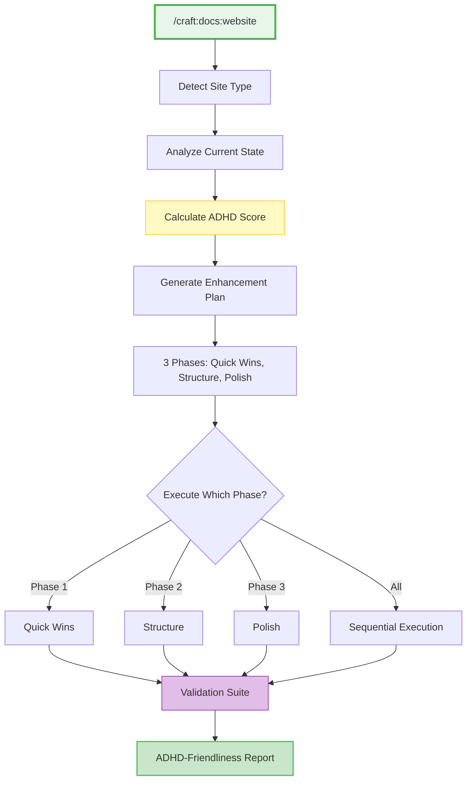

# SPEC: Craft Plugin Website Enhancement Commands

**Status:** draft
**Created:** 2025-12-31
**From Brainstorm:** BRAINSTORM-website-enhancements-2025-12-31.md (in project root)
**Priority:** HIGH - Foundation for aiterm docs enhancement

---

## Overview

Enhance the craft plugin (`~/projects/dev-tools/claude-plugins/craft/`) with comprehensive website optimization commands. These commands will be **tested on craft's own documentation first**, then applied to aiterm, establishing best practices for ADHD-friendly technical documentation.

**Strategic Approach:**
1. Build features in craft plugin
2. Test on craft's own documentation site
3. Validate with ADHD-friendly improvements
4. Apply proven patterns to aiterm documentation
5. Generalize for any MkDocs/technical docs site

---

## Primary User Story

**As a** craft plugin developer maintaining documentation,
**I want** automated website enhancement commands,
**So that** I can optimize documentation for ADHD users without manual effort.

### Acceptance Criteria

- [x] `/craft:docs:website` command exists
- [ ] Command detects website type (MkDocs, Quarto, etc.)
- [ ] Generates TL;DR boxes for all major pages
- [ ] Adds time estimates to tutorials
- [ ] Validates and fixes mermaid diagram syntax
- [ ] Creates ADHD Quick Start page
- [ ] Generates Visual Workflows page
- [ ] Flattens navigation hierarchy
- [ ] Adds visual callout boxes
- [ ] Creates mobile-responsive CSS
- [ ] Validates with `mkdocs build --strict`
- [ ] Measures ADHD-friendliness score

---

## Secondary User Stories

### Story 2: Plugin Documentation Self-Improvement

**As a** craft plugin maintainer,
**I want** craft to optimize its own documentation,
**So that** users can find and use craft commands easily.

**Acceptance:**
- Craft's README.md has TL;DR box
- All command `.md` files have time estimates
- Visual workflow diagrams show command relationships
- ADHD Quick Start for craft exists

### Story 3: Aiterm Documentation Enhancement

**As an** aiterm project maintainer,
**I want** to use craft to enhance aiterm's docs,
**So that** ADHD users can onboard quickly.

**Acceptance:**
- `/craft:docs:website` runs successfully on aiterm project
- Generates 5 mermaid workflow diagrams
- Adds TL;DR boxes to 40+ pages
- Flattens navigation (moves ADHD guide to top-level)
- Measurable improvement in time-to-first-success

### Story 4: Generalized Documentation Enhancement

**As a** developer with any MkDocs project,
**I want** craft to enhance my documentation,
**So that** all technical docs can be ADHD-friendly.

**Acceptance:**
- Works with any MkDocs Material site
- Detects existing structure automatically
- Generates appropriate enhancements
- Preserves existing content and customizations

---

## Technical Requirements

### Architecture



### API Design

#### New Command: `/craft:docs:website`

**Location:** `~/projects/dev-tools/claude-plugins/craft/commands/docs/website.md`

**Usage:**
```bash
/craft:docs:website                  # Full enhancement cycle (all 3 phases)
/craft:docs:website --analyze        # Analyze only, show ADHD score
/craft:docs:website --phase 1        # Quick wins only
/craft:docs:website --phase 2        # Structure improvements only
/craft:docs:website --phase 3        # Polish & mobile responsive
/craft:docs:website --dry-run        # Preview changes without writing
/craft:docs:website --validate       # Validate current state
```

**Output:**
```
┌─────────────────────────────────────────────────────────────┐
│ 📊 WEBSITE ENHANCEMENT PLAN                                 │
├─────────────────────────────────────────────────────────────┤
│                                                             │
│ Project: craft plugin                                       │
│ Site Type: MkDocs Material                                  │
│ Current ADHD Score: 62/100                                  │
│                                                             │
│ PHASE 1: QUICK WINS (< 2 hours)                             │
│   ✓ Fix 3 mermaid syntax errors                            │
│   ✓ Add TL;DR boxes to 8 major pages                       │
│   ✓ Add time estimates to 4 tutorials                      │
│   ✓ Create ADHD Quick Start page                           │
│   Impact: +15 points → 77/100                               │
│                                                             │
│ PHASE 2: STRUCTURE (< 4 hours)                              │
│   ✓ Create Visual Workflows page                           │
│   ✓ Flatten navigation (promote ADHD features)             │
│   ✓ Add visual callout boxes                               │
│   ✓ Homepage restructure (cards)                           │
│   Impact: +12 points → 89/100                               │
│                                                             │
│ PHASE 3: POLISH (< 8 hours)                                 │
│   ✓ Mobile responsive CSS                                  │
│   ✓ Interactive mermaid diagrams                           │
│   ✓ Progress indicators                                    │
│   ✓ Command playground                                     │
│   Impact: +8 points → 97/100                                │
│                                                             │
│ Proceed? (y/n/preview)                                      │
└─────────────────────────────────────────────────────────────┘
```

#### Enhanced Command: `/craft:docs:update`

**Changes:** Add `--website-mode` flag

```bash
/craft:docs:update --website-mode    # Include website optimizations
```

**Integration:**
- After generating docs, run website enhancement phase
- Add ADHD score to completion report
- Suggest `/craft:docs:website` if score < 70

#### Enhanced Command: `/craft:site:status`

**Changes:** Add ADHD-friendliness section

```bash
/craft:site:status                   # Shows ADHD score
```

**New Section:**
```
│ 🧠 ADHD-FRIENDLINESS                                        │
│   Overall Score: 62/100 ██████░░░░                          │
│                                                             │
│   Breakdown:                                                │
│   Visual Hierarchy:    ⚠️  55/100 (needs TL;DR boxes)       │
│   Time Estimates:      ❌  20/100 (missing on most pages)   │
│   Workflow Diagrams:   ⚠️  45/100 (3 errors, no workflows)  │
│   Mobile Responsive:   ✅  80/100 (good, minor fixes)       │
│   Content Density:     ⚠️  60/100 (some dense paragraphs)   │
│                                                             │
│   Recommendation: Run /craft:docs:website --phase 1         │
```

### Data Models

#### ADHD Scoring Algorithm

```python
class ADHDScore:
    def calculate(self, site_analysis: SiteAnalysis) -> int:
        """
        Calculate ADHD-friendliness score (0-100)

        Categories (each 0-100, weighted):
        - Visual Hierarchy (25%): TL;DR boxes, headings, emojis
        - Time Estimates (20%): Tutorials, guides have time
        - Workflow Diagrams (20%): Mermaid diagrams present, no errors
        - Mobile Responsive (15%): Overflow fixes, touch targets
        - Content Density (20%): Paragraph length, scanability
        """
        scores = {
            'visual_hierarchy': self._score_visual_hierarchy(site_analysis),
            'time_estimates': self._score_time_estimates(site_analysis),
            'workflow_diagrams': self._score_workflow_diagrams(site_analysis),
            'mobile_responsive': self._score_mobile_responsive(site_analysis),
            'content_density': self._score_content_density(site_analysis)
        }

        weights = {
            'visual_hierarchy': 0.25,
            'time_estimates': 0.20,
            'workflow_diagrams': 0.20,
            'mobile_responsive': 0.15,
            'content_density': 0.20
        }

        return sum(scores[k] * weights[k] for k in scores)
```

#### Site Analysis Data Structure

```python
@dataclass
class SiteAnalysis:
    site_type: str  # 'mkdocs', 'quarto', 'sphinx', etc.
    total_pages: int

    # Visual hierarchy
    pages_with_tldr: int
    pages_with_emojis: int
    heading_hierarchy_valid: bool

    # Time estimates
    tutorials_count: int
    tutorials_with_time: int

    # Diagrams
    mermaid_diagrams: int
    mermaid_errors: int
    workflow_diagrams_exist: bool

    # Mobile
    has_responsive_css: bool
    mermaid_overflow_fixed: bool
    touch_targets_adequate: bool

    # Content density
    dense_paragraphs: int  # > 5 sentences
    callout_boxes: int
    visual_breaks: int
```

### Dependencies

| Dependency | Version | Purpose |
|------------|---------|---------|
| **Python** | 3.10+ | Command execution |
| **Typer** | Latest | CLI framework (already in craft) |
| **Rich** | Latest | Terminal output (already in craft) |
| **Beautiful Soup** | 4.12+ | HTML/Markdown parsing |
| **PyYAML** | Latest | mkdocs.yml manipulation |
| **Jinja2** | Latest | Template rendering |

**New Dependencies:**
```bash
pip install beautifulsoup4 lxml
```

---

## UI/UX Specifications

### User Flow: Website Enhancement

```mermaid
sequenceDiagram
    participant User
    participant Craft as /craft:docs:website
    participant Analyzer
    participant Generator
    participant Validator

    User->>Craft: /craft:docs:website
    Craft->>Analyzer: Detect site type
    Analyzer-->>Craft: MkDocs Material detected

    Craft->>Analyzer: Analyze current state
    Analyzer->>Analyzer: Calculate ADHD score
    Analyzer-->>Craft: Score: 62/100

    Craft->>User: Show enhancement plan
    User->>Craft: Approve Phase 1

    Craft->>Generator: Generate Phase 1
    Generator->>Generator: Fix mermaid errors
    Generator->>Generator: Add TL;DR boxes
    Generator->>Generator: Add time estimates
    Generator->>Generator: Create ADHD quick start
    Generator-->>Craft: Phase 1 complete

    Craft->>Validator: Validate changes
    Validator->>Validator: Check mermaid syntax
    Validator->>Validator: Verify TL;DR format
    Validator->>Validator: Calculate new score
    Validator-->>Craft: New score: 77/100

    Craft->>User: ✅ Phase 1 complete (+15 points)
```

### Wireframes (ASCII)

#### ADHD Quick Start Page Template

```
┌─────────────────────────────────────────────────────────────┐
│ # ADHD Quick Start                                          │
│                                                             │
│ > Get started in **under 2 minutes**                        │
│                                                             │
│ ## ⏱️ First 30 Seconds                                      │
│                                                             │
│ ```bash                                                     │
│ [primary-command]    # [What it does]                       │
│ [second-command]     # [What it does]                       │
│ [third-command]      # [What it does]                       │
│ ```                                                         │
│                                                             │
│ ## ⏱️ Next 5 Minutes                                        │
│                                                             │
│ - **Learn:** [Tutorial link]                                │
│ - **Configure:** [Settings link]                            │
│ - **Status:** [Status command]                              │
│                                                             │
│ ## 🆘 Stuck?                                                │
│                                                             │
│ - **Diagnose:** `[diagnostic-command]`                      │
│ - **Help:** `[help-command]`                                │
│ - **Details:** `[info-command]`                             │
│                                                             │
└─────────────────────────────────────────────────────────────┘
```

#### TL;DR Box Template

```markdown
> **TL;DR** (30 seconds)
> - **What:** [One sentence description]
> - **Why:** [One benefit statement]
> - **How:** [One command or one link]
> - **Next:** [One next step]
```

#### Visual Callout Box Templates

```markdown
> 💡 **Pro Tip:** [Helpful insight for power users]

> ⚠️ **Warning:** [Important caution or gotcha]

> ✅ **Success:** [Positive outcome indicator]

> 🎯 **ADHD-Friendly:** [Specific ADHD optimization feature]

> ⏱️ **Time Saver:** [Shortcut or faster approach]

> 🔍 **Deep Dive:** [Link to detailed explanation]
```

### Accessibility Checklist

- [ ] **Color contrast:** WCAG AA compliant (4.5:1 minimum)
- [ ] **Alt text:** All images have descriptive alt text
- [ ] **Heading hierarchy:** No skipped levels (H1 → H2 → H3)
- [ ] **Link text:** Descriptive (not "click here")
- [ ] **Keyboard navigation:** Tab order logical
- [ ] **Screen reader:** ARIA labels on diagrams
- [ ] **Touch targets:** Minimum 44px × 44px
- [ ] **Focus indicators:** Visible on all interactive elements

---

## Open Questions

1. **Craft's own documentation:**
   - Where is craft's documentation currently?
   - Does craft have a website or just README.md?
   - Should we create craft's documentation site first?

2. **Mermaid error detection:**
   - Can we automate syntax validation before rendering?
   - Should we add pre-commit hook for mermaid validation?

3. **ADHD score thresholds:**
   - What score is "acceptable" (> 70, > 80, > 90)?
   - Should we fail CI if score drops below threshold?

4. **Mobile testing:**
   - Do we have access to real devices for testing?
   - Should we use BrowserStack or similar service?

5. **Command playground:**
   - Is WebAssembly acceptable for craft plugin?
   - Alternative: pre-recorded GIF demos?

---

## Review Checklist

### Code Quality

- [ ] Command follows craft plugin structure
- [ ] Uses existing craft utilities (not duplicating code)
- [ ] Error handling for all file operations
- [ ] Dry-run mode works correctly
- [ ] Output formatted with Rich (consistent with craft style)

### Testing

- [ ] Unit tests for ADHD scoring algorithm
- [ ] Integration tests for website detection
- [ ] Tests for TL;DR box generation
- [ ] Tests for mermaid syntax validation
- [ ] Tests on craft's own docs
- [ ] Tests on aiterm docs

### Documentation

- [ ] Command documented in craft/commands/docs/website.md
- [ ] Added to craft README.md
- [ ] Examples for each flag
- [ ] Screenshot of output
- [ ] Video demo (optional)

### User Experience

- [ ] Progress indicators during long operations
- [ ] Clear error messages if site not compatible
- [ ] Preview mode shows exactly what will change
- [ ] Confirmation before major changes
- [ ] Rollback mechanism if user unhappy

---

## Implementation Notes

### Phase 1: Craft Plugin Command Structure

**File:** `~/projects/dev-tools/claude-plugins/craft/commands/docs/website.md`

**Template:**
```markdown
# /craft:docs:website - ADHD-Friendly Website Enhancement

You are a website optimization expert specializing in ADHD-friendly documentation.

## Purpose

**One command to make any documentation site ADHD-friendly:**
1. Analyze current ADHD-friendliness score
2. Generate enhancement plan (3 phases)
3. Execute improvements automatically
4. Validate with strict checks
5. Report measurable improvements

## When Invoked

### Step 1: Detect Site Type

```bash
# Check for MkDocs
ls mkdocs.yml 2>/dev/null && echo "mkdocs"

# Check for Quarto
ls _quarto.yml 2>/dev/null && echo "quarto"

# Check for Sphinx
ls conf.py 2>/dev/null && echo "sphinx"
```

### Step 2: Analyze Current State

[ADHD scoring algorithm implementation]

### Step 3: Generate Enhancement Plan

[Phase 1, 2, 3 generation logic]

### Step 4: Execute Enhancements

[Implementation details for each enhancement]

### Step 5: Validate & Report

[Validation suite and reporting]
```

### Phase 2: Test on Craft's Own Docs

**Before running on aiterm, test on craft:**

1. Create craft documentation site (if doesn't exist)
2. Run `/craft:docs:website --analyze`
3. Review generated plan
4. Execute Phase 1 only
5. Validate improvements
6. Iterate based on results

### Phase 3: Apply to Aiterm

**Only after craft validation:**

1. Navigate to aiterm project
2. Run `/craft:docs:website --analyze`
3. Review plan (should match brainstorm)
4. Execute all 3 phases sequentially
5. Measure time-to-first-success improvement

---

## History

| Date | Version | Changes |
|------|---------|---------|
| 2025-12-31 | 0.1.0 | Initial spec from brainstorm |

---

## Related Specs

- N/A - This is the first spec for website enhancements

---

## Approval Status

- [ ] **Technical Review:** Pending
- [ ] **UX Review:** Pending
- [ ] **ADHD Expert Review:** Pending (if available)
- [ ] **Approved for Implementation:** Pending

---

**Next Steps:**

1. Create `/craft:docs:website` command file
2. Implement ADHD scoring algorithm
3. Test on craft's own documentation
4. Iterate based on results
5. Apply to aiterm documentation
6. Generalize for any MkDocs site

**Estimated Timeline:** 2 weeks (matching brainstorm phases)
