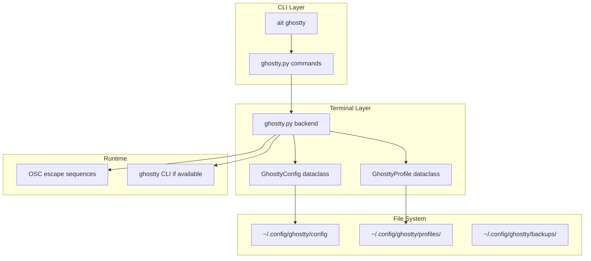
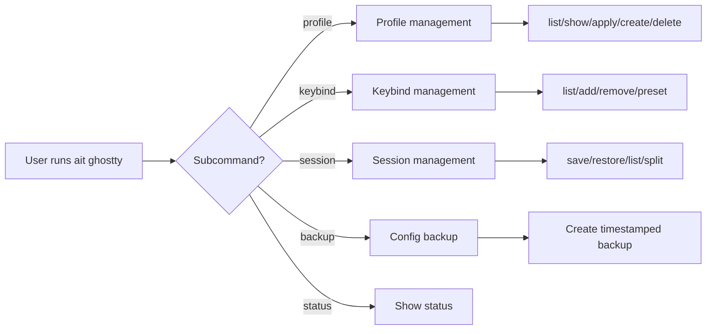

# Spec: Ghostty Terminal Enhancements

**Status:** draft
**Created:** 2025-12-30
**Updated:** 2025-12-30
**Author:** Claude (via /brainstorm d f s)
**From Brainstorm:** Deep feature brainstorm with 8 questions

---

## Overview

Enhance aiterm's Ghostty terminal support to achieve parity with iTerm2 integration. Focus on power users who need profile/context switching, keybind management, session control, and config backup. Target release: v0.4.0.

---

## User Stories

### Primary User Story

**As a** power user switching from iTerm2 to Ghostty
**I want** the same level of aiterm integration I had with iTerm2
**So that** I can use aiterm's context detection and profile switching seamlessly

#### Acceptance Criteria

- [ ] `ait ghostty profile list/apply/create` works like iTerm2 profile commands
- [ ] Context switching (`ait switch`) applies Ghostty-specific settings
- [ ] Keybind management via `ait ghostty keybind list/add/preset`
- [ ] Session control via `ait ghostty session save/restore/split`
- [ ] Config backup via `ait ghostty backup` (matches claude backup pattern)

### Secondary User Stories

**As a** developer with multiple projects
**I want** automatic profile switching based on directory context
**So that** production directories show distinct visual cues (red theme)

**As a** keyboard-centric user
**I want** to manage Ghostty keybinds from the CLI
**So that** I don't need to manually edit config files

**As a** user who experiments with settings
**I want** to backup and restore my Ghostty config
**So that** I can safely try new configurations

---

## Technical Requirements

### Architecture

The Ghostty integration follows aiterm's existing terminal abstraction pattern, extending the `TerminalBackend` interface with Ghostty-specific capabilities.



### API Design

| Command | Subcommand | Description |
|---------|------------|-------------|
| `ait ghostty profile` | `list` | List available profiles |
| `ait ghostty profile` | `show [name]` | Show profile details |
| `ait ghostty profile` | `apply <name>` | Apply a profile |
| `ait ghostty profile` | `create <name>` | Create profile from current |
| `ait ghostty profile` | `delete <name>` | Delete a profile |
| `ait ghostty keybind` | `list` | List current keybindings |
| `ait ghostty keybind` | `add <key> <action>` | Add a keybinding |
| `ait ghostty keybind` | `remove <key>` | Remove a keybinding |
| `ait ghostty keybind` | `preset <name>` | Apply keybind preset (vim/emacs) |
| `ait ghostty session` | `save <name>` | Save current session layout |
| `ait ghostty session` | `restore <name>` | Restore saved session |
| `ait ghostty session` | `list` | List saved sessions |
| `ait ghostty session` | `split <direction>` | Split current pane (h/v) |
| `ait ghostty` | `backup` | Backup config (timestamped) |
| `ait ghostty` | `restore [backup]` | Restore from backup |

### Data Models

```
Model: GhosttyProfile
Fields:
  - name: str (primary key, e.g., "Production", "Python-Dev")
  - theme: str (e.g., "catppuccin-mocha")
  - font_family: str (e.g., "JetBrains Mono")
  - font_size: int (e.g., 14)
  - background_opacity: float (0.0-1.0)
  - window_padding: tuple[int, int] (x, y)
  - cursor_style: str (block/bar/underline)
  - custom_settings: dict[str, str] (additional key-value pairs)
  - created_at: timestamp
  - updated_at: timestamp

Model: GhosttySession
Fields:
  - name: str (primary key)
  - layout: str (JSON representation of splits/tabs)
  - working_dirs: list[str] (paths for each pane)
  - created_at: timestamp

Model: GhosttyBackup
Fields:
  - filename: str (e.g., "ghostty-backup-2025-12-30-143022.config")
  - path: Path (full path to backup file)
  - created_at: timestamp
  - size_bytes: int
```

### Dependencies

- [ ] `typer` - CLI framework (already installed)
- [ ] `rich` - Terminal output (already installed)
- [ ] No new dependencies required - uses existing aiterm stack

---

## UI/UX Specifications

### User Flow



### Wireframes

```
┌─────────────────────────────────────────────────────────────┐
│ $ ait ghostty profile list                                  │
├─────────────────────────────────────────────────────────────┤
│                                                             │
│ ┌─────────────────────────────────────────────────────────┐ │
│ │ Ghostty Profiles                                        │ │
│ ├─────────────────────────────────────────────────────────┤ │
│ │ Name           Theme              Font           Active │ │
│ │ ─────────────────────────────────────────────────────── │ │
│ │ Default        (default)          Menlo 14pt        ○   │ │
│ │ Production     rose-pine          JetBrains 14pt    ●   │ │
│ │ Python-Dev     catppuccin-mocha   Fira Code 13pt    ○   │ │
│ │ R-Dev          nord               IBM Plex 14pt     ○   │ │
│ └─────────────────────────────────────────────────────────┘ │
│                                                             │
│ 4 profiles · Use 'ait ghostty profile apply <name>'         │
│                                                             │
└─────────────────────────────────────────────────────────────┘

┌─────────────────────────────────────────────────────────────┐
│ $ ait ghostty backup                                        │
├─────────────────────────────────────────────────────────────┤
│                                                             │
│ ✓ Backup created: ghostty-backup-2025-12-30-143022.config   │
│   Location: ~/.config/ghostty/backups/                      │
│   Size: 1.2 KB                                              │
│                                                             │
│ Existing backups: 3                                         │
│   └── ghostty-backup-2025-12-29-091511.config (1.1 KB)      │
│   └── ghostty-backup-2025-12-28-160234.config (1.0 KB)      │
│   └── ghostty-backup-2025-12-27-082145.config (0.9 KB)      │
│                                                             │
│ Restore with: ait ghostty restore <backup-name>             │
│                                                             │
└─────────────────────────────────────────────────────────────┘
```

### Accessibility Checklist

- [x] Keyboard navigation supported (CLI-native)
- [x] Screen reader compatible (text-based output)
- [x] Color contrast meets WCAG AA (Rich library handles this)
- [x] Focus indicators visible (N/A - CLI)
- [x] Touch targets >= 44x44px (N/A - CLI)
- [x] Error messages descriptive (Rich error formatting)

---

## Open Questions

- [ ] Does Ghostty support OSC escape sequences for runtime config changes?
- [ ] Should profiles be stored as separate files or in a single profiles.toml?
- [ ] What session layout format to use? (JSON vs TOML vs custom)
- [ ] Should keybind presets be bundled or fetched from a repository?

---

## Review Checklist

- [x] All acceptance criteria are testable
- [x] Technical requirements are complete and unambiguous
- [ ] Dependencies identified and available (no new deps needed)
- [ ] No blocking questions remain (4 open questions)
- [x] UI/UX flow validated
- [x] Security considerations addressed (file permissions for config)
- [ ] Performance requirements defined (should be instant for all commands)
- [ ] Stakeholder approval obtained

---

## Implementation Notes

**Hybrid Profile Approach:**
- Store profiles as named config snippets in `~/.config/ghostty/profiles/`
- When applying: merge profile settings into main config OR use Ghostty's native profile support if available
- Runtime overrides via OSC sequences where supported

**Backup Strategy (matching claude backup):**
- Timestamped copies: `ghostty-backup-YYYY-MM-DD-HHMMSS.config`
- Location: `~/.config/ghostty/backups/`
- Keep last 10 backups by default (configurable)
- `restore` command lists available backups if none specified

**Phased Implementation:**
1. Phase 1: Profile management (highest impact)
2. Phase 2: Backup/restore (safety net for users)
3. Phase 3: Keybind management
4. Phase 4: Session control (most complex)

---

## History

| Date | Change | Author |
|------|--------|--------|
| 2025-12-30 | Initial draft from deep brainstorm | Claude |
