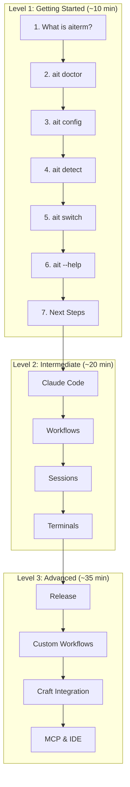

# SPEC: Interactive Tutorial System for aiterm

**Version:** 1.0  
**Status:** Draft  
**Created:** 2025-12-30  
**Author:** OpenCode  
**Target Release:** v0.6.0  

---

## Executive Summary

### Problem Statement

aiterm has grown significantly (611 tests, 43 modules, 35+ commands) with rich functionality across terminal management, Claude Code integration, release automation, and workflow orchestration. New users face a steep learning curve with no guided onboarding path. Current documentation (README, docs site) is comprehensive but passive - users must self-navigate without hands-on practice.

### Proposed Solution

Implement an **interactive tutorial system** (`ait learn`) that provides progressive, hands-on learning experiences. Following the proven pattern from Nexus CLI, this system will guide users through three skill levels with real commands, contextual hints, and pause/resume capability.

### Success Criteria

- **User Adoption**: 60%+ of new users complete Getting Started tutorial
- **Time to Productivity**: Reduce from ~2 hours (doc reading) to ~30 minutes (tutorial + practice)
- **Support Reduction**: 40% reduction in basic setup questions
- **Test Coverage**: 90%+ coverage for tutorial system code
- **Documentation**: Complete integration with existing MkDocs site

### Key Benefits

1. **For New Users**: Clear, guided learning path with immediate hands-on practice
2. **For Existing Users**: Discover advanced features through structured tutorials
3. **For Maintainers**: Reduced support burden, standardized onboarding
4. **For Teams**: Consistent training, faster team member ramp-up

---

## Architecture

### Technology Stack

**Existing Dependencies (No New Additions Required)**:
- `typer` - CLI framework (already used)
- `rich` - Terminal formatting (already used)
- `questionary` - Interactive prompts (already used)

**Python Version**: 3.10+ (matches current requirement)

### Module Structure

```
src/aiterm/
├── utils/
│   ├── __init__.py
│   └── tutorial.py          # NEW: Tutorial engine (600-700 lines)
│       ├── TutorialLevel    # Enum: getting-started, intermediate, advanced
│       ├── TutorialStep     # Dataclass: step definition
│       ├── Tutorial         # Base class: tutorial logic
│       ├── create_getting_started_tutorial()
│       ├── create_intermediate_tutorial()
│       ├── create_advanced_tutorial()
│       ├── get_tutorial(level)
│       └── list_tutorials()
│
└── cli/
    └── main.py              # MODIFIED: Add learn command (~50 new lines)

tests/
└── test_tutorial.py         # NEW: Tutorial system tests (40+ tests)
    ├── test_tutorial_structure
    ├── test_step_navigation
    ├── test_pause_resume
    ├── test_interactive_prompts
    └── test_tutorial_content

docs/
├── tutorials/
│   └── interactive-learning.md  # NEW: MkDocs integration
└── TUTORIAL_GUIDE.md             # NEW: Standalone reference (300+ lines)
```

### Core Components

#### 1. TutorialLevel (Enum)
```python
class TutorialLevel(str, Enum):
    GETTING_STARTED = "getting-started"
    INTERMEDIATE = "intermediate"
    ADVANCED = "advanced"
```

#### 2. TutorialStep (Dataclass)
```python
@dataclass
class TutorialStep:
    title: str                          # Step heading
    description: str                    # Detailed explanation
    command: str | None = None          # Command to demonstrate
    interactive: bool = False           # Require confirmation?
    validator: Callable[[], bool] | None = None  # Optional validation
    hint: str | None = None             # Additional context
```

#### 3. Tutorial (Base Class)
```python
class Tutorial:
    def __init__(self, name: str, level: TutorialLevel, description: str)
    def add_step(self, step: TutorialStep) -> None
    def show_intro(self) -> None
    def show_step(self, step_num: int) -> None
    def run(self) -> None
    def show_completion(self) -> None
```

#### 4. CLI Integration
```python
@app.command()
def learn(
    level: Annotated[str | None, typer.Argument(...)] = None,
    step: Annotated[int | None, typer.Option("--step", "-s")] = None,
) -> None:
    """Interactive tutorials for learning aiterm."""
```

### Design Patterns

**Pattern 1: Progressive Disclosure**
- Start simple (Getting Started: doctor, detect)
- Build complexity (Intermediate: workflows, terminals)
- Advanced techniques (Power User: release automation, custom workflows)

**Pattern 2: Hands-On Learning**
- Each step includes real commands
- Interactive prompts confirm understanding
- Contextual hints provide additional guidance

**Pattern 3: Flexible Pacing**
- Pause at any step
- Resume with `--step N`
- Skip tutorials (no forced flow)

**Pattern 4: Rich Feedback**
- Color-coded by level (green/yellow/red)
- Progress indicators (Step 3/7)
- Completion celebrations

---

## Visual Documentation

### Tutorial Flow Diagram

The tutorial system follows a progressive 3-level structure:



See also: [Full Tutorial Flow Diagram](../diagrams/tutorial-flow.md)

### Related Diagrams

| Diagram | Description |
|---------|-------------|
| [Context Detection](../diagrams/context-detection.md) | How project context is detected |
| [Session Lifecycle](../diagrams/session-lifecycle.md) | Claude Code session management |
| [Release Workflow](../diagrams/release-workflow.md) | Release automation pipeline |
| [Craft Integration](../diagrams/craft-integration.md) | Plugin architecture |
| [Git Worktrees](../diagrams/worktree-flow.md) | Parallel development workflow |

### GIF Demos

Each tutorial level includes animated demonstrations:

| Level | GIFs | Location |
|-------|------|----------|
| Getting Started | doctor, detect, switch | `docs/demos/tutorials/getting-started-*.gif` |
| Intermediate | claude, workflows, sessions | `docs/demos/tutorials/intermediate-*.gif` |
| Advanced | release, worktrees, craft | `docs/demos/tutorials/advanced-*.gif` |

---

## Tutorial Content Specification

### Level 1: Getting Started (7 steps, ~10 minutes)

**Target Audience**: First-time aiterm users, developers setting up AI-assisted workflow

**Learning Objectives**:
- Understand what aiterm does and why it's useful
- Verify installation and configuration
- Learn basic command structure
- Perform first context detection
- Understand relationship with Claude Code

**Steps**:

1. **Welcome to aiterm** (Intro)
   - Description: Overview of aiterm's purpose (terminal optimization for AI development)
   - Key concepts: Terminal management, Claude Code integration, context detection
   - No command (orientation only)

2. **Check Your Installation**
   - Command: `ait doctor`
   - Description: Verify aiterm can access terminals, detect tools
   - Interactive: Yes (confirm understanding of output)
   - Hint: "Green checkmarks = good. Red X's = optional features"

3. **Understand Your Configuration**
   - Command: `ait config show`
   - Description: View current settings (config paths, defaults)
   - Interactive: Yes
   - Hint: "Config is in ~/.config/aiterm/config.toml"

4. **Detect Project Context**
   - Command: `ait detect`
   - Description: See how aiterm identifies project types
   - Interactive: Yes
   - Hint: "Try this in different project directories to see various contexts"

5. **Apply Context to Terminal**
   - Command: `ait switch`
   - Description: Change terminal profile based on context
   - Interactive: Yes
   - Hint: "Only works in supported terminals (iTerm2, Ghostty, etc.)"

6. **Explore Command Structure**
   - Command: `ait --help`
   - Description: Understand command organization (domains: claude, terminals, workflows)
   - Interactive: No
   - Hint: "Commands are grouped by domain. Use `ait <domain> --help` for details"

7. **Next Steps**
   - Description: Summary + pointers to intermediate tutorial
   - Commands mentioned: `ait claude settings`, `ait workflows list`, `ait learn intermediate`
   - Interactive: No

**Duration**: 10-12 minutes  
**Prerequisites**: aiterm installed, basic terminal knowledge  
**Outcome**: User understands core concepts and can run basic commands

---

### Level 2: Intermediate - Domain Workflows (11 steps, ~20 minutes)

**Target Audience**: Users comfortable with basics, ready to explore specific features

**Learning Objectives**:
- Configure Claude Code integration (primary use case)
- Use workflow automation
- Manage sessions and feature branches
- Customize terminal-specific features

**Steps**:

1. **Claude Code Settings** (Primary integration)
   - Command: `ait claude settings`
   - Description: View current Claude Code configuration
   - Interactive: Yes
   - Hint: "Settings file is in ~/.claude/settings.json"

2. **Backup Your Settings**
   - Command: `ait claude backup`
   - Description: Create safety backup before changes
   - Interactive: Yes

3. **Auto-Approval Presets**
   - Command: `ait claude approvals presets`
   - Description: View pre-configured approval sets (safe, moderate, full)
   - Interactive: No

4. **Add Safe Approvals**
   - Command: `ait claude approvals add safe-reads`
   - Description: Enable safe file reading permissions
   - Interactive: Yes
   - Hint: "Start with safe-reads, add more as needed"

5. **Workflow Basics**
   - Command: `ait workflows list`
   - Description: See available workflow templates
   - Interactive: No

6. **Feature Branch Workflow**
   - Command: `ait feature status`
   - Description: Check current feature branch state
   - Interactive: Yes
   - Hint: "Useful for managing parallel development tasks"

7. **Session Management**
   - Command: `ait sessions list`
   - Description: Track active Claude Code sessions
   - Interactive: Yes

8. **Terminal Management Overview**
   - Description: aiterm supports 6 terminals with varying capabilities
   - Command: `ait terminals list`
   - Hint: "Feature support varies: iTerm2 has most, Terminal.app has least"

9. **Detect Your Terminal**
   - Command: `ait terminals detect`
   - Description: Identify current terminal emulator
   - Interactive: Yes

10. **Ghostty Quick Themes** (conditional on terminal)
    - Command: `ait ghostty themes list`
    - Description: Browse 14 built-in Ghostty themes
    - Interactive: No
    - Hint: "Only applicable if using Ghostty terminal"

11. **Status Bar Customization**
    - Command: `ait statusbar show`
    - Description: View current status bar configuration
    - Interactive: No

**Duration**: 20-25 minutes
**Prerequisites**: Completed Getting Started
**Outcome**: User can configure Claude Code, manage workflows, use terminal-specific features

---

### Level 3: Advanced - Power User Techniques (12 steps, ~30 minutes)

**Target Audience**: Experienced users ready for automation and release workflows

**Learning Objectives**:
- Master release automation (v0.5.0 features)
- Build custom workflows
- Integrate with craft system and MCP servers
- Advanced terminal and IDE configuration
- Troubleshooting and debugging

**Steps**:

1. **Release Automation Overview** (Intro)
   - Description: New v0.5.0 release commands streamline PyPI/Homebrew publishing
   - Command: `ait release --help`
   - Hint: "7 commands: check, status, pypi, homebrew, tag, notes, full"

2. **Pre-Release Validation**
   - Command: `ait release check`
   - Description: Validate version consistency, tests, changelog
   - Interactive: Yes
   - Hint: "Run this before every release to catch issues early"

3. **Release Status & Notes**
   - Command: `ait release status`
   - Description: See current version, pending commits, suggested next version
   - Interactive: Yes
   - Follow-up: `ait release notes` - Generate notes from commits

4. **Full Release Workflow**
   - Command: `ait release full --help`
   - Description: Complete workflow: check → tag → pypi → homebrew
   - Interactive: No
   - Hint: "Use --dry-run first: `ait release full 0.6.0 --dry-run`"

5. **Custom Workflow Creation**
   - Command: `ait workflows custom create my-workflow`
   - Description: Build personal automation workflows in YAML
   - Interactive: Yes
   - Hint: "Workflows stored in ~/.config/aiterm/workflows/"

6. **Workflow Chaining**
   - Command: `ait workflows run lint+test+build`
   - Description: Chain multiple workflows with + separator
   - Interactive: Yes
   - Hint: "Stops on first failure, great for pre-commit checks"

7. **Craft Integration Overview**
   - Command: `ait craft status`
   - Description: Check craft plugin installation and available commands
   - Interactive: No
   - Hint: "Craft extends aiterm with 68 commands, 17 skills, 7 agents"
   - Follow-up commands to mention:
     - `/craft:git:worktree` - Parallel development with git worktrees
     - `/craft:docs:mermaid` - Generate diagram templates
     - `/craft:orchestrate` - AI-assisted multi-agent workflows
     - `/craft:check release` - Pre-release audit

8. **Craft Git Worktrees**
   - Command: (Show example) `/craft:git:worktree setup`
   - Description: Work on multiple branches simultaneously without switching
   - Interactive: Yes
   - Hint: "Create worktrees for feature + hotfix at same time"
   - Key commands: `create <branch>`, `list`, `finish`, `clean`

9. **MCP Server Management**
   - Command: `ait mcp list`
   - Description: View configured MCP servers for Claude Code
   - Interactive: No
   - Follow-up: `ait mcp status` for health check

10. **IDE Integrations**
    - Command: `ait ide list`
    - Description: See supported IDEs (VS Code, Cursor, Zed, Positron)
    - Interactive: No
    - Hint: "Use `ait ide configure <ide>` to set up integration"

11. **Advanced Debugging**
    - Command: `ait info --json`
    - Description: Get detailed diagnostic information
    - Interactive: No
    - Hint: "Use --json for programmatic parsing"

12. **Custom Configurations**
    - Command: `ait config edit`
    - Description: Edit config.toml directly for advanced customization
    - Interactive: Yes
    - Hint: "See docs/reference/configuration.md for all options"

13. **Next Steps & Resources**
    - Description: Summary of power-user resources and community
    - Links: GitHub issues, documentation site, craft plugin docs
    - Hint: "Check `ait --help` periodically - new features added regularly!"

**Duration**: 35-40 minutes
**Prerequisites**: Completed Intermediate, familiarity with release processes helpful
**Outcome**: User can automate releases, create custom workflows, manage integrations

---

## Implementation Plan

### Phase 1: Core Engine (Week 1, 10-12 hours)

**Deliverables**:
- `src/aiterm/utils/tutorial.py` (600-700 lines)
  - TutorialLevel enum
  - TutorialStep dataclass
  - Tutorial base class
  - Helper functions (get_tutorial, list_tutorials)

**Tasks**:
1. Create tutorial.py module structure
2. Implement TutorialStep and TutorialLevel
3. Implement Tutorial base class with:
   - show_intro() - Rich panel with level-specific colors
   - show_step() - Display step with command/hint
   - run() - Interactive loop with pause/resume
   - show_completion() - Celebration message
4. Add helper functions
5. Unit tests for core components (15 tests)

**Validation**:
- [ ] Tutorial can be instantiated with steps
- [ ] Steps display correctly with Rich formatting
- [ ] Interactive prompts work (confirm, pause)
- [ ] Resume from arbitrary step works

---

### Phase 2: Tutorial Content (Week 1-2, 8-10 hours)

**Deliverables**:
- Getting Started tutorial implementation
- Intermediate tutorial implementation
- Advanced tutorial implementation

**Tasks**:
1. Create `create_getting_started_tutorial()`
   - 7 steps as specified above
   - Interactive prompts on steps 2-5
   - Hints for each command
2. Create `create_intermediate_tutorial()`
   - 11 steps as specified
   - Interactive prompts on key steps
3. Create `create_advanced_tutorial()`
   - 12 steps with release automation focus
   - Dry-run mode examples
4. Content validation tests (20 tests)

**Validation**:
- [ ] All 30 steps have clear descriptions
- [ ] Commands are accurate and tested
- [ ] Interactive prompts at appropriate steps
- [ ] Hints provide value without overwhelming

---

### Phase 3: CLI Integration (Week 2, 4-6 hours)

**Deliverables**:
- `ait learn` command in main.py
- Help text and examples
- Shell completion integration

**Tasks**:
1. Add `@app.command()` for learn in cli/main.py
2. Implement command logic:
   - No args → list tutorials
   - `ait learn <level>` → run tutorial
   - `ait learn <level> --step N` → resume
3. Add rich help text and examples
4. CLI integration tests (5 tests)

**Validation**:
- [ ] `ait learn` lists all tutorials
- [ ] `ait learn getting-started` runs tutorial
- [ ] `--step` flag works correctly
- [ ] Error handling for invalid levels

---

### Phase 4: Documentation (Week 2-3, 6-8 hours)

**Deliverables**:
- `docs/tutorials/interactive-learning.md` (MkDocs)
- `TUTORIAL_GUIDE.md` (standalone reference)
- Updated README.md
- Updated docs/REFCARD.md

**Tasks**:
1. Create MkDocs page:
   - Tutorial overview
   - Level descriptions
   - Usage examples
   - Screenshots/GIFs (optional)
2. Create standalone guide:
   - Quick reference
   - Step-by-step breakdown
   - Tips and tricks
   - Troubleshooting
3. Update README with tutorial section
4. Update REFCARD with learn commands
5. Update mkdocs.yml navigation

**Validation**:
- [ ] Documentation is clear and comprehensive
- [ ] Examples work as written
- [ ] Links to other docs are accurate
- [ ] MkDocs site builds without errors

---

### Phase 5: Testing & Polish (Week 3, 4-6 hours)

**Deliverables**:
- Comprehensive test suite (40+ tests)
- Edge case handling
- Error message improvements

**Tasks**:
1. Create tests/test_tutorial.py:
   - Tutorial structure tests (10 tests)
   - Step navigation tests (8 tests)
   - Pause/resume tests (6 tests)
   - Interactive prompt tests (8 tests)
   - Content validation tests (8 tests)
2. Edge case handling:
   - Invalid level names
   - Out-of-range step numbers
   - Interrupt handling (Ctrl+C)
3. Error message polish
4. Performance testing (tutorial should start <100ms)

**Validation**:
- [ ] 90%+ code coverage for tutorial.py
- [ ] All edge cases handled gracefully
- [ ] Error messages are helpful
- [ ] Performance meets targets

---

### Phase 6: User Testing & Iteration (Week 3-4, 4-6 hours)

**Deliverables**:
- User feedback summary
- Iteration on content/UX
- Final polish

**Tasks**:
1. Internal dogfooding:
   - Run all tutorials fresh
   - Note confusion points
   - Time each tutorial
2. External user testing (3-5 users):
   - Provide tutorial to new users
   - Observe completion rates
   - Collect feedback
3. Iterate based on feedback:
   - Clarify confusing steps
   - Add hints where needed
   - Adjust pacing
4. Final review and polish

**Validation**:
- [ ] 80%+ completion rate in user testing
- [ ] Average time within estimates
- [ ] Positive user feedback
- [ ] No critical usability issues

---

## Testing Strategy

### Unit Tests (25 tests)

**Tutorial Engine (`test_tutorial.py`)**:
- Tutorial instantiation and configuration
- Step addition and retrieval
- Intro/completion displays
- Step navigation (next, previous, jump)
- Pause/resume logic
- Interactive prompt simulation
- Helper function behavior

### Integration Tests (10 tests)

**CLI Integration (`test_cli.py` additions)**:
- `ait learn` command execution
- Tutorial listing
- Level selection
- Step resumption
- Error handling

### Content Validation Tests (10 tests)

**Tutorial Content (`test_tutorial_content.py`)**:
- All steps have required fields
- Commands are valid and tested
- Step count matches specification
- No duplicate step titles
- Hints are present where specified

### Manual Testing Checklist

- [ ] Run each tutorial from start to finish
- [ ] Test pause/resume at each step
- [ ] Verify all commands execute correctly
- [ ] Check Rich formatting on different terminals
- [ ] Test with Python 3.10, 3.11, 3.12
- [ ] Verify on macOS and Linux
- [ ] Test with different terminal emulators

### Coverage Target

- **Tutorial engine**: 95%+ coverage
- **CLI integration**: 90%+ coverage
- **Overall project**: Maintain 85%+ (current: 85%)

---

## Documentation Plan

### User-Facing Documentation

**1. MkDocs Integration** (`docs/tutorials/interactive-learning.md`):
```markdown
# Interactive Learning System

## Quick Start
## Tutorial Levels
## Usage Guide
## FAQ
## Troubleshooting
```

**2. Standalone Guide** (`TUTORIAL_GUIDE.md`):
```markdown
# aiterm Tutorial System

## Overview
## Getting Started Tutorial (7 steps breakdown)
## Intermediate Tutorial (11 steps breakdown)
## Advanced Tutorial (12 steps breakdown)
## Tips and Tricks
## Common Issues
```

**3. README Updates**:
- Add "🎓 Learn Interactively" section
- Quick commands for tutorials
- Link to tutorial guide

**4. Quick Reference Card** (`docs/REFCARD.md`):
```
INTERACTIVE LEARNING
────────────────────
ait learn                   List all tutorials
ait learn getting-started   Basic tutorial (7 steps)
ait learn intermediate      Domain workflows (11 steps)
ait learn advanced          Power user (12 steps)
ait learn <level> --step N  Resume from step N
```

### Developer Documentation

**1. Architecture Doc** (`docs/development/architecture.md` update):
- Add tutorial system section
- Explain design patterns
- Document extension points

**2. Contributing Guide** (`docs/development/contributing.md` update):
- How to add tutorial steps
- Content guidelines
- Testing requirements

### Documentation Structure

```
docs/
├── tutorials/
│   └── interactive-learning.md      # NEW: Main tutorial docs
├── getting-started/
│   └── quickstart.md                # UPDATE: Link to tutorials
├── reference/
│   └── commands.md                  # UPDATE: Add learn command
└── development/
    ├── architecture.md              # UPDATE: Tutorial system
    └── contributing.md              # UPDATE: Tutorial guidelines

TUTORIAL_GUIDE.md                    # NEW: Standalone reference
README.md                            # UPDATE: Tutorial section
docs/REFCARD.md                      # UPDATE: Learn commands
```

---

## Success Metrics

### Quantitative Metrics

**User Adoption**:
- Tutorial completion rate: Target 60%+
- Getting Started completion: Target 80%+
- Intermediate completion: Target 50%+
- Advanced completion: Target 30%+

**Time Metrics**:
- Time to first successful command: <5 minutes
- Time to complete Getting Started: 10-15 minutes
- Time to productive use: <30 minutes (vs. 2 hours currently)

**Quality Metrics**:
- Test coverage: 90%+ for tutorial code
- Documentation completeness: 100% (all tutorials documented)
- Zero critical bugs in tutorial system

**Support Metrics**:
- Reduction in basic setup questions: 40%+
- Tutorial-related issues: <5 per month
- User satisfaction: 4.5/5 or higher

### Qualitative Metrics

**User Feedback**:
- "Tutorials are clear and easy to follow"
- "Hands-on practice helped me learn faster"
- "I discovered features I didn't know existed"

**Developer Experience**:
- Tutorial content is easy to update
- Adding new steps is straightforward
- Tests catch content errors

---

## Timeline & Effort Estimates

### Timeline (3-4 weeks)

| Phase | Duration | Effort | Dependencies |
|-------|----------|--------|--------------|
| 1. Core Engine | Week 1 (Days 1-4) | 10-12 hours | None |
| 2. Tutorial Content | Week 1-2 (Days 4-8) | 8-10 hours | Phase 1 complete |
| 3. CLI Integration | Week 2 (Days 8-10) | 4-6 hours | Phase 1, 2 complete |
| 4. Documentation | Week 2-3 (Days 10-14) | 6-8 hours | Phase 3 complete |
| 5. Testing & Polish | Week 3 (Days 14-16) | 4-6 hours | Phase 4 complete |
| 6. User Testing | Week 3-4 (Days 16-20) | 4-6 hours | Phase 5 complete |

**Total Effort**: 36-48 hours over 3-4 weeks

### Milestones

- **Week 1 End**: Core engine + content complete, basic testing done
- **Week 2 End**: CLI integration + documentation complete
- **Week 3 End**: Testing complete, ready for user testing
- **Week 4 End**: User feedback incorporated, ready for release

### Release Strategy

**Target**: v0.6.0 (after v0.5.0 docs update)

**Release Checklist**:
- [ ] All 40+ tests passing
- [ ] Documentation complete and reviewed
- [ ] User testing completed with 80%+ satisfaction
- [ ] CHANGELOG.md updated
- [ ] Tutorial system mentioned in release notes
- [ ] MkDocs site deployed with tutorial pages

---

## Risks & Mitigations

### Technical Risks

**Risk 1: Terminal Compatibility Issues**
- *Description*: Interactive prompts may not work in all terminals
- *Impact*: Medium (affects user experience)
- *Mitigation*: Test on all 6 supported terminals, provide fallback text mode
- *Contingency*: Add `--no-interactive` flag for CI/automated environments

**Risk 2: Content Becomes Outdated**
- *Description*: As aiterm evolves, tutorial commands may break
- *Impact*: High (broken tutorials frustrate users)
- *Mitigation*: Add automated tests that run tutorial commands
- *Contingency*: Version tutorials, maintain archive of historical tutorials

**Risk 3: Performance Degradation**
- *Description*: Rich formatting may slow tutorial start time
- *Impact*: Low (minor annoyance)
- *Mitigation*: Profile and optimize, lazy-load Rich components
- *Contingency*: Add `--fast` mode with minimal formatting

### User Experience Risks

**Risk 4: Tutorial Too Long**
- *Description*: Users abandon tutorial before completion
- *Impact*: Medium (defeats onboarding purpose)
- *Mitigation*: Keep Getting Started to 7 steps, add pause/resume
- *Contingency*: Create "Quick Start" 3-step mini-tutorial

**Risk 5: Commands Fail for User**
- *Description*: Tutorial commands error due to user environment
- *Impact*: High (frustrating experience)
- *Mitigation*: Add pre-flight checks, clear error messages with solutions
- *Contingency*: Provide "skip this step" option with explanation

**Risk 6: Information Overload**
- *Description*: Too much information in descriptions/hints
- *Impact*: Medium (overwhelming for beginners)
- *Mitigation*: Keep descriptions concise, put details in hints
- *Contingency*: Add `--verbose` flag for extended explanations

### Maintenance Risks

**Risk 7: Difficult to Update Content**
- *Description*: Changing tutorial content requires code changes
- *Impact*: Low (slows iteration)
- *Mitigation*: Consider YAML-based content in future iteration
- *Contingency*: Document content update process clearly

### Edge Cases & Error Handling

Implementation must handle these edge cases gracefully:

**1. Command Failures During Tutorial**
```python
# When a tutorial command fails (e.g., ait doctor shows errors)
- Show the actual error output
- Explain what went wrong in user-friendly terms
- Offer options: "Retry", "Skip this step", "Exit tutorial"
- Log failure for debugging if user reports issue
```

**2. Terminal-Specific Steps**
```python
# For Ghostty-only steps when user has iTerm2
def should_show_step(step):
    if step.terminal_requirement:
        current = detect_terminal()
        if current != step.terminal_requirement:
            return False, f"Skipping (requires {step.terminal_requirement})"
    return True, None
```

**3. Missing Dependencies**
```python
# When required tools are missing (e.g., gh CLI for release commands)
- Pre-flight check at tutorial start
- Clear message: "This tutorial requires: gh (GitHub CLI)"
- Provide installation instructions
- Option to continue anyway (some steps will be skipped)
```

**4. Network-Dependent Steps**
```python
# For steps that need network (PyPI verification, etc.)
- Timeout after 10 seconds
- Show "Network check timed out - skipping online verification"
- Continue with tutorial, mark step as "skipped (offline)"
```

**5. Invalid User Input**
```python
# For step navigation and responses
- Invalid step number → Show valid range, re-prompt
- Empty response at confirmation → Treat as "continue"
- Ctrl+C → Graceful exit with "Tutorial paused at step N"
```

**6. State Recovery**
```python
# For resume functionality
- Save progress to ~/.config/aiterm/tutorial_state.json
- On crash/interrupt: "Resume from step 5? [Y/n]"
- Stale state (>7 days): "Previous progress is old. Start fresh? [Y/n]"
```

---

## Future Enhancements

### v0.7.0+ Potential Features

**1. Completion Tracking**
- Persist tutorial progress to config
- Show completion badges
- Resume from last step automatically

**2. Domain-Specific Tutorials**
- Terminal-specific deep dives (iTerm2, Ghostty)
- Workflow-focused tutorials (release process, dev workflow)
- Integration tutorials (Claude Code, Craft)

**3. Quiz Mode**
- Knowledge verification after each level
- Multiple choice questions
- Certificate generation on passing

**4. Video Companions**
- Screen recordings of each tutorial
- Embedded in MkDocs site
- YouTube playlist

**5. Multi-Language Support**
- Translate tutorials to other languages
- Language selection in `ait learn --lang es`

**6. Custom Tutorials**
- User-created tutorial templates
- Share tutorials via YAML files
- Community tutorial repository

**7. Analytics**
- Track completion rates
- Identify problematic steps
- A/B test content improvements

**8. AI-Powered Help**
- Detect when user is stuck
- Suggest relevant tutorials
- Generate custom tutorials based on usage

---

## Appendices

### Appendix A: Tutorial Content Examples

**Sample Step from Getting Started**:

```python
TutorialStep(
    title="Check Your Installation",
    description=(
        "Let's verify that aiterm can access your tools and data.\n"
        "The 'doctor' command checks for terminals, shells, and integrations.\n\n"
        "Look for:\n"
        "  ✅ Green checkmarks = working\n"
        "  ❌ Red X's = optional features"
    ),
    command="ait doctor",
    interactive=True,
    hint="Don't worry if some checks fail - many features are optional!",
)
```

**Sample Output**:

```
╭─────────────────── Step 2/7 ───────────────────╮
│ Check Your Installation                        │
│                                                │
│ Let's verify that aiterm can access your      │
│ tools and data. The 'doctor' command checks   │
│ for terminals, shells, and integrations.      │
│                                                │
│ Look for:                                      │
│   ✅ Green checkmarks = working                │
│   ❌ Red X's = optional features               │
╰────────────────────────────────────────────────╯

Command to try:
  ait doctor

💡 Hint: Don't worry if some checks fail - many features are optional!

Have you tried this command? [Y/n]:
```

### Appendix B: Error Messages

**Invalid Level**:
```
Error: Unknown tutorial level: 'beginer'

Available levels:
  • getting-started
  • intermediate
  • advanced

Example: ait learn getting-started
```

**Out of Range Step**:
```
Error: Step 15 is out of range for this tutorial

The 'getting-started' tutorial has 7 steps.

Try: ait learn getting-started --step 1
```

**Tutorial Interrupted**:
```
Tutorial paused at step 4/7

Resume with: ait learn getting-started --step 5
Or restart from beginning: ait learn getting-started
```

### Appendix C: Testing Pseudocode

**Test Tutorial Structure**:
```python
def test_tutorial_has_required_fields():
    tutorial = create_getting_started_tutorial()
    assert tutorial.name
    assert tutorial.level == TutorialLevel.GETTING_STARTED
    assert tutorial.description
    assert len(tutorial.steps) == 7

def test_all_steps_have_titles():
    tutorial = create_getting_started_tutorial()
    for step in tutorial.steps:
        assert step.title
        assert step.description

def test_interactive_steps_have_commands():
    tutorial = create_getting_started_tutorial()
    for step in tutorial.steps:
        if step.interactive:
            assert step.command is not None
```

### Appendix D: Implementation Code Skeleton

```python
# src/aiterm/utils/tutorial.py

"""Interactive tutorial system for aiterm."""

import time
from dataclasses import dataclass
from enum import Enum
from typing import Callable

from rich.console import Console
from rich.panel import Panel
from rich.prompt import Confirm, Prompt
from rich.table import Table

console = Console()

class TutorialLevel(str, Enum):
    """Tutorial difficulty levels."""
    GETTING_STARTED = "getting-started"
    INTERMEDIATE = "intermediate"
    ADVANCED = "advanced"

@dataclass
class TutorialStep:
    """A single tutorial step."""
    title: str
    description: str
    command: str | None = None
    interactive: bool = False
    validator: Callable[[], bool] | None = None
    hint: str | None = None

class Tutorial:
    """Base tutorial class."""
    
    def __init__(self, name: str, level: TutorialLevel, description: str):
        self.name = name
        self.level = level
        self.description = description
        self.steps: list[TutorialStep] = []
        self.current_step = 0
    
    def add_step(self, step: TutorialStep) -> None:
        """Add a step to the tutorial."""
        self.steps.append(step)
    
    def show_intro(self) -> None:
        """Show tutorial introduction."""
        # Implementation details...
        pass
    
    def show_step(self, step_num: int) -> None:
        """Display a tutorial step."""
        # Implementation details...
        pass
    
    def run(self) -> None:
        """Run the interactive tutorial."""
        # Implementation details...
        pass
    
    def show_completion(self) -> None:
        """Show completion message."""
        # Implementation details...
        pass

def create_getting_started_tutorial() -> Tutorial:
    """Create Getting Started tutorial."""
    tutorial = Tutorial(
        name="Getting Started with aiterm",
        level=TutorialLevel.GETTING_STARTED,
        description="Learn the basics of terminal optimization for AI development",
    )
    # Add 7 steps...
    return tutorial

def create_intermediate_tutorial() -> Tutorial:
    """Create Intermediate tutorial."""
    # Implementation...
    pass

def create_advanced_tutorial() -> Tutorial:
    """Create Advanced tutorial."""
    # Implementation...
    pass

def get_tutorial(level: TutorialLevel) -> Tutorial:
    """Get tutorial by level."""
    tutorials = {
        TutorialLevel.GETTING_STARTED: create_getting_started_tutorial,
        TutorialLevel.INTERMEDIATE: create_intermediate_tutorial,
        TutorialLevel.ADVANCED: create_advanced_tutorial,
    }
    return tutorials[level]()

def list_tutorials() -> None:
    """List all available tutorials."""
    # Display table of tutorials with Rich
    pass
```

---

## References

### Inspiration & Prior Art

1. **Nexus CLI Tutorial System** (proven implementation)
   - Location: `/Users/dt/projects/dev-tools/nexus-cli/nexus/utils/tutorial.py`
   - 638 lines, 3 levels, 30 total steps
   - Successful pattern to replicate

2. **Poetry Tutorial** (`poetry help`)
   - Interactive setup wizard
   - Contextual help

3. **Rustlings** (Rust learning tool)
   - Progressive exercises
   - Automated validation

4. **VIM Tutor** (`vimtutor`)
   - Classic interactive tutorial
   - Learn by doing

### Related Documentation

- **aiterm README**: Current quickstart (passive)
- **aiterm docs/**: Comprehensive reference docs
- **Nexus TUTORIAL_GUIDE.md**: Template for aiterm guide
- **aiterm V0.5.0-PLAN.md**: Release automation context

### External Resources

- [Rich Documentation](https://rich.readthedocs.io/): Terminal formatting
- [Typer Documentation](https://typer.tiangolo.com/): CLI framework
- [Questionary Documentation](https://questionary.readthedocs.io/): Interactive prompts

---

## Approval & Sign-Off

**Specification Author**: OpenCode  
**Review Required**: DT (Project Owner)  
**Target Approval Date**: 2025-12-30  
**Implementation Start**: Upon approval  

**Reviewer Comments**:
_[To be filled during review]_

**Approved**: ☐ Yes  ☐ No  ☐ Needs Revision  
**Signature**: _________________  
**Date**: _________________  

---

**End of Specification Document**

*Version 1.0 - Draft for Review*
