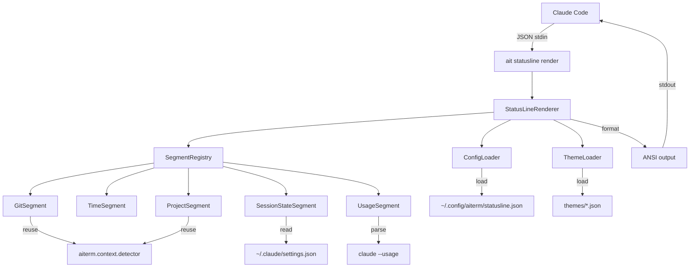
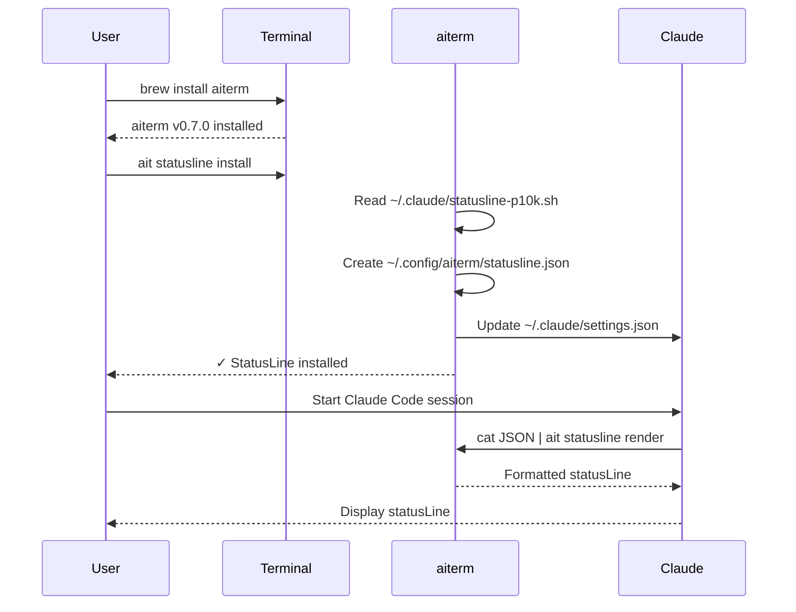

# SPEC: StatusLine Integration into aiterm

**Status:** draft
**Created:** 2025-12-31
**From Brainstorm:** `/Users/dt/BRAINSTORM-statusline-aiterm-integration-2025-12-31.md`
**Priority:** 🔥 HIGHEST - Flagship feature for aiterm v0.7.0

---

## Overview

Integrate Claude Code statusLine customization into aiterm as a core feature, replacing the standalone bash script (`~/.claude/statusline-p10k.sh`) with a Python-based CLI tool that leverages aiterm's existing infrastructure for project detection, terminal integration, and configuration management.

**Scope:** Full integration over 8 weeks (6 phases)

**Out of scope:** Backwards incompatible changes to aiterm core

---

## Primary User Story

**As a** Claude Code user with a Max plan
**I want** my statusLine to show productivity-focused information (usage limits, git context, session state, project health) configured via CLI
**So that** I can optimize my workflow without cost/token anxiety and without manually editing bash scripts

**Acceptance Criteria:**
1. `ait statusline render` produces visually identical output to current bash version
2. `ait statusline config set KEY VALUE` allows configuration without bash editing
3. Session/weekly usage displays with reset timers
4. All 57 existing bash test scenarios pass with Python implementation
5. Performance: < 100ms execution time (Claude Code calls every 300ms)

---

## Secondary User Stories

### Story 2: Developer Maintenance
**As an** aiterm maintainer
**I want** statusLine logic in Python with pytest tests
**So that** I can easily add features and catch regressions

**Acceptance:** 150+ pytest tests, CI/CD integration

### Story 3: Theme Customization
**As a** user who values aesthetics
**I want** to switch themes via CLI command
**So that** I can match my terminal color scheme

**Acceptance:** 3 built-in themes, `ait statusline theme set THEME` works

### Story 4: Usage Awareness
**As a** Max plan user
**I want** to see when my session/weekly limits reset
**So that** I can plan my work sessions effectively

**Acceptance:** Usage display shows reset timers, color-coded by threshold

---

## Architecture

### System Design

```
┌─────────────────────────────────────────────────────────────┐
│  Claude Code                                                │
│  ~/.claude/settings.json:                                   │
│    statusLine.command = "ait statusline render"            │
└───────────────────────────┬─────────────────────────────────┘
                            │ JSON via stdin
                            ↓
┌─────────────────────────────────────────────────────────────┐
│  aiterm CLI (Python)                                        │
│  ├── src/aiterm/cli/statusline.py                          │
│  │    └── render_command() → StatusLineRenderer            │
│  └── src/aiterm/statusline/                                │
│       ├── renderer.py (main)                                │
│       ├── segments.py (git, time, project, session, usage) │
│       ├── config.py (StatusLineConfig)                      │
│       ├── themes.py (theme loading)                         │
│       └── usage.py (UsageTracker)                           │
└───────────────────────────┬─────────────────────────────────┘
                            │ Formatted output to stdout
                            ↓
┌─────────────────────────────────────────────────────────────┐
│  Terminal (iTerm2/Ghostty/etc)                              │
│  Displays:                                                  │
│  ╭─ ░▒▓ 📁 aiterm  main* ▓▒░                                │
│  ╰─ Sonnet 4.5 │ 📊S:45/100(2h) │ 10:30 │ ⏱ 5m              │
└─────────────────────────────────────────────────────────────┘
```

### Component Diagram



### Data Flow

**Input (JSON via stdin):**
```json
{
  "workspace": {"current_dir": "/path", "project_dir": "/path"},
  "model": {"display_name": "Sonnet 4.5", "id": "claude-sonnet-4-5"},
  "output_style": {"name": "learning"},
  "session_id": "abc123",
  "cost": {"total_lines_added": 123, "total_lines_removed": 45},
  "version": "1.0.80"
}
```

**Processing:**
1. Parse JSON from stdin
2. Load config from `~/.config/aiterm/statusline.json`
3. Load theme from `src/aiterm/statusline/themes/{theme}.json`
4. Execute enabled segments (git, time, project, session, usage)
5. Format output with ANSI color codes
6. Write to stdout

**Output (ANSI-formatted string):**
```
╭─ \033[48;5;54;38;5;250m ░▒▓ 📁 aiterm  main* ▓▒░\033[0m
╰─ Sonnet 4.5 │ 📊S:45/100(2h) │ 10:30 │ ⏱ 5m
```

---

## API Design

### CLI Commands

| Command | Purpose | Example |
|---------|---------|---------|
| `ait statusline render` | Render statusLine (called by Claude Code) | `echo '{}' \| ait statusline render` |
| `ait statusline install` | Setup Claude Code integration | `ait statusline install` |
| `ait statusline config` | Show current config | `ait statusline config` |
| `ait statusline config get KEY` | Get config value | `ait statusline config get display.show_git` |
| `ait statusline config set KEY VAL` | Set config value | `ait statusline config set display.show_git false` |
| `ait statusline config reset` | Reset to defaults | `ait statusline config reset` |
| `ait statusline theme list` | List available themes | `ait statusline theme list` |
| `ait statusline theme set THEME` | Switch theme | `ait statusline theme set cool-blues` |
| `ait statusline theme show` | Show current theme colors | `ait statusline theme show` |
| `ait statusline usage` | Show detailed usage stats | `ait statusline usage` |
| `ait statusline test` | Test with mock data | `ait statusline test` |
| `ait statusline doctor` | Validate setup | `ait statusline doctor` |

### Python API

**StatusLineRenderer** (main class):
```python
class StatusLineRenderer:
    def __init__(self, config: StatusLineConfig, theme: Theme):
        self.config = config
        self.theme = theme
        self.segments = self._register_segments()

    def render(self, data: dict) -> str:
        """Render statusLine from JSON data"""
        line1 = self._render_line1(data)
        line2 = self._render_line2(data)
        return f"{line1}  {line2}\n"

    def _render_line1(self, data: dict) -> str:
        """Render: ╭─ [directory] [git]"""
        segments = []
        if self.config.get('display.show_directory'):
            segments.append(self.segments['directory'].render(data))
        if self.config.get('display.show_git'):
            segments.append(self.segments['git'].render(data))
        return self._join_segments(segments)

    def _render_line2(self, data: dict) -> str:
        """Render: ╰─ [model] [usage] [time] [duration] [lines]"""
        segments = []
        segments.append(self.segments['model'].render(data))
        if self.config.get('display.show_session_usage'):
            segments.append(self.segments['usage'].render(data))
        if self.config.get('display.show_current_time'):
            segments.append(self.segments['time'].render(data))
        # ... more segments
        return self._join_segments(segments, separator=" │ ")
```

**Segment Interface:**
```python
class Segment(ABC):
    @abstractmethod
    def render(self, data: dict) -> str:
        """Render this segment"""
        pass

class GitSegment(Segment):
    def render(self, data: dict) -> str:
        cwd = data['workspace']['current_dir']
        git_info = self._get_git_info(cwd)
        return self._format_git(git_info)
```

**UsageTracker:**
```python
class UsageTracker:
    def get_usage(self) -> dict:
        """Get session + weekly usage from Claude Code"""
        # Option 1: Parse `claude --usage` output
        # Option 2: Read from internal files
        # Returns: {"session": {...}, "weekly": {...}}

    def format_compact(self, usage: dict) -> str:
        """Format: 📊S:45/100(2h) W:234/500(3d)"""
        # Color-code based on percentage
```

---

## Data Models

### Config Schema (`~/.config/aiterm/statusline.json`)

```json
{
  "$schema": "https://json-schema.org/draft-07/schema#",
  "type": "object",
  "properties": {
    "enabled": {"type": "boolean", "default": true},
    "theme": {"type": "string", "default": "purple-charcoal"},
    "display": {
      "type": "object",
      "properties": {
        "directory_mode": {"enum": ["smart", "basename", "full"], "default": "smart"},
        "show_git": {"type": "boolean", "default": true},
        "show_thinking_indicator": {"type": "boolean", "default": true},
        "show_output_style": {"enum": ["auto", "always", "never"], "default": "auto"},
        "show_session_duration": {"type": "boolean", "default": true},
        "show_current_time": {"type": "boolean", "default": true},
        "show_lines_changed": {"type": "boolean", "default": true},
        "show_r_version": {"type": "boolean", "default": true},
        "show_session_usage": {"type": "boolean", "default": true},
        "show_weekly_usage": {"type": "boolean", "default": true},
        "show_background_agents": {"type": "boolean", "default": false},
        "show_mcp_status": {"type": "boolean", "default": false}
      }
    },
    "usage": {
      "type": "object",
      "properties": {
        "show_reset_timer": {"type": "boolean", "default": true},
        "warning_threshold": {"type": "number", "default": 80, "minimum": 0, "maximum": 100},
        "compact_format": {"type": "boolean", "default": true}
      }
    },
    "git": {
      "type": "object",
      "properties": {
        "show_ahead_behind": {"type": "boolean", "default": true},
        "show_untracked_count": {"type": "boolean", "default": true},
        "show_stash_count": {"type": "boolean", "default": false},
        "show_remote_status": {"type": "boolean", "default": false},
        "truncate_branch_length": {"type": "number", "default": 32}
      }
    }
  }
}
```

### Theme Schema

```json
{
  "name": "purple-charcoal",
  "colors": {
    "directory": {
      "bg": "48;5;54",
      "fg": "38;5;250",
      "anchor": "38;5;255;1"
    },
    "git_clean": {
      "bg": "48;5;236",
      "fg": "38;5;250"
    },
    "git_dirty": {
      "bg": "48;5;60",
      "fg": "38;5;250"
    },
    "model_sonnet": "38;5;147",
    "model_opus": "38;5;177",
    "model_haiku": "38;5;183"
  }
}
```

---

## Dependencies

### New Dependencies
| Package | Version | Purpose |
|---------|---------|---------|
| `rich` | ≥13.0.0 | Already used by aiterm (CLI formatting) |
| `pydantic` | ≥2.0.0 | Config validation (optional, use if needed) |

### Existing aiterm Dependencies (Reused)
- `typer` - CLI framework
- `pytest` - Testing
- `subprocess` - Git commands
- `pathlib` - File operations
- `json` - Config/theme loading

---

## UI/UX Specifications

### User Flow: First-Time Setup



### Wireframes (ASCII)

**Line 1 (Directory + Git):**
```
╭─ ░▒▓ 📁 aiterm  main* ⇣2 ⇡1 ?3 ▓▒░
   │   │  │       │    │  │  │  │
   │   │  │       │    │  │  │  └─ Visual separator
   │   │  │       │    │  │  └──── Untracked files count
   │   │  │       │    │  └─────── Commits ahead
   │   │  │       │    └────────── Commits behind
   │   │  │       └─────────────── Dirty indicator
   │   │  └─────────────────────── Project name
   │   └────────────────────────── Project icon
   └────────────────────────────── Powerline edge
```

**Line 2 (Model + Metadata):**
```
╰─ Sonnet 4.5 │ 📊S:45/100(2h) │ 10:30 │ ⏱ 5m │ +123/-45
   │           │  │              │       │      │
   │           │  │              │       │      └─ Lines changed
   │           │  │              │       └──────── Session duration
   │           │  │              └──────────────── Current time
   │           │  └─────────────────────────────── Usage tracking
   └──────────────────────────────────────────────Session state indicators (thinking, style, agents)
```

### Accessibility Checklist

- [x] Color-blind friendly color schemes (all 3 themes)
- [x] Text-only mode available (disable icons via config)
- [x] Screen reader compatible (pure text output)
- [x] Keyboard navigation (all CLI commands)
- [x] High contrast mode (forest-greens theme)
- [x] Respects terminal color settings

---

## Open Questions

| # | Question | Options | Decision | Rationale |
|---|----------|---------|----------|-----------|
| 1 | Usage data source? | A) Parse `claude --usage`<br>B) Read internal files<br>C) Wait for JSON field | **A** | Simple, works now, monitor for C |
| 2 | Agent detection method? | A) Parse transcript<br>B) Process tree<br>C) Tracking file | **C** | Most reliable, can implement now |
| 3 | R package health depth? | A) File checks only<br>B) Run devtools::test()<br>C) Check last R CMD check | **A** | Fast, good enough for statusLine |
| 4 | Cache strategy? | A) No caching<br>B) 5-min cache<br>C) Event-based invalidation | **B** | Balance freshness vs performance |

---

## Review Checklist

**Before implementation:**
- [ ] User approves architecture (Option A: Full Integration)
- [ ] User approves 8-week timeline
- [ ] User approves Phase 0 as starting point (usage tracking)
- [ ] CI/CD pipeline supports Python testing
- [ ] Homebrew formula can be updated for v0.7.0

**Before Phase 0 complete:**
- [ ] Visual parity with bash version (screenshot comparison)
- [ ] Performance: < 100ms execution time
- [ ] All 57 bash test scenarios pass
- [ ] Migration script tested with 5+ users
- [ ] Documentation reviewed

**Before v0.7.0 release:**
- [ ] All 6 phases complete
- [ ] 150+ pytest tests passing
- [ ] MkDocs site updated
- [ ] Release notes written
- [ ] Homebrew formula PR submitted

---

## Implementation Notes

### Phase 0: Critical Path (2 weeks)

**Day 1-2: Module Structure**
```bash
src/aiterm/statusline/
├── __init__.py           # Module exports
├── renderer.py           # StatusLineRenderer class
├── segments.py           # All segment classes
├── config.py             # StatusLineConfig
├── themes.py             # Theme loading
└── themes/
    ├── purple-charcoal.json
    ├── cool-blues.json
    └── forest-greens.json
```

**Day 3-5: Port Core Logic**
- Git segment (subprocess calls to git)
- Project detection (reuse `aiterm.context.detector`)
- Time tracking (session duration, current time)
- Theme system (ANSI color code formatting)

**Day 6-7: CLI Commands**
```python
# src/aiterm/cli/statusline.py
import typer
from aiterm.statusline.renderer import StatusLineRenderer

app = typer.Typer(name="statusline")

@app.command()
def render():
    """Render statusLine from JSON stdin"""
    import sys
    data = json.load(sys.stdin)
    renderer = StatusLineRenderer.from_config()
    print(renderer.render(data), end='')

@app.command()
def install():
    """Setup Claude Code integration"""
    # Update ~/.claude/settings.json
    # Create ~/.config/aiterm/statusline.json
    # Create bash wrapper
```

**Day 8-9: Testing**
- Unit tests for each segment
- Integration test with mock JSON
- Visual diff with bash version

**Day 10: Migration**
- `ait statusline install` script
- Documentation
- User acceptance testing

### Phase 1: Usage Tracking (1 week)

**UsageTracker implementation:**
```python
import subprocess
import re

class UsageTracker:
    def get_usage(self) -> dict:
        """Parse claude --usage output"""
        try:
            result = subprocess.run(
                ['claude', '--usage'],
                capture_output=True,
                text=True,
                timeout=5
            )
            return self._parse_output(result.stdout)
        except Exception as e:
            return {}  # Graceful degradation

    def _parse_output(self, output: str) -> dict:
        """Parse output format:
        Session: 45/100 messages (resets in 2h 15m)
        Weekly: 234/500 messages (resets in 3d 4h)
        """
        session_match = re.search(r'Session: (\d+)/(\d+).*resets in (.+)', output)
        weekly_match = re.search(r'Weekly: (\d+)/(\d+).*resets in (.+)', output)

        return {
            'session': {
                'current': int(session_match.group(1)),
                'limit': int(session_match.group(2)),
                'reset_time': session_match.group(3)
            } if session_match else None,
            'weekly': {
                'current': int(weekly_match.group(1)),
                'limit': int(weekly_match.group(2)),
                'reset_time': weekly_match.group(3)
            } if weekly_match else None
        }
```

---

## History

| Date | Version | Changes |
|------|---------|---------|
| 2025-12-31 | v1.0 (draft) | Initial spec created from brainstorm |

---

**Approval Required:**
- [ ] User review and approval
- [ ] Technical lead review
- [ ] Architecture review

**Once approved, proceed to:**
- Implementation (Phase 0: Module structure)
- Testing (parallel with implementation)
- Documentation (as features complete)
