# SPEC: StatusLine Redesign - Minimal with Worktree Context

**Status:** Done
**Created:** 2026-01-01
**Completed:** 2026-01-01
**Implementation:** All features implemented, tested, and documented
**Status:** ✅ Implemented in v0.7.0

---

## Overview

Redesign aiterm's statusLine to minimize visual clutter while adding adaptive Powerlevel10k-style worktree display on the right side. Remove time-tracking bloat (session duration, clock, lines changed, cost data) and focus on essential context (model, project, git branch). Worktree information displays adaptively with different layouts for main branch vs worktree branches.

**Goals:**
- Reduce metrics from 8 to 3 essential (model, project, git)
- Add right-side P10k segment for worktree context
- Implement adaptive layout (main vs worktree)
- Maintain ADHD-friendly visual clarity

---

## Primary User Story

**As a** developer working with git worktrees in Claude Code,
**I want** a clean statusLine that highlights worktree context on the right side,
**So that** I can instantly see which worktree I'm in without visual clutter from unnecessary metrics.

**Acceptance Criteria:**
- Session duration, current time, lines changed, battery %, and cost data removed from default display
- Worktree name appears on right side when in a worktree (Powerlevel10k reversed segments: `░▒▓ (wt) name ▓▒░`)
- Main branch shows minimal statusLine (no right side) or optionally worktree count
- Smart branch truncation preserves both start and end of long names (e.g., `feature/...auth-system`)
- All existing statusLine tests pass + 15 new tests for right-side rendering

---

## Secondary User Stories

### Story 2: Config-Based Declutter

**As a** developer overwhelmed by metrics,
**I want** a one-command way to switch to minimal statusLine,
**So that** I can quickly clean up my workspace without manual config edits.

**Implementation:** `ait statusline preset minimal` command

---

### Story 3: Adaptive Worktree Layout

**As a** developer with multiple worktrees,
**I want** different statusLine layouts for main vs worktree contexts,
**So that** I get maximum context when in a worktree and minimal noise when in main.

**Implementation:** Right-side segments only populate when in worktree (or show count in main)

---

## Technical Requirements

### Architecture

#### Current Architecture (Left-Only)
```
StatusLineRenderer
  ├─ _render_project()  → ░▒▓ 📁 aiterm (wt) main ▓▒░
  ├─ _render_git()       → (included in project)
  └─ _render_model()     → Sonnet 4.5

Output: [project segment] [model segment]
```

#### New Architecture (Left + Right)
```
StatusLineRenderer
  ├─ Left Segments
  │   ├─ _render_project()  → ░▒▓ 📁 aiterm feature-auth ▓▒░
  │   ├─ _render_git()       → (included in project)
  │   └─ _render_model()     → Sonnet 4.5
  ├─ Right Segments (NEW)
  │   └─ _render_worktree()  → ░▒▓ (wt) feature-auth ▓▒░
  └─ Padding Calculator
      └─ terminal_width - left_width - right_width

Output: [left segments] [padding] [right segments]
```

#### Component Interaction


---

### API Design

#### New Methods

| Method | Signature | Purpose |
|--------|-----------|---------|
| `_render_right()` | `() -> str` | Render right-aligned segments with P10k style |
| `_build_right_segments()` | `(cwd: str) -> list[dict]` | Build worktree context segments |
| `_calculate_padding()` | `(left: str, right: str) -> int` | Calculate spacing for alignment |
| `_strip_ansi_length()` | `(text: str) -> int` | Get visible character count (strip ANSI) |
| `_get_worktree_name()` | `(cwd: str) -> Optional[str]` | Extract worktree name from git metadata |
| `_truncate_branch()` | `(branch: str, max_len: int) -> str` | Smart truncation (keep start/end) |

#### Modified Methods

| Method | Change |
|--------|--------|
| `render()` | Add right-side rendering logic + padding |
| `_render_project()` | Remove left-side `(wt)` marker (moved to right) |

---

### Data Models

#### Segment Structure
```python
Segment = {
    'content': str,    # Text to display
    'bg': str,         # Background color code (ANSI)
    'fg': str          # Foreground color code (ANSI)
}
```

#### Worktree Segment (Right-Side)
```python
{
    'content': '(wt) feature-auth',
    'bg': '235',  # Dark gray
    'fg': '245'   # Light gray
}
```

#### Main Branch Segment (Right-Side, Optional)
```python
{
    'content': '🌳 3 worktrees',
    'bg': '235',
    'fg': '245'
}
```

---

### Dependencies

**Existing:**
- `subprocess` (for git commands)
- `re` (for ANSI code stripping)
- `pathlib` (for worktree path parsing)

**New (Optional):**
- `shutil.get_terminal_size()` (for responsive width detection)

**No new external dependencies required.**

---

## UI/UX Specifications

### User Flow: Main Branch Workflow

```mermaid
flowchart LR
    Start[cd aiterm] --> Detect{Check git context}
    Detect -->|Main branch| Minimal[Show minimal statusLine]
    Detect -->|Worktree| Adaptive[Show worktree on right]

    Minimal --> Display1["╭─ ░▒▓ 📁 aiterm  main ▓▒░\n╰─ Sonnet 4.5"]

    Adaptive --> Display2["╭─ ░▒▓ 📁 aiterm  feature-auth ▓▒░    ░▒▓ (wt) feature-auth ▓▒░\n╰─ Sonnet 4.5"]

    Display1 --> Clean[Clean, minimal]
    Display2 --> Context[Worktree context prominent]
```



### Wireframes (ASCII)

#### Main Branch (Minimal)
```
Terminal Width: 120 chars
┌────────────────────────────────────────────────────────────────────────────────────────────────────────────────────┐
│ ╭─ ░▒▓ 📁 aiterm  main ▓▒░                                                                                         │
│ ╰─ Sonnet 4.5                                                                                                      │
└────────────────────────────────────────────────────────────────────────────────────────────────────────────────────┘
```

**Character breakdown:**
- Project segment: `░▒▓ 📁 aiterm  main ▓▒░` (28 chars visible)
- Model segment: `Sonnet 4.5` (10 chars)
- Total: ~40 chars (no right side)

---

#### Worktree (Adaptive)
```
Terminal Width: 120 chars
┌────────────────────────────────────────────────────────────────────────────────────────────────────────────────────┐
│ ╭─ ░▒▓ 📁 aiterm  feature-auth ▓▒░                                      ░▒▓ (wt) feature-auth ▓▒░                 │
│ ╰─ Sonnet 4.5                                                                                                      │
└────────────────────────────────────────────────────────────────────────────────────────────────────────────────────┘
```

**Character breakdown:**
- Left segment: `░▒▓ 📁 aiterm  feature-auth ▓▒░` (~38 chars)
- Right segment: `░▒▓ (wt) feature-auth ▓▒░` (~28 chars)
- Padding: 120 - 38 - 28 = 54 chars
- Total: ~120 chars (full width utilization)

---

#### Narrow Terminal (< 100 cols) - Future Enhancement
```
Terminal Width: 80 chars
┌──────────────────────────────────────────────────────────────────────────────┐
│ ╭─ ░▒▓ 📁 aiterm  feature-auth ▓▒░                                           │
│ │  ░▒▓ (wt) feature-auth ▓▒░                                                 │
│ ╰─ Sonnet 4.5                                                                │
└──────────────────────────────────────────────────────────────────────────────┘
```

**Fallback:** Vertical stacking (not implemented in Phase 1-2)

---

### Accessibility Checklist

- [x] **Color Contrast:** P10k segments use high-contrast colors (245/235 = 4.5:1 ratio)
- [x] **Screen Readers:** All text is plain ASCII (no icon-only information)
- [x] **Keyboard Navigation:** N/A (statusLine is display-only)
- [x] **Font Size Independence:** Uses terminal font settings
- [x] **ANSI Code Compatibility:** Falls back to plaintext if terminal doesn't support colors
- [ ] **Custom Color Themes:** Future - allow user-defined colors (Phase 3)

**Note:** Current implementation relies on default terminal color support. No custom accessibility mode needed (terminal handles this).

---

## Open Questions

### Q1: Terminal Width Detection Reliability
**Question:** How reliably can we detect terminal width in all environments (SSH, tmux, screen)?

**Options:**
- **A:** Use `shutil.get_terminal_size()` with fallback to 120
- **B:** Read `$COLUMNS` env var (may be stale)
- **C:** Run `tput cols` command (subprocess overhead)
- **D:** Hardcode 120 (safest, least flexible)

**Recommended:** Option A (shutil with fallback)

**Impact:** If detection fails, right-side segments may misalign or get truncated.

---

### Q2: ANSI Code Stripping Regex
**Question:** Does the current regex handle all ANSI escape sequences (colors, cursor movement, etc.)?

**Current regex:** `\x1B(?:[@-Z\\-_]|\[[0-?]*[ -/]*[@-~])`

**Risk:** If regex misses some codes, padding calculation will be incorrect → misalignment.

**Mitigation:** Add comprehensive test suite with various ANSI codes.

---

### Q3: Right-Side Content Priority
**Question:** When terminal is narrow, what should we prioritize: worktree name or count?

**Options:**
- **A:** Always show worktree name (truncate if needed)
- **B:** Show count in main, name in worktree
- **C:** Hide right side entirely if < 100 cols

**Recommended:** Option A (worktree context most critical)

---

### Q4: Config Migration Strategy
**Question:** Should `preset minimal` modify user config permanently or just for current session?

**Options:**
- **A:** Permanent (write to `~/.config/aiterm/statusline.json`)
- **B:** Session-only (env var override)
- **C:** Ask user on first run

**Recommended:** Option A with backup (write `.json.bak` first)

---

## Review Checklist

### Functional Requirements
- [ ] Session duration, current time, lines changed removed from default
- [ ] Right-side worktree display renders with P10k style
- [ ] Adaptive layout (main vs worktree) working
- [ ] Smart branch truncation preserves context
- [ ] `ait statusline preset minimal` command functional
- [ ] Terminal width detection with fallback
- [ ] ANSI code stripping accurate

### Code Quality
- [ ] All new methods have docstrings
- [ ] Type hints on all public methods
- [ ] Error handling for subprocess calls (git commands)
- [ ] No hardcoded values (use config where appropriate)
- [ ] Follow existing code style (Black formatter)

### Testing
- [ ] Unit tests for `_get_worktree_name()` (main vs worktree)
- [ ] Unit tests for `_truncate_branch()` (edge cases)
- [ ] Unit tests for `_strip_ansi_length()` (various ANSI codes)
- [ ] Integration test for right-side rendering
- [ ] Visual test in actual worktree
- [ ] Test in narrow terminal (< 100 cols)
- [ ] All existing tests pass (no regressions)

### Documentation
- [x] Updated documentation with new layout
- [ ] Add examples of main vs worktree display
- [ ] Document new config options (if any)
- [ ] Update README.md with minimal statusLine example
- [ ] Add migration guide (bloated → minimal)

### Performance
- [ ] No noticeable lag (300ms render interval)
- [ ] Git subprocess calls cached or optimized
- [ ] ANSI regex compiled once (not per render)

---

## Implementation Notes

### Phase 1: Config Cleanup (30 min)

**Files to modify:**
1. **CLI:** `src/aiterm/cli/statusline.py` - Added `preset` command
2. **Segments:** `src/aiterm/statusline/segments.py` - Added `_truncate_branch()`
3. **Segments:** `src/aiterm/statusline/segments.py` - Added `_get_worktree_name()`

**Tests to add:**
- `tests/test_statusline_config.py::test_preset_minimal`
- `tests/test_statusline_segments.py::test_truncate_branch`
- `tests/test_statusline_segments.py::test_get_worktree_name`

---

### Phase 2: Right-Side Rendering (1-2 hours)

**Files to modify:**
1. **Renderer:** Modified `StatusLineRenderer`
2. **Renderer:** Added `_render_right()` method
3. **Renderer:** Added `_strip_ansi_length()` method
4. **Renderer:** Added `_build_right_segments()` method
5. **Project:** Modified project segment (removed `(wt)` marker)

**Tests to add:**
- `tests/test_statusline_render.py::test_render_right`
- `tests/test_statusline_render.py::test_padding_calculation`
- `tests/test_statusline_render.py::test_ansi_strip`
- `tests/test_statusline_worktree.py::test_build_right_segments_main`
- `tests/test_statusline_worktree.py::test_build_right_segments_worktree`

**Integration tests:**
- `tests/integration/test_statusline_worktree_display.py`

---

### Code Examples

#### Example 1: Smart Branch Truncation
```python
# src/aiterm/statusline/segments.py:550
def _truncate_branch(self, branch: str, max_len: int) -> str:
    """Truncate branch name while preserving start and end.

    Args:
        branch: Branch name to truncate
        max_len: Maximum length

    Returns:
        Truncated branch name with "..." in middle

    Examples:
        >>> _truncate_branch('feature/authentication-system-oauth2', 32)
        'feature/...stem-oauth2'
    """
    if len(branch) <= max_len:
        return branch

    # Keep first 10 chars + "..." + last (max_len - 13) chars
    keep_start = 10
    keep_end = max_len - keep_start - 3

    if keep_end < 5:
        # If max_len too small, just use ellipsis
        return branch[:max_len-3] + "..."

    return f"{branch[:keep_start]}...{branch[-keep_end:]}"
```

---

#### Example 2: Right-Side Rendering
```python
# src/aiterm/statusline/segments.py:200
def _render_right(self) -> str:
    """Render right-aligned segments with reversed Powerlevel10k style.

    Returns:
        Right-side content with P10k arrows (or empty string)

    Example:
        "░▒▓ (wt) feature-auth ▓▒░"
    """
    if not self.right_segments:
        return ""

    # Reversed powerline: ░▒▓ content ▓▒░
    parts = []
    for segment in self.right_segments:
        content = segment['content']
        bg = segment.get('bg', '235')
        fg = segment.get('fg', '245')

        # Build ANSI-colored segment
        parts.append(
            f"\033[48;5;{bg}m\033[38;5;{fg}m"  # Set colors
            f"░▒▓ {content} ▓▒░"                 # Content with arrows
            f"\033[0m"                           # Reset
        )

    return " ".join(parts)
```

---

#### Example 3: Padding Calculation
```python
# src/aiterm/statusline/segments.py:60
def render(self) -> str:
    """Render complete statusLine with left + right segments.

    Returns:
        Formatted statusLine with proper alignment
    """
    left = self._render_left()
    right = self._render_right()

    if not right:
        return left  # No right side = existing behavior

    # Calculate padding for right alignment
    try:
        terminal_width = shutil.get_terminal_size((120, 24)).columns
    except (OSError, ValueError):
        terminal_width = 120  # Fallback

    left_width = self._strip_ansi_length(left)
    right_width = self._strip_ansi_length(right)
    padding = terminal_width - left_width - right_width

    if padding > 0:
        return f"{left}{' ' * padding}{right}"
    else:
        # Not enough room - fallback to left-only
        return left
```

---

## History

**2026-01-01:** Initial spec created from brainstorm session
- Primary user story: Minimal statusLine with worktree context
- Technical architecture: Left + right segment rendering
- Implementation phases: 2 phases (config cleanup + right-side rendering)
- Open questions: 4 (terminal width, ANSI stripping, content priority, config migration)

---

## Related Documents

- **User Guide:** [Minimal StatusLine Guide](../guides/statusline-minimal.md)
- **Configuration:** `src/aiterm/statusline/config.py` - Configuration schema
- **Rendering:** `src/aiterm/statusline/segments.py` - Segment rendering

---

**Status:** ✅ Implemented | **Version:** v0.7.0
