# SPEC: StatusLine Left/Right Spacing Enhancement

**Status:** Draft
**Created:** 2026-01-02
**Status:** ✅ Implemented in v0.7.1
**Priority:** High (ADHD-friendly visual clarity)

---

## Overview

Enhance aiterm's statusLine to provide dynamic, visually comfortable spacing between left and right Powerlevel10k segments. Current fixed-fill padding creates variable gaps that can feel cramped or disconnected. This spec defines a percentage-based gap system with visual separators, configurable presets, and graceful degradation for narrow terminals.

**Goals:**
- Dynamic gap sizing (20% of terminal width default)
- Visual separator (subtle … in center)
- Three configurable presets (minimal/standard/spacious)
- Practical alignment tolerance (±2 chars)
- Narrow terminal strategy (reduce gap, keep both sides)

---

## Primary User Story

**As an** ADHD user working with Claude Code statusLine,
**I want** visually comfortable spacing between left and right segments,
**So that** I can quickly distinguish worktree context without visual clutter or confusion.

**Acceptance Criteria:**
- Gap size scales with terminal width (feels comfortable at 80, 120, 160+ cols)
- Subtle visual separator (…) helps eye track between segments
- Three quick presets available (minimal/standard/spacious)
- Narrow terminals (< 90 cols) reduce gap but show both sides when possible
- Right-side alignment within ±2 chars (practical rendering)
- Config schema includes spacing.mode, spacing.min_gap, spacing.max_gap, spacing.show_separator
- `ait statusline spacing <preset>` command works
- All statusLine tests pass + 14 new spacing tests

---

## Secondary User Stories

### Story 2: Terminal Power User Customization

**As a** terminal power user,
**I want** to configure exact gap sizes and separator styles,
**So that** I can match my personal aesthetic preferences.

**Implementation:**
- Config schema with min/max gap bounds
- Separator toggle (show_separator)
- Preset system for quick switching

---

### Story 3: Developer Testing Edge Cases

**As a** developer working on statusLine,
**I want** a debug tool to visualize spacing calculations,
**So that** I can troubleshoot alignment issues quickly.

**Implementation:**
- `ait statusline debug-spacing` command (future)
- Shows terminal width, segment widths, gap calculation, actual rendering

---

## Technical Requirements

### Architecture

#### Current Architecture (Fixed Fill)
```
StatusLineRenderer._align_line:
  1. Get terminal width
  2. Calculate: padding = terminal_width - left_width - right_width
  3. Return: left + (' ' * padding) + right

Issue: padding varies wildly (0-60 chars depending on content)
```

#### New Architecture (Dynamic Gap)
```
StatusLineRenderer._align_line:
  1. Get terminal width
  2. Strip ANSI from left/right
  3. Calculate gap = _calculate_gap(terminal_width, left_width, right_width)
     ├─ Load spacing preset (minimal/standard/spacious)
     ├─ Calculate: gap = terminal_width * preset.base_percent
     ├─ Clamp: max(min_gap, min(gap, max_gap))
     └─ Check fit: available >= gap ? gap : reduce_or_hide
  4. Render gap = _render_gap(gap)
     ├─ Check if separator enabled
     ├─ Calculate center position
     └─ Return: whitespace + separator + whitespace
  5. Return: left + gap + right
```

#### Component Diagram


---

### API Design

#### New Methods

| Method | Signature | Purpose | Returns |
|--------|-----------|---------|---------|
| `_calculate_gap()` | `(terminal_width: int, left_width: int, right_width: int) -> int` | Calculate optimal gap size | Gap in chars, or -1 to hide right |
| `_render_gap()` | `(gap_size: int) -> str` | Render gap with optional separator | Gap string (whitespace + ANSI separator) |
| `_get_terminal_width()` | `() -> int` | Get terminal width with caching | Width in columns |
| `_handle_narrow_terminal()` | `(terminal_width, left_width, right_width, desired_gap)` | Narrow terminal reduction strategy | (gap, left_width, right_width) tuple |

#### Modified Methods

| Method | Change | Reason |
|--------|--------|--------|
| `_align_line()` | Replace fixed padding with `_calculate_gap()` + `_render_gap()` | Dynamic spacing |
| `_strip_ansi_length()` | Add fallback estimate (70% of raw length) | Handle malformed ANSI |

#### New CLI Command

```python
@app.command("spacing")
def statusline_spacing(preset: str):
    """Set spacing preset (minimal/standard/spacious)."""
```

---

### Data Models

#### Config Schema Additions

```python
'spacing.mode': {
    'type': 'str',
    'default': 'standard',
    'choices': ['minimal', 'standard', 'spacious'],
    'description': 'Gap size between left and right segments',
    'category': 'display'
},

'spacing.min_gap': {
    'type': 'int',
    'default': 10,
    'description': 'Minimum gap in chars (narrow terminal fallback)',
    'category': 'display'
},

'spacing.max_gap': {
    'type': 'int',
    'default': 40,
    'description': 'Maximum gap in chars (wide terminal cap)',
    'category': 'display'
},

'spacing.show_separator': {
    'type': 'bool',
    'default': True,
    'description': 'Show subtle separator (…) in gap center',
    'category': 'display'
}
```

#### SPACING_PRESETS Constant

```python
SPACING_PRESETS = {
    'minimal': {
        'base_percent': 0.15,  # 15% of terminal width
        'min_gap': 5,
        'max_gap': 20
    },
    'standard': {
        'base_percent': 0.20,  # 20% of terminal width (default)
        'min_gap': 10,
        'max_gap': 40
    },
    'spacious': {
        'base_percent': 0.30,  # 30% of terminal width
        'min_gap': 15,
        'max_gap': 60
    }
}
```

---

### Dependencies

**Existing (No New Dependencies):**
- `shutil.get_terminal_size()` - Terminal width detection
- `re` - ANSI escape code stripping
- Python 3.10+ standard library

**No external packages required.**

---

## UI/UX Specifications

### User Flow: Spacing Adjustment

```mermaid
flowchart LR
    Start[User notices<br/>cramped spacing] --> Check{How to adjust?}

    Check -->|Quick| Preset["ait statusline<br/>spacing spacious"]
    Check -->|Manual| Config["ait statusline config<br/>set spacing.min_gap 15"]

    Preset --> Restart[Restart<br/>Claude Code]
    Config --> Restart

    Restart --> Verify{Spacing<br/>comfortable?}

    Verify -->|Yes| Done[✓ Complete]
    Verify -->|No| Adjust[Try different<br/>preset]

    Adjust --> Preset
```



### Visual Layouts

#### Standard Preset (20%) - Recommended

**120 col terminal:**
```
╭─ ░▒▓ 📁 aiterm  main ▓▒░                … ░▒▓ (wt) feature-auth ▓▒░
╰─ Sonnet 4.5
```

**Measurements:**
- Left segment: 28 chars
- Right segment: 30 chars
- Gap: 24 chars (20% of 120)
- Separator: … at position 12

**80 col terminal:**
```
╭─ ░▒▓ 📁 aiterm  main ▓▒░     … ░▒▓ (wt) feature-auth ▓▒░
╰─ Sonnet 4.5
```

**Measurements:**
- Gap reduced to: 16 chars (20% of 80)
- Min gap: 10 chars (still above minimum)
- Both sides visible

---

#### Minimal Preset (15%)

**120 col terminal:**
```
╭─ ░▒▓ 📁 aiterm  main ▓▒░            … ░▒▓ (wt) feature-auth ▓▒░
╰─ Sonnet 4.5
```

**Gap:** 18 chars (15% of 120)
**Use case:** Maximize content space

---

#### Spacious Preset (30%)

**120 col terminal:**
```
╭─ ░▒▓ 📁 aiterm  main ▓▒░                          … ░▒▓ (wt) feature-auth ▓▒░
╰─ Sonnet 4.5
```

**Gap:** 36 chars (30% of 120)
**Use case:** Maximum visual separation

---

### Narrow Terminal Behavior

**Decision Tree:**

```
Terminal: 80 cols
Left: 50 cols
Right: 30 cols
Desired gap: 16 cols (20%)

Available = 80 - 50 - 30 = 0 cols

Strategy:
1. Try desired gap (16 cols) → Won't fit
2. Try min gap (10 cols) → Still won't fit
3. Truncate left by 10% (50 → 45 cols) → Available = 5 cols
4. Still won't fit → Hide right side

Result: Left only displayed
```

**Graceful Degradation Levels:**
1. Use desired gap (perfect fit)
2. Reduce to min gap (tight but visible)
3. Truncate left slightly (10% reduction)
4. Hide right side (last resort)

---

### Wireframes

#### Gap Rendering Detail

```
Before (Fixed Fill):
╭─ ░▒▓ 📁 aiterm ▓▒░                                         ░▒▓ (wt) name ▓▒░
   ↑ Left (20 chars)   ↑ Padding (variable: 40 chars)        ↑ Right (20 chars)

After (Dynamic 20%):
╭─ ░▒▓ 📁 aiterm ▓▒░                … ░▒▓ (wt) name ▓▒░
   ↑ Left (20 chars)   ↑ Gap (24 chars, 20% of 120)         ↑ Right (20 chars)
                          ↑ Separator at center (char 12)

ANSI codes (hidden):
\033[48;5;24m ... \033[0m [whitespace] \033[38;5;240m…\033[0m [whitespace] \033[48;5;235m ...
```

---

### Accessibility Checklist

- [x] **Color contrast:** Separator uses dim gray (240) - low contrast, doesn't distract
- [x] **Screen readers:** Separator is visual only (doesn't add semantic meaning)
- [x] **Keyboard nav:** N/A (statusLine is display-only)
- [x] **Cognitive load:** Reduces visual clutter via consistent spacing
- [x] **ADHD-friendly:** Predictable gap size aids visual scanning
- [ ] **Low vision:** Consider making separator optional (config already includes toggle)

---

## Open Questions

1. **Should separator style adapt to gap width?**
   - Current: Single … for all gaps ≥ 10 chars
   - Alternative: … (10-20 chars), ⋯ (20-30 chars), ··· (30+ chars)
   - **Decision:** Start simple (single …), iterate based on feedback

2. **How to handle terminal resize mid-session?**
   - Current: Width cached, no mid-session detection
   - Alternative: Check width every 10 renders, update if >10% change
   - **Decision:** Phase 3 feature (not MVP)

3. **What if left + right > terminal width (impossible gap)?**
   - Current: Hide right side
   - Alternative: Truncate both sides proportionally
   - **Decision:** Hide right (simpler, preserves left priority)

4. **Should we log warnings for ANSI strip failures?**
   - Current: Silent fallback to 70% estimate
   - Alternative: Log to stderr once per session
   - **Decision:** Log with visibility flag (prevent spam)

---

## Review Checklist

### Functionality
- [ ] Dynamic gap calculation working (20% of terminal width)
- [ ] Three presets functional (minimal/standard/spacious)
- [ ] Separator rendering in gap center
- [ ] Narrow terminal reduction strategy working
- [ ] Min/max gap bounds enforced
- [ ] Alignment tolerance (±2 chars) implemented

### Performance
- [ ] No performance regression (gap calc is O(1))
- [ ] Terminal width caching reduces syscalls
- [ ] ANSI stripping regex compiled once (class-level)

### User Experience
- [ ] `ait statusline spacing <preset>` command works
- [ ] Config schema validated
- [ ] Visual preview shows preset effects
- [ ] Spacing feels comfortable at 80, 120, 160 cols

### Testing
- [ ] 14 new spacing tests written
- [ ] All existing statusLine tests pass
- [ ] Visual tests at multiple terminal widths
- [ ] Edge cases tested (malformed ANSI, narrow terminal, resize)

### Documentation
- [ ] Config schema documented
- [ ] Preset examples shown
- [ ] CLI command help text clear
- [ ] Before/after screenshots captured

### Code Quality
- [ ] Type hints on all new methods
- [ ] Docstrings on public methods
- [ ] No hardcoded magic numbers (use constants)
- [ ] Error handling for edge cases

---

## Implementation Notes

### Phase 1: Core Gap System (1 hour)

**Files to modify:**
- `src/aiterm/statusline/config.py` - Add schema (4 settings)
- `src/aiterm/statusline/renderer.py` - Add methods (_calculate_gap, _render_gap, modify _align_line)
- `src/aiterm/statusline/config.py` - Add SPACING_PRESETS constant

**Code changes:**
```python
# config.py
SPACING_PRESETS = {
    'minimal': {'base_percent': 0.15, 'min_gap': 5, 'max_gap': 20},
    'standard': {'base_percent': 0.20, 'min_gap': 10, 'max_gap': 40},
    'spacious': {'base_percent': 0.30, 'min_gap': 15, 'max_gap': 60}
}

# renderer.py (line ~350)
def _calculate_gap(self, terminal_width: int, left_width: int, right_width: int) -> int:
    mode = self.config.get('spacing.mode', 'standard')
    preset = SPACING_PRESETS[mode]

    dynamic_gap = int(terminal_width * preset['base_percent'])
    gap = max(preset['min_gap'], min(dynamic_gap, preset['max_gap']))

    available = terminal_width - left_width - right_width

    if available < gap:
        return available if available >= preset['min_gap'] else -1

    return gap

def _render_gap(self, gap_size: int) -> str:
    if gap_size < 10 or not self.config.get('spacing.show_separator', True):
        return ' ' * gap_size

    left_pad = (gap_size - 1) // 2
    right_pad = gap_size - left_pad - 1
    separator = '\033[38;5;240m…\033[0m'

    return f"{' ' * left_pad}{separator}{' ' * right_pad}"

def _align_line(self, left: str, right: str) -> str:
    terminal_width = shutil.get_terminal_size((120, 24)).columns
    left_width = self._strip_ansi_length(left)
    right_width = self._strip_ansi_length(right)

    gap = self._calculate_gap(terminal_width, left_width, right_width)

    if gap < 0:
        return left

    gap_str = self._render_gap(gap)
    return f"{left}{gap_str}{right}"
```

**Tests to add:**
```python
# tests/test_statusline_spacing.py
def test_calculate_gap_standard()
def test_calculate_gap_clamped_max()
def test_calculate_gap_narrow_terminal()
def test_render_gap_with_separator()
def test_render_gap_too_narrow()
def test_preset_minimal()
def test_preset_standard()
def test_preset_spacious()
```

---

### Phase 2: CLI & Polish (1.5 hours)

**Files to modify:**
- `src/aiterm/cli/statusline.py` - Add `spacing` command
- `src/aiterm/statusline/renderer.py` - Add tolerance logic, narrow terminal strategy

**New command:**
```python
@app.command("spacing")
def statusline_spacing(preset: str = typer.Argument(...)):
    valid = ['minimal', 'standard', 'spacious']
    if preset not in valid:
        console.print(f"[red]Invalid: {preset}[/]")
        raise typer.Exit(1)

    config = StatusLineConfig()
    config.set('spacing.mode', preset)

    preset_info = SPACING_PRESETS[preset]
    console.print(f"[green]✓[/] Spacing: {preset}")
    console.print(f"Gap: {int(preset_info['base_percent']*100)}% of terminal width")
    console.print("Restart Claude Code to see changes")
```

**Tests to add:**
```python
def test_spacing_command_minimal()
def test_spacing_command_invalid()
def test_alignment_tolerance()
def test_narrow_terminal_reduction()
def test_ansi_strip_fallback()
def test_separator_toggle()
```

---

### Phase 3: Advanced Features (Future)

**Not in MVP scope, but planned:**
- Terminal resize detection (cache width, check every 10 renders)
- Adaptive separator styles (gap-dependent)
- Debug spacing command (`ait statusline debug-spacing`)
- Visual measurement tool

---

## History

| Date | Author | Change |
|------|--------|--------|
| 2026-01-02 | Claude Sonnet 4.5 | Initial spec from brainstorm |
| 2026-01-02 | DT | Reviewed and approved for implementation |

---

**Status:** Draft (awaiting implementation)
**Next Steps:**
1. Implement Phase 1 (core gap system)
2. Add 8 tests
3. Visually test at multiple terminal widths
4. Implement Phase 2 (CLI + polish)
5. Add 6 more tests
6. Update user documentation
7. Mark spec as "Done"
