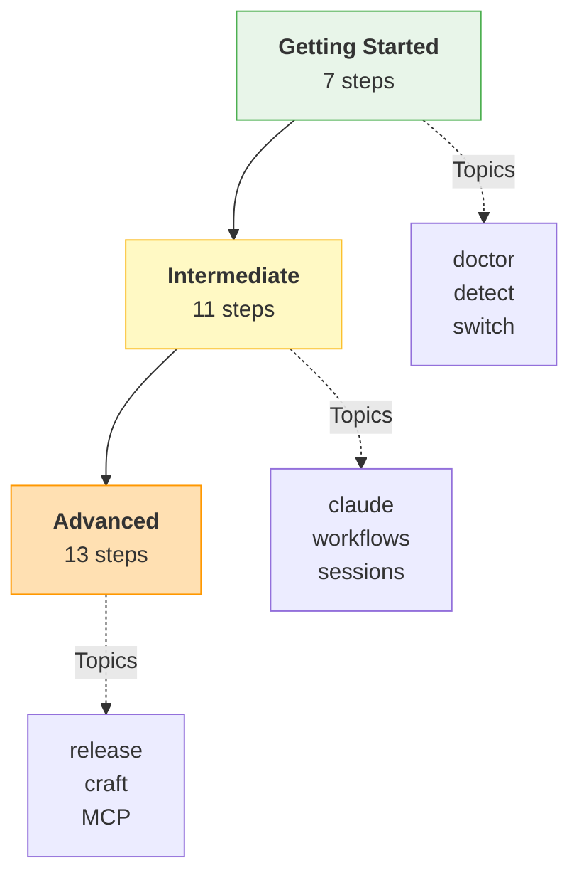

# Interactive Tutorials

Learn aiterm through hands-on, progressive tutorials.

## Available Tutorials

<div class="grid cards" markdown>

-   :material-rocket-launch:{ .lg .middle } **Getting Started**

    ---

    Essential commands and basic setup for new users.

    [:octicons-arrow-right-24: Start Tutorial](getting-started/index.md)

    **7 steps** · **~10 minutes**

-   :material-cog:{ .lg .middle } **Intermediate**

    ---

    Claude Code integration, workflows, and sessions.

    [:octicons-arrow-right-24: Continue Learning](intermediate/index.md)

    **11 steps** · **~20 minutes**

-   :material-star:{ .lg .middle } **Advanced**

    ---

    Release automation, craft integration, and power user techniques.

    [:octicons-arrow-right-24: Master aiterm](advanced/index.md)

    **13 steps** · **~35 minutes**

</div>

## Quick Start

```bash
# List available tutorials
ait learn

# Start the beginner tutorial
ait learn start getting-started

# Resume from a specific step
ait learn start intermediate --step 5

# Preview tutorial details
ait learn info advanced
```

## Tutorial Flow



## Learning Path

| Level | Focus | Prerequisites |
|-------|-------|---------------|
| **Getting Started** | Installation, basic commands | aiterm installed |
| **Intermediate** | Claude Code, workflows, sessions | Completed Getting Started |
| **Advanced** | Release automation, craft, IDE | Completed Intermediate |

## Tips for Success

!!! tip "Interactive Learning"
    Each tutorial step includes:

    - Clear explanations of concepts
    - Commands to try yourself
    - Hints for troubleshooting
    - Progress tracking

!!! info "Resume Anytime"
    If you need to pause, use `--step N` to resume:
    ```bash
    ait learn start intermediate --step 5
    ```

## Related Resources

- [Quick Reference Card](../REFCARD.md)
- [Tutorial Commands Reference](../reference/REFCARD-TUTORIALS.md)
- [All Commands](../reference/commands.md)
