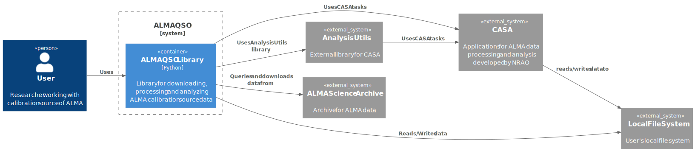

Container
=================

This section provides a overview of ALMAQSO showing the boundary of container (executable, library, database and so on) within the system.
However, ALMAQSO is small project and consists of only one container, ALMAQSO Library.

Purpose
-------
This diagram explains the high-level technology choices made within ALMAQSO and how responsibilities are distributed across the containers.

Audience
--------
- Developers working on ALMAQSO
- New contributors

Components
----------
Here, we explain only new components that were not explained in the System Context diagram.

- **ALMAQSO Library**: A Python library that provides functionalities for downloading, processing, and analyzing ALMA calibration source data. Python is widely used in the radio observational astronomy community, making it a suitable choice for this library.

C4-Container Diagram
--------------------

:numref:`fig-L2-container` shows the container diagram of the ALMAQSO system.

   C4-Container Diagram. (Web version: Click to show full-size diagram.)