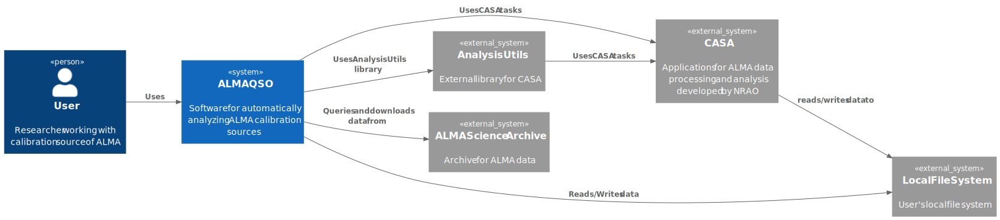

System context
==================

This section provides a general overview of the ALMAQSO system within user (researcher) and external system interactions.

Purpose
-------
This diagram explains how ALMAQSO fits into the surrounding ecosystem and how researchers interact with external systems.

Audience
--------
- Researchers using ALMAQSO
- New contributors
- Developers unfamiliar with CASA

Components
----------
- **User**: Users who conduct data analysis using ALMAQSO. They are typically researchers in astronomy.
- **ALMAQSO**: This software system that provides automated data retrieval and analysis for ALMA calibration sources.
- **External Systems**: CASA, analysisUtils, ALMA Science Archive and local file systems that interact with ALMAQSO.

C4-Context Diagram
-------------------

:numref:`fig-L1-context` shows the system context diagram of the ALMAQSO.

   C4-Context Diagram. (Web version: Click to show full-size diagram.)