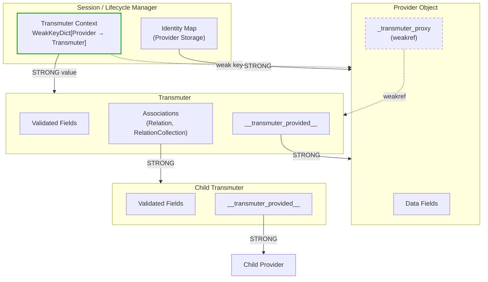
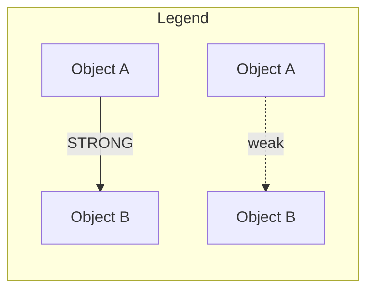
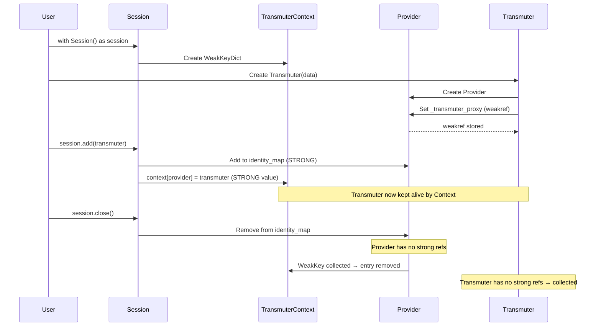
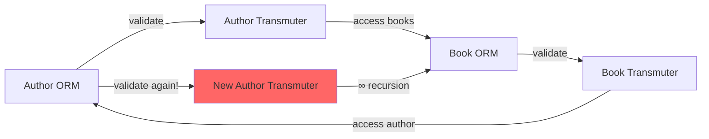
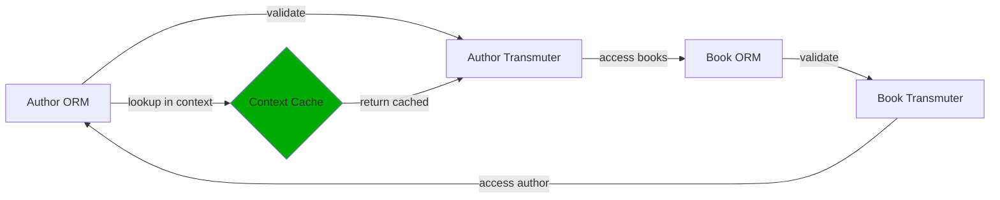

# Materia Reference Design

This document describes the reference architecture between Transmuters and their backing Provider objects (Materia). Understanding this design is crucial for implementing new Materia types correctly.

## Core Concepts

| Term | Description |
|------|-------------|
| **Transmuter** | Pydantic model that wraps and validates a Provider object |
| **Provider** | Backing object managed by a Materia (e.g., SQLAlchemy ORM model) |
| **Materia** | Plugin system that connects Transmuters to specific backends |
| **Transmuter Context** | Session-scoped cache mapping Provider → Transmuter |

## Reference Architecture

The key challenge is maintaining bidirectional references between Transmuters and Providers without:
1. Creating memory leaks through reference cycles
2. Losing Transmuters prematurely during validation
3. Infinite recursion during circular relationship validation

### Reference Flow Diagram



### Reference Type Summary



| From | To | Type | Reason |
|------|----|------|--------|
| `Session/IdentityMap` | Provider | **STRONG** | Session owns provider lifecycle |
| `TransmuterContext` (key) | Provider | **weak** | Auto-cleanup when provider is collected |
| `TransmuterContext` (value) | Transmuter | **STRONG** | Keeps Transmuter alive while Provider exists |
| `Transmuter.__transmuter_provided__` | Provider | **STRONG** | Transmuter wraps the provider |
| `Provider._transmuter_proxy` | Transmuter | **weakref** | Prevents bidirectional strong cycle |
| `Association.__payloads__` | Child Transmuters | **STRONG** | Relationship data integrity |

## Lifecycle Model



## The Circular Validation Problem

When validating circular relationships (e.g., Author → Book → Author), without proper caching:



**Solution:** The `TransmuterContext` caches Provider → Transmuter mappings:



## Implementing a New Materia

### Required Components

1. **Provider Mixin** - Your provider objects must implement `TransmuterProxied`:

```python
from weakref import ref
from arcanus.base import TransmuterProxiedMixin

class YourProviderBase(TransmuterProxiedMixin):
    """Base class for your provider objects."""
    
    # TransmuterProxiedMixin provides:
    # - _transmuter_proxy: ref[BaseTransmuter] | None
    # - transmuter_proxy property (getter/setter with weakref)
```

2. **Session/Context Manager** - Manage the transmuter context:

```python
from weakref import WeakKeyDictionary
from arcanus.base import validation_context

class YourSession:
    _transmuter_context: WeakKeyDictionary[Any, BaseTransmuter]
    
    def __init__(self):
        self._transmuter_context = WeakKeyDictionary()
    
    def __enter__(self):
        # Activate the validation context for this session
        self._context_manager = validation_context(self._transmuter_context)
        self._context_manager.__enter__()
        return self
    
    def __exit__(self, *args):
        self._context_manager.__exit__(*args)
```

3. **Materia Registration** - Register your provider types:

```python
from arcanus.materia.base import BaseMateria

class YourMateria(BaseMateria):
    def bless(self):
        def decorator(transmuter_cls):
            # Map Transmuter class to Provider class
            self.formulars[transmuter_cls] = YourProviderClass
            return transmuter_cls
        return decorator
```

### Attention Points

#### ⚠️ Reference Rules

| Rule | Why |
|------|-----|
| Provider → Transmuter must be **weakref** | Prevents memory cycle |
| Context must use **WeakKeyDictionary** | Auto-cleanup when provider collected |
| Transmuter → Provider must be **strong** | Transmuter owns/wraps provider |

#### ⚠️ Context Lookup Order

In `model_formulate`, always check in this order:

```python
@model_validator(mode="wrap")
def model_formulate(cls, data, handler, info):
    if is_provider_object(data):
        context = validated.get()
        
        # 1. Check context first (guaranteed strong reference)
        if cached := context.get(data):
            if not cached._revalidating:
                return cached
        
        # 2. Check weak proxy (may be None if collected)
        instance = data.transmuter_proxy
        
        # 3. Create if needed
        if instance is None or instance._revalidating:
            instance = create_transmuter(data, handler)
            data.transmuter_proxy = instance  # Set weak ref
        
        # 4. Store in context (keeps alive)
        context[data] = instance
        
    return instance
```

#### ⚠️ Association Handling

When accessing relationships:
1. The Association's `_load()` method triggers provider → transmuter validation
2. This validation looks up the context to avoid re-creation
3. Child transmuters are stored in `__payloads__` with strong references

#### ⚠️ Cascade Operations

When adding a transmuter to session:
1. Add the provider to your identity map
2. Walk the cascade tree (relationships)
3. For each related provider with a `transmuter_proxy`, add to context:

```python
def add(self, transmuter):
    provider = transmuter.__transmuter_provided__
    self._add_to_identity_map(provider)
    self._transmuter_context[provider] = transmuter
    
    # Cascade to related objects
    for related_provider in self._cascade_iterator(provider):
        if hasattr(related_provider, 'transmuter_proxy'):
            if related_transmuter := related_provider.transmuter_proxy:
                self._transmuter_context[related_provider] = related_transmuter
```

### Memory Safety Checklist

- [ ] Provider objects implement `TransmuterProxiedMixin`
- [ ] `_transmuter_proxy` uses `weakref.ref()`
- [ ] Context uses `WeakKeyDictionary` (weak keys, strong values)
- [ ] Session/lifecycle manager holds providers strongly
- [ ] Transmuter holds provider strongly via `__transmuter_provided__`
- [ ] No other strong reference from Provider → Transmuter

### Testing Recommendations

1. **Loop creation test** - Create objects in a loop, verify no duplicates:
```python
for i in range(100):
    child = Child(name=f"child_{i}")
    parent.children.append(child)
# All children should be unique and accessible
```

2. **Circular reference test** - Validate bidirectional relationships:
```python
parent.child = child
child.parent = parent
assert child.parent is parent  # Same instance, not new
```

3. **Memory leak test** - Verify cleanup after session close:
```python
import gc
with YourSession() as session:
    obj = create_transmuter()
    weak_ref = weakref.ref(obj)
    session.add(obj)

gc.collect()
assert weak_ref() is None  # Should be collected
```

