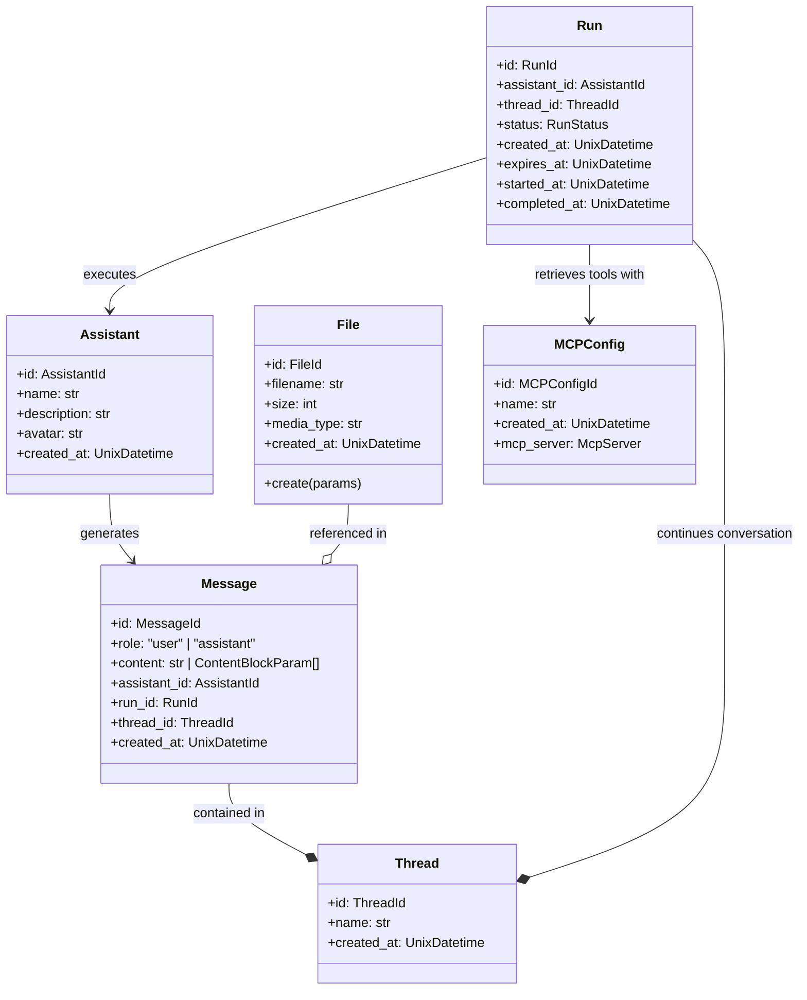
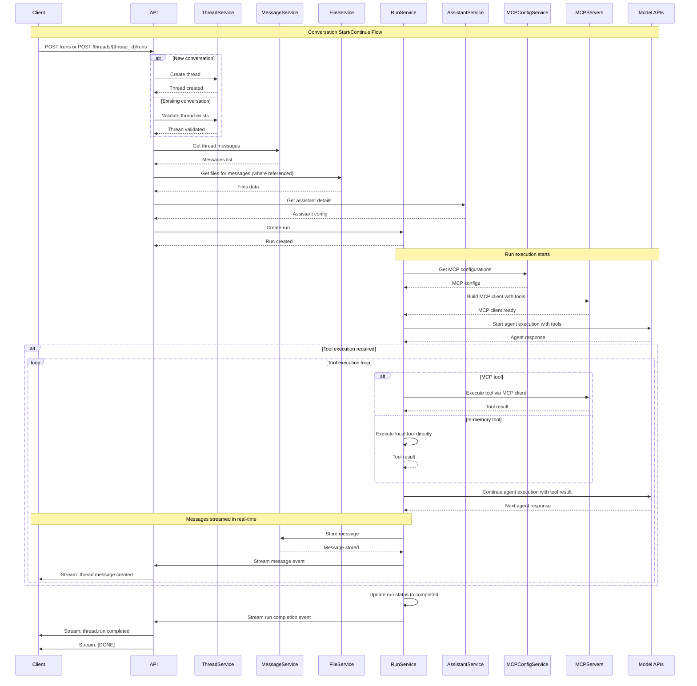

# AskUI Chat

**⚠️ Warning:** AskUI Chat is currently in an experimental stage and has several limitations (see below).

AskUI Chat is a web application that allows interacting with an AskUI Vision Agent similar how it can be
done with `VisionAgent.act()` or `AndroidVisionAgent.act()` but in a more interactive manner that involves less code.

## Table of Contents

- [Installation](#installation)
- [Configuration](#configuration)
- [Usage](#usage)
- [Architecture](#architecture)
  - [Resources](#resources)
  - [Chat Conversation Flow](#chat-conversation-flow)
- [API Reference](#api-reference)
- [API Usage Examples](#api-usage-examples)
  - [0. Start Chat API server and prepare environment](#0-start-chat-api-server-and-prepare-environment)
  - [1. List available assistants](#1-list-available-assistants)
  - [2. Start conversation](#2-start-conversation)
  - [3. Continue conversation](#3-continue-conversation)
  - [4. Retrieve the whole conversation](#4-retrieve-the-whole-conversation)

## Installation

Please follow the [installation instructions](../README.md#installation).

Instead of installing the `askui[all]` package with all features, you can install the `askui[chat]` package with only the chat features to save some disk space and speed up the installation:

```bash
pip install askui[chat]
```

## Configuration

To use the chat, configure the following environment variables:

- `ASKUI_TOKEN`: AskUI Vision Agent behind chat uses currently the AskUI API
- `ASKUI_WORKSPACE_ID`: AskUI Vision Agent behind chat uses currently the AskUI API
- `ASKUI__CHAT_API__DATA_DIR` (optional, defaults to `$(pwd)/chat`): Currently, the AskUI chat stores all data in a directory locally. You can change the default directory by setting this environment variable.
- `ASKUI__CHAT_API__HOST` (optional, defaults to `127.0.0.1`): The host to bind the chat API to.
- `ASKUI__CHAT_API__PORT` (optional, defaults to `9261`): The port to bind the chat API to.
- `ASKUI__CHAT_API__LOG_LEVEL` (optional, defaults to `info`): The log level to use for the chat API.


## Usage

Start the chat API server within a shell:

```bash
python -m askui.chat
```

After the server has started, navigate to the chat in the [AskUI Hub](https://hub.askui.com/).

## Architecture

This repository only includes the AskUI Chat API (`src/askui/chat`). The AskUI Chat UI can be accessed through the [AskUI Hub](https://hub.askui.com/) and connects to the local Chat API after it has been started.

The AskUI Chat provides a comprehensive chat system with assistants, threads, messages, runs, and file management capabilities.
The underlying API is roughly modeled after the [OpenAI Assistants API](https://platform.openai.com/docs/assistants/migration) but also
integrates different concepts and extends it in various ways, e.g.,

- MCP configs for retrieving tools from MCP servers
- messages modeled after [Anthropic's Message API](https://docs.anthropic.com/en/api/messages#body-messages)
- runs enabling the execution of multiple iterations of tool calling loops instead of passing control back to user after each iteration.

### Resources

The API is organized around the following core resources:
- **Assistants**: AI agents that take are passed an ongoing conversation (thread) including configuration (tools, limits etc.) and continue the conversation
- **Threads**: Conversation sessions that contain messages
- **Messages**: Individual messages by user or assistants in a thread
- **Runs**: Calling the agent with the thread to continue conversation which results in tool calls and calls of other assistants and messages being added to the thread
- **Files**: Attachments and resources that can be referenced in messages
- **MCP Configs**: Model Context Protocol configurations for AI models to retrieve tools from MCP servers enabling to pluging in custom tools



### Chat Conversation Flow



## API Reference

To see the API reference, start the AskUI Chat API server and open the Swagger UI.

```bash
python -m askui.chat
```

Navigate to `http://localhost:9261/docs` in your favorite browser.

The API reference is interactive and allows you to try out the API with the Swagger UI.

For most endpoints, you need to specify a `AskUI-Workspace` header which is the workspace id as they are scoped to a workspace.
Navigate to `https://hub.askui.com` and select a workspace through the UI and copy the workspace id from the URL you are directed to.

## API Usage Examples

### 0. Start Chat API server and prepare environment

Start the AskUI Chat API server

```bash
python -m askui.chat
```

In another shell, prepare the environment variables with your workspace id and askui access token (from the [AskUI Hub](https://hub.askui.com)) as well as the base url, e.g., `http://localhost:9261` from the initial logs output by `python -m askui.chat`.

```bash
export BASE_URL="<base_url>"
export ASKUI_WORKSPACE="<workspace_id>"
export ASKUI_TOKEN="<askui_access_token>"
export AUTHORIZATION="Basic $(echo -n $ASKUI_TOKEN | base64)"
```


### 1. List available assistants

```bash
curl -X GET "$BASE_URL/v1/assistants" \
  -H "Authorization: $AUTHORIZATION" \
  -H "AskUI-Workspace: $ASKUI_WORKSPACE"
```

**Example Response:**
```json

{
  "object": "list",
  "data": [
    {
      "id": "asst_ge3tiojsga3dgnruge3di2u5ov36shedkcslxnmcd",
      "name": "AskUI Web Testing Agent",
      "description": null,
      "avatar": "data:image/svg+xml;base64,PHN2ZyB4bWxucz0iaHR0cDovL3d3dy53My5vcmcvMjAwMC9zdmciIHhtbG5zOnhsaW5rPSJodHRwOi8vd3d3LnczLm9yZy8xOTk5L3hsaW5rIiB2aWV3Qm94PSIwIDAgMjcgMjciIGFyaWEtaGlkZGVuPSJ0cnVlIiByb2xlPSJpbWciIGNsYXNzPSJpY29uaWZ5IGljb25pZnktLXR3ZW1vamkiIHByZXNlcnZlQXNwZWN0UmF0aW89InhNaWRZTWlkIG1lZXQiPjxwYXRoIGZpbGw9IiNDQ0Q2REQiIGQ9Ik0xMC45MjIgMTAuODEgMTkuMTAyIDIuNjI5bDUuMjIxIDUuMjIxIC04LjE4MSA4LjE4MXoiLz48cGF0aCBmaWxsPSIjNjhFMDkwIiBkPSJNNi4wNzcgMjUuNzk5QzEuODc1IDI1LjUgMS4xMjUgMjIuNTQ3IDEuMjI2IDIwLjk0OWMwLjI0MSAtMy44MDMgMTEuNzAxIC0xMi40MTMgMTEuNzAxIC0xMi40MTNsOS4zODggMS40NDhjMC4wMDEgMCAtMTMuMDQyIDE2LjA0NCAtMTYuMjM3IDE1LjgxNiIvPjxwYXRoIGZpbGw9IiM4ODk5QTYiIGQ9Ik0yNC4yNDUgMi43ODFDMjIuMDU0IDAuNTkgMTkuNTc4IC0wLjQ4NyAxOC43MTUgMC4zNzdjLTAuMDEgMC4wMSAtMC4wMTcgMC4wMjMgLTAuMDI2IDAuMDMzIC0wLjAwNSAwLjAwNSAtMC4wMTEgMC4wMDYgLTAuMDE2IDAuMDExTDEuNzIxIDE3LjM3M2E1LjU3MiA1LjU3MiAwIDAgMCAtMS42NDMgMy45NjZjMCAxLjQ5OCAwLjU4NCAyLjkwNiAxLjY0MyAzLjk2NWE1LjU3MiA1LjU3MiAwIDAgMCAzLjk2NiAxLjY0MyA1LjU3MiA1LjU3MiAwIDAgMCAzLjk2NSAtMS42NDJsMTYuOTUzIC0xNi45NTNjMC4wMDUgLTAuMDA1IDAuMDA3IC0wLjAxMiAwLjAxMSAtMC4wMTcgMC4wMSAtMC4wMDkgMC4wMjIgLTAuMDE1IDAuMDMyIC0wLjAyNSAwLjg2MyAtMC44NjIgLTAuMjE0IC0zLjMzOCAtMi40MDUgLTUuNTI5TTguMDYzIDIzLjcxNGMtMC42MzQgMC42MzQgLTEuNDc4IDAuOTgzIC0yLjM3NCAwLjk4M3MtMS43NDEgLTAuMzUgLTIuMzc1IC0wLjk4NGEzLjMzOCAzLjMzOCAwIDAgMSAtMC45ODQgLTIuMzc1YzAgLTAuODk3IDAuMzUgLTEuNzQgMC45ODMgLTIuMzc0TDE5LjA1OSAzLjIxOGMwLjQ2NyAwLjg1OCAxLjE3IDEuNzk2IDIuMDYyIDIuNjg4czEuODMgMS41OTUgMi42ODggMi4wNjJ6Ii8+PHBhdGggZmlsbD0iIzE3QkY2MyIgZD0iTTIxLjg5NyA5Ljg1OGMtMC4wNDQgMC4yODQgLTEuOTcgMC41NjMgLTQuMjY4IDAuMjU3cy00LjExMiAtMC45MTcgLTQuMDUyIC0xLjM2NSAxLjk3IC0wLjU2MyA0LjI2OCAtMC4yNTcgNC4xMjEgMC45MTggNC4wNTIgMS4zNjVNOC4xMyAxNy40MzVhMC41OTYgMC41OTYgMCAxIDEgLTAuODQyIC0wLjg0MyAwLjU5NiAwLjU5NiAwIDAgMSAwLjg0MiAwLjg0M20yLjQ4OCAxLjk2MWEwLjk3NCAwLjk3NCAwIDEgMSAtMS4zNzYgLTEuMzc3IDAuOTc0IDAuOTc0IDAgMCAxIDEuMzc2IDEuMzc3bTEuMjU4IC0zLjk5M2EwLjkxNiAwLjkxNiAwIDAgMSAtMS4yOTQgLTEuMjk0IDAuOTE1IDAuOTE1IDAgMSAxIDEuMjk0IDEuMjk0bS01LjE1MSA2LjY0NGExLjExNyAxLjExNyAwIDEgMSAtMS41NzkgLTEuNTc5IDEuMTE3IDEuMTE3IDAgMCAxIDEuNTc5IDEuNTc5bTguNTQ3IC02Ljg2OGEwLjc5NCAwLjc5NCAwIDEgMSAtMS4xMjIgLTEuMTIzIDAuNzk0IDAuNzk0IDAgMCAxIDEuMTIyIDEuMTIzbS0wLjkwNSAtMy4yMTZhMC41MiAwLjUyIDAgMSAxIC0wLjczNCAtMC43MzUgMC41MiAwLjUyIDAgMCAxIDAuNzM0IDAuNzM1Ii8+PHBhdGggdHJhbnNmb3JtPSJyb3RhdGUoLTQ1LjAwMSAzMC44MTcgNS4yMjMpIiBmaWxsPSIjQ0NENkREIiBjeD0iMzAuODE3IiBjeT0iNS4yMjMiIHJ4PSIxLjE4NCIgcnk9IjQuODQ3IiBkPSJNMjQuMDAxIDMuOTE3QTAuODg4IDMuNjM1IDAgMCAxIDIzLjExMyA3LjU1M0EwLjg4OCAzLjYzNSAwIDAgMSAyMi4yMjUgMy45MTdBMC44ODggMy42MzUgMCAwIDEgMjQuMDAxIDMuOTE3eiIvPjwvc3ZnPg==",
      "object": "assistant",
      "created_at": 1755848144
    },
    {
      "id": "asst_ge3tiojsga3dgnruge3di2u5ov36shedkcslxnmcc",
      "name": "AskUI Web Vision Agent",
      "description": null,
      "avatar": "data:image/svg+xml;base64,PHN2ZyB4bWxucz0iaHR0cDovL3d3dy53My5vcmcvMjAwMC9zdmciIHdpZHRoPSI0MDAiIGhlaWdodD0iNDAwIiB2aWV3Qm94PSIwIDAgNDAwIDQwMCIgZmlsbD0ibm9uZSI+CjxwYXRoIGQ9Ik0xMzYuNDQ0IDIyMS41NTZDMTIzLjU1OCAyMjUuMjEzIDExNS4xMDQgMjMxLjYyNSAxMDkuNTM1IDIzOC4wMzJDMTE0Ljg2OSAyMzMuMzY0IDEyMi4wMTQgMjI5LjA4IDEzMS42NTIgMjI2LjM0OEMxNDEuNTEgMjIzLjU1NCAxNDkuOTIgMjIzLjU3NCAxNTYuODY5IDIyNC45MTVWMjE5LjQ4MUMxNTAuOTQxIDIxOC45MzkgMTQ0LjE0NSAyMTkuMzcxIDEzNi40NDQgMjIxLjU1NlpNMTA4Ljk0NiAxNzUuODc2TDYxLjA4OTUgMTg4LjQ4NEM2MS4wODk1IDE4OC40ODQgNjEuOTYxNyAxODkuNzE2IDYzLjU3NjcgMTkxLjM2TDEwNC4xNTMgMTgwLjY2OEMxMDQuMTUzIDE4MC42NjggMTAzLjU3OCAxODguMDc3IDk4LjU4NDcgMTk0LjcwNUMxMDguMDMgMTg3LjU1OSAxMDguOTQ2IDE3NS44NzYgMTA4Ljk0NiAxNzUuODc2Wk0xNDkuMDA1IDI4OC4zNDdDODEuNjU4MiAzMDYuNDg2IDQ2LjAyNzIgMjI4LjQzOCAzNS4yMzk2IDE4Ny45MjhDMzAuMjU1NiAxNjkuMjI5IDI4LjA3OTkgMTU1LjA2NyAyNy41IDE0NS45MjhDMjcuNDM3NyAxNDQuOTc5IDI3LjQ2NjUgMTQ0LjE3OSAyNy41MzM2IDE0My40NDZDMjQuMDQgMTQzLjY1NyAyMi4zNjc0IDE0NS40NzMgMjIuNzA3NyAxNTAuNzIxQzIzLjI4NzYgMTU5Ljg1NSAyNS40NjMzIDE3NC4wMTYgMzAuNDQ3MyAxOTIuNzIxQzQxLjIzMDEgMjMzLjIyNSA3Ni44NjU5IDMxMS4yNzMgMTQ0LjIxMyAyOTMuMTM0QzE1OC44NzIgMjg5LjE4NSAxNjkuODg1IDI4MS45OTIgMTc4LjE1MiAyNzIuODFDMTcwLjUzMiAyNzkuNjkyIDE2MC45OTUgMjg1LjExMiAxNDkuMDA1IDI4OC4zNDdaTTE2MS42NjEgMTI4LjExVjEzMi45MDNIMTg4LjA3N0MxODcuNTM1IDEzMS4yMDYgMTg2Ljk4OSAxMjkuNjc3IDE4Ni40NDcgMTI4LjExSDE2MS42NjFaIiBmaWxsPSIjMkQ0NTUyIi8+CjxwYXRoIGQ9Ik0xOTMuOTgxIDE2Ny41ODRDMjA1Ljg2MSAxNzAuOTU4IDIxMi4xNDQgMTc5LjI4NyAyMTUuNDY1IDE4Ni42NThMMjI4LjcxMSAxOTAuNDJDMjI4LjcxMSAxOTAuNDIgMjI2LjkwNCAxNjQuNjIzIDIwMy41NyAxNTcuOTk1QzE4MS43NDEgMTUxLjc5MyAxNjguMzA4IDE3MC4xMjQgMTY2LjY3NCAxNzIuNDk2QzE3My4wMjQgMTY3Ljk3MiAxODIuMjk3IDE2NC4yNjggMTkzLjk4MSAxNjcuNTg0Wk0yOTkuNDIyIDE4Ni43NzdDMjc3LjU3MyAxODAuNTQ3IDI2NC4xNDUgMTk4LjkxNiAyNjIuNTM1IDIwMS4yNTVDMjY4Ljg5IDE5Ni43MzYgMjc4LjE1OCAxOTMuMDMxIDI4OS44MzcgMTk2LjM2MkMzMDEuNjk4IDE5OS43NDEgMzA3Ljk3NiAyMDguMDYgMzExLjMwNyAyMTUuNDM2TDMyNC41NzIgMjE5LjIxMkMzMjQuNTcyIDIxOS4yMTIgMzIyLjczNiAxOTMuNDEgMjk5LjQyMiAxODYuNzc3Wk0yODYuMjYyIDI1NC43OTVMMTc2LjA3MiAyMjMuOTlDMTc2LjA3MiAyMjMuOTkgMTc3LjI2NSAyMzAuMDM4IDE4MS44NDIgMjM3Ljg2OUwyNzQuNjE3IDI2My44MDVDMjgyLjI1NSAyNTkuMzg2IDI4Ni4yNjIgMjU0Ljc5NSAyODYuMjYyIDI1NC43OTVaTTIwOS44NjcgMzIxLjEwMkMxMjIuNjE4IDI5Ny43MSAxMzMuMTY2IDE4Ni41NDMgMTQ3LjI4NCAxMzMuODY1QzE1My4wOTcgMTEyLjE1NiAxNTkuMDczIDk2LjAyMDMgMTY0LjAyOSA4NS4yMDRDMTYxLjA3MiA4NC41OTUzIDE1OC42MjMgODYuMTUyOSAxNTYuMjAzIDkxLjA3NDZDMTUwLjk0MSAxMDEuNzQ3IDE0NC4yMTIgMTE5LjEyNCAxMzcuNyAxNDMuNDVDMTIzLjU4NiAxOTYuMTI3IDExMy4wMzggMzA3LjI5IDIwMC4yODMgMzMwLjY4MkMyNDEuNDA2IDM0MS42OTkgMjczLjQ0MiAzMjQuOTU1IDI5Ny4zMjMgMjk4LjY1OUMyNzQuNjU1IDMxOS4xOSAyNDUuNzE0IDMzMC43MDEgMjA5Ljg2NyAzMjEuMTAyWiIgZmlsbD0iIzJENDU1MiIvPgo8cGF0aCBkPSJNMTYxLjY2MSAyNjIuMjk2VjIzOS44NjNMOTkuMzMyNCAyNTcuNTM3Qzk5LjMzMjQgMjU3LjUzNyAxMDMuOTM4IDIzMC43NzcgMTM2LjQ0NCAyMjEuNTU2QzE0Ni4zMDIgMjE4Ljc2MiAxNTQuNzEzIDIxOC43ODEgMTYxLjY2MSAyMjAuMTIzVjEyOC4xMUgxOTIuODY5QzE4OS40NzEgMTE3LjYxIDE4Ni4xODQgMTA5LjUyNiAxODMuNDIzIDEwMy45MDlDMTc4Ljg1NiA5NC42MTIgMTc0LjE3NCAxMDAuNzc1IDE2My41NDUgMTA5LjY2NUMxNTYuMDU5IDExNS45MTkgMTM3LjEzOSAxMjkuMjYxIDEwOC42NjggMTM2LjkzM0M4MC4xOTY2IDE0NC42MSA1Ny4xNzkgMTQyLjU3NCA0Ny41NzUyIDE0MC45MTFDMzMuOTYwMSAxMzguNTYyIDI2LjgzODcgMTM1LjU3MiAyNy41MDQ5IDE0NS45MjhDMjguMDg0NyAxNTUuMDYyIDMwLjI2MDUgMTY5LjIyNCAzNS4yNDQ1IDE4Ny45MjhDNDYuMDI3MiAyMjguNDMzIDgxLjY2MyAzMDYuNDgxIDE0OS4wMSAyODguMzQyQzE2Ni42MDIgMjgzLjYwMiAxNzkuMDE5IDI3NC4yMzMgMTg3LjYyNiAyNjIuMjkxSDE2MS42NjFWMjYyLjI5NlpNNjEuMDg0OCAxODguNDg0TDEwOC45NDYgMTc1Ljg3NkMxMDguOTQ2IDE3NS44NzYgMTA3LjU1MSAxOTQuMjg4IDg5LjYwODcgMTk5LjAxOEM3MS42NjE0IDIwMy43NDMgNjEuMDg0OCAxODguNDg0IDYxLjA4NDggMTg4LjQ4NFoiIGZpbGw9IiNFMjU3NEMiLz4KPHBhdGggZD0iTTM0MS43ODYgMTI5LjE3NEMzMjkuMzQ1IDEzMS4zNTUgMjk5LjQ5OCAxMzQuMDcyIDI2Mi42MTIgMTI0LjE4NUMyMjUuNzE2IDExNC4zMDQgMjAxLjIzNiA5Ny4wMjI0IDE5MS41MzcgODguODk5NEMxNzcuNzg4IDc3LjM4MzQgMTcxLjc0IDY5LjM4MDIgMTY1Ljc4OCA4MS40ODU3QzE2MC41MjYgOTIuMTYzIDE1My43OTcgMTA5LjU0IDE0Ny4yODQgMTMzLjg2NkMxMzMuMTcxIDE4Ni41NDMgMTIyLjYyMyAyOTcuNzA2IDIwOS44NjcgMzIxLjA5OEMyOTcuMDkzIDM0NC40NyAzNDMuNTMgMjQyLjkyIDM1Ny42NDQgMTkwLjIzOEMzNjQuMTU3IDE2NS45MTcgMzY3LjAxMyAxNDcuNSAzNjcuNzk5IDEzNS42MjVDMzY4LjY5NSAxMjIuMTczIDM1OS40NTUgMTI2LjA3OCAzNDEuNzg2IDEyOS4xNzRaTTE2Ni40OTcgMTcyLjc1NkMxNjYuNDk3IDE3Mi43NTYgMTgwLjI0NiAxNTEuMzcyIDIwMy41NjUgMTU4QzIyNi44OTkgMTY0LjYyOCAyMjguNzA2IDE5MC40MjUgMjI4LjcwNiAxOTAuNDI1TDE2Ni40OTcgMTcyLjc1NlpNMjIzLjQyIDI2OC43MTNDMTgyLjQwMyAyNTYuNjk4IDE3Ni4wNzcgMjIzLjk5IDE3Ni4wNzcgMjIzLjk5TDI4Ni4yNjIgMjU0Ljc5NkMyODYuMjYyIDI1NC43OTEgMjY0LjAyMSAyODAuNTc4IDIyMy40MiAyNjguNzEzWk0yNjIuMzc3IDIwMS40OTVDMjYyLjM3NyAyMDEuNDk1IDI3Ni4xMDcgMTgwLjEyNiAyOTkuNDIyIDE4Ni43NzNDMzIyLjczNiAxOTMuNDExIDMyNC41NzIgMjE5LjIwOCAzMjQuNTcyIDIxOS4yMDhMMjYyLjM3NyAyMDEuNDk1WiIgZmlsbD0iIzJFQUQzMyIvPgo8cGF0aCBkPSJNMTM5Ljg4IDI0Ni4wNEw5OS4zMzI0IDI1Ny41MzJDOTkuMzMyNCAyNTcuNTMyIDEwMy43MzcgMjMyLjQ0IDEzMy42MDcgMjIyLjQ5NkwxMTAuNjQ3IDEzNi4zM0wxMDguNjYzIDEzNi45MzNDODAuMTkxOCAxNDQuNjExIDU3LjE3NDIgMTQyLjU3NCA0Ny41NzA0IDE0MC45MTFDMzMuOTU1NCAxMzguNTYzIDI2LjgzNCAxMzUuNTcyIDI3LjUwMDEgMTQ1LjkyOUMyOC4wOCAxNTUuMDYzIDMwLjI1NTcgMTY5LjIyNCAzNS4yMzk3IDE4Ny45MjlDNDYuMDIyNSAyMjguNDMzIDgxLjY1ODMgMzA2LjQ4MSAxNDkuMDA1IDI4OC4zNDJMMTUwLjk4OSAyODcuNzE5TDEzOS44OCAyNDYuMDRaTTYxLjA4NDggMTg4LjQ4NUwxMDguOTQ2IDE3NS44NzZDMTA4Ljk0NiAxNzUuODc2IDEwNy41NTEgMTk0LjI4OCA4OS42MDg3IDE5OS4wMThDNzEuNjYxNSAyMDMuNzQzIDYxLjA4NDggMTg4LjQ4NSA2MS4wODQ4IDE4OC40ODVaIiBmaWxsPSIjRDY1MzQ4Ii8+CjxwYXRoIGQ9Ik0yMjUuMjcgMjY5LjE2M0wyMjMuNDE1IDI2OC43MTJDMTgyLjM5OCAyNTYuNjk4IDE3Ni4wNzIgMjIzLjk5IDE3Ni4wNzIgMjIzLjk5TDIzMi44OSAyMzkuODcyTDI2Mi45NzEgMTI0LjI4MUwyNjIuNjA3IDEyNC4xODVDMjI1LjcxMSAxMTQuMzA0IDIwMS4yMzIgOTcuMDIyNCAxOTEuNTMyIDg4Ljg5OTRDMTc3Ljc4MyA3Ny4zODM0IDE3MS43MzUgNjkuMzgwMiAxNjUuNzgzIDgxLjQ4NTdDMTYwLjUyNiA5Mi4xNjMgMTUzLjc5NyAxMDkuNTQgMTQ3LjI4NCAxMzMuODY2QzEzMy4xNzEgMTg2LjU0MyAxMjIuNjIzIDI5Ny43MDYgMjA5Ljg2NyAzMjEuMDk3TDIxMS42NTUgMzIxLjVMMjI1LjI3IDI2OS4xNjNaTTE2Ni40OTcgMTcyLjc1NkMxNjYuNDk3IDE3Mi43NTYgMTgwLjI0NiAxNTEuMzcyIDIwMy41NjUgMTU4QzIyNi44OTkgMTY0LjYyOCAyMjguNzA2IDE5MC40MjUgMjI4LjcwNiAxOTAuNDI1TDE2Ni40OTcgMTcyLjc1NloiIGZpbGw9IiMxRDhEMjIiLz4KPHBhdGggZD0iTTE0MS45NDYgMjQ1LjQ1MUwxMzEuMDcyIDI0OC41MzdDMTMzLjY0MSAyNjMuMDE5IDEzOC4xNjkgMjc2LjkxNyAxNDUuMjc2IDI4OS4xOTVDMTQ2LjUxMyAyODguOTIyIDE0Ny43NCAyODguNjg3IDE0OSAyODguMzQyQzE1Mi4zMDIgMjg3LjQ1MSAxNTUuMzY0IDI4Ni4zNDggMTU4LjMxMiAyODUuMTQ1QzE1MC4zNzEgMjczLjM2MSAxNDUuMTE4IDI1OS43ODkgMTQxLjk0NiAyNDUuNDUxWk0xMzcuNyAxNDMuNDUxQzEzMi4xMTIgMTY0LjMwNyAxMjcuMTEzIDE5NC4zMjYgMTI4LjQ4OSAyMjQuNDM2QzEzMC45NTIgMjIzLjM2NyAxMzMuNTU0IDIyMi4zNzEgMTM2LjQ0NCAyMjEuNTUxTDEzOC40NTcgMjIxLjEwMUMxMzYuMDAzIDE4OC45MzkgMTQxLjMwOCAxNTYuMTY1IDE0Ny4yODQgMTMzLjg2NkMxNDguNzk5IDEyOC4yMjUgMTUwLjMxOCAxMjIuOTc4IDE1MS44MzIgMTE4LjA4NUMxNDkuMzkzIDExOS42MzcgMTQ2Ljc2NyAxMjEuMjI4IDE0My43NzYgMTIyLjg2N0MxNDEuNzU5IDEyOS4wOTMgMTM5LjcyMiAxMzUuODk4IDEzNy43IDE0My40NTFaIiBmaWxsPSIjQzA0QjQxIi8+Cjwvc3ZnPg==",
      "object": "assistant",
      "created_at": 1755848144
    },
    {
      "id": "asst_ge3tiojsga3dgnruge3di2u5ov36shedkcslxnmca",
      "name": "AskUI Vision Agent",
      "description": null,
      "avatar": "data:image/svg+xml;base64,PHN2ZyAgeG1sbnM9Imh0dHA6Ly93d3cudzMub3JnLzIwMDAvc3ZnIgogIHdpZHRoPSIyNCIKICBoZWlnaHQ9IjI0IgogIHZpZXdCb3g9IjAgMCAyNCAyNCIKICBmaWxsPSJub25lIgogIHN0cm9rZT0iIzAwMCIgc3R5bGU9ImJhY2tncm91bmQtY29sb3I6ICNmZmY7IGJvcmRlci1yYWRpdXM6IDJweCIKICBzdHJva2Utd2lkdGg9IjIiCiAgc3Ryb2tlLWxpbmVjYXA9InJvdW5kIgogIHN0cm9rZS1saW5lam9pbj0icm91bmQiCj4KICA8cGF0aCBkPSJNMTIgOFY0SDgiIC8+CiAgPHJlY3Qgd2lkdGg9IjE2IiBoZWlnaHQ9IjEyIiB4PSI0IiB5PSI4IiByeD0iMiIgLz4KICA8cGF0aCBkPSJNMiAxNGgyIiAvPgogIDxwYXRoIGQ9Ik0yMCAxNGgyIiAvPgogIDxwYXRoIGQ9Ik0xNSAxM3YyIiAvPgogIDxwYXRoIGQ9Ik05IDEzdjIiIC8+Cjwvc3ZnPgo=",
      "object": "assistant",
      "created_at": 1755848144
    },
    {
      "id": "asst_78da09fbf1ed43c7826fb1686f89f541",
      "name": "AskUI Android Vision Agent",
      "description": null,
      "avatar": "data:image/svg+xml;base64,PHN2ZyB4bWxucz0iaHR0cDovL3d3dy53My5vcmcvMjAwMC9zdmciICB2aWV3Qm94PSIwIDAgNDggNDgiIHdpZHRoPSIyNXB4IiBoZWlnaHQ9IjI1cHgiPjxwYXRoIGQ9Ik0gMzIuNTE5NTMxIDAuOTgyNDIxODggQSAxLjUwMDE1IDEuNTAwMTUgMCAwIDAgMzEuMjc5Mjk3IDEuNjI4OTA2MiBMIDI5LjQzNzUgNC4yMDg5ODQ0IEMgMjcuNzgwMjA3IDMuNDQwNTAwNiAyNS45NDE5MSAzIDI0IDMgQyAyMi4wNTgwOSAzIDIwLjIxOTc5MyAzLjQ0MDUwMDYgMTguNTYyNSA0LjIwODk4NDQgTCAxNi43MjA3MDMgMS42Mjg5MDYyIEEgMS41MDAxNSAxLjUwMDE1IDAgMCAwIDE1LjQzNTU0NyAwLjk4NDM3NSBBIDEuNTAwMTUgMS41MDAxNSAwIDAgMCAxNC4yNzkyOTcgMy4zNzEwOTM4IEwgMTYgNS43NzkyOTY5IEMgMTMuMTM4ODk2IDguMDI0NzU4MiAxMS4yNDUxODggMTEuNDM2MDIgMTEuMDM1MTU2IDE1LjI5MTAxNiBDIDEwLjU1MzI2IDE1LjExMjgxOCAxMC4wNDA0MDggMTUgOS41IDE1IEMgNy4wMzI0OTkxIDE1IDUgMTcuMDMyNDk5IDUgMTkuNSBMIDUgMzAuNSBDIDUgMzIuOTY3NTAxIDcuMDMyNDk5MSAzNSA5LjUgMzUgQyAxMC4wOTAzMTMgMzUgMTAuNjUzMjI5IDM0Ljg3ODc0OSAxMS4xNzE4NzUgMzQuNjY3OTY5IEMgMTEuNTY0MzM2IDM2LjA3MjEwNSAxMi42MzEzMzMgMzcuMTk2OTk0IDE0IDM3LjY5MzM1OSBMIDE0IDQxLjUgQyAxNCA0My45Njc1MDEgMTYuMDMyNDk5IDQ2IDE4LjUgNDYgQyAyMC45Njc1MDEgNDYgMjMgNDMuOTY3NTAxIDIzIDQxLjUgTCAyMyAzOCBMIDI1IDM4IEwgMjUgNDEuNSBDIDI1IDQzLjk2NzUwMSAyNy4wMzI0OTkgNDYgMjkuNSA0NiBDIDMxLjk2NzUwMSA0NiAzNCA0My45Njc1MDEgMzQgNDEuNSBMIDM0IDM3LjY5MzM1OSBDIDM1LjM2ODY2NyAzNy4xOTY5OTQgMzYuNDM1NjY0IDM2LjA3MjEwNSAzNi44MjgxMjUgMzQuNjY3OTY5IEMgMzcuMzQ2NzcxIDM0Ljg3ODc0OSAzNy45MDk2ODcgMzUgMzguNSAzNSBDIDQwLjk2NzUwMSAzNSA0MyAzMi45Njc1MDEgNDMgMzAuNSBMIDQzIDE5LjUgQyA0MyAxNy4wMzI0OTkgNDAuOTY3NTAxIDE1IDM4LjUgMTUgQyAzNy45NTk1OTIgMTUgMzcuNDQ2NzQgMTUuMTEyODE4IDM2Ljk2NDg0NCAxNS4yOTEwMTYgQyAzNi43NTQ4MTIgMTEuNDM2MDIgMzQuODYxMTA0IDguMDI0NzU4MiAzMiA1Ljc3OTI5NjkgTCAzMy43MjA3MDMgMy4zNzEwOTM4IEEgMS41MDAxNSAxLjUwMDE1IDAgMCAwIDMyLjUxOTUzMSAwLjk4MjQyMTg4IHogTSAyNCA2IEMgMjkuMTg1MTI3IDYgMzMuMjc2NzI3IDkuOTU3NTEzMiAzMy43OTg4MjggMTUgTCAxNC4yMDExNzIgMTUgQyAxNC43MjMyNzMgOS45NTc1MTMyIDE4LjgxNDg3MyA2IDI0IDYgeiBNIDE5LjUgMTAgQSAxLjUgMS41IDAgMCAwIDE5LjUgMTMgQSAxLjUgMS41IDAgMCAwIDE5LjUgMTAgeiBNIDI4LjUgMTAgQSAxLjUgMS41IDAgMCAwIDI4LjUgMTMgQSAxLjUgMS41IDAgMCAwIDI4LjUgMTAgeiBNIDkuNSAxOCBDIDEwLjM0NjQ5OSAxOCAxMSAxOC42NTM1MDEgMTEgMTkuNSBMIDExIDMwLjUgQyAxMSAzMS4zNDY0OTkgMTAuMzQ2NDk5IDMyIDkuNSAzMiBDIDguNjUzNTAwOSAzMiA4IDMxLjM0NjQ5OSA4IDMwLjUgTCA4IDE5LjUgQyA4IDE4LjY1MzUwMSA4LjY1MzUwMDkgMTggOS41IDE4IHogTSAxNCAxOCBMIDM0IDE4IEwgMzQgMTkuNSBMIDM0IDMwLjUgTCAzNCAzMy41IEMgMzQgMzQuMzQ2NDk5IDMzLjM0NjQ5OSAzNSAzMi41IDM1IEwgMjUgMzUgTCAyMyAzNSBMIDE1LjUgMzUgQyAxNC42NTM1MDEgMzUgMTQgMzQuMzQ2NDk5IDE0IDMzLjUgTCAxNCAzMC41IEwgMTQgMTkuNSBMIDE0IDE4IHogTSAzOC41IDE4IEMgMzkuMzQ2NDk5IDE4IDQwIDE4LjY1MzUwMSA0MCAxOS41IEwgNDAgMzAuNSBDIDQwIDMxLjM0NjQ5OSAzOS4zNDY0OTkgMzIgMzguNSAzMiBDIDM3LjY1MzUwMSAzMiAzNyAzMS4zNDY0OTkgMzcgMzAuNSBMIDM3IDE5LjUgQyAzNyAxOC42NTM1MDEgMzcuNjUzNTAxIDE4IDM4LjUgMTggeiBNIDE3IDM4IEwgMjAgMzggTCAyMCA0MS41IEMgMjAgNDIuMzQ2NDk5IDE5LjM0NjQ5OSA0MyAxOC41IDQzIEMgMTcuNjUzNTAxIDQzIDE3IDQyLjM0NjQ5OSAxNyA0MS41IEwgMTcgMzggeiBNIDI4IDM4IEwgMzEgMzggTCAzMSA0MS41IEMgMzEgNDIuMzQ2NDk5IDMwLjM0NjQ5OSA0MyAyOS41IDQzIEMgMjguNjUzNTAxIDQzIDI4IDQyLjM0NjQ5OSAyOCA0MS41IEwgMjggMzggeiIvPjwvc3ZnPg==",
      "object": "assistant",
      "created_at": 1755848144
    }
  ],
  "first_id": "asst_ge3tiojsga3dgnruge3di2u5ov36shedkcslxnmcd",
  "last_id": "asst_78da09fbf1ed43c7826fb1686f89f541",
  "has_more": false
}
```

Choose an assistant and copy the assistants ids to clipboard for the next call to create the conversation.


### 2. Start conversation

Create a conversation (thread) and immediately run the assistant with the thread to continue the conversation with the assistant:

Make sure to replace `<assistant_id>` beforehand.

```bash
export ASSISTANT_ID="<assistant_id>"

curl -X POST "$BASE_URL/v1/runs" \
  -H "Authorization: $AUTHORIZATION" \
  -H "AskUI-Workspace: $ASKUI_WORKSPACE" \
  -H "Content-Type: application/json" \
  -d "{
    \"assistant_id\": \"$ASSISTANT_ID\",
    \"stream\": true,
    \"thread\": {
      \"name\": \"Quick Chat\",
      \"messages\": [
        {
          \"role\": \"user\",
          \"content\": \"What kind of assistant are you? What can you do for me?\"
        }
      ]
    }
  }"
```

This will return a Server-Sent Events (SSE) stream with real-time updates.
The `thread.message.created` events contain the assistant's responses.

**Example Response:**
```bash
event: thread.run.created
data: {"id":"run_68a83b0edc4b2f83ddacba1b","assistant_id":"asst_ge3tiojsga3dgnruge3di2u5ov36shedkcslxnmca","object":"thread.run","thread_id":"thread_68a83b0edc4b2f83ddacba19","created_at":1755855630,"expires_at":1755856230,"started_at":null,"completed_at":null,"failed_at":null,"cancelled_at":null,"tried_cancelling_at":null,"last_error":null,"status":"queued"}

event: thread.run.queued
data: {"id":"run_68a83b0edc4b2f83ddacba1b","assistant_id":"asst_ge3tiojsga3dgnruge3di2u5ov36shedkcslxnmca","object":"thread.run","thread_id":"thread_68a83b0edc4b2f83ddacba19","created_at":1755855630,"expires_at":1755856230,"started_at":null,"completed_at":null,"failed_at":null,"cancelled_at":null,"tried_cancelling_at":null,"last_error":null,"status":"queued"}

event: thread.run.in_progress
data: {"id":"run_68a83b0edc4b2f83ddacba1b","assistant_id":"asst_ge3tiojsga3dgnruge3di2u5ov36shedkcslxnmca","object":"thread.run","thread_id":"thread_68a83b0edc4b2f83ddacba19","created_at":1755855630,"expires_at":1755856230,"started_at":1755855630,"completed_at":null,"failed_at":null,"cancelled_at":null,"tried_cancelling_at":null,"last_error":null,"status":"in_progress"}

event: thread.message.created
data: {"id":"msg_68a83b1fdc4b2f83ddacba1c","role":"assistant","content":[{"thinking":"The user is asking about what kind of assistant I am and what I can do for them. Looking at the functions available to me, I can see I have access to:\n\n1. Computer interaction tools - I can take screenshots, click, type, scroll, and interact with a desktop GUI environment\n2. Display management tools - I can list displays, set active displays, etc.\n3. Exception tool - for error handling\n\nBased on the system capability description, I'm running on a darwin (macOS) machine with arm64 architecture and have internet access. I can help with web tasks by opening browsers, and I have various capabilities for interacting with applications and the desktop environment.\n\nI should explain my capabilities clearly to the user without going into too much technical detail about the specific function names.","type":"thinking"},{"text":"I'm an AI assistant that can help you interact with and control a computer desktop environment. Here's what I can do for you:\n\n## Computer Control & Automation\n- **Take screenshots** to see what's on the screen\n- **Click, type, and navigate** using mouse and keyboard\n- **Open and interact with applications** like browsers, text editors, etc.\n- **Perform web browsing tasks** - search for information, fill out forms, navigate websites\n- **Automate repetitive tasks** on the desktop\n\n## Specific Capabilities\n- **Web research and browsing** - I can open browsers (Firefox, Chrome, Safari) and search for information online\n- **Application interaction** - Navigate menus, click buttons, fill forms\n- **File and document handling** - Open, read, and work with various file types\n- **Multi-display support** - Work across multiple screens if available\n\n## Current Environment\nI'm running on a macOS system with internet access, so I can help with both local desktop tasks and online activities.\n\n## How I Work\nI interact with the computer visually - I take screenshots to see what's happening, then use mouse clicks and keyboard input to perform actions, just like a human would.\n\n**What would you like me to help you with?** I can assist with tasks like:\n- Researching topics online\n- Opening and using specific applications\n- Automating workflows\n- Finding and organizing information\n- And much more!\n\nJust let me know what you need, and I'll get started!","type":"text","cache_control":null,"citations":null}],"stop_reason":null,"assistant_id":"asst_ge3tiojsga3dgnruge3di2u5ov36shedkcslxnmca","run_id":"run_68a83b0edc4b2f83ddacba1b","object":"thread.message","created_at":1755855647,"thread_id":"thread_68a83b0edc4b2f83ddacba19"}

event: thread.run.completed
data: {"id":"run_68a83b0edc4b2f83ddacba1b","assistant_id":"asst_ge3tiojsga3dgnruge3di2u5ov36shedkcslxnmca","object":"thread.run","thread_id":"thread_68a83b0edc4b2f83ddacba19","created_at":1755855630,"expires_at":1755856230,"started_at":1755855630,"completed_at":1755855647,"failed_at":null,"cancelled_at":null,"tried_cancelling_at":null,"last_error":null,"status":"completed"}

event: done
data: [DONE]
```

### 3. Continue conversation

To continue the conversation, just add a new message to the thread and run the assistant again:

Make sure to replace `<thread_id>` beforehand with the thread id from the previous response.

```bash
export THREAD_ID="<thread_id>"

curl -X POST "$BASE_URL/v1/threads/$THREAD_ID/messages" \
  -H "Authorization: $AUTHORIZATION" \
  -H "AskUI-Workspace: $ASKUI_WORKSPACE" \
  -H "Content-Type: application/json" \
  -d '{
    "role": "user",
    "content": "Can you explain that in more detail?"
  }'
```

```bash
curl -X POST "$BASE_URL/v1/threads/$THREAD_ID/runs" \
  -H "Authorization: $AUTHORIZATION" \
  -H "AskUI-Workspace: $ASKUI_WORKSPACE" \
  -H "Content-Type: application/json" \
  -d "{
    \"assistant_id\": \"$ASSISTANT_ID\",
    \"stream\": true
  }"
```

This pattern continues for the entire conversation - add messages and create runs to process them.

### 4. Retrieve the whole conversation

*Important:* The `order` parameter is required to retrieve the messages in the chronological order. Only the last 20 messages are returned by default. To go through all messages, check the other parameters of the endpoint in the [API reference](http://localhost:9261/docs).

```bash
curl -X GET "$BASE_URL/v1/threads/$THREAD_ID/messages?order=asc" \
  -H "Authorization: $AUTHORIZATION" \
  -H "AskUI-Workspace: $ASKUI_WORKSPACE" > conversation.json
```
