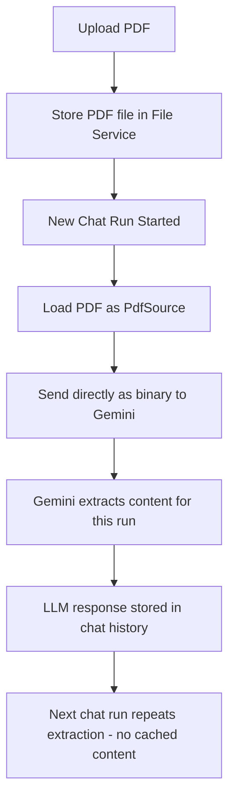
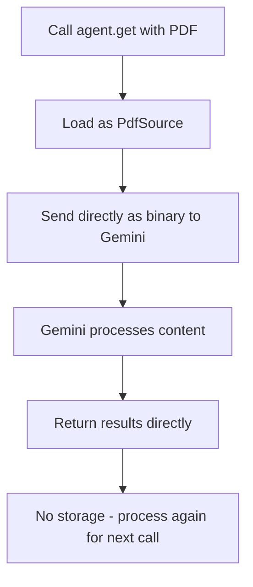
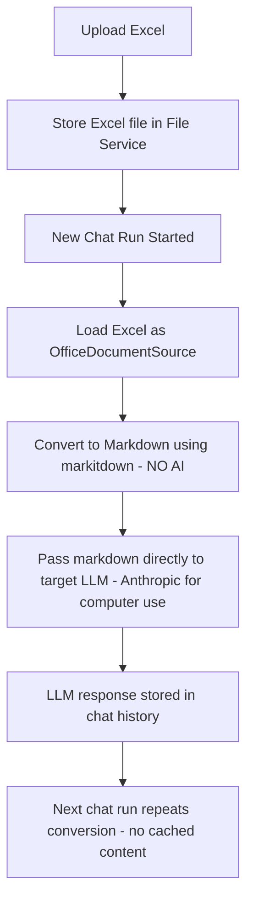
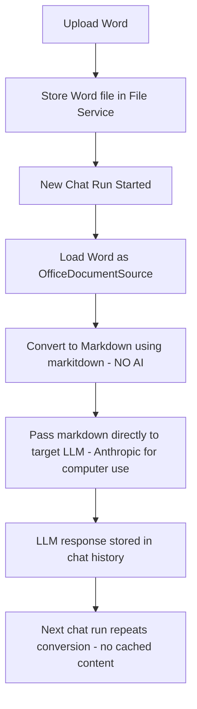
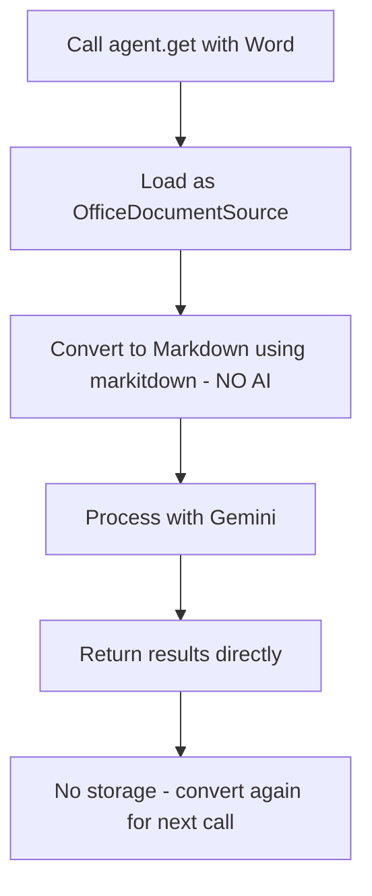
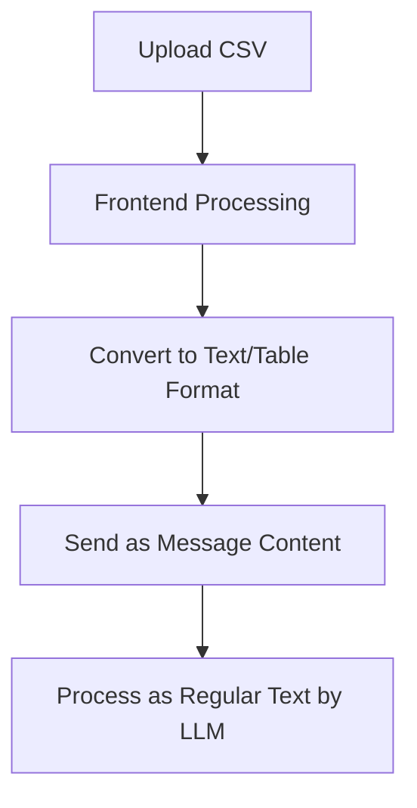

# File Format Support in AskUI Vision Agent

This document provides comprehensive information about how different file formats are supported in the AskUI Vision Agent, including their processing methods and integration with Large Language Models (LLMs).

## Supported File Formats

The AskUI Vision Agent supports the following file formats for data extraction and processing:

### 📄 PDF Files (.pdf)

- **MIME Types**: `application/pdf`
- **Maximum File Size**: 20MB
- **Processing Method**: **Depends on Usage Context**

#### Chat API Usage (File Stored, Extraction Per-Run)

- **File Storage**: PDF files are stored as PDF files, not as extracted text
- **Per-Run Extraction**: Data extraction happens on every chat run using AskUI’s Gemini models (see [translator.py#L67](https://github.com/askui/vision-agent/blob/7993387387c7a5b9e2e813ca4124f8f613d8107b/src/askui/chat/api/messages/translator.py#L67))
- **No Caching**: Currently, no caching mechanism exists - PDF content is re-extracted for each chat run
- **Multiple PDFs**: If multiple PDF files are present, all will be re-extracted on every run
- **Architecture**: PDF file stored → Extract on each chat run → Process with Gemini → LLM response stored in chat history (extracted content not stored)

#### VisionAgent.get() Usage (No History)

- **Per-Query Processing**: Each `get()` command processes the PDF file directly, no history is maintained
- **Always processes original file**: Every query runs against the original PDF file, not cached content
- **No extraction caching**: File is processed fresh for each separate `get()` call
- **Architecture**: PDF → Gemini (direct processing) → Return results → No storage
- **Model Support**:
  - ✅ **Chat API**: AskUI Gemini models extract PDF content on every chat run (no caching)
  - ✅ **VisionAgent.get()**: AskUI Gemini models process PDF directly for each query

#### Processing Workflow for PDF Files

**Chat API Workflow (Per-run extraction):**



**VisionAgent.get() Workflow (Per-query processing):**



#### PDF-Specific Limitations

- **20MB file size limit** for PDF files
- **Processing model restriction**: Only AskUI-hosted Gemini models can process PDFs
- **No caching mechanism**: PDF content is re-extracted on every chat run (both Chat API and VisionAgent.get())
- **Performance impact**:
  - Chat API: PDF re-extracted for each chat run, slower with multiple PDFs
  - VisionAgent.get(): PDF processed for each individual query
- **Multiple PDF overhead**: All PDF files are re-processed on every chat run
- **Future enhancement**: Caching mechanism may be implemented to avoid repeated extraction

### 📊 Excel Files (.xlsx, .xls)

- **MIME Types**:
  - `application/vnd.openxmlformats-officedocument.spreadsheetml.sheet` (.xlsx)
  - `application/vnd.ms-excel` (.xls)
- **Processing Method**: **Depends on Usage Context**

#### Chat API Usage (File Stored, Conversion Per-Run)

- **File Storage**: Excel files are stored as Excel files, not as extracted markdown text
- **Per-Run Conversion**: Files are converted to markdown on every chat run using [`markitdown`](https://github.com/microsoft/markitdown) library (no AI involved)
- **No Caching**: Currently, no caching mechanism exists - Excel content is re-converted for each chat run
- **Multiple Files**: If multiple Excel files are present, all will be re-converted on every run
- **Architecture**: Excel file stored → Convert to markdown on each chat run → Pass directly to target LLM (e.g., Anthropic for computer use) → LLM response stored in chat history (converted content not stored)

#### VisionAgent.get() Usage (No History)

- **Per-Query Processing**: Each `get()` command converts the Excel file to markdown fresh, no history is maintained
- **Always processes original file**: Every query runs against the original Excel file, not cached content
- **No conversion caching**: File is converted fresh for each separate `get()` call
- **Architecture**: Excel → `markitdown` conversion → Gemini processing → Return results → No storage
- **Features**:
  - Sheet names are preserved in the markdown output
  - Tables are converted to markdown table format
  - Optimized for LLM token usage
  - Deterministic conversion process (same input = same output)
  - **No AI in conversion**: `markitdown` performs rule-based conversion
- **Model Support**:
  - ✅ **Chat API**: Converted markdown passed directly to target LLM (e.g., Anthropic for computer use) - no Gemini processing
  - ✅ **VisionAgent.get()**: Only Gemini models can process converted markdown for each query

#### Processing Workflow for Excel Files

**Chat API Workflow (Per-run conversion):**



**VisionAgent.get() Workflow (Per-query conversion):**


#### Excel-Specific Limitations

- **No specific file size limit** mentioned (limited by general upload constraints)
- **No caching mechanism**: Excel content is re-converted on every chat run (both Chat API and VisionAgent.get())
- Conversion quality depends on [`markitdown`](https://github.com/microsoft/markitdown) library capabilities
- Complex formatting may be simplified during markdown conversion
- Embedded objects (charts, complex tables) may not preserve all details
- **Processing model differences**:
  - Chat API: Converted markdown passed directly to target LLM (e.g., Anthropic) - no Gemini processing
  - VisionAgent.get(): Only Gemini models can process converted content
- **No AI in conversion**: Conversion is deterministic and rule-based, not AI-powered
- **Performance impact**:
  - Chat API: Excel re-converted for each chat run, but no additional AI processing overhead
  - VisionAgent.get(): Excel converted for each individual query
- **Multiple file overhead**: All Excel files are re-processed on every chat run
- **Future enhancement**: Caching mechanism may be implemented to avoid repeated conversion

### 📝 Word Documents (.doc, .docx)

- **MIME Types**:
  - `application/vnd.openxmlformats-officedocument.wordprocessingml.document` (.docx)
  - `application/msword` (.doc)
- **Processing Method**: **Depends on Usage Context**

#### Chat API Usage (File Stored, Conversion Per-Run)

- **File Storage**: Word documents are stored as Word files, not as extracted markdown text
- **Per-Run Conversion**: Files are converted to markdown on every chat run using [`markitdown`](https://github.com/microsoft/markitdown) library (no AI involved)
- **No Caching**: Currently, no caching mechanism exists - Word content is re-converted for each chat run
- **Multiple Files**: If multiple Word files are present, all will be re-converted on every run
- **Architecture**: Word file stored → Convert to markdown on each chat run → Pass directly to target LLM (e.g., Anthropic for computer use) → LLM response stored in chat history (converted content not stored)

#### VisionAgent.get() Usage (No History)

- **Per-Query Processing**: Each `get()` command converts the Word file to markdown fresh, no history is maintained
- **Always processes original file**: Every query runs against the original Word file, not cached content
- **No conversion caching**: File is converted fresh for each separate `get()` call
- **Architecture**: Word → `markitdown` conversion → Gemini processing → Return results → No storage
- **Features**:
  - Layout and formatting preserved as much as possible
  - Tables converted to HTML tables within markdown
  - Deterministic conversion process (same input = same output)
  - No AI-generated image descriptions during conversion (handled by `markitdown`)
  - **No AI in conversion**: `markitdown` performs rule-based conversion
- **Model Support**:
  - ✅ **Chat API**: Converted markdown passed directly to target LLM (e.g., Anthropic for computer use) - no Gemini processing
  - ✅ **VisionAgent.get()**: Only Gemini models can process converted markdown for each query

#### Processing Workflow for Word Documents

**Chat API Workflow (Per-run conversion):**



**VisionAgent.get() Workflow (Per-query conversion):**



#### Word Document-Specific Limitations

- **No specific file size limit** mentioned (limited by general upload constraints)
- **No caching mechanism**: Word content is re-converted on every chat run (both Chat API and VisionAgent.get())
- Conversion quality depends on [`markitdown`](https://github.com/microsoft/markitdown) library capabilities
- Complex formatting may be simplified during markdown conversion
- Embedded objects (charts, complex tables) may not preserve all details
- **Processing model differences**:
  - Chat API: Converted markdown passed directly to target LLM (e.g., Anthropic) - no Gemini processing
  - VisionAgent.get(): Only Gemini models can process converted content
- **No AI in conversion**: Conversion is deterministic and rule-based, not AI-powered
- **Performance impact**:
  - Chat API: Word re-converted for each chat run, but no additional AI processing overhead
  - VisionAgent.get(): Word converted for each individual query
- **Multiple file overhead**: All Word files are re-processed on every chat run
- **Future enhancement**: Caching mechanism may be implemented to avoid repeated conversion

### 📈 CSV Files (.csv)

- **Status**: **Not directly supported by the backend**
- **Likely Processing**: CSV files are most probably converted to text on the frontend and sent to the chat API as plain text content
- **Note**: No specific CSV processing logic was found in the backend codebase, suggesting frontend preprocessing

#### Processing Workflow for CSV Files



#### CSV-Specific Limitations

- **No backend support**: CSV processing happens on the frontend only
- **Limited functionality**: No specialized CSV parsing or structure preservation
- **Text-only processing**: Treated as regular text content by the LLM
- **No file size limits**: Since processing happens on frontend, backend file limits don’t apply

## Processing Architecture

### File Upload and Storage

1. **File Upload**: Files are uploaded via the Chat API (`/v1/files` endpoint)
2. **Storage**: Files are stored locally in the chat data directory with metadata
3. **Size Limits**:
   - **PDF files**: 20MB maximum file size
   - **Office documents**: No specific size limit mentioned (limited by general upload constraints)
4. **MIME Type Detection**: Automatic MIME type detection using the `filetype` library

## Technical Implementation Details

### Key Components

#### 1. Source Utilities (`src/askui/utils/source_utils.py`)

- Handles file type detection and source loading
- Supports MIME types: PDF, Excel (.xlsx, .xls), Word (.docx, .doc)
- Creates appropriate source objects (`PdfSource`, `OfficeDocumentSource`, `ImageSource`)

#### 2. Markdown Conversion (`src/askui/utils/markdown_utils.py`)

- Uses Microsoft’s [`markitdown`](https://github.com/microsoft/markitdown) library for Office document conversion
- Provides `convert_to_markdown()` function for file-to-markdown conversion
- **No AI involved**: `markitdown` performs deterministic, rule-based conversion
- Supports multiple formats: PDF, PowerPoint(used), Word (used), Excel (used), Images, Audio, HTML, and more

#### 3. Model-Specific Processing

- **Google Gemini API** (`src/askui/models/askui/google_genai_api.py`):
  - **Initial Processing Only**: Direct PDF processing (binary data) and Office document processing during upload
  - Currently the only models that support initial document processing during upload
  - Once extracted, the text is stored in chat history for all models to use
- **Anthropic Models**: Can process extracted document text from chat history, primary LLM for computer use tasks

#### 4. Chat API Integration

- **File Service** (`src/askui/chat/api/files/service.py`): Handles file upload and storage
- **Message Translator** (`src/askui/chat/api/messages/translator.py`): Converts files to LLM-compatible format during upload
- **Chat Message History**: Stores extracted document text for future reference by any model

### Dependencies

The following key dependencies enable file format support:

- `markitdown[xls,xlsx,docx]>=0.1.2`: Non-AI Office document conversion during upload (see [Microsoft MarkItDown](https://github.com/microsoft/markitdown))
- `filetype>=1.2.0`: MIME type detection
- `google-genai>=1.20.0`: One-time PDF processing during upload for Gemini models

## Usage Examples

### Chat API Frontend Implementation

The Chat API provides comprehensive document processing capabilities on the frontend, including file upload, processing, and interaction flows for a complete user experience from uploading documents to receiving processed responses.

### Processing Excel Files

#### Using VisionAgent.get() (Per-query conversion)

```python
from askui import VisionAgent
from askui.models.models import ModelName
with VisionAgent() as agent:
    # Excel converted to markdown fresh for each get() call - no history maintained    result1 = agent.get(
        "Extract the quarterly sales data",
        source="sales_report.xlsx",  # File converted to markdown each time        model=ModelName.ASKUI__GEMINI__2_5__FLASH  # Only Gemini models support documents    )
    # This call converts the Excel to markdown again from scratch    result2 = agent.get(
        "Find the highest revenue month",
        source="sales_report.xlsx",  # File converted again, no cached content        model=ModelName.ASKUI__GEMINI__2_5__FLASH
    )
```

#### Using Chat API (Per-run conversion, no caching)

```python
# When using the Chat API, Excel files are stored but content is re-converted# on every chat run - no caching mechanism currently exists## Example: If you have 2 Excel files uploaded and start a new chat:# - Both Excel files will be converted to markdown by markitdown again# - This happens for every new chat run# - Future enhancement: caching may be implemented to avoid repeated conversion
```

**Frontend Implementation Reference:**
The Chat API provides a complete flow from file upload to processing with comprehensive document handling capabilities.

### Processing PDF Files

#### Using VisionAgent.get() (Per-query processing)

```python
from askui import VisionAgent
from askui.models.models import ModelName
with VisionAgent() as agent:
    # PDF processed fresh for each get() call - no history maintained    result1 = agent.get(
        "Summarize the main points",
        source="document.pdf",  # File processed directly each time        model=ModelName.ASKUI__GEMINI__2_5__FLASH  # Only Gemini models support PDFs    )
    # This call processes the PDF again from scratch    result2 = agent.get(
        "Extract key dates",
        source="document.pdf",  # File processed again, no cached content        model=ModelName.ASKUI__GEMINI__2_5__FLASH
    )
```

#### Using Chat API (Per-run extraction, no caching)

```python
# When using the Chat API, PDF files are stored but content is re-extracted# on every chat run - no caching mechanism currently exists## Example: If you have 3 PDF files uploaded and start a new chat:# - All 3 PDFs will be processed by Gemini again# - This happens for every new chat run# - Future enhancement: caching may be implemented to avoid repeated extraction
```

### Processing Word Documents

#### Using VisionAgent.get() (Per-query conversion)

```python
from askui import VisionAgent
from askui.models.models import ModelName
with VisionAgent() as agent:
    # Word converted to markdown fresh for each get() call - no history maintained    result1 = agent.get(
        "Extract all action items",
        source="meeting_notes.docx",  # File converted to markdown each time        model=ModelName.ASKUI__GEMINI__2_5__FLASH  # Only Gemini models support documents    )
    # This call converts the Word document to markdown again from scratch    result2 = agent.get(
        "Find all mentioned dates",
        source="meeting_notes.docx",  # File converted again, no cached content        model=ModelName.ASKUI__GEMINI__2_5__FLASH
    )
```

#### Using Chat API (Per-run conversion, no caching)

```python
# When using the Chat API, Word files are stored but content is re-converted# on every chat run - no caching mechanism currently exists## Example: If you have 3 Word files uploaded and start a new chat:# - All 3 Word files will be converted to markdown by markitdown again# - This happens for every new chat run# - Future enhancement: caching may be implemented to avoid repeated conversion
```

## General Limitations and Considerations

- **Processing Model Restriction**: Currently, only Gemini models support document processing
- **No Caching Mechanism**: All document files (PDF, Excel, Word) are re-processed on every chat run and VisionAgent.get() call
- **File Storage Only**: Files are stored as original files, not as extracted/converted content
- **Runtime Conversion**: Document processing happens on runtime to create LLM-compatible messages
- **Chat History Storage**: LLM responses (e.g., from Anthropic computer use) are stored in chat history, but processed document content is not
- **Performance Impact**: Multiple documents mean multiple processing operations on every run

### Performance Considerations

- **No caching**: All document files are re-processed on every chat run and VisionAgent.get() call
- **Multiple file overhead**: Having multiple documents significantly impacts performance as all are re-processed
- **Processing types**:
  - PDFs: Re-extracted by Gemini on every run (AI processing overhead)
  - Office documents: Re-converted by `markitdown` on every run (fast, deterministic, no AI overhead)
- **Chat API vs VisionAgent.get()**: Both follow the same pattern - no caching, always re-process
- Currently limited to Gemini models for document processing, which may create processing bottlenecks

## Model Compatibility Matrix

| File Format         | AskUI Gemini                             | Anthropic Claude                          | OpenRouter                                | AskUI Inference API                       |
| ------------------- | ---------------------------------------- | ----------------------------------------- | ----------------------------------------- | ----------------------------------------- |
| PDF (.pdf)          | ✅ Direct Processing (per-run/per-query) | ❌ Not Supported                          | ❌ Not Supported                          | ❌ Not Supported                          |
| Excel (.xlsx, .xls) | ✅ VisionAgent.get() only                | ✅ Chat API (receives converted markdown) | ✅ Chat API (receives converted markdown) | ✅ Chat API (receives converted markdown) |
| Word (.docx, .doc)  | ✅ VisionAgent.get() only                | ✅ Chat API (receives converted markdown) | ✅ Chat API (receives converted markdown) | ✅ Chat API (receives converted markdown) |
| CSV (.csv)          | ⚠️ Frontend Only                       | ⚠️ Frontend Only                        | ⚠️ Frontend Only                        | ⚠️ Frontend Only                        |

**Legend:**

- ✅ Fully Supported
- ⚠️ Limited Support
- ❌ Not Supported

## Best Practices

1. **Understand Model Usage**:
   - **PDFs**: Only Gemini models can process PDFs (both Chat API and VisionAgent.get())
   - **Office docs (Chat API)**: Converted markdown passed directly to target LLM (e.g., Anthropic)
   - **Office docs (VisionAgent.get())**: Only Gemini models can process converted content
2. **Understand Processing Flow**:
   - Office docs (Chat API): `markitdown` (non-AI) conversion → Direct to target LLM (e.g., Anthropic)
   - Office docs (VisionAgent.get()): `markitdown` (non-AI) conversion → Gemini processes converted content
   - PDFs: Direct binary processing by Gemini on every run/query → No caching
3. **Optimize File Size**: Keep PDF files under 20MB (required limit); Office documents have no specific size limit
4. **Test Document Quality**: Verify that processed documents maintain essential information
5. **Handle CSV Frontend**: Implement CSV processing on the frontend before sending to the API

## Future Enhancements

Potential areas for improvement:

- **PDF Caching Mechanism**: Implement caching to avoid re-extracting PDF content on every chat run
- **Expand Model Support**: Enable document processing for other models (Anthropic, OpenRouter, etc.)
- **Native CSV Support**: Add backend CSV processing capabilities
- **Additional Formats**: Support for PowerPoint, RTF, and other document formats
- **Enhanced Processing Pipeline**: Optimize document conversion and query processing
- **Improved Formatting**: Better preservation of complex document structures
- **Larger PDF Support**: Streaming processing for PDF files larger than 20MB
- **Multi-Model Architecture**: Allow different models for document extraction vs. computer use tasks
- **Intelligent Caching**: Cache extracted content
