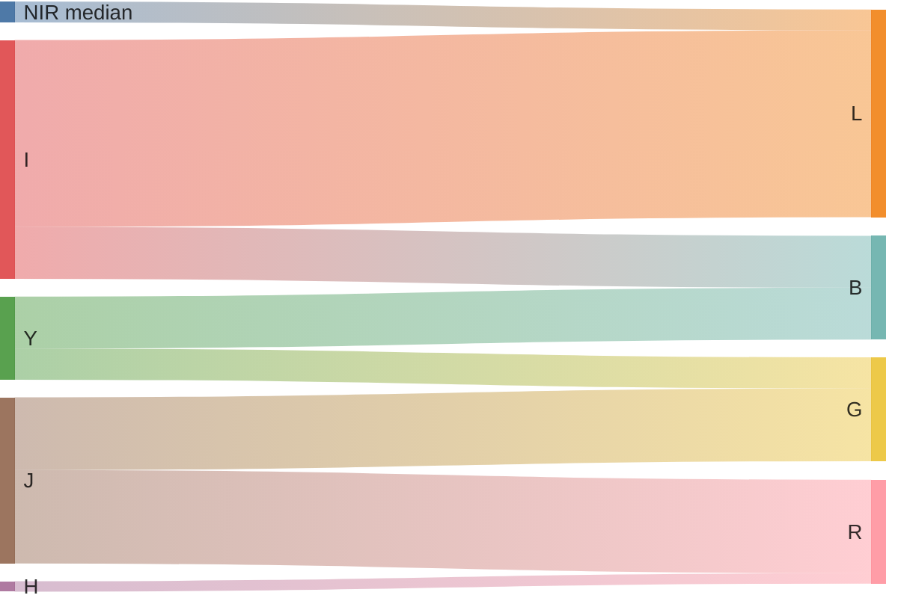

# Process

## Basics

Command `azul process` generates a defect-inpainted color image of a tile from input MER data retrieved with `azul retrieve`.



We want to output an RGB image from four input channels: one VIS (I) and three NIR bands (Y, J, H).
We decide to keep the wavelength ordering: I < Y < J < H.
Two adjacent input channels may contribute to an output channel, e.g. Y and J may contribute to G.
An input channel may contribute to two adjacent output channels, e.g. Y may contribute to B and G.
Resolution in I is better than in other channels, therefore it has higher weight in the output intensity (more precisely, lightness).
Different weight parameters control the different contributions.

The dynamic range is asinh-scaled, which yields pleasing results for both low- and high-energy regions.
The function is linear-like for low values and log-like for high values.
Scaling is controlled by two bounds -- black and white points -- and a stretching parameter which sets the transition point between linear-like scaling and log-like scaling.
They are expressed in AB magnitude, such that a higher value corresponds to a lower intensity.

Pixels with a null value are inpainted, but many defects remain.
Relying on bitmasks to detect them and decide on the inpainting technique would be better, especially for VIS ghosts, yet I did not find a satisfying selection method, which would work both for WIDE and DEEP tiles...

## Algorithm

The script proceeds as follows:

1. Inpaint bad pixels, i.e. the ones with value 0.
1. Sharpen each channel with an unsharp masking filter of given full-width at half maximum (`--fwhm`) and strength (`--shapen`);
This step is disabled if the strength is 0.
1. Scale each channel according to its zero point (`--zero`) and gain parameter (`--scaling`).
1. Stretch the dynamic range with asinh function, using white point (`-w`), offset parameter (opposite of black point, `-b`), and stretch parameter (`-a`) as AB magnitudes.
1. Blend IYJH channels into RGB and lightness (L) channels according to the various flux parameters (`--ib`, `--yg`, `--jr`, `--nirl`).
1. Shift hue (`--hue`) and boost color saturation (`--saturation`).
1. Adjust the colorwise response curves by specifying interpolating spline knots (`--curves`).

## Inputs

Input files are discovered according to their names in the [tile folder](workspace.md) and a glob pattern.
For more details, see help messages of options `--workspace` and `--input` with `azul -h`.
When several files are given for a single channel, they are stacked as the median image.

## Output(s)

The script results in a 16-bit TIFF, 8-bit PNG or 8-bit compressed JPG depending on the extension of the file name parameter (`-o`).
In this file name, any occurence of `{workspace}` (resp. `{tile}`) will be replaced with the workspace path (resp. the actual tile index).

Intermediate images are saved when the file name contains `{step}`.
The latter will be replaced with the name of the intermediate step as follows:

* `mask` -- The bad pixel map is saved with color coding, where 0 means the pixel is good,
and grey (resp. blue, green, red) means the I (resp. Y, J, H) channel is bad.
* `blended` -- The RGB image is saved before curve adjustment.
* `adjusted` -- This is the final image.

For example, using the default template `{workspace}/{tile}/{tile}_{step}.tiff`,
the mask of tile 102159776 will be saved as `102159776_mask.tiff` in the tile folder.
If, instead, `-o {workspace}/{tile}.jpg` is used, then the output will be a simple JPG file in the workspace and no intermediate steps will be saved.

## Resources and cropping

In its current version, the script may be very memory-greedy and runs on a single core.
Below is a typical profiling for DEEP and WIDE tiles, including elapsed time and peak RAM usage for each step.
Theses numbers are printed step-by-step during the execution of `azul process`.
Walltime will depend on the CPU while RAM usage should be stable across architectures.

|            | DEEP         | WIDE         |
| ---------- | ------------ | ------------ |
| Shape      | 10k x 10k px | 20k x 20k px |
| Reading    |  10 s,  3 GB |  10 s,  6 GB |
| Inpainting |  25 s,  7 GB | 110 s, 28 GB |
| Sharpening |   5 s,  3 GB |  70 s, 12 GB |
| Stretching |   5 s,  2 GB |  25 s,  8 GB |
| Blending   |  20 s,  6 GB |  70 s, 22 GB |
| Adjustment |  10 s,  4 GB |  25 s, 12 GB |
| OVERALL    |  75 s,  7 GB | 310 s, 28 GB |

Scalability is roughly linear, such that you should be able to interpolate the needs wrt. the input shape.
In order to lower the memory consumption, it is possible to crop the image with numpy's syntax, e.g. for the top-left quarter (x < 5000, y >= 5000):

```
azul process 102159776[5000:,:5000]
```

The region to be rendered can also be selected graphically with `azul crop`.
