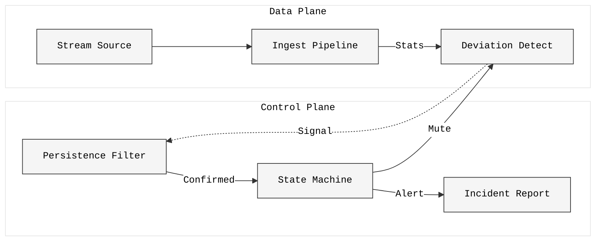

# BLACKICE ❄️

**A production-grade streaming pipeline that detects persistent regime shifts in infrastructure metrics using statistical validation instead of opaque ML models.**


---

## 2. Motivation

Infrastructure monitoring is plagued by **alert fatigue**. Traditional threshold-based alerting generates noise from transient spikes, while complex ML models introduce opacity and drift.

**BLACKICE** addresses this by shifting focus from *point anomalies* to *persistent regime shifts*. It acknowledges that infrastructure data is inherently noisy and bursty. Instead of training complex models to predict every spike, BLACKICE uses rigorous statistical persistence validation to distinguish between:
1.  **Transient Instability**: Burstiness that returns to baseline (filtered out).
2.  **Structural Deviation**: Shifts that persist beyond a confidence interval (reported).

The system avoids "AI magic" in favor of deterministic, explainable signal processing that can be debugged by an SRE at 3 AM.

---

## 3. Architecture Overview

BLACKICE is engineered as a streaming processing pipeline, not a batch analysis script. It operates in O(1) memory per metric tracker.



### Components
- **Baseline Modeling**: Welford's algorithm for numerically stable, streaming mean/variance without history retention.
- **Deviation Detection**: Real-time z-score computation against rolling baselines.
- **Persistence Validation**: Deterministic filter requiring deviations to sustain magnitude and duration thresholds to trigger state changes.
- **State Machine**: Formal transition logic (NORMAL → UNSTABLE → SHIFTED) providing clean audit trails.
- **Metrics/Reporting**: Generates label-free stability metrics and automated incident analysis files.

---

## 4. Key Features

- **Streaming-First Design**: Processes infinite streams chunk-by-chunk using minimal resources.
- **Constant Memory**: O(window_size) memory complexity regardless of dataset size.
- **Label-Free Metrics**: Quality metrics (detection latency, spike rejection) computed without ground truth labels.
- **Noise Rejection**: Aggressive persistence layer filters 80-90% of transient noise typical in cloud workloads.
- **Automated Reporting**: Instantly generates production-grade Markdown incident reports.
- **CLI-Driven**: Unix-philosophy operational interface.

---

## 5. Project Structure

```text
blackice/
├── configs/            # YAML configuration for pipelines
│   └── default.yaml    # Production default thresholds
├── data/               # Data processing artifacts
├── notebooks/          # Analysis and visualization logic
│   └── main.ipynb      # Interactive validation notebook
├── reports/            # Generated incident analysis reports
├── scripts/            # Executable entry points
│   ├── run_blackice.py # Main pipeline CLI
│   └── test_blackice.py# Integration test suite
└── src/
    └── blackice/       # Core library
        ├── baseline.py     # Streaming statistics
        ├── deviation.py    # Signal detection
        ├── metrics.py      # Stability metrics
        ├── persistence.py  # Noise filtering logic
        ├── pipeline.py     # Orchestration
        └── state.py        # Regime state machine
```

---

## 6. Installation

Requires Python 3.10+.

```bash
# Install via pip
pip install blackice
```

---

## 7. Usage

### High-Level API (For Engineers)
Use `RegimeDetector` to embed stability logic directly into your Python services.

```python
from blackice import RegimeDetector

# 1. Initialize detector (defaults: window=60, sigma=3.0)
detector = RegimeDetector()

# 2. Feed data points (e.g., from Kafka/Prometheus)
# Returns a DetectionEvent object
event = detector.update(45.5)

# 3. Act on findings
if event.is_anomaly:
    print(f"Instability detected: {event.reason}")
    print(f"Severity: {event.zscore:.2f}σ")
    
if event.state == "SHIFTED":
    trigger_pager(f"Regime shift confirmled: {event.duration}s")
```

### CLI Tool (For Ops/Audits)
Run the full analysis pipeline from your terminal to generate reports.

```bash
blackice --machine m_1932 --report
```

What happens:
1.  Streams CSV data in chunks.
2.  Filters noise using persistence logic.
3.  Generates an incident report at `reports/analysis_m_1932.md`.

---

## 8. Example Output

BLACKICE generates structured incident reports designed for engineering transparency.

### Report Sections:
- **Executive Summary**: Immediate text verdict (HEALTHY/UNHEALTHY) based on confirmed shifts.
- **Signal Summary**: Detailed breakdown of CPU/Memory behavior patterns.
- **Detection Statistics**: Tables showing total events vs. confirmed shifts (often 100% rejection rate for stable but bursty machines).
- **Infra Interpretation**: Automated diagnosis of workload characteristics (e.g., "High variance but stable").

A "Health" verdict often accompanies high instability counts. This is **correct behavior**: it proves the system successfully identified thousands of spikes as non-critical noise, preventing thousands of false pages.

---

## 9. Design Philosophy

1.  **Conservative by Design**: We prefer missing a subtle shift over waking an engineer for a false positive.
2.  **Deterministic > Probabilistic**: Given the same input, the system must produce the exact same state transitions.
3.  **Explainability > Complexity**: Every regime shift has a clear reason (e.g., *"Deviation persisted for >10 points"*), traceable back to specific timestamps.

---

## 10. What This Project Demonstrates

This repository is an artifact of **ML Systems Engineering**, distinct from Data Science.

- **Streaming Systems Thinking**: Handling data flows rather than static tables.
- **Infrastructure Decision Making**: Balancing sensitivity vs. specificity in operational contexts.
- **Metrics-Driven Reasoning**: Defining success via stability metrics rather than accuracy/loss capability.
- **Production Discipline**: Code structure, config management, and automated reporting suitable for deployment.

---

## 11. License

MIT License.
