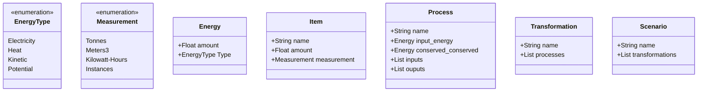

# Belt Data models

```mermaid
classDiagram
      class EnergyType {
          <<enumeration>>
	  Electricity
          Heat
	  Kinetic
          Potential
      }
      class Measurement {
          <<enumeration>>
	  Tonnes
          Meters3
	  Kilowatt-Hours
          Instances
      }
      class Energy {
          +Float amount
          +EnergyType Type
      }
      class Item {
	  +String name
          +Float amount
          +Measurement measurement
      }
      class Process {
          +String name
          +Energy input_energy
          +Energy conserved_conserved
          +List<Item> inputs
          +List<Item> ouputs
      }
      class Transformation {
          +String name
          +List<Process> processes
      }
      class Scenario {
          +String name
          +List<Transformation> transformations
      }
```
