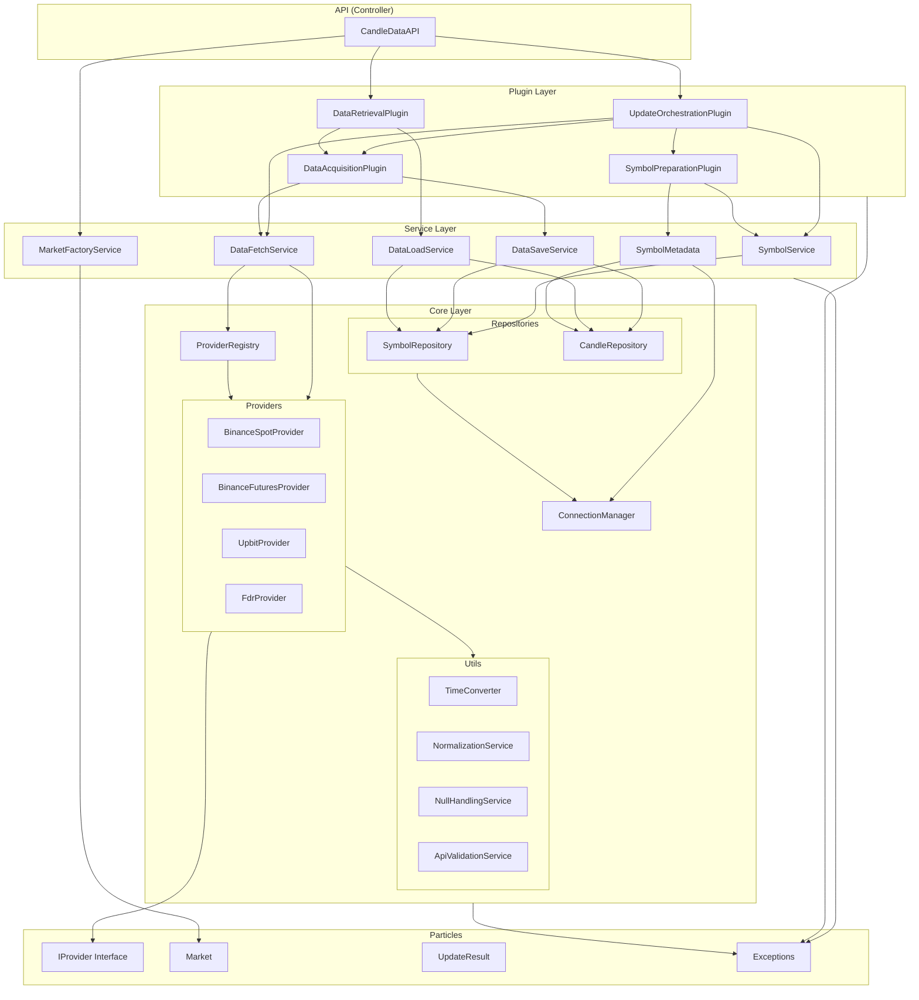
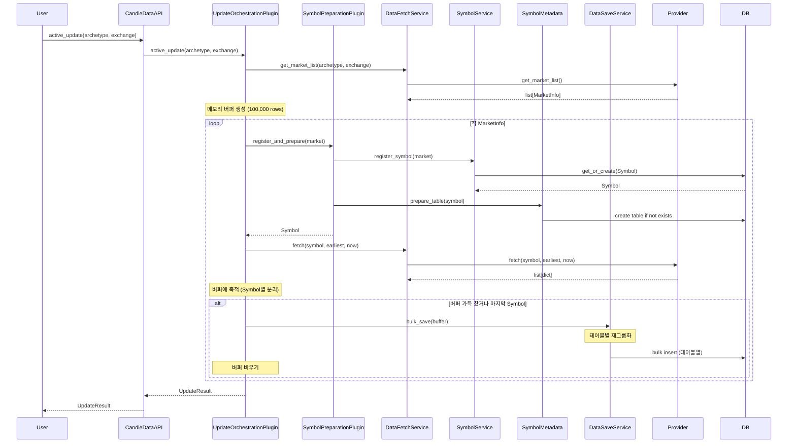
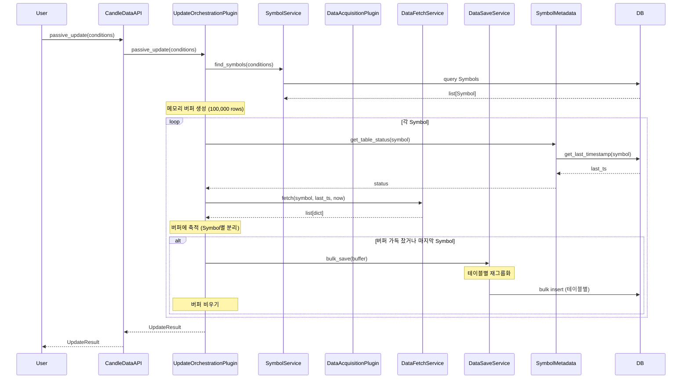
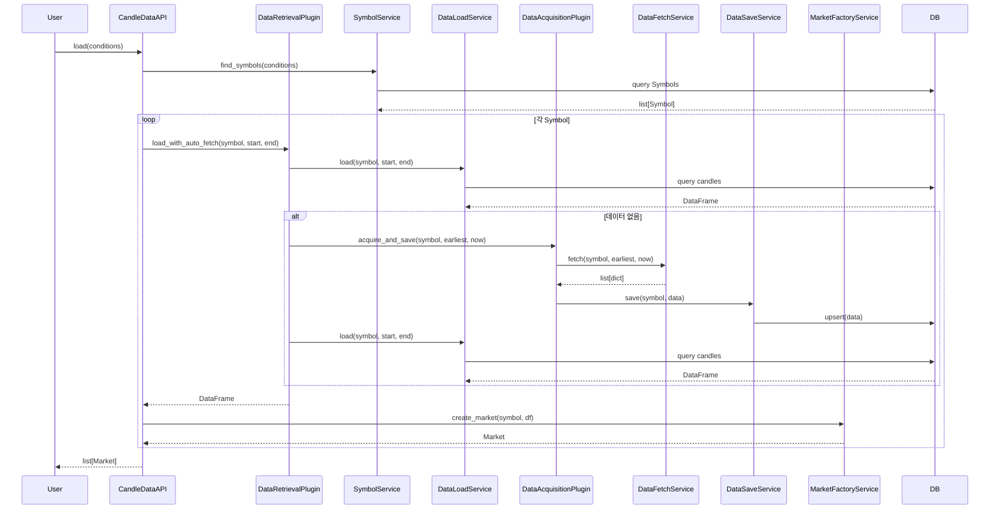

# Architecture - CandleDataManager

## 개요

캔들 데이터의 획득, 저장, 조회, 관리를 일원화하는 통합 시스템.
다양한 거래소(Binance, Upbit, KRX 등)의 캔들 데이터를 표준화된 방식으로 수집하고,
데이터베이스에 저장하며, 조건 기반으로 조회하는 단일 진입점을 제공한다.

## 목표

1. **데이터 획득 통합**: 여러 거래소 API를 하나의 인터페이스로 통합
2. **저장소 자동화**: Symbol 기반 테이블 자동 생성 및 관리
3. **Active/Passive Update**: 신규 Symbol 등록 및 전체 수집 / 기존 Symbol 증분 갱신
4. **유연한 조회**: 조건 조합으로 다수 Symbol 데이터 동시 로드
5. **자동 획득**: 데이터 없는 Symbol 로드 시 자동 수집

## 패턴

**CPSCP (Controller-Plugin-Service-Core-Particles)**

- Controller: 사용자 API 제공, Plugin 조합으로 최상위 워크플로우 구성
- Plugin: 여러 Service 조합하여 중간 수준의 복합 작업 수행
- Service: 재사용 가능한 단일 책임 기능 단위, Core만 의존
- Core: Provider 구현체, Repository, 유틸리티
- Particles: 인터페이스, 데이터 구조, 예외

## 전체 아키텍처



## 주요 워크플로우

### 1. Active Update (메모리 버퍼링)



### 2. Passive Update (메모리 버퍼링)



### 3. Data Load (자동 획득)



## 컴포넌트 책임

### Controller (API)

#### CandleDataAPI
- 패키지의 단일 진입점
- Plugin 조합으로 최상위 워크플로우 구성
- 사용자에게 단순한 인터페이스 제공

**주요 메서드:**
```python
def active_update(archetype=None, exchange=None, tradetype=None) -> UpdateResult
def passive_update(archetype=None, exchange=None, tradetype=None, ...) -> UpdateResult
def load(archetype=None, exchange=None, ..., start_at=None, end_at=None, limit=None) -> list[Market]
def get_symbol(symbol_str: str) -> Symbol
```

### Plugin

#### UpdateOrchestrationPlugin
- Active/Passive Update 조율
- 여러 Symbol에 대한 업데이트 반복 처리
- 메모리 버퍼 관리 (100,000 rows)
- 실패한 Symbol 수집 및 결과 보고

**사용하는 Service/Plugin:**
- SymbolPreparationPlugin
- SymbolService
- DataFetchService
- DataSaveService
- SymbolMetadata

**메모리 버퍼 구조:**
```python
buffer: dict[Symbol, list[dict]] = {}
buffer_row_count: int = 0
```

**버퍼 관리 로직:**
1. Symbol별로 데이터 분리 저장 (추적 용이성)
2. 총 row 수가 100,000 도달 시 bulk_save 호출
3. DataSaveService가 테이블별로 재그룹화하여 insert
4. 버퍼 비우기

**주요 메서드:**
```python
def active_update(archetype, exchange, tradetype) -> UpdateResult:
    """마켓 리스트 획득 → Symbol 등록 → 전체 데이터 수집

    메모리 버퍼 사용:
    - 각 Symbol 데이터를 buffer[symbol]에 축적
    - 100,000 rows 도달 시 bulk_save
    """

def passive_update(conditions, buffer_size=100000) -> UpdateResult:
    """기존 Symbol의 증분 업데이트

    메모리 버퍼 사용:
    - 각 Symbol 데이터를 buffer[symbol]에 축적
    - 100,000 rows 도달 시 bulk_save
    """
```

#### DataRetrievalPlugin
- 데이터 로드 + 없으면 자동 획득
- Load → 빈 결과 → Fetch → Save → Load 흐름 조율

**사용하는 Service/Plugin:**
- DataLoadService
- DataAcquisitionPlugin

**주요 메서드:**
```python
def load_with_auto_fetch(symbol, start_at, end_at) -> pd.DataFrame
```

#### DataAcquisitionPlugin
- Fetch + Save 조합
- 단일 작업: 데이터 획득 후 즉시 저장

**사용하는 Service:**
- DataFetchService
- DataSaveService

**주요 메서드:**
```python
def acquire_and_save(symbol, start_at, end_at) -> None
```

#### SymbolPreparationPlugin
- Symbol 등록 + 테이블 준비 조합
- 단일 작업: Symbol 생성 및 DB 준비

**사용하는 Service:**
- SymbolService
- SymbolMetadata

**주요 메서드:**
```python
def register_and_prepare(archetype, exchange, tradetype, base, quote, timeframe, **optional) -> Symbol
```

### Service

**원칙: Service는 Core만 의존, Service 간 의존성 금지**

#### SymbolService
- Symbol 등록/조회
- 조건 기반 Symbol 필터링

**의존하는 Core:**
- SymbolRepository

**주요 메서드:**
```python
def register_symbol(archetype, exchange, tradetype, base, quote, timeframe, **optional) -> Symbol
def find_symbols(**conditions) -> list[Symbol]
def get_by_string(symbol_str: str) -> Symbol
```

#### DataFetchService
- Provider 선택 및 데이터 획득
- 마켓 리스트 조회
- 데이터 범위 확인

**의존하는 Core:**
- ProviderRegistry
- Providers

**주요 메서드:**
```python
def fetch(symbol: Symbol, start_at: int, end_at: int) -> list[dict]
def fetch_all_data(symbol: Symbol) -> list[dict]
def get_market_list(archetype: str, exchange: str, tradetype: str) -> list[dict]
```

#### DataSaveService
- 캔들 데이터 저장
- Bulk insert 최적화 (테이블별 재그룹화)
- last_timestamp 갱신

**의존하는 Core:**
- CandleRepository
- SymbolRepository
- ConnectionManager

**주요 메서드:**
```python
def save(symbol: Symbol, data: list[dict]) -> None
    """단일 Symbol 데이터 저장"""

def bulk_save(buffer: dict[Symbol, list[dict]]) -> None:
    """여러 Symbol 데이터를 테이블별로 재그룹화하여 bulk insert

    처리 과정:
    1. Symbol별 데이터를 테이블명으로 재그룹화
       - 예: BTC-USDT-1h, ETH-USDT-1h → candles_1h 테이블

    2. 통합 테이블 처리
       - 같은 테이블의 모든 데이터 통합
       - symbol_id 컬럼 추가
       - 한번에 bulk insert

    3. 개별 테이블 처리
       - Symbol별로 독립적인 테이블
       - 각 테이블에 개별 bulk insert

    결과: 테이블 개수만큼 bulk insert 실행
    """
```

**알고리즘 예시:**
```
입력 버퍼:
{
    Symbol(BTC-USDT-1h): [1000 rows],
    Symbol(ETH-USDT-1h): [2000 rows],
    Symbol(BTC-USDT-1m): [50000 rows],
    Symbol(ETH-USDT-1m): [47000 rows]
}

1단계 재그룹화:
{
    'candles_1h': [
        (BTC-USDT-1h, 1000 rows),
        (ETH-USDT-1h, 2000 rows)
    ],
    'candles_crypto_binance_spot_btc_usdt_1m': [
        (BTC-USDT-1m, 50000 rows)
    ],
    'candles_crypto_binance_spot_eth_usdt_1m': [
        (ETH-USDT-1m, 47000 rows)
    ]
}

2단계 bulk insert:
- candles_1h: 3000 rows 한번에 (symbol_id로 구분)
- candles_crypto_binance_spot_btc_usdt_1m: 50000 rows
- candles_crypto_binance_spot_eth_usdt_1m: 47000 rows

총 3번의 bulk insert 실행
```

#### DataLoadService
- DB에서 캔들 데이터 로드
- DataFrame 변환

**의존하는 Core:**
- CandleRepository
- SymbolRepository

**주요 메서드:**
```python
def load(symbol: Symbol, start_at=None, end_at=None, limit=None) -> pd.DataFrame
```

#### MarketFactoryService
- Symbol + DataFrame → Market 객체 생성

**의존하는 Particles:**
- Market

**주요 메서드:**
```python
def create_market(symbol: Symbol, candles: pd.DataFrame) -> Market
```

#### SymbolMetadata (기존)
- 테이블 준비 (자동 생성)
- 테이블 상태 조회

**의존하는 Core:**
- CandleRepository
- ConnectionManager

### Core

#### ProviderRegistry
- Symbol → 적절한 Provider 선택
- Provider 인스턴스 캐싱

**주요 메서드:**
```python
def get_provider(symbol: Symbol) -> IProvider
def get_providers_by_condition(archetype=None, exchange=None, tradetype=None) -> list[IProvider]
```

#### Providers
각 거래소의 구체 구현 (IProvider 구현)

- **BinanceSpotProvider**: Binance Spot 데이터 제공
- **BinanceFuturesProvider**: Binance Futures 데이터 제공
- **UpbitProvider**: Upbit 데이터 제공
- **FdrProvider**: 주식 데이터 제공 (KRX, NYSE 등)

**공통 메서드 (IProvider):**
```python
def fetch(symbol: Symbol, start_at: int, end_at: int) -> list[dict]
def get_market_list() -> list[dict]
def get_data_range(symbol: Symbol) -> tuple[int | None, int | None]
```

#### Repositories (기존)
- **SymbolRepository**: Symbol CRUD
- **CandleRepository**: 동적 캔들 테이블 관리

#### ConnectionManager (기존)
- DB 연결 풀 관리
- 세션/커넥션 제공

#### Utils
Provider에서 사용하는 공통 유틸리티

- **TimeConverter**: 다양한 시간 형식 → Unix timestamp
- **NormalizationService**: 거래소별 데이터 정규화
- **NullHandlingService**: Null 값 처리
- **ApiValidationService**: API 키 검증

### Particles

#### IProvider (Protocol)
Provider가 구현해야 할 인터페이스

```python
class IProvider(Protocol):
    @property
    def archetype(self) -> str: ...

    @property
    def exchange(self) -> str: ...

    @property
    def tradetype(self) -> str: ...

    def fetch(self, symbol: Symbol, start_at: int, end_at: int) -> list[dict]: ...
    def get_market_list() -> list[dict]: ...
    def get_data_range(symbol: Symbol) -> tuple[int | None, int | None]: ...
```

#### Market
Symbol과 캔들 데이터를 래핑

```python
@dataclass
class Market:
    symbol: Symbol
    candles: pd.DataFrame
```

#### UpdateResult
Active/Passive Update 결과

```python
@dataclass
class UpdateResult:
    success_symbols: list[Symbol]
    failed_symbols: list[tuple[Symbol, str]]  # (symbol, reason)
    total_rows: int
```

#### Exceptions (기존)
- ProviderNotImplementedError
- NoApiKeyError
- ServerNotRespondedError
- InvalidDataError

## 의존성 흐름

```
Particles (IProvider, Market, UpdateResult, Exceptions)
    ↑
Core (Providers, Repositories, Utils, ProviderRegistry)
    ↑
Service (SymbolService, DataFetchService, DataSaveService, DataLoadService, MarketFactoryService)
    ↑ (Service는 Core만 의존, Service 간 의존 금지)
Plugin (UpdateOrchestrationPlugin, DataRetrievalPlugin, DataAcquisitionPlugin, SymbolPreparationPlugin)
    ↑ (Plugin은 여러 Service 조합)
API (CandleDataAPI)
    ↑ (Controller는 Plugin 조합)
User
```

**계층별 의존성 규칙:**
- **API**: Plugin만 사용
- **Plugin**: Service와 다른 Plugin 조합 (Plugin 간 의존 허용)
- **Service**: Core만 의존 (Service 간 의존 금지)
- **Core**: Particles만 의존
- **Particles**: 의존성 없음

## 주요 설계 결정

### 1. Plugin 계층 추가
- Service 간 의존성 제거를 위해 Plugin 계층 도입
- Plugin이 여러 Service를 조합하여 복합 작업 수행
- Service는 단일 책임만 가지며 Core만 의존

### 2. Provider 인터페이스 표준화
- IProvider Protocol로 출력 형식 강제
- 새 Provider 추가 시 일관성 보장

### 3. 메모리 버퍼링 및 테이블별 Bulk Insert
- **버퍼 구조**: `dict[Symbol, list[dict]]` - Symbol별 데이터 분리 저장
- **버퍼 크기**: 100,000 rows (약 4.8MB)
- **Active/Passive Update 모두 적용**
- **처리 흐름**:
  1. UpdateOrchestrationPlugin이 Symbol별로 데이터 수집하여 버퍼에 축적
  2. 100,000 rows 도달 시 DataSaveService.bulk_save() 호출
  3. DataSaveService가 테이블별로 재그룹화
  4. 같은 테이블의 데이터는 한번에 bulk insert (통합 테이블의 경우 여러 Symbol 데이터 통합)
  5. 테이블 개수만큼 bulk insert 실행
- **성능 최적화**: 네트워크 I/O와 DB I/O 분리, bulk insert로 DB 부하 최소화

### 4. 자동 획득
- DataRetrievalPlugin에서 데이터 없음 감지 시 자동 fetch
- 사용자는 데이터 존재 여부 신경 쓸 필요 없음

### 5. 부분 성공 허용
- UpdateOrchestrationPlugin이 일부 실패해도 계속 진행
- 실패한 Symbol은 UpdateResult에 수집하여 보고

### 6. 단일 진입점
- CandleDataAPI 하나로 모든 기능 제공
- 사용자는 내부 구조 몰라도 됨

## 확장 포인트

### 새로운 Provider 추가
1. Core/Providers에 새 Provider 클래스 작성 (IProvider 구현)
2. ProviderRegistry에 매핑 추가
3. 자동으로 Active/Passive Update 지원

### 새로운 데이터 변환
- MarketFactoryService 확장으로 다양한 출력 형식 지원 가능

### 스케줄링
- 상위 시스템에서 CandleDataAPI.passive_update() 주기적 호출
