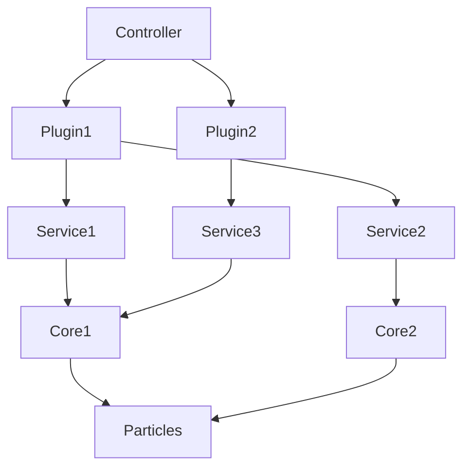

# Controller-Plugin-Service-Core-Particles Pattern

## 정의

단일 도메인 전담 모듈을 위한 5계층 구조 패턴.

**구조:** Controller → Plugin → Service → Core → Particles

**특징:**
- 계층적 의존성 흐름 (Particles → Core → Service → Plugin → Controller)
- 각 계층의 명확한 책임 분리
- 탑다운 방식 설계

**적용 대상:**
- 단일 도메인을 전담하는 모듈
- 의존성이 일방적으로 흐르는 구조
- 계층적으로 정리 가능한 로직

**부적합:**
- 작업이 매우 다양하고 조합이 복잡한 경우 → Service-Director-Worker
- 극단적으로 단순한 경우 → 값 객체 패턴

## 패턴 구조



## 계층 책임

### Controller (필수)
- 사용자 인터페이스, 공개 API 제공
- Plugin 생성/관리, 고수준 라우팅
- 비즈니스 워크플로우 조율
- Stateful 가능

**예시 (TradeSimulation):**
```python
class TradeSimulation:
    def __init__(self):
        self._limit_fill_service = SpotLimitFillService()
        self._market_buy_fill_service = SpotMarketBuyFillService()
        self._trade_factory_service = SpotTradeFactoryService()

    def process(self, order: Order, price: Price) -> List[Trade]:
        # 주문 타입 라우팅
        if order.order_type == OrderType.LIMIT:
            params_list = self._limit_fill_service.execute(order, price)
        elif order.order_type == OrderType.MARKET:
            params_list = self._market_buy_fill_service.execute(order, price)

        # 최종 객체 생성
        return self._trade_factory_service.create(params_list, order, price)
```

### Plugin (선택)
- 특정 기능의 독립적 구현체
- Controller와 Service 사이의 중간 조율
- **여러 Service를 조합**하여 복합 작업 수행
- 전략 선택, 환경 관리, 의존성 주입 책임

**여러 Service 조합 예시:**
```python
class StorageDirector:
    def __init__(self, strategy_type: str):
        # 전략 선택 및 Service 생성
        strategy = self._select_strategy(strategy_type)
        self._prepare_service = PrepareService(strategy)
        self._save_service = SaveService(strategy)
        self._load_service = LoadService(strategy)

    def save_candles(self, df):
        # 여러 Service를 순차 조합
        prepared = self._prepare_service.execute(df)
        result = self._save_service.execute(prepared)
        return result

    def update_candles(self, df):
        # 여러 Service를 복합 조합
        existing = self._load_service.execute()
        merged = self._prepare_service.merge(existing, df)
        return self._save_service.execute(merged)
```

**Plugin의 역할:**
- **Service 조합**: 여러 Service를 순차/병렬/조건부로 실행
- **전략 주입**: 동일한 인터페이스, 다른 구현체 선택
- **상태 관리**: 여러 Service 간 공유 상태 관리

**주의:**
- Plugin 계층은 선택적. 많은 경우 Controller가 직접 Service를 호출
- Plugin이 없다면 Controller → Service 직접 의존
- Service 조합이 복잡하면 Plugin 사용, 단순하면 Controller에서 직접 조합

### Service (필수)
- 비즈니스 로직 조합, 워크플로우 관장
- Core 계층의 순수 알고리즘을 조합하여 비즈니스 로직 구성
- 중간 결과 수집 및 변환
- Stateless 권장, 필요시 Stateful 가능

**예시 (SpotLimitFillService):**
```python
class SpotLimitFillService:
    def execute(self, order: SpotOrder, price: Price) -> List[TradeParams]:
        # 1. 만료 체크 (비즈니스 규칙)
        if self._is_expired(order, price.t):
            return []

        # 2. Core 알고리즘 사용
        zone = CandleAnalyzer.classify_zone(price, order.price)

        # 3. 워크플로우 분기
        if zone == "body":
            return self._fill_body_zone(order)
        elif zone in ("head", "tail"):
            return self._fill_wick_zone(order)

    def _fill_body_zone(self, order):
        # Core 알고리즘 조합
        count = random.randint(SplitConfig.MIN_COUNT, SplitConfig.MAX_COUNT)
        amounts = AmountSplitter.split_with_dirichlet(
            order.amount, order.min_amount, count
        )
        return [TradeParams(amt, order.price, idx) for idx, amt in enumerate(amounts)]
```

### Core (필수)
- 순수 비즈니스 로직, 도메인 알고리즘
- Stateless, 정적 메서드 권장
- 재사용 가능한 원자적 연산
- Particles만 의존
- **같은 종류의 동작은 한 클래스로 묶기** (함수 하나당 클래스 하나는 과도함)

**예시 (관련 기능을 한 클래스에 묶음):**
```python
class CandleAnalyzer:
    """캔들 분석 관련 알고리즘 모음"""

    @staticmethod
    def classify_zone(price, target_price: float) -> str:
        """캔들 영역 분류 (body/head/tail/none)"""
        body_bottom = price.bodybottom()
        body_top = price.bodytop()

        if body_bottom <= target_price <= body_top:
            return "body"
        if body_top < target_price <= price.h:
            return "head"
        if price.l <= target_price < body_bottom:
            return "tail"
        return "none"

    @staticmethod
    def calculate_body_ratio(price) -> float:
        """캔들 몸통 비율 계산"""
        total_range = price.h - price.l
        if total_range == 0:
            return 0.0
        body_range = abs(price.c - price.o)
        return body_range / total_range

    @staticmethod
    def is_volatile(price, threshold: float = 0.02) -> bool:
        """변동성 판단"""
        return (price.h - price.l) / price.o > threshold

class AmountSplitter:
    """수량 분할 알고리즘 모음"""

    @staticmethod
    def split_with_dirichlet(
        total_amount: float,
        min_amount: float,
        split_count: int
    ) -> List[float]:
        """Dirichlet 분포로 수량 분할"""
        alphas = np.ones(split_count)
        ratios = np.random.dirichlet(alphas)
        raw_pieces = ratios * total_amount
        # 최소 수량 보장 로직...
        return pieces

    @staticmethod
    def split_evenly(total_amount: float, split_count: int) -> List[float]:
        """균등 분할"""
        return [total_amount / split_count] * split_count
```

### Particles (필수)
- 계층 간 데이터 전달용 구조
- 도메인 상수, 설정값
- 불변 데이터 구조 권장
- 의존성 없음 (최하위 계층)

**예시:**
```python
@dataclass(frozen=True)
class TradeParams:
    """체결 파라미터"""
    fill_amount: float
    fill_price: float
    fill_index: int

class FillProbability:
    """체결 확률 상수"""
    BODY_FULL = 1.0
    WICK_FAIL = 0.3
    WICK_FULL = 0.3
    WICK_PARTIAL = 0.4

class SplitConfig:
    """분할 설정"""
    MIN_COUNT = 1
    MAX_COUNT = 10
    MIN_SPLIT_RATIO = 0.1
```

## 구현 원칙

### 계층 분리
- 상위 계층은 하위 계층만 의존
- 하위 계층은 상위 계층을 알지 못함
- 동일 계층 간 의존성 최소화

### 의존성 흐름
```
Particles (데이터 구조, 상수)
    ↑
Core (순수 알고리즘, 도메인 로직)
    ↑
Service (워크플로우 조합)
    ↑
Plugin (전략 선택, 중간 조율) - 선택적
    ↑
Controller (공개 인터페이스, 라우팅)
```

### 네이밍 컨벤션
```
Controller: {Domain}, {Domain}API, {Domain}Manager
Plugin:     {Domain}Director, {Feature}Manager
Service:    {Operation}Service, {Feature}Service
Core:       {Algorithm}Analyzer, {Operation}Calculator, {Feature}Utils
Particles:  {Entity}Params, {Domain}Config, {Feature}Constants
```

예: `TradeSimulation` + `SpotLimitFillService` + `CandleAnalyzer` + `TradeParams`

### 인터페이스
- Controller: 공개 메서드는 도메인 용어 사용
- Service: `execute`, `process`, `handle` 등의 명확한 동사
- Core: 정적 메서드, 순수 함수
- Particles: 불변 데이터 구조 (dataclass frozen=True)

## 디렉토리 구조

### 기본 원칙
- **모듈 루트**: `Architecture - {ModuleName}.md` 설계 문서 필수
- **Controller/Service/Core**: `{계층}/{SubmoduleName}/{SubmoduleName}.py` + `for-agent-moduleinfo.md`
- **Plugin/Particles**: 하위 폴더 없이 바로 클래스 정의 파일
- **각 계층**: 계층 루트에도 `for-agent-moduleinfo.md` 필요

### 기본 (Plugin 없음)
```
{module}/
├── Architecture - {ModuleName}.md          # 모듈 설계 문서
├── API/                                    # Controller 계층
│   ├── {ControllerName}/
│   │   ├── {ControllerName}.py
│   │   └── for-agent-moduleinfo.md
│   └── for-agent-moduleinfo.md
├── Service/
│   ├── {ServiceName1}/
│   │   ├── {ServiceName1}.py
│   │   └── for-agent-moduleinfo.md
│   ├── {ServiceName2}/
│   │   ├── {ServiceName2}.py
│   │   └── for-agent-moduleinfo.md
│   └── for-agent-moduleinfo.md
├── Core/
│   ├── {CoreName1}/
│   │   ├── {CoreName1}.py
│   │   └── for-agent-moduleinfo.md
│   ├── {CoreName2}/
│   │   ├── {CoreName2}.py
│   │   └── for-agent-moduleinfo.md
│   └── for-agent-moduleinfo.md
├── InternalStruct/                         # Particles
│   └── {entity}_params.py
└── Constants/                              # Particles
    └── {domain}_config.py
```

### Plugin 포함
```
{module}/
├── Architecture - {ModuleName}.md
├── API/
│   ├── {ControllerName}/
│   │   ├── {ControllerName}.py
│   │   └── for-agent-moduleinfo.md
│   └── for-agent-moduleinfo.md
├── Plugin/                                 # 하위 폴더 없음
│   ├── {plugin1}_director.py
│   └── {plugin2}_manager.py
├── Service/
│   ├── {ServiceName1}/
│   │   ├── {ServiceName1}.py
│   │   └── for-agent-moduleinfo.md
│   └── for-agent-moduleinfo.md
├── Core/
│   ├── {CoreName1}/
│   │   ├── {CoreName1}.py
│   │   └── for-agent-moduleinfo.md
│   └── for-agent-moduleinfo.md
└── InternalStruct/
    ├── {entity1}.py
    └── {entity2}.py
```

### Strategy 패턴 포함 (Core 계층)
```
{module}/
├── Architecture - {ModuleName}.md
├── API/
│   ├── {ControllerName}/
│   │   ├── {ControllerName}.py
│   │   └── for-agent-moduleinfo.md
│   └── for-agent-moduleinfo.md
├── Plugin/
│   └── storage_director.py
├── Service/
│   ├── PrepareService/
│   │   ├── PrepareService.py
│   │   └── for-agent-moduleinfo.md
│   ├── SaveService/
│   │   ├── SaveService.py
│   │   └── for-agent-moduleinfo.md
│   └── for-agent-moduleinfo.md
└── Core/
    ├── PrepareStrategy/
    │   ├── PrepareStrategy.py          # Base + 구현체 모두 포함
    │   └── for-agent-moduleinfo.md
    ├── SaveStrategy/
    │   ├── SaveStrategy.py
    │   └── for-agent-moduleinfo.md
    └── for-agent-moduleinfo.md
```

## 참조 사례

### TradeSimulation (5계층, Plugin 없음)
- **Controller**: `TradeSimulation` (주문 라우팅, 최종 Trade 생성)
- **Service**:
  - `SpotLimitFillService` (지정가 체결 시뮬레이션)
  - `SpotMarketBuyFillService` (시장가 매수 시뮬레이션)
  - `SpotTradeFactoryService` (Trade 객체 생성)
- **Core**:
  - `CandleAnalyzer` (캔들 영역 분류)
  - `AmountSplitter` (수량 분할 알고리즘)
  - `PriceSampler` (가격 샘플링)
  - `SlippageCalculator` (슬리피지 계산)
- **Particles**:
  - `TradeParams` (체결 파라미터)
  - `FillProbability` (체결 확률 상수)
  - `SplitConfig` (분할 설정)

**특징:**
- Controller가 주문 타입에 따라 적절한 Service 선택
- Service가 Core 알고리즘을 조합하여 비즈니스 로직 구성
- Core는 순수 정적 메서드로 재사용성 높음
- 의존성이 일방적으로 흐름: Particles → Core → Service → Controller

**경로:** `packages/financial-simulation/financial_simulation/tradesim/`

## SDW 패턴과의 차이

| 구분 | CPSCP | SDW |
|------|-------|-----|
| **계층 수** | 5계층 | 3계층 |
| **의존성** | 일방적, 계층적 | 산발적 조합 |
| **복잡도** | 계층 깊이 | 조합 복잡도 |
| **확장** | 계층별 추가 | Worker 추가 및 조합 변경 |
| **적용** | 단일 도메인, 명확한 계층 | 다양한 작업, 동적 조합 |

**선택 기준:**
- 지표 계산처럼 각 기능이 독립적이고 계층적 → CPSCP
- 주문 처리처럼 작업 조합이 복잡하고 동적 → SDW

## 금지사항

- **계층 건너뛰기** - Controller가 Core 직접 접근 금지
- **역방향 의존성** - Core가 Service 참조 금지
- **계층 내 순환 의존** - Service1 ↔ Service2 금지
- **Particles의 로직** - 순수 데이터/상수만, 비즈니스 로직 금지
- **Core의 상태** - Stateless 유지, 정적 메서드 권장
