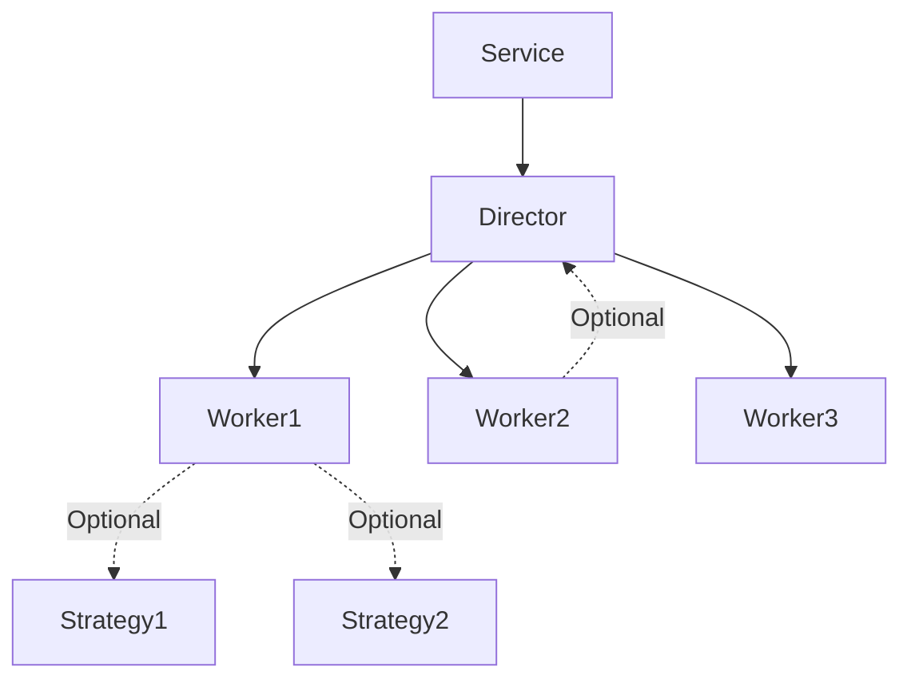

# Service-Director-Worker Pattern

## 정의

중간 복잡도 서비스 구현을 위한 3계층 구조 패턴.

**구조:** Service → Director → Worker (+ Strategy 선택적)

**특징:**
- Director가 Mediator로 Worker 조율 및 공유 리소스 제공
- Worker간 의존성 최소화 (단일 작업 집중, SRP)
- Director간 의존성 금지 (Service에서만 조율)

**적용 대상:**
- 단순하지 않지만 대규모 오케스트레이션도 아닌 수준
- 여러 독립적 작업 조율, 확장 가능성 필요

**부적합:**
- 극단적으로 단순 (단일 함수 충분)
- Director간 오케스트레이션 필요 → Provider-Service-Core

## 패턴 구조



## 계층 책임

### Service (필수)
- 사용자 인터페이스, 고수준 비즈니스 로직
- Director 생성/관리, **복수 Director 조율** (Director 간 의존성 금지, Service만 조율)
- Stateful 가능

### Director (필수)
- Mediator: Worker/Factory 조율, 작업 엔트리포인트
- Worker의 Facade: public 메서드로 Worker 기능 노출
- Worker/Factory 생성/캐싱, 호출 순서 제어, 공유 리소스 제공
- Strategy 선택 (사용시)
- **결과 수집**: Worker의 중간 결과를 수집하여 Service에 반환
- **금지:** Director간 의존성 (Service에서만 조율)

### Worker (필수)
- 단일 작업 실행 (SRP), Callable(`__call__`), Stateless 권장
- 생성자에서 의존성 주입 (Strategy, Director 등)
- **반환값**: 중간 결과 또는 파라미터 반환 (복잡한 객체 생성은 별도 Factory/Director에 위임)
- **Worker간 의존성:** 직접 참조 금지, Director 주입받아 public facade 메서드 호출

### Strategy (선택)
- 동일 작업의 다른 구현 캡슐화, 런타임 전략 선택
- **Worker 레벨에서만** 사용 (Service/Director 레벨 금지)

### 공유 도구 (Shared Tools)
- **Stateless 유틸리티**: Static 메서드로 구현, Worker가 직접 import하여 사용
  - 순수 계산 함수, 변환 로직 등
  - 의존성 주입 불필요 (불필요한 보일러플레이트 방지)
  - 예: `CalculationTool.get_price_range()`, `ValidationTool.validate_amount()`
- **Stateful 도구**: 인스턴스 생성 후 의존성 주입
  - 설정값, 캐시, 상태를 보유하는 경우
  - Service 또는 Director에서 생성하여 Worker에 전달

## 구현 원칙

### 계층 분리
- Service → Director만 접근 (Worker 직접 접근 금지)
- Director → Worker만 관리
- Worker → Strategy만 알고 상위 계층 의존성 최소화

### 의존성 주입
- 생성자에서 주입 (런타임 생성보다 초기화 시점 선호)
- Director: 설정/전략 주입
- Worker: Strategy/Director 주입
- **예외**: Stateless 유틸리티는 주입하지 않고 static 메서드로 구현, Worker가 직접 import

### 네이밍 컨벤션
```
Service:  {Domain}Service, {Domain}Manager
Director: {Domain}Director, {Domain}Coordinator
Worker:   {Action}Worker, {Task}Worker
Strategy: {Backend}{Action}Strategy
Tools:    {Purpose}Tool (stateless static 메서드)
```

예: `WalletInspectorService` + `WalletInspectorDirector` + `TotalValueWorker` + `CalculationTool`

### 인터페이스
- Worker: `__call__` 메서드, 명확한 타입 정의
- Director: public facade 메서드(Service 및 Worker용), Worker는 private(`_name`)

## 디렉토리 구조

### 기본
```
{module}/
├── {service_name}.py
├── {tool_name}.py              # Stateless 유틸리티 (선택)
└── {director_name}/
    ├── {director_name}.py
    ├── {worker1}_worker.py
    └── {worker2}_worker.py
```

### Strategy 포함
```
{module}/
├── {service_name}.py
├── {tool_name}.py              # Stateless 유틸리티 (선택)
└── {director_name}/
    ├── {director_name}.py
    ├── {operation}_worker.py
    └── strategy/
        ├── base.py
        ├── {impl1}.py
        └── {impl2}.py
```

### 복수 Director
```
{module}/
├── {service_name}.py
├── {tool_name}.py              # Stateless 유틸리티 (선택)
├── {director1}/
│   ├── {director1}.py
│   ├── {worker1}_worker.py
│   └── {worker2}_worker.py
└── {director2}/
    ├── {director2}.py
    ├── {worker3}_worker.py
    └── {worker4}_worker.py
```

### Factory 통합 (복수 Director)
```
{module}/
├── {service_name}.py
├── {tool_name}.py                      # Stateless 유틸리티 (선택)
├── {factory_director_name}.py          # Factory 조율 Director
├── {type1}/                            # 예: spot/
│   ├── {type1}_execution_director.py
│   ├── {type1}_factory.py
│   ├── {worker1}_worker.py
│   └── {worker2}_worker.py
└── {type2}/                            # 예: futures/
    ├── {type2}_execution_director.py
    ├── {type2}_factory.py
    ├── {worker3}_worker.py
    └── {worker4}_worker.py
```

## 참조 사례

### Candle (Strategy 사용)
- Service: `Candle`
- Director: `StorageDirector` (환경 기반 전략 선택)
- Workers: `PrepareWorker`, `SaveWorker`, `LoadWorker`
- Strategies: `ParquetStrategy`, `MySQLStrategy`

### WalletInspector (독립 Workers)
- Service: `WalletInspectorService`
- Director: `WalletInspectorDirector` (wallet 객체 공유)
- Workers: `TotalValueWorker`, `RealizedPnLWorker`, `UnrealizedPnLWorker`, `PositionSummaryWorker`, `CurrencySummaryWorker`

### TradeSimulation (복수 Director, Factory 통합)
- Service: `TradeSimulation` (모든 Director 조율)
- Directors:
  - `SpotExecutionDirector` (Spot Worker 조율)
  - `FuturesExecutionDirector` (Futures Worker 조율)
  - `TradeFactoryDirector` (Factory 조율)
- Workers: `SpotLimitWorker`, `SpotMarketBuyWorker`, `SpotMarketSellWorker`
- Factories: `SpotTradeFactory`, `FuturesTradeFactory`
- Shared Tools: `CalculationTool` (static 메서드, Worker가 직접 import)
- 특징: Worker → 파라미터 반환, Service가 ExecutionDirector와 FactoryDirector 조율

## Worker간 의존성 처리

Director의 public facade 메서드를 통해 다른 Worker 기능 사용:

```python
class Director:
    def process_simple(self, data):  # facade 메서드
        return self._simple_worker(data)

class ComplexWorker:
    def __init__(self, director):
        self.director = director

    def __call__(self, data):
        intermediate = self.director.process_simple(data)  # facade 호출
        return self._process(intermediate)
```

## 복수 Director 조율

**Service가 여러 Director를 조율해야 하는 경우:**

### Factory 패턴 통합
객체 생성이 복잡하거나 별도 관리가 필요한 경우:

```python
class Service:
    def __init__(self):
        self._execution_director = ExecutionDirector()
        self._factory_director = FactoryDirector()

    def process(self, input_data):
        # 1. ExecutionDirector에서 중간 결과 획득
        params = self._execution_director.execute(input_data)

        # 2. FactoryDirector에서 최종 객체 생성
        result = self._factory_director.create(params)

        return result

# Worker 예시 (Stateless 유틸리티는 직접 import)
from ..calculation_tool import CalculationTool

class LimitWorker:
    def __call__(self, order, price):
        # Static 메서드 직접 호출 (의존성 주입 불필요)
        range_type = CalculationTool.get_price_range(price, order.price)
        amounts = CalculationTool.get_separated_amount_sequence(...)

        return [TradeParams(amount, price, idx) for ...]
```

**원칙:**
- Worker는 객체 생성 파라미터만 반환
- ExecutionDirector는 Worker 결과 수집, 파라미터 반환
- FactoryDirector는 Factory 조율, 최종 객체 생성
- **Service만 여러 Director 조율** (Director 간 의존성 금지)
- **Stateless 유틸리티**: 의존성 주입 대신 static 메서드로 구현, Worker가 직접 import

### Spot/Futures 분리
타입별로 다른 처리가 필요한 경우:

```python
class Service:
    def __init__(self):
        self._spot_director = SpotDirector()
        self._futures_director = FuturesDirector()

    def process(self, order):
        if isinstance(order, SpotOrder):
            return self._spot_director.execute(order)
        elif isinstance(order, FuturesOrder):
            return self._futures_director.execute(order)
```

## 금지사항

- **Director간 의존성** - Service에서만 조율
- **Service가 Worker 직접 접근** - Director facade 통해서만
- **Worker가 다른 Worker 직접 참조** - Director facade 메서드 호출
- **Worker가 Director private 접근** - Director의 public facade 메서드만 사용
- **Worker가 복잡한 객체 직접 생성** - 중간 결과/파라미터만 반환, 객체 생성은 Factory/Director에 위임
- **Service/Director 레벨 Strategy** - Worker 레벨에서만
