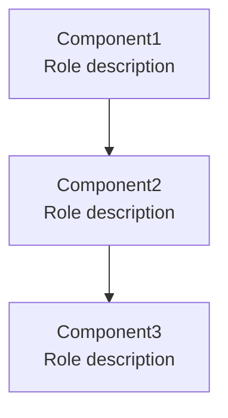

# Architecture - [Module Name]

## Overview

[1-2 paragraphs describing the module's purpose and core concepts]

### Core Features

- [Feature 1]: [Brief description]
- [Feature 2]: [Brief description]
- [Feature 3]: [Brief description]

### Design Philosophy

_This section is optional. Include only when there have been philosophical design discussions in previous context._

**[Philosophical Principle 1]**
- [Explanation]

**[Philosophical Principle 2]**
- [Explanation]

### Dependencies

```toml
dependencies = [
    "package-name>=version",
]
```

**Notes:**
- `package-name`: [Purpose of use]

## Structure



**Component Responsibilities:**
- **Component1**: [High-level responsibility and role in the system]
- **Component2**: [High-level responsibility and role in the system]
- **Component3**: [High-level responsibility and role in the system]

**Dependencies:**
- [Dependency relationship 1]
- [Dependency relationship 2]

**Notes:**
- This is a system-level design documenting component identification and relationships
- Detailed implementation patterns, APIs, and data structures are defined separately in each component's moduleinfo documentation

**Development Order and Status:** [Concept Design | Developing | Testing | Done | Deprecated]
1. [Component1] Done
2. [Component2] Done
3. [Component3] In-progress..