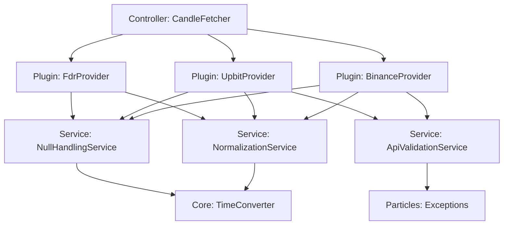
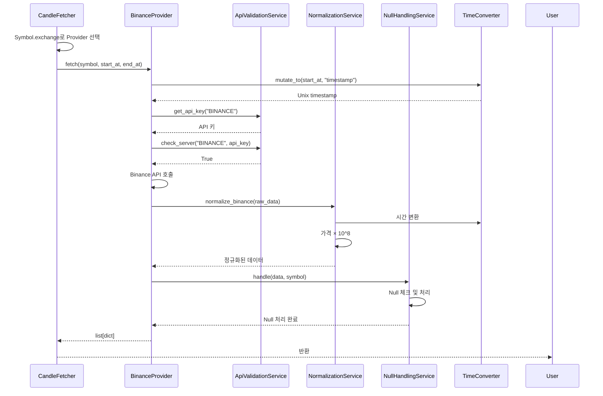

# CandleFetcher 모듈

캔들 데이터 획득 모듈. 외부 API (Binance, Upbit, FDR 등)에서 캔들 데이터를 받아와 정규화하여 반환.

## 개요

**목적:** Symbol 객체를 받아 해당 거래소의 캔들 데이터를 획득하고 내부 형식으로 변환

**주요 기능:**
- 거래소별 Provider 선택 (exchange 필드 기반)
- API 키 관리 (.env)
- 데이터 정규화 (키 매핑, 타입 변환, 가격 int 변환)
- Null 처리 (volume → 0, 가격 → 이전값 또는 DB)
- 시간 형식 변환 (문자열/int → Unix timestamp)

**패턴:** CPSCP (Controller-Plugin-Service-Core-Particles)

## 아키텍처

### 계층 구조



### 의존성 흐름

```
Particles (Exceptions)
    ↑
Core (TimeConverter)
    ↑
Service (Normalization, NullHandling, ApiValidation)
    ↑
Plugin (BinanceProvider, UpbitProvider, FdrProvider)
    ↑
Controller (CandleFetcher)
```

## 계층별 책임

### Controller (API)
**CandleFetcher**
- 공개 API 제공
- Symbol.exchange로 Provider 선택
- Provider 인스턴스 캐싱
- 미구현 Provider 감지

### Plugin
**BinanceProvider, UpbitProvider, FdrProvider**
- 각 거래소 API 호출
- Service 조합하여 워크플로우 구현
  1. API 검증 (키 확보, 서버 체크)
  2. API 호출
  3. 정규화
  4. Null 처리

### Service
**NormalizationService**
- 거래소별 키 매핑
- 타입 변환 (string → float → int)
- 가격 int 변환 (× 10^8)

**NullHandlingService**
- volume null → 0
- 가격 null → 응답 내 이전값 → DB 조회 → 에러

**ApiValidationService**
- .env에서 API 키 조회
- 서버 응답 확인

### Core
**TimeConverter**
- 다양한 시간 형식 → Unix timestamp
- 자동 sec/ms 구분

### Particles
**Exceptions**
- ProviderNotImplementedError
- NoApiKeyError
- ServerNotRespondedError
- InvalidDataError

## 데이터 흐름

### 입력
```python
# Controller
symbol: Symbol  # exchange='BINANCE'
start_at: str | int  # "2024-1-1" 또는 1704067200
end_at: str | int
```

### 처리 과정



### 출력
```python
# 반환값
list[dict]
[
    {
        'timestamp': int,  # Unix timestamp (초)
        'open': int,       # × 10^8
        'high': int,
        'low': int,
        'close': int,
        'volume': int
    }
]
```

## 주요 의사결정

### 1. 패턴 선택: CPSCP
**이유:**
- 단일 도메인 (캔들 획득)
- 일방적 의존성 흐름
- Provider 확장성 (Plugin으로 분리)
- 공통 로직 재사용 (Service)

### 2. 가격 변환 시점: 정규화 단계
**이유:**
- 시간복잡도 동일 (O(N))
- 정규화와 함께 처리하는 것이 자연스러움
- Provider가 CandleRepository 의존 (허용 가능)

### 3. Null 처리: 응답 내 이전값 → DB → 에러
**이유:**
- 대부분 응답 내에서 해결 가능
- DB 조회는 최소화 (성능)
- 복구 불가능한 경우 명확한 에러

### 4. 시간 변환: Core 계층
**이유:**
- 순수 알고리즘 (Stateless)
- 재사용 가능
- Provider와 독립적

### 5. Provider 캐싱
**이유:**
- Service 인스턴스 재생성 방지
- API 클라이언트 재사용
- 성능 향상

## 확장 가능성

### 새 Provider 추가
1. `Plugin/{NewProvider}.py` 생성
2. `fetch(symbol, start_at, end_at)` 구현
3. NormalizationService에 `normalize_{new}()` 추가
4. CandleFetcher에 매핑 추가

### 새 거래소 키 매핑
- NormalizationService의 `normalize_{exchange}()` 메서드만 추가

### 새 시간 형식 지원
- TimeConverter의 `mutate_to()` 로직 확장

## 의존성

### 외부 의존성
- Core/ConnectionManager: DB 연결 (NullHandlingService)
- Core/Models/CandleRepository: 가격 변환, 마지막 캔들 조회
- Core/Models/Symbol: Symbol 객체

### 라이브러리 의존성
- os: 환경변수 (.env)
- dateutil: 시간 문자열 파싱
- requests 또는 거래소 SDK: API 호출
- pandas: FDR DataFrame 처리

## 제약사항

- Symbol 객체는 DB에 존재해야 함 (Service 계층에서 확보)
- API 키는 .env에 `{EXCHANGE}_API_KEY` 형식으로 저장
- 반환 데이터는 symbol_id 없음 (호출자가 추가)
- 통합/개별 테이블 구분은 호출자 책임
