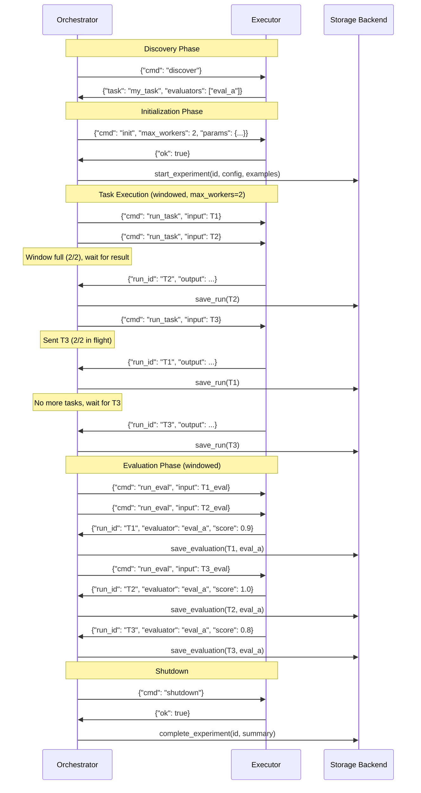
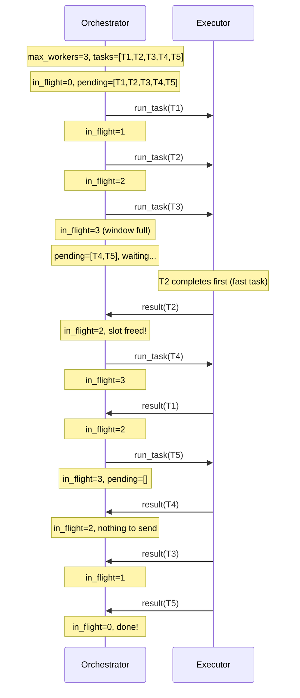
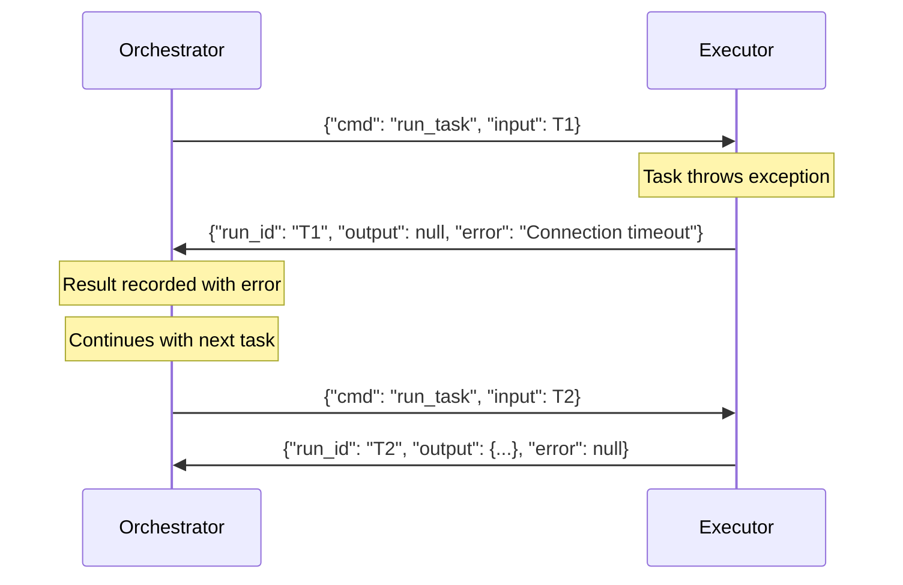

# Executor Protocol

This document describes the communication protocol between the Orchestrator and Executor components in cat-experiments.

## Overview

The Executor protocol enables task and evaluator execution across process boundaries. It supports:

- **In-process execution**: Python asyncio (development/testing)
- **Subprocess execution**: Any language via JSON-lines over stdin/stdout

## Architecture

```
┌─────────────┐                    ┌──────────────┐
│             │  JSON messages     │              │
│ Orchestrator│ ◄────────────────► │   Executor   │
│             │  (stdin/stdout)    │              │
└─────────────┘                    └──────────────┘
      │                                   │
      │ - Tracks in-flight slots          │ - Processes tasks/evals
      │ - Sends work when slots free      │ - Returns results as ready
      │ - Persists results                │ - Handles concurrency internally
      │ - Reports progress                │
      ▼                                   ▼
┌─────────────┐                    ┌──────────────┐
│  Storage    │                    │  Experiment  │
│  Backend    │                    │    File      │
└─────────────┘                    │  (@task,     │
                                   │  @evaluator) │
                                   └──────────────┘
```

## Protocol Messages

### Discovery

Orchestrator requests metadata about the experiment file.

**Request:**
```json
{"cmd": "discover"}
```

**Response:**
```json
{
  "protocol_version": "1.0",
  "name": "my_experiment",
  "description": "Experiment description",
  "task": "my_task",
  "evaluators": ["accuracy", "latency"],
  "params": {"model": "gpt-4", "temperature": 0.7}
}
```

### Initialization

Orchestrator configures the executor before running tasks.

**Request:**
```json
{"cmd": "init", "max_workers": 4, "params": {"model": "gpt-4o"}}
```

**Response:**
```json
{"ok": true}
```

On error:
```json
{"ok": false, "error": "Failed to initialize: ..."}
```

### Task Execution

Orchestrator sends tasks one at a time, using windowed flow control.

**Request:**
```json
{
  "cmd": "run_task",
  "input": {
    "id": "example_1",
    "input": {"question": "What is 2+2?"},
    "output": {"answer": "4"},
    "metadata": {},
    "run_id": "example_1#1",
    "repetition_number": 1,
    "params": {"model": "gpt-4o"}
  }
}
```

**Response:**
```json
{
  "run_id": "example_1#1",
  "output": {"answer": "4", "tool_calls": []},
  "metadata": {
    "started_at": "2024-01-15T10:00:00Z",
    "completed_at": "2024-01-15T10:00:01Z",
    "execution_time_ms": 1000
  },
  "error": null
}
```

On error:
```json
{
  "run_id": "example_1#1",
  "output": null,
  "metadata": {"started_at": "...", "completed_at": "..."},
  "error": "Task failed: connection timeout"
}
```

### Evaluation Execution

Orchestrator sends eval inputs, executor runs all (or specified) evaluators.

**Request:**
```json
{
  "cmd": "run_eval",
  "input": {
    "example": {"id": "example_1", "input": {...}, "output": {...}},
    "actual_output": {"answer": "4"},
    "expected_output": {"answer": "4"},
    "params": {}
  },
  "evaluators": ["accuracy"]
}
```

If `evaluators` is omitted, all registered evaluators run.

**Response (one per evaluator):**
```json
{
  "run_id": "example_1#1",
  "evaluator": "accuracy",
  "score": 1.0,
  "label": "correct",
  "metadata": {"explanation": "Exact match"},
  "error": null
}
```

### Shutdown

Orchestrator signals executor to clean up and exit.

**Request:**
```json
{"cmd": "shutdown"}
```

**Response:**
```json
{"ok": true}
```

## Flow Control: Windowed Dispatch

The orchestrator uses a windowed/credits model for backpressure:

1. Orchestrator maintains `in_flight` count (tasks sent but not yet returned)
2. Orchestrator sends tasks while `in_flight < max_workers`
3. On receiving a result, orchestrator decrements `in_flight` and may send more
4. This ensures bounded memory and natural backpressure

## Sequence Diagrams

### Full Experiment Flow



### Windowed Flow Control Detail



### Error Handling



## Implementation Notes

### Executor (Subprocess)

The executor subprocess should:

1. **Read stdin asynchronously** - Don't block on processing
2. **Spawn tasks concurrently** - Use asyncio.create_task or similar
3. **Write results immediately** - Flush stdout after each result
4. **Trust orchestrator's windowing** - No need for internal semaphore

```python
# Pseudocode for subprocess executor
async def main():
    pending = []

    async def handle_task(input):
        result = await run_task(input)
        print(json.dumps(result), flush=True)

    async for line in read_stdin_async():
        msg = json.loads(line)
        match msg["cmd"]:
            case "discover":
                print(json.dumps(get_discover_info()))
            case "init":
                store_config(msg)
                print(json.dumps({"ok": True}))
            case "run_task":
                pending.append(asyncio.create_task(handle_task(msg["input"])))
            case "shutdown":
                await asyncio.gather(*pending)
                print(json.dumps({"ok": True}))
                break
```

### Orchestrator

The orchestrator should:

1. **Track in-flight count** - Increment on send, decrement on receive
2. **Use async I/O** - Read results while sending new tasks
3. **Handle out-of-order results** - Tasks may complete in any order

## Python API

```python
class Executor(Protocol):
    """Protocol for task/evaluator execution."""

    async def discover(self) -> DiscoverResult:
        """Get experiment metadata."""
        ...

    async def init(self, request: InitRequest) -> InitResult:
        """Initialize with config."""
        ...

    async def run_task(self, input: TaskInput) -> TaskResult:
        """Execute a single task."""
        ...

    async def run_eval(
        self,
        input: EvalInput,
        evaluators: list[str] | None = None
    ) -> list[EvalResult]:
        """Execute evaluators on a single input."""
        ...

    async def shutdown(self) -> ShutdownResult:
        """Clean up and shutdown."""
        ...
```

## Message Schema

See `src/cat/experiments/protocol/types.py` for full type definitions:

- `DiscoverResult`
- `InitRequest` / `InitResult`
- `TaskInput` / `TaskResult`
- `EvalInput` / `EvalResult`
- `ShutdownResult`
