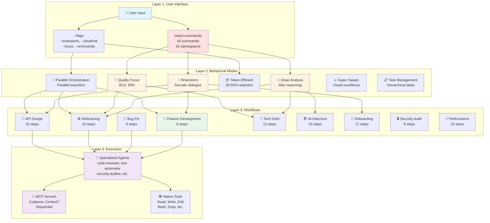
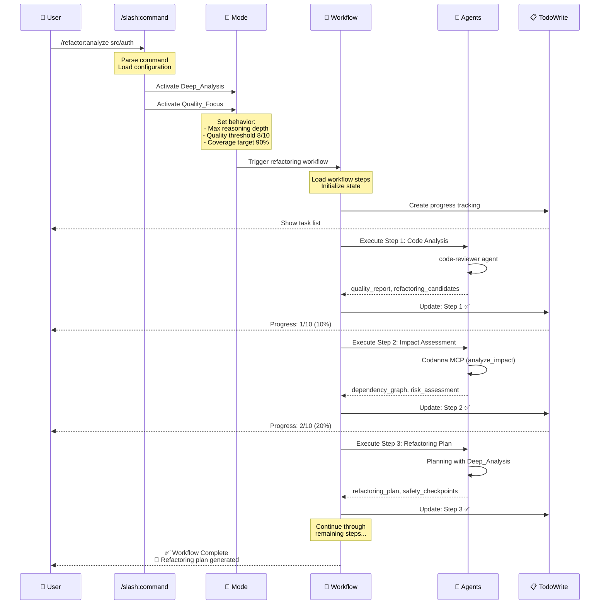
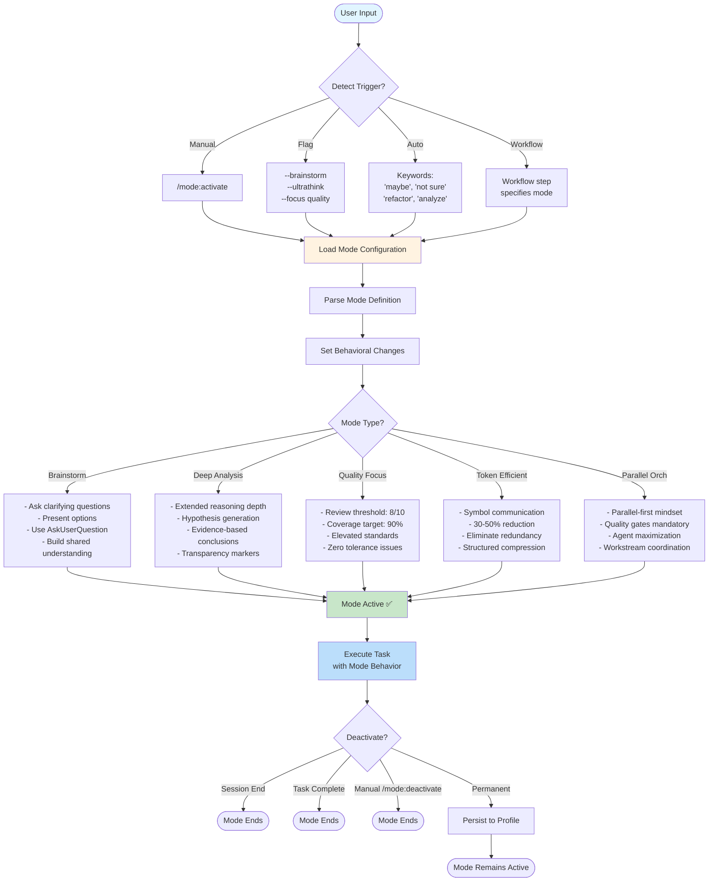
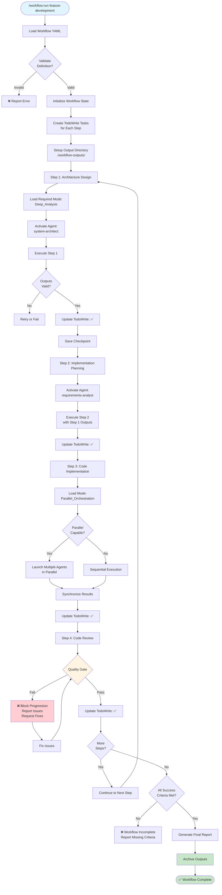
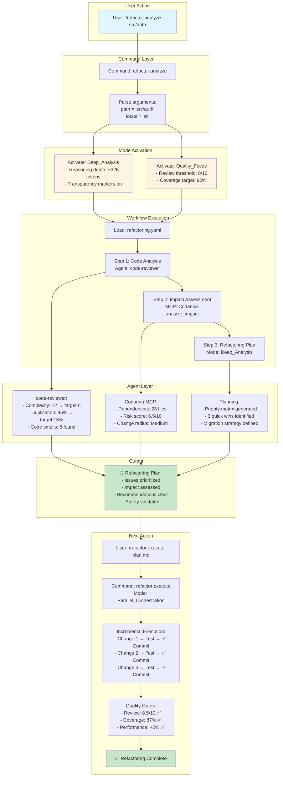
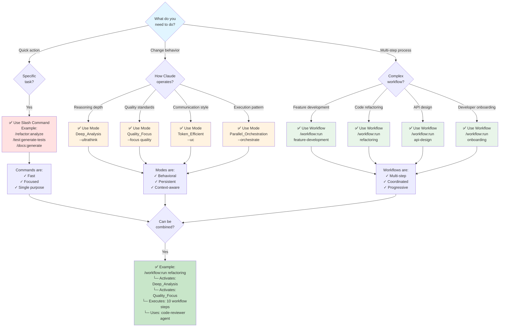
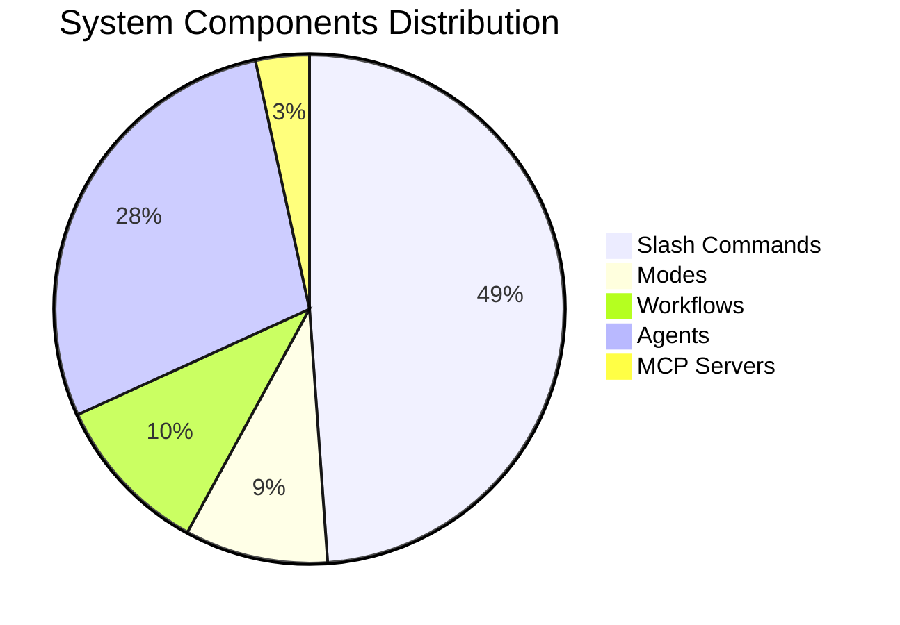
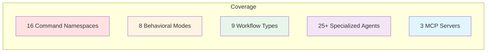
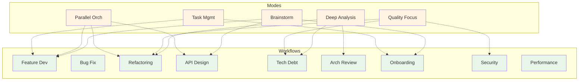

# Cortex Architecture Diagrams

Visual documentation of the three-layer automation system.

---

## System Architecture Overview



---

## Command → Mode → Workflow Flow



---

## Mode Activation Flow



---

## Workflow Execution Flow



---

## Refactoring Example: End-to-End



---

## Decision Tree: Which Layer to Use?



---

## System Statistics





---

## Mode + Workflow Compatibility Matrix



---

## Legend

| Symbol | Meaning |
|--------|---------|
| 👤 | User / Human Input |
| 🎨 | Behavioral Mode |
| 🔄 | Workflow / Process |
| 🤖 | Agent / AI Actor |
| 🔌 | MCP Server |
| 🛠️ | Native Tool |
| ✅ | Success / Complete |
| ❌ | Failure / Error |
| 📋 | Task / Todo |
| 📄 | Output / Document |
| ⚡ | Fast / Optimized |
| 🔒 | Security |
| 🎯 | Target / Goal |

---

## Quick Start Guide

### For Developers

1. **Explore the system**:

   ```bash
   cortex
   # Press 3 → View Modes
   # Press 6 → View Workflows
   ```

2. **Try a command**:

   ```bash
   /refactor:analyze src/
   /workflow:run feature-development
   /mode:activate Brainstorm
   ```

3. **Understand the flow**:
   - Command activates → Mode influences → Workflow executes → Agents work

### For Architects

1. **Review diagrams** in this file
2. **Understand three layers**: Commands → Modes → Workflows
3. **Study integration patterns**: How layers interact
4. **Customize workflows**: Adapt to your needs

### For DevOps

1. **Deployment workflows**: `feature-development`, `security-audit`
2. **Quality gates**: Integrated in all workflows
3. **Automation ready**: Commands can be scripted
4. **State management**: Checkpoint/resume support
